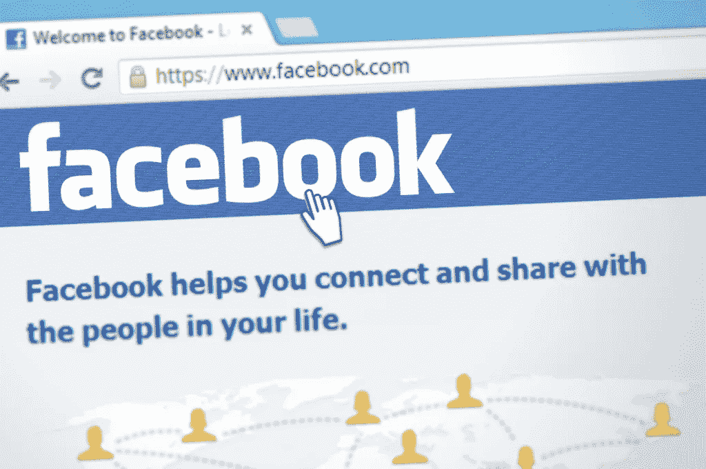

# 脸书:我们这一代的癌症

> 原文：<https://medium.com/hackernoon/facebook-cancer-of-our-generation-ddc34f5f1605>

已经是上午 9 点了，我开始查看我的通知。生日，周年纪念，以及我从 TED 演讲中复制的帖子上的“喜欢”。

感觉就像例行公事一样，我浏览了一下新闻提要，看看是否有什么新消息。我不是在找什么特别的东西，只是为了浏览而浏览。

当我滚动浏览提要时，我感觉到各种各样的情绪，其中大多数都充满了羡慕、嫉妒，有时还有同情。我很少为多年没有联系的朋友感到高兴。

我用脸书跟踪人们。我用它来检查我朋友的照片，感觉和他们有点联系。即使，我没有连接。脸书让我感到与世隔绝。

当我在 T2 的一家高科技初创公司 T3 完成剩余的日常工作时，我再次打开了脸书。这一次，我没有寻找新的东西，我花时间看我的个人资料，确保我被描绘成我希望成为的人。我看一些 TED 或者励志的视频，贴出来分享。

我的观众是我的 415 个有联系的朋友，他们会把我的帖子视为他们日常生活的一部分。就像我一样，他们会感受到各种情绪，并以类似于我的方式做出反应。

研究表明，我们每天花大约一个小时在脸书上。也就是每年 365 小时，相当于大约 15 整天。每天，我们都要放弃一个小时去做一些甚至不会让我们开心的事情。

“连接”的感觉只不过是一种虚假的连接感。尽管我们感觉到一种联系，但我们知道在内心深处这种联系正使我们更加孤立。

同样的例行公事意味着我们要保持联系，却让我们远离必要的社会交往。时间在流逝，你在脸书度过的每一个“时刻”都不像它看起来那样。

生活还在继续，正如人们所说，脸书已经成为我们生活中的毒瘤。它故意削弱我们的社会交往，助长嫉妒和羡慕，并造成伤害而不是好处。

如果我们每天花一个小时，发短信，写邮件，打电话，让你的朋友知道他们的重要性，我们将会得到真诚和真正的友谊。

如果我们把在脸书度过的每一天都花在认识新朋友上，我们将会得到一种超乎想象的联系感。

这些天你会做什么？

> [黑客中午](http://bit.ly/Hackernoon)是黑客如何开始他们的下午。我们是 [@AMI](http://bit.ly/atAMIatAMI) 家庭的一员。我们现在[接受投稿](http://bit.ly/hackernoonsubmission)，并乐意[讨论广告&赞助](mailto:partners@amipublications.com)机会。
> 
> 如果你喜欢这个故事，我们推荐你阅读我们的[最新科技故事](http://bit.ly/hackernoonlatestt)和[趋势科技故事](https://hackernoon.com/trending)。直到下一次，不要把世界的现实想当然！

