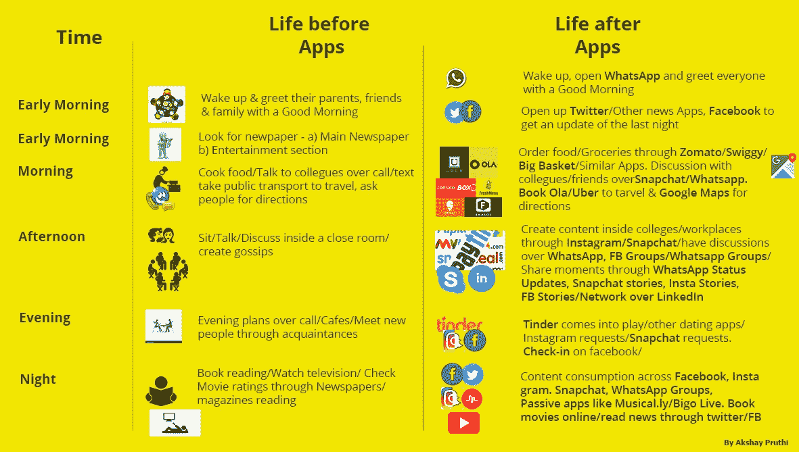
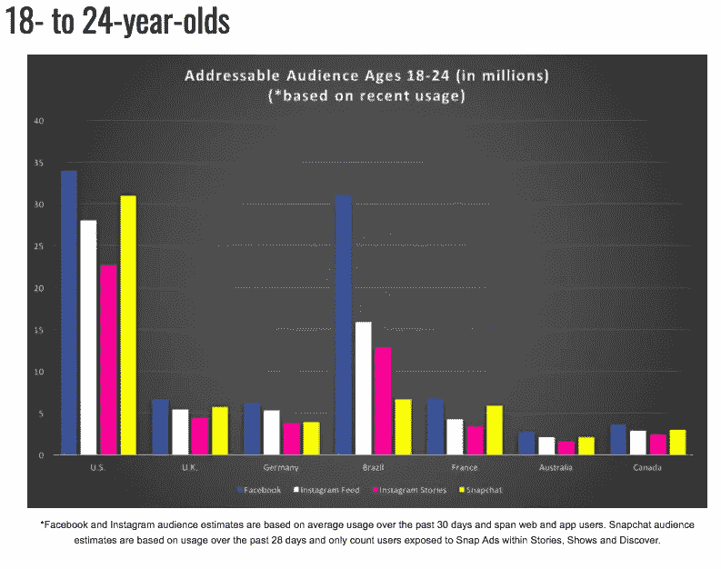
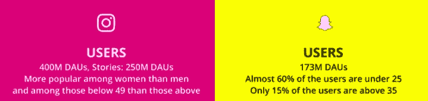
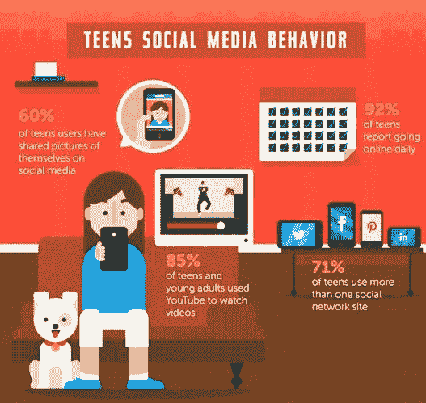
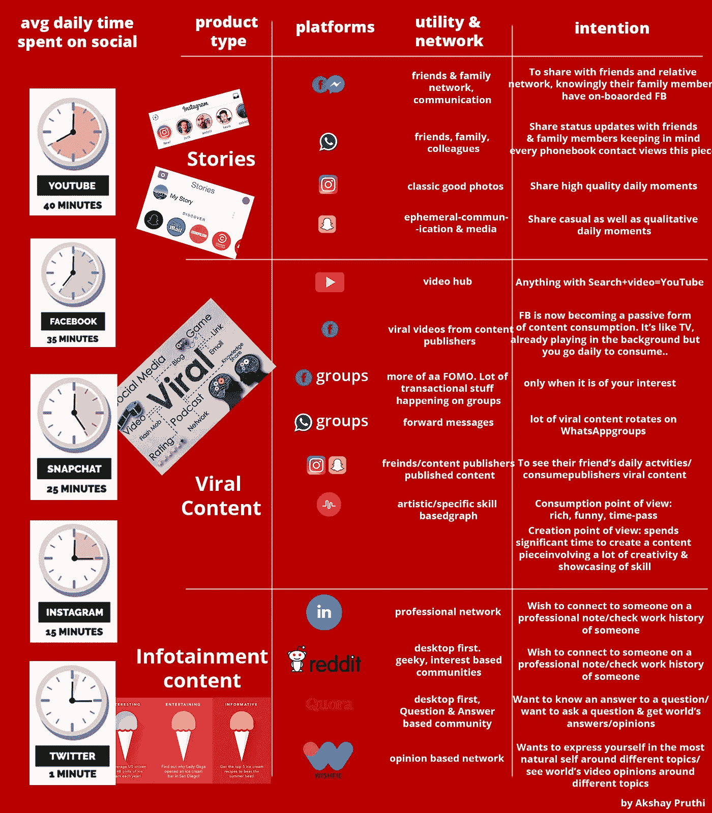

# 脸书//insta gram//Snapchat——没有人在杀害任何人……

> 原文：<https://medium.com/hackernoon/facebook-instagram-snapchat-no-one-is-killing-no-one-f87abb9564e9>

## 有很多社交网站。如果你在自己的社交网络上工作，你必须创建一个社交图。

创建一家消费科技初创公司从来都不容易。未知的变数太多了；你只需要不断尝试，同时进行实验。在 B2B 业务中，交易开始发挥作用，这在不同的层面上增强了动力，而在消费技术业务中，尤其是在社交消费者领域，你需要建立一个假设，并不断尝试，直到你开始通过数据看到一些验证。

在 [Wishfie](http://www.wishfie.com) ，我们围绕脸书、Snapchat、Instagram 和类似应用如何从几千用户扩大到现在的数百万用户做了大量二手研究。

# 设置上下文

我们看到很多关于 Snapchat 杀死脸书还是 Instagram 打败 Snapchat 的辩论，然而，在我看来，所有这些都是扯淡。

在为我们的应用 Wishfie 做二次调查时，我决定与青少年交谈，试图了解他们使用哪些应用，为什么使用这些应用，以及他们一天在这些应用上花了多少时间。

我惊讶地看到他们的反应。在我采访的大约 120 名年龄组为 13-17 岁、地理位置在泛印度的人中，使用偏好是:

1.  Snapchat
2.  Whatsapp
3.  照片墙
4.  脸谱网
5.  Musical.ly/Like/Dubsmash/ viva video/他们不断尝试的新社交消费应用

**Q1:你为什么用 Snapchat 聊天？Whatsapp 不是更方便吗？**

a1:70%的用户使用情况和 Whatsapp 差不多。但这些人在日常对话中使用 Snapchat 的事实让我感到震惊。他们保存最后 7-8 条消息，以了解聊天的背景；他们付出了额外的努力，但仍继续在 Snapchat 上聊天。当被问及原因时，我没有得到直接的回答，但这更多的是因为没有从一个平台切换到另一个平台，因为这提供了聊天、贴纸和随时发送照片的选项。

推论:我们生活在一个小小的世界里。不要根据你的感觉去假设。

Q2:那 Instagram 和脸书呢？你什么时候为什么使用它？

A2:青少年平均每 2 小时使用一次 Instagram，主要是为了打破“这是经典内容”的单调，或者为 Instagram 添加最近故意点击的经典照片的故事。

大多数人每天使用脸书 3-4 次，这更像是一种习惯。对他们来说，它就像一个高级版的 YouTube，因为它充满了娱乐，而且大部分是视频内容。

**推论:青少年非常关心他们的同龄人，酷的因素，吹牛的因素。有了 Instagram，当一个 15 岁的孩子拥有 5000 多名粉丝时，他们会觉得自己是自己小世界里的名人。**

在与许多人交谈后，我想到尝试分析社交媒体在推出此类应用之前和之后的周期。

This is what I drew out of the qualitative discussion with people

在这个定性研究之后，我决定看看这些巨头发布的一些统计数据，并想验证我脑海中建立的假设是真是假。

1.  一篇有趣的文章对 Snapchat 和 Instagram 进行了很好的比较，发现 Instagram 是整体赢家:

[**我们对比了 Snapchat 和 Instagram，看看哪个应用更好——下面是获胜者**](http://www.businessinsider.in/We-compared-Snapchat-and-Instagram-to-find-out-which-app-is-better-heres-the-winner/We-compared-Snapchat-and-Instagram-to-find-out-which-app-is-better-heres-the-winner/slideshow/59715816.cms)

[*Snapchat 粉丝可能不想听，但 Instagram 正在做 Snapchat 做的许多事情——而且正在做……www . business insider . in*](http://www.businessinsider.in/We-compared-Snapchat-and-Instagram-to-find-out-which-app-is-better-heres-the-winner/We-compared-Snapchat-and-Instagram-to-find-out-which-app-is-better-heres-the-winner/slideshow/59715816.cms)

2.

3.

4.

5.

6.

因此，从数据中可以明显看出，脸书在很大程度上引领着社会格局。但问题是上述数据是否与定性研究相符。

**推论:**

**脸书拥有 1.32 亿 DAU，遥遥领先于所有社交媒体。**

**Instagram 在 Stories 上拥有 3 亿+活跃用户，WhatsApp 在 WhatsApp Status 上也触及了同样的数字，这比 Snapchat 的整个用户集(166M)还要多(** [**来源**](https://techcrunch.com/2017/11/01/instagram-whatsapp-vs-snapchat/) **)**

不匹配…是吗？

完全不知所措，我决定与不同年龄组的人进行更多的问答。

Q1:你用 Snapchat 做什么？

A1:用于与朋友聊天，了解他们的故事。Snapchat 故事的频率相当高，这创造了 FOMO。

Q2:你用 Instagram 做什么？

A2:查看我所关注的人的内容，发现不同领域的新内容，或者以经典图片的形式为我的故事增添精彩瞬间。

**推论:Instagram、脸书、Snapchat 和 WhatsApp 已经在移动设备上获得了自己的空间/不动产，没有人会杀死任何人。**

不同的受众需要不同的东西来玩，上述每个社交网络都开发了自己的社交图。因此，相互竞争是非常困难的。因此，他们没有与其他类似的平台竞争，而是在打一场自己的战斗来留住用户。

一个人不太可能因为更喜欢脸书或者更喜欢 Snapchat 而删除 Instagram，反之亦然。

如果你正在建立一个社交网络，创建你自己的社交图谱是非常重要的。

Social Network Graph

上面提到的每一个社交网络都解决了一个潜在的效用。例如，Instagram 以令人兴奋的过滤器开始，Snapchat 带来了 evanescence，Quora 确保你在平台上提出的任何问题都能得到答案，而 Wishfie 带来了一波全新的基于观点的图表。

**推论:在这个快速发展的世界中，这些社交网络之间总会存在一些差距，因此一个可能无法取代另一个。找到那个缺口，游戏就该是你的了。**

***免责声明:这主要是基于轶事证据，因为我的研究样本量并不大。本文首次发表于 YourStory***