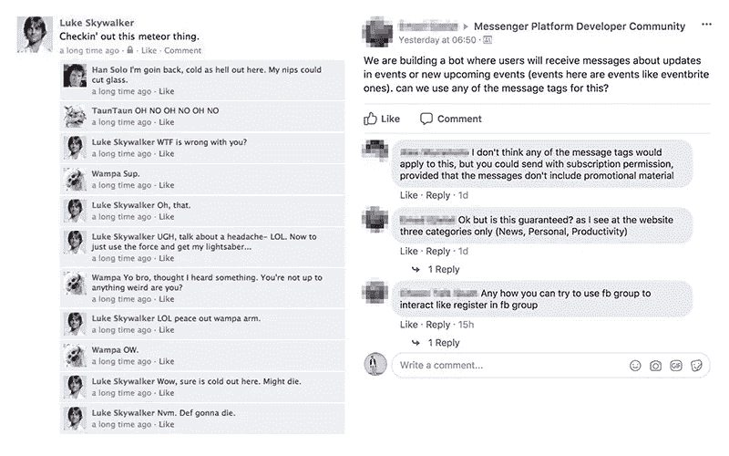
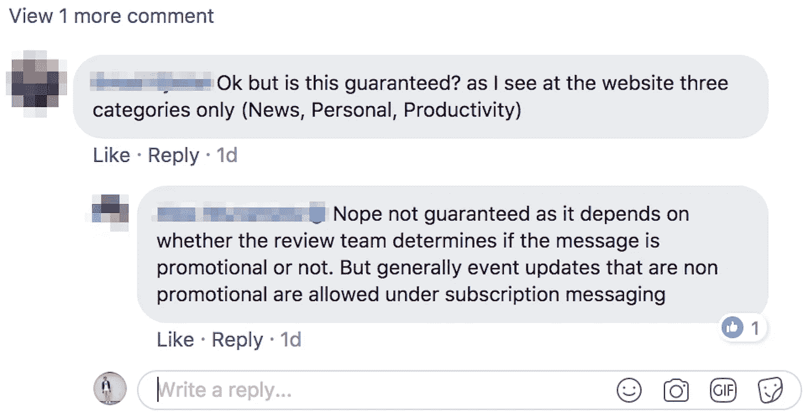
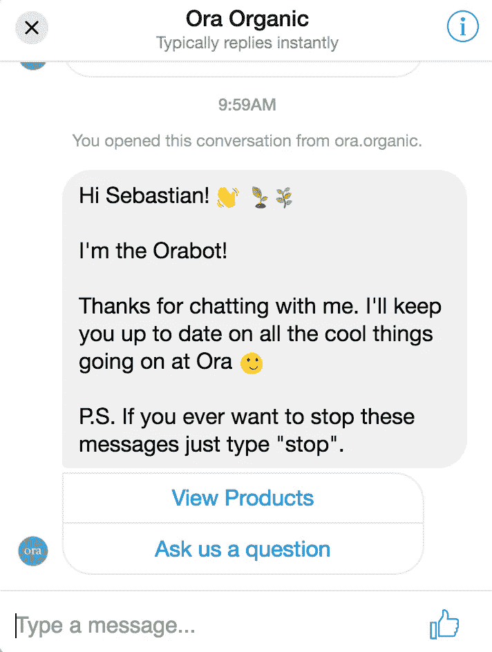

# 脸书刚刚对评论进行了重大修改，这是对电子商务未来的一个重大暗示

> 原文：<https://medium.com/hackernoon/facebook-just-made-a-major-change-to-comments-and-its-a-big-hint-at-the-future-of-e-commerce-a41ac39b3a6c>

社交媒体电子商务工具的下一波浪潮已经到来。

通过 Instagram、Snapchat 和 Messenger 进行销售已经运行了一段时间，而且似乎正在发挥作用，脸书最近在商业网站上推出了 Messenger 插件 T3 的测试版。

那次发布似乎也促使脸书**彻底改变了他们在新闻订阅上的评论用户界面**(你们中的一些人可能已经看过了，或者可能还没有看到——那都是**脸书的 A/B 测试**项目的一部分)

**Old Facebook Comments UI on the left, new one on the right.** *Source: CollegeHumor and Messenger Platform Developer Community*

**看着眼熟？**

我相信我不需要向你展示我目前在 Messenger 中活跃的 37 个不同对话的截图来告诉你脸书评论现在看起来就像你花五分钟试图找出如何关闭通知的群聊。

在过去的一年左右，对脸书的评论已经趋向于一种更为对话的形式，但这是第一次重大的、引人注目的重新设计。

在我看来，脸书平台最吸引人的部分之一——评论——的最新变化似乎有两个关键目标:

## **目标 1:将评论转化为对话**

脸书已经为此努力了一段时间。我认为这是他们一直致力于实现的目标，因为根据定义，对话需要直接的回答。

对话通常也是由一个小团体进行的:比如说 2-3 个人。如果对话变得越来越大，那么它就变成了一个需要管理和组织来避免脱轨的论坛。

**A conversation on Facebook, or in Messenger?** I’d also expect color changes to the Replies in the near future.

最后，在现实生活中，如果你想偷听或参与谈话，你必须(通常)主动进入。*在*回复*按钮后面隐藏*附加评论的目的是**来表示这个主动进入**对话。它的目的是让你承诺你的行动，并向脸书提供你对正在进行的对话感兴趣的记录。

## **目标 2:整理视频内容的评论**

从新闻网站到社交媒体和企业，向视频内容的转移已经成为整个互联网的一个宏观趋势。

也有猜测说，脸书正开始优先考虑视频内容，只要它格式好，有字幕并且相关。

脸书已经尝试了一些不同的整理评论的方法，最明显的是他们的*顶级评论*算法，该算法选择哪些评论在有重要参与度的帖子上上升到[顶级](https://www.youtube.com/watch?v=2u1zK8AaHic)。再说一次，s [对这种算法如何工作的推测](https://evolvepolitics.com/why-has-facebook-changed-their-top-comment-algorithm-so-it-only-benefits-racists-nazis-and-trolls/)很普遍，而且它在将最相关和考虑最周全的评论移动到顶部方面肯定远非完美。

新设计从两个方面帮助清理评论。首先，它通过将回复折叠成行动号召，继续了前一次 UI 迭代的工作。第二，如上所述，它迫使用户将评论部分视为对话，并提示他们照此阅读。

视频内容[的参与度](http://fortune.com/2016/05/30/facebook-video-engagement/)明显低于基于文本或图片的内容。脸书还在[衡量人们观看视频的时间](https://newsroom.fb.com/news/2015/06/news-feed-fyi-taking-into-account-time-spent-on-stories/)，结合参与度指标(喜欢、分享和点击)，为**提供了一个衡量一段内容及其相关对话与用户相关程度的有力工具**。

# 那么这对商业来说意味着什么呢？

就在此刻——不多。

更多的是这个 UI 设计暗示了未来:脸书希望把它在平台上的大部分互动变成对话。

这意味着对话是**人对人**和**人对人工智能**。

最近聊天机器人开发者在 Messenger 中的激增( [ManyChat](https://blog.manychat.com/best-facebook-chatbots/) 、[botfail](https://botfuel.io/en)、[conversal](http://www.conversocial.com/))就是证明。

作为一家通过电子商务商店和亚马逊销售的公司的首席技术官，Messenger 已经越来越成为我们业务不可或缺的一部分。

这已经成为我们获取和保留客户战略的重要组成部分，因为我们希望**以更有意义的方式**与消费者互动，同时保持高效和精益。

An interaction flow with the “Orabot” on the [www.ora.organic](https://www.ora.organic) website

通过对话提供有用的信息和内容是这些聊天机器人的主要优势，因为它允许用户以问答的方式**探索产品和服务**；这种互动远比浏览万维网上的网页更人性化。

**这也是所有电子商务公司的目标——让在线零售更人性化。**

电子商务越人性化，我们就越不需要去实体店和销售代表咨询最适合我们的鞋码；这个角色将由聊天机器人来担当。

# 脸书的未来

虽然评论用户界面的变化可能看起来只是一个小麻烦，一个为了与 Messenger 保持一致的简单游戏，或者是一个设计犯罪，但我认为它宣告了**脸书挑战亚马逊**作为电子商务零售主要参与者的意图(尽管这一宣告可以在脸书最初推出通过 Messenger 销售时得到解释)。

对于许多电子商务公司来说，这是一个范式转变。

随着**评论变成对话**，以及**交易变成关系，以一种有益的、有意义的方式与你的客户互动只会变得更加重要。**

## 感谢阅读！

我是 [Sebastian Bryers](https://medium.com/u/eaa908ac8f7e?source=post_page-----a41ac39b3a6c--------------------------------) ，Ora Organic 的首席[技术官和增长主管，这是一家以植物为基础的营养公司，专注于有机、可持续和帮助我们的产品。](https://hackernoon.com/tagged/technology)

我们出现在《鲨鱼池》中([第 8 季，第 18 集](http://abc.go.com/shows/shark-tank/episode-guide/season-8/18-episode-18))，并因生产出营养补充品行业中最具创新性的产品而在西部天然产品博览会[和东部博览会](http://www.newhope.com/products-and-trends/nexty-awards-recognize-inspiration-innovation-and-integrity-natural-products/gallery?curr=70280&slide=15)上获奖。

如果你想联系我，你可以在这里或者在推特上联系我。