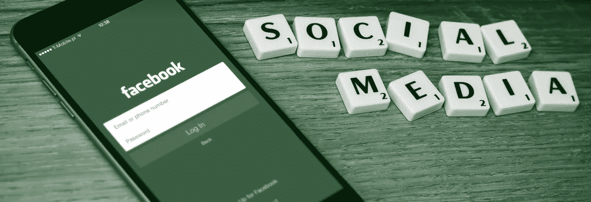
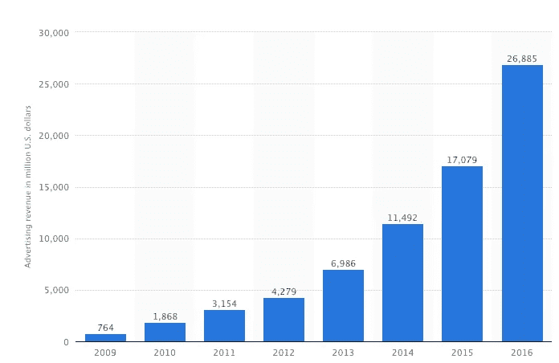
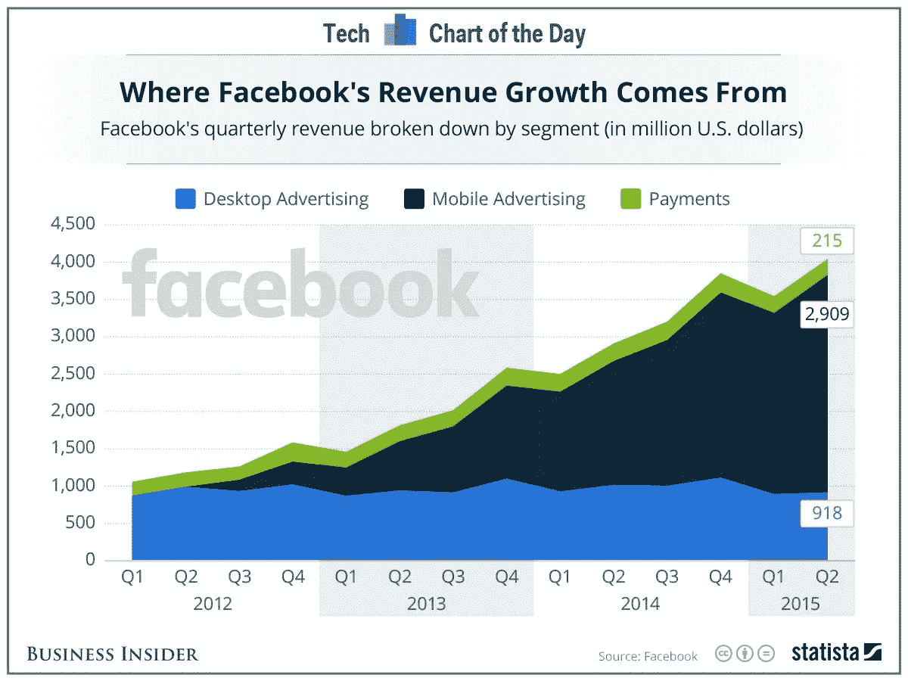

# 脸书——爱它或恨它，你不能忽视它。

> 原文：<https://medium.com/hackernoon/facebook-love-it-or-hate-it-you-cant-ignore-it-d9107a19156e>

## 我和脸书的关系可以用“复杂”来形容。很讽刺，不是吗？



我羡慕我妹妹。她没有脸书账号。我从没问过为什么。也许她觉得没必要。也许她不想公开她的社交生活。我不确定。但我知道我羡慕这种简单。

我和脸书的关系相当复杂。我几乎完全不用脸书。曾经有一段时间，我的时间表上充满了我在 Quora 上回答问题的更新。但是自从我禁用了自动分享功能，我不知道我的朋友们还能看到什么——除了我每两三个月发一次的帖子，只是发泄一下我刚刚产生的一些古怪和/或有趣的想法。不，不像许多脸书用户，我也不喜欢查看我朋友列表中的人的更新。所以我不会浏览我的订阅。

还没有。我想我每周至少会启动脸书应用 2-3 次。为什么？

1.  如果我每个月只查看一次脸书，我不喜欢看到成百上千的新通知堆积起来。我知道我无法让自己一页一页地看完。FOMO 确实是真实的。
2.  我喜欢内容。我不浏览大部分，但我喜欢浏览人们通过他们的脸书页面分享的不同类型的媒体(*特别是视频*)。帮助我更好地思考，更好地制定策略，更好地理解。
3.  **我做广告。我一直对脸书的广告业着迷。在一个由谷歌主导的领域——并且很好地抵御了竞争对手,*老牌公司和新兴公司* —脸书不仅能够站稳脚跟。它能够持续增长，以至于在 2016 年第四季度，它赚了近 90 亿美元。他们做到了这一切，没有惹恼他们的用户，也没有用交付的结果取悦他们的消费者。**



Data and chart source : [https://www.statista.com/](https://www.statista.com/)

# 为什么 FACEBOOK 广告让我着迷？

*迷恋*。我想不出任何其他的词来形容我对脸书广告的感情。你越是关注 FB 广告，它们就越不像是一种收入模式，而更像是一种产品模式。

很漂亮。良好集成、无缝交付、不妨碍使用的非侵入性行为。告诉我一个你见过的更好的广告投放。

> 公平地说，脸书在视频广告上一直以一种失败的方式丢球，但我希望他们能尽快纠正这些错误。在他们把整个事情变成主流并向所有人开放之前。

脸书一直在试验和执行其广告投放的方式，可以成为一门全面的产品管理课程。你越是试图理解它们，你就越能洞察如何进行你自己系统的产品开发— *不管你的业务线是什么。*

脸书的 DAU、MAU 和整体用户基数逐年增加。虽然其 90%的日常活跃用户通过手机访问该系统(*这并不奇怪*)，但超过 45%的用户仍然通过他们的电脑访问该系统。然而，当您查看收入增长时，您会发现桌面收入或多或少处于停滞状态。



[Photo credit](https://blog.bufferapp.com/law-of-the-double-peak)

脸书意识到在桌面上没什么可做的，所以他们决定将主要(*如果不仅仅是*)焦点转移到移动设备上。随着广告投放被巧妙地整合到主要产品中，这个赌注显然得到了回报。

# 那么为什么我还在用 FACEBOOK 呢？

这一切真的很迷人。我喜欢脸书的产品经理处理整个广告模块的方式，我喜欢诸如此类的东西。但我不认为我已经清楚地回答了首要问题。

> 如果我不喜欢使用脸书，甚至不使用它，那么为什么我仍然有我的 FB 帐户？为什么我不干脆删掉？

因为我是企业家。如果你是 21 世纪的企业家，你真的不能错过脸书！

如果我必须关闭所有其他营销渠道来支持其中一个，我会选择脸书。如果我只有 50 美元来收集用户对我产品的反馈，而且必须花在一个地方，我可能会选择脸书。

脸书很重要。爱它或恨它，它不会消失。

> 哦。公平地说，我在使用脸书时遇到的问题与其说是脸书的错，不如说是我的新闻订阅上出现的项目的错。如果我接受了每一个朋友的邀请，这不能怪脸书。

# 今天到此为止。明天见。


(*是的，我回来了。故事会像以前一样有规律地开始流动。*)

```
I am Abhishek. I am here... there.... Everywhere...[**Medium**](/@abyshake) **|** [**Twitter**](http://twitter.com/@abyshake) **| Facebook |** [**Quora**](http://bit.ly/abyshake) **|** [**LinkedIn**](http://in.linkedin.com/in/abyshake) **|** [**E-mail**](mailto:mail@abyshake.com)
```

[](http://bit.ly/HackernoonFB)[](https://goo.gl/k7XYbx)[](https://goo.gl/4ofytp)

> [黑客中午](http://bit.ly/Hackernoon)是黑客如何开始他们的下午。我们是 [@AMI](http://bit.ly/atAMIatAMI) 家庭的一员。我们现在[接受投稿](http://bit.ly/hackernoonsubmission)并乐意[讨论广告&赞助](mailto:partners@amipublications.com)机会。
> 
> 如果你喜欢这个故事，我们推荐你阅读我们的[最新科技故事](http://bit.ly/hackernoonlatestt)和[趋势科技故事](https://hackernoon.com/trending)。直到下一次，不要把世界的现实想当然！

