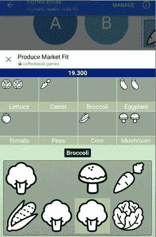
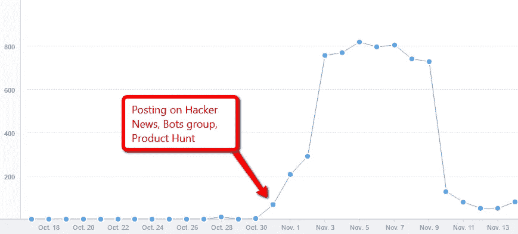

# Facebook Messenger Bot 平台增长和趋势观察

> 原文：<https://medium.com/hackernoon/facebook-messenger-bot-platform-growth-and-trend-observations-ad5287b64ca1>

自 2016 年 4 月推出[脸书](https://hackernoon.com/tagged/facebook) Messenger Bot 平台以来，时间刚刚过去 6 个多月。该平台已经经历了一些发展和演变，但迄今为止还没有任何“杀手级应用程序”，从这个意义上来说，它并不乐观。

我是一个经验丰富的脸书开发者和脸书迷。当脸书应用平台在 2007 年第一次上线的时候，我碰巧有一个机会马上在上面工作。(我当时在一个为客户开发网络应用的小工作室工作，当时每个人都想开发一个脸书应用，所以我可以通过做这个获得报酬。那段经历最终让我在 2008 年年中加入了 Zynga，当时这是一家纯粹的脸书游戏公司，我在那里工作了 6 年。)

快进到 2016 年年中，Facebook Messenger Bot 平台的发布。这一次，我的工作不是在 bot 开发领域；然而，从第一天开始，我就参与了这个平台上的多个爱好项目，并看到了它的变化和趋势。这里有一点比较和对比的平台和迄今为止的经验。

# 平台目标

这些是我的想法，不是脸书的官方立场。我认为脸书应该以此为目标:

*   类似于脸书应用平台的平台增长
*   用户普遍使用的黑仔应用

以下是我认为脸书的[学习](https://hackernoon.com/tagged/learning)从第一次开始，并试图避免陷入:

*   由于自由使用通信渠道(通知、新闻源)，平台变得垃圾
*   通过鼓励公用事业和生活应用来保持平台的有用性，而不是让它“退化”成像脸书应用平台那样的游戏平台

# 平台增长和杀手级应用:与脸书应用的时间线比较

这是让我在思考 Messenger Bot 平台的成功时反复思考的原因:

*   过去的 6 个月感觉像是在平台上度过的一生，令人沮丧的是看到在市场采用方面进展如此之小——我的朋友(除了机器人开发者)都没有在 Messenger 上使用任何机器人。
*   另一方面，脸书应用平台上的杀手级应用直到平台发布 6-12 个月后才出现。德克萨斯扑克( [Zynga 扑克](https://en.wikipedia.org/wiki/Zynga_Poker)的原名)、[黑帮大战](https://en.wikipedia.org/wiki/Mob_Wars)、[黑手党大战](https://en.wikipedia.org/wiki/Mafia_Wars)，都出现在这个时间段前后； [Restaurant City](http://restaurantcity.wikia.com/wiki/Restaurant_City) 、 [FarmVille](https://en.wikipedia.org/wiki/FarmVille) 和其他更多的图形游戏来得更晚——在该平台的 18-24 个月时间框架内。这确实说服我保持耐心。然而…
*   脸书应用程序平台上的早期应用程序已经非常有粘性，并获得了大量采用；尽管它们不是杀手级应用。这些应用程序包括像[超级墙](http://thenextweb.com/socialmedia/2011/04/13/the-greatest-facebook-apps-we-loved-and-lost/)、[吸血鬼和狼人](http://www.adweek.com/socialtimes/vampires-werewolves-zombies-slayers-oh-my/556270)、[出售的朋友](https://en.wikipedia.org/wiki/Friends_for_Sale)以及当时 Slide 和 RockYou 的一堆装饰/表情类型的应用程序。其中许多早在平台上线 2-3 个月就出现了。这是目前 Messenger Bot 平台非常缺乏的。我们甚至还没有大规模采用的“屁应用程序”。(从绝对数字来看，我敢肯定现在的机器人用户比 2008 年初的应用程序用户要多，这只是因为脸书网络本身现在要大得多。不过，用户的比例可能会更低；那时，每个人都至少有一面超级墙、趣味墙或高级墙。)

# 脸书的站台近卫

可能有也可能没有来自脸书的官方声明，但我们很多人都有这样的印象，脸书最初并不打算让他们的网络应用平台专注于游戏。实用应用是我心中的大事，像[我去过的城市](https://www.facebook.com/CitiesIveVisited)(最终被猫途鹰收购——平台上唯一成功的非游戏应用之一)就是我心中的大事。

然而，游戏被证明是杀手级应用，他们也随之发展。脸书信用是作为一种在平台上游戏赚钱的方式发布的，最终一个完整的游戏门户网站建成了。在这一过程中，许多最初被设计为应用程序接触非应用程序用户的轻量级方式的病毒式增长渠道，如通知和订阅帖子，被改变和削弱，因为它们被滥用得太多了。从脸书的角度来看，这非常有意义——它让脸书变得更干净、更友好，但从应用开发者的角度来看，这是毁灭性的，因为他们失去了向新用户展示的最有效渠道。

我之所以深入整个故事，是因为我相信这就是现在在 Messenger Bot 平台上推动一些设计决策的原因:

*   病毒渠道是故意缺失的。最近，轮播模板上增加了一个共享按钮功能，作为一个轻量级的通信渠道，用户可以使用它来共享你的机器人。在此之前，几乎什么都没有。即使是这个新的分享按钮，目前也非常有限。
*   社交图(访问用户好友列表的 API)显然是故意缺失的。即使你有脸书朋友也是你的机器人用户！我确实认为能够访问你的整个社交图谱(这是脸书应用程序平台允许的)有点过分，但不能访问你的朋友，他们也是机器人的用户，这对于在机器人内创建伟大的社交体验来说是非常有限的。
*   它也缺少本质上的“新闻源”换句话说，用户没有被动的方式去探索他/她的朋友在使用什么。这与脸书应用程序平台形成了鲜明的对比，那里有丰富的应用程序:1)在 2007 年初，脸书的个人资料被频繁访问，个人资料框模块允许非常容易地发现新的应用程序。这就是像超级长城这样的应用程序快速增长的原因。2)脸书新闻订阅本身一直允许向其发布帖子，直到游戏严重滥用它，他们不得不缩减规模。但对于所有在它之前出现并能利用它的游戏来说，增长是巨大的。要想在 Messenger 上有一个类似的应用，你需要在 Messenger 应用上有某种“主页”,在那里你可以看到你的朋友正在使用的一些机器人。我不知道这样的功能在设计中有什么意义，我甚至认为期望脸书设计出这样的东西是不现实的。我只是指出这两个平台之间的区别，以及为什么现在开发机器人更难的原因。

最后，从脸书的角度来看，这一切都是有道理的。如果提供了这些渠道，人们可以看到，这个平台将很快被他们试图避免的应用和游戏“污染”。从他们在 F8 的展示中，很清楚他们想要什么类型的机器人和 UX——机票、航班登记、订购鲜花、订购任何东西、获得收据以及与客户支持部门交谈。这些都不是病毒式渠道有意义的应用程序/机器人。然而具有讽刺意味的是，这也是该平台难以获得牵引力的原因。让我们面对现实吧，据报道现在有 34，000 个机器人在 Messenger Bot 平台上，但是你的朋友(他们不是脸书的开发者)没有一个使用它们。我敢打赌，你 90%的朋友(除了技术人员)甚至不知道机器人是什么，也不知道它们存在于 Messenger 上。

# 我的经验——利用唯一可用的病毒渠道进行增长黑客攻击

几周前，我在 Messenger Bot 平台上建立了一个实验项目。从我之前参与的一个失败的项目中吸取经验，并使用当时刚刚宣布的新“分享”按钮功能，我决定看看我是否可以建立一个应用程序，模仿最初脸书应用程序平台中一些应用程序的成功。

Mini games that you can complete a round in seconds, and share a high score.

这个想法很简单——迷你游戏本质上是快速抽动游戏，你可以获得高分，你被鼓励分享分数来挑战朋友打破你的分数。游戏是[茶歇](https://coffeebreak.games) ( [直接信使链接](https://m.me/PlayCoffeeBreakGames)如果你在手机上)。

这个实验有点成功，尽管它没有持续多久。

Number of messages the bot received daily since launch

在发布的那天晚上，我把它发布到了 Bots 开发组、黑客新闻和产品搜索上。我甚至没有考虑一天中发布的最佳时间，只是想把它作为一个测试。它自己起飞了。然而，这并没有持续多久。

损害增长的一个主要因素是用户数量的下降，他们在向机器人发送消息后甚至没有开始游戏。起初，通过分享来传播游戏是很棒的，但许多人要么不知道如何开始玩迷你游戏，要么不感兴趣。

启动任何游戏的独立用户数量与向机器人发送至少一条消息的总用户数量之比大约为 50%。这意味着大约 50%的用户在使用该机器人后会立即退出。

从这个快速实验中，我有 3 个主要收获:

*   新的分享按钮使得平台上的病毒式增长成为可能；但这是一个更加深思熟虑的行动(与之前的应用邀请、通知和提要帖子相比)，Messenger 频道也更加微妙。这意味着与受众(用户选择分享的任何人)相关的分享是强大的，但它可能比旧的通知渠道更快地成为滥用/感觉像滥用。小心使用。(我个人已经屏蔽了几个我试用过的 Messenger Bot 应用程序，它们不会停止给我发消息，尽管我对继续下去不感兴趣。)
*   被动探索和发现仍然是一个很大的问题。除了上面提到的病毒式传播渠道之外，信使机器人应用程序很少有其他途径被看到。对于我自己来说，在 Bots group 和 Hacker News 上的帖子之后，我几乎不能做什么来帮助推动它向前发展。(我做了几件事，比如向 botlist.co 提交申请，在脸书广告公司花了几美元，但都没什么用。)
*   用户对信使机器人的态度和/或了解程度。假设分享他们高分的用户选择了可能玩的朋友来分享(而不是随机发送垃圾邮件)，50%的下降数字令人失望。一个假设是，大多数用户要么根本不知道机器人是什么，要么不知道他们应该用它做什么，只有更好奇/更勇敢的人才会玩它。

这大概总结了我现在对 Messenger Bot 平台的想法！总的来说，我很高兴能有一个新的平台进行实验。我还不能完全相信聊天机器人/对话式用户界面已经准备好登上大舞台，但我对它会登上大舞台持乐观态度。请在评论中留下你的想法，如果你喜欢，请关注帖子！

> [黑客中午](http://bit.ly/Hackernoon)是黑客如何开始他们的下午。我们是 [@AMI](http://bit.ly/atAMIatAMI) 家庭的一员。我们现在[接受投稿](http://bit.ly/hackernoonsubmission)，并乐意[讨论广告&赞助](mailto:partners@amipublications.com)机会。
> 
> 如果你喜欢这个故事，我们推荐你阅读我们的[最新科技故事](http://bit.ly/hackernoonlatestt)和[趋势科技故事](https://hackernoon.com/trending)。直到下一次，不要把世界的现实想当然！

