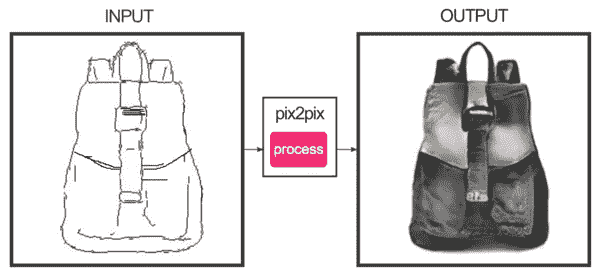

# 🔮脸书押注人工智能，我们能对机器人征税吗？

> 原文：<https://medium.com/hackernoon/facebooks-bet-on-ai-and-can-we-tax-robots-40e1fefbfac7>

## 🚀这是指数视图的第 102 期。在此注册订阅时事通讯。

Demo of deep-learning image transfer

脸书的人工智能雄心。虚拟现实不是一种时尚。为什么我们不应该对机器人征税？就业的变化[性质](https://hackernoon.com/tagged/nature)。使用加密货币来调整激励措施。赞美简单的启发法。数字避孕。费城的海洛因。

希望这能引发伟大的对话！

❤️ **爱这个？**请通过 **Twitter** ，[LinkedIn](https://www.linkedin.com/shareArticle?mini=true&url=http://azeem.io/s&title=Azeem%27s%20Exponential%20Digest%20-%20highly%20recommended&summary=&source=)，[脸书](https://www.facebook.com/sharer/sharer.php?u=http://azeem.io/s)分享[。](https://twitter.com/intent/tweet?text=Love%20Exponential%20View%20from%20@azeem%20Great%20weekly%20newsletter%20Sign%20up%20http://azeem.io/s)

# 近期发展部

💡Stephen Levy [讲述脸书如何将人工智能融入其产品。给我留下深刻印象的是，脸书坚信，现在制造像样的消费产品需要人工智能的预测能力。**长读**](https://backchannel.com/inside-facebooks-ai-machine-7a869b922ea7#.7n4vb4ies)

ⓜ对 Facebook 如何缩小其人工智能助手 Facebook M 的野心进行了精彩的分析。在没有人工干预的情况下，m 只能满足 30%的请求。

🌈虚拟现实是一种时尚吗？早期数据显示，采用曲线与 iPhone 相差不远。

👩‍💻英国的自营职业增长速度明显快于其他发达经济体。这种增长一方面出现在高收入行业，另一方面出现在不稳定行业。这是否代表着劳动力市场的重塑？[完整 PDF](http://www.resolutionfoundation.org/app/uploads/2017/02/Self-employment-presentation.pdf) | [简要总结。](http://www.resolutionfoundation.org/publications/a-tough-gig-the-nature-of-self-employment-in-21st-century-britain-and-policy-implications/)(此外，报告显示[到 2032 年](http://www.cbronline.com/news/verticals/public-sector/automation-robots-replace-250000-public-sector-workers-next-15-years/)，25 万英国公务员可能会被自动化取代。)

🇺🇸·大卫·布鲁克斯认为本世纪的美国已经崩溃。“21 世纪看起来更加糟糕和坎坷:民族主义上升，对民主的信心下降，世界秩序瓦解。”不，不是机器人扼杀了增长。另请参见高盛关于美国劳动力市场问题的报告[中的精彩摘录，以及只有灾难才可靠地降低收入不平等的严峻预测](https://twitter.com/JimPethokoukis/status/835452405957419008)。

💸“随着比特币交易的真实成本上升，边际效用下降，该平台作为人类经济互动工具的基本价值也随之下降”。

# 机器人与人工智能系

🤖我们应该像比尔·盖茨建议的那样对机器人征税吗？经济学家 [提出了一个有说服力的论点，即我们不应该](http://www.economist.com/news/finance-and-economics/21717374-bill-gatess-proposal-revealing-about-challenge-automation-poses-why-taxing)。基本原理？自动化似乎不是劳动力回报减少的原因，而是某些公司力量的增加(通过网络效应、优越的文化或政府保护，如知识产权)。)**必读。**

借助于 [pix2pix 和图像到图像转换](http://affinelayer.com/pixsrv/index.html)的实现，我在这篇文章的顶部绘制了一个时尚的背包图像。你自己玩吧。(在 iPhone 上不起作用。)

💵Numerai 是一家初创公司，通过汇集数据科学家社区的最佳算法来构建金融交易模型，该公司得到了许多订阅者的支持。Numerai 必须克服一个激励问题。当市场中的参与者通常是对手时，你如何让人们分享产生 alpha 的算法？Numerai 提出了一个新颖的解决方案，交易者通过在新的加密货币中投资来支持他们对算法的信心。)

表演算法导致超额支出，表现不佳者失去他们的股份。这种模式可能会激励平台上的合作。Numerai 的方法行得通吗？别无选择，只能等待并找出答案。

*   [人工智能如何让英特尔措手不及](http://www.economist.com/news/business/21717430-success-nvidia-and-its-new-computing-chip-signals-rapid-change-it-architecture)(以及它对通用 CPU 的长期押注)
*   美国一家大型医院终止了与 IBM Watson 的合作，该公司的人工智能部门(过高的期望？)
*   [AI 在《超级粉碎兄弟》中粉碎人类](https://www.newscientist.com/article/2122452-ai-beats-professional-players-at-super-smash-bros-video-game/)。“几个小时后，人工智能足以击败游戏中的人工智能，几周后，它可以击败顶级人类。”
*   [人工智能胜过人类的许多狭窄任务的可靠列表](/on-coding/the-state-of-ai-9aae385c2038#.npzzpvgav)
*   [深度学习面部时光机](https://www.technologyreview.com/s/603684/neural-network-learns-to-synthetically-age-faces-and-make-them-look-younger-too/)
*   DeepCoder [通过从其他程序窃取来学习写代码](https://www.newscientist.com/article/mg23331144-500-ai-learns-to-write-its-own-code-by-stealing-from-other-programs/)
*   [机器人清洁市场呈指数级增长](http://robohub.org/robotic-cleaning-market-growing-exponentially/)
*   这里是[当卡车自动驾驶时，工作岗位将会流失](https://www.axios.com/heres-where-jobs-will-be-lost-when-robots-drive-trucks-2276682948.html)
*   通用汽车计划明年在美国城市测试数千辆自动驾驶汽车
*   🎧**新电动汽车播客** : [与机器人的亲密生活](https://soundcloud.com/exponentialview/up-close-and-personal-living-intimately-with-robots-with-kate-devlin)与凯特·德芙琳

# 在晚宴上显得聪明的小点心

💡[简单的试探法往往胜过复杂的规则。](http://www.foundingfuel.com/article/gigerenzers-simple-rules/)Gerd Gigerenzer 的出色表现

费城海洛因疫情内幕

墨西哥的糖税成功地减少了糖的消费

💏埃琳娜·贝里隆德的避孕算法和避孕药一样有效。

[Beepi 是如何失败的。曾经火热的汽车市场的内爆分析](https://carlypso.com/blog/2017/02/22/why-did-beepi-fail-what-does-it-mean-for-online-car-sales/)

🔋投机者正在囤积钴(锂离子电池所需)

六足机器人用两条腿移动得更快

[SHA-1 密码功能被破解](https://shattered.it/)。**优**念

🚀谷神星上发现的有机化合物

👽[发现七颗温带系外行星](http://www.nature.com/nature/journal/v542/n7642/full/nature21360.html)

# 你写的东西

EV 读者本周的两篇文章值得一读。

*   尼克·拉塞尔问是否有可能通过社交媒体来改变人类个体的大脑？
*   侯赛因·卡赛[提出了全民基本收入的理由](/economicsecproj/universal-basic-income-new-deal-of-the-21st-century-be6c1c9221de#.egy7z4r3y)

# 结束注释

我看了《我，丹尼尔·布莱克》,这是一部伟大的电影，讲述了一个木匠如何应对失业，如何在英国的社会安全网中航行，如何努力维护自己的尊严。就其本身而言，这是一部精彩的电影。有一点特别有趣。主角需要驾驭一个拜占庭式的官僚程序，对其如何运作没有真正的解释，纠正权也有限:这本质上是一个巨大的算法。而且是不人道的。推荐观看！

祝你度过超级一周

阿兹姆

🚀从朋友那里转发的？[在此注册指数视图。](http://azeem.io/s)

> [黑客中午](http://bit.ly/Hackernoon)是黑客如何开始他们的下午。我们是 T21 家庭的一员。我们现在[接受投稿](http://bit.ly/hackernoonsubmission)并乐意[讨论广告&赞助](mailto:partners@amipublications.com)机会。
> 
> 如果你喜欢这个故事，我们推荐你阅读我们的[最新科技故事](http://bit.ly/hackernoonlatestt)和[趋势科技故事](https://hackernoon.com/trending)。直到下一次，不要把世界的现实想当然！

