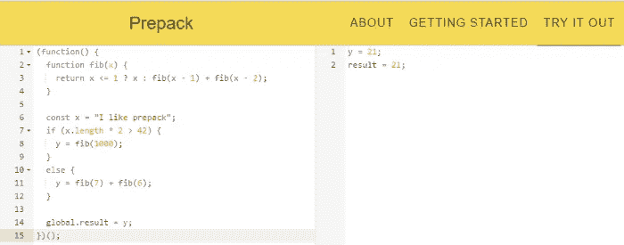
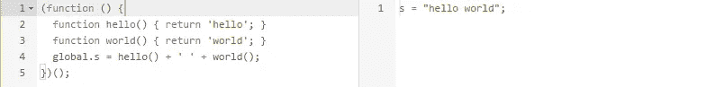
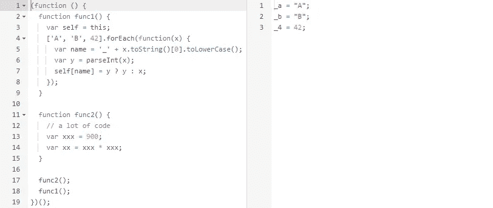
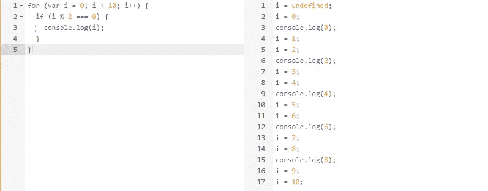
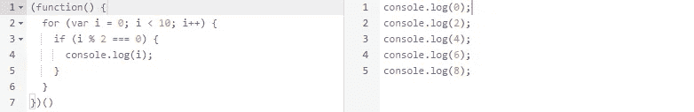
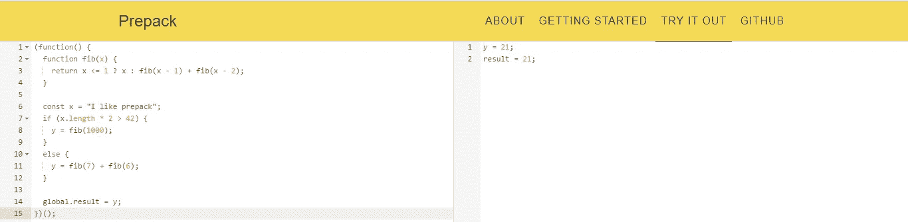
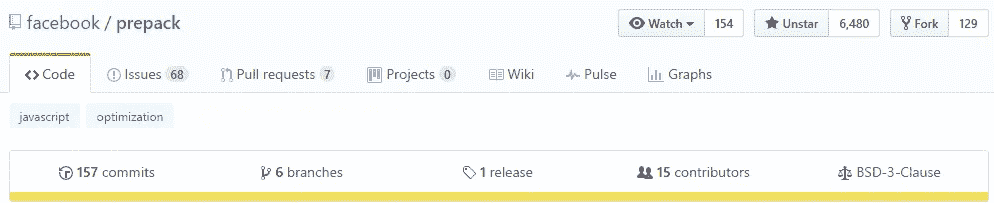
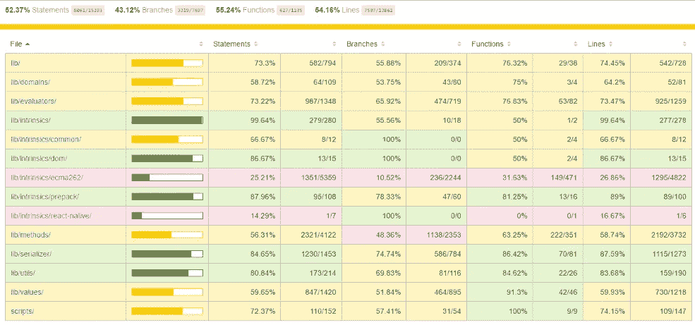

# 脸书的 Prepack——JavaScript 领域的下一个黑仔

> 原文：<https://medium.com/hackernoon/facebooks-prepack-the-next-killer-in-the-javascript-zone-d932556ffd8c>



***本*条** ***原本出现在***[***dormoshe . io***](https://dormoshe.io/articles/facebooks-prepack-the-next-killer-in-the-javascript-zone-7)

最近几天，社交网络上关于 ***Prepack*** 的风波不断。大概你还没听说吧。那是合理的！就在几天前已经是一个**开源**了。预包装已开发的脸书和它正在积极发展。这是实验性的，仍然处于非常早期的阶段，但它是令人敬畏的😱。

在这篇文章中，我们将介绍预包装，涵盖脸书想要解决的问题，看到一些很酷的例子，并了解预包装的现状。

# **前..什么？**

> Prepack 是一个优化 JavaScript 源代码的工具

可以在**编译时**而不是运行时完成的计算将**删除**。Prepack **用简单赋值序列的等价代码替换 JavaScript 包**的全局代码。这消除了大多数中间计算和对象分配。

Sebastian McKenzie — one of the Prepack developers

Prepack 是 JavaScript 的**部分求值器**。Prepack 重写了一个 JavaScript 包，使得 JavaScript 代码的执行效率更高。对于初始化繁重的代码，Prepack 在 JavaScript 解析被有效缓存的环境中工作得最好。

## 那么闭包编译器呢？

> Prepack 关注运行时性能，而闭包编译器强调 JavaScript 代码大小。

闭包编译器还优化了 JavaScript 代码。Prepack 更进一步，真正运行初始化阶段的全局代码，展开循环和递归。

## 一段历史

一年前，在 React-Europe 2016 大会上，Sebastian McKenzie 谈到了如何让 JavaScript 初始化更快。

McKenzie talk at React-Europe 2016

所以，现在我们对它有了更多的了解。有名称和网站，我们可以使用它。

# 如何开始？

Prepack 以 npm 软件包的形式提供，您可以通过 Prepack-CLI 工具或对 Node.js 模块的 API 调用来使用它。

## 预包装 CLI

要安装 Prepack-CLI，请运行

`npm install -g prepack`

然后编译一个文件，运行

```
prepack script.js
```

## 预包装 API

为了在其中安装一个项目，运行

```
npm install --save-dev prepack
```

然后 js 代码看起来像这样:

Prepack api usage via npm package — code example

## 预打包-网络包-插件

有一个 webpack 插件可以方便地使用 Prepack。

webpack plugin usage example

# 让表演开始吧

这里有一些很酷的例子。示例中的左侧包含输入，右侧包含 Prepack 的输出。

第一个示例是传统的 hello world 示例:



Example 1

可以看到，Prepack 把代码编译成了最小的版本。

下一个例子包含两个函数。代码如下:



Example 2

编译后的代码由第一个函数生成。函数`func2`是无用的，它不包含任何副作用代码，所以没有与`func2`相关联的编译代码。

注意，不在[生命](https://developer.mozilla.org/en-US/docs/Glossary/IIFE)中的代码不是完全优化的。



Example without IIFE

此示例显示了使用 for 循环进行编码。编译后的代码中去掉了循环，但是还有很多未使用的代码行。生活看起来会是这样的:



Example with IIFE

在这里您可以看到只有 5 行日志操作。

## 操场

你可以在 Prepack 网站的一个专门的游乐场里自己尝试一下(见参考资料部分)。对于那些不想安装它或只对玩预包装感兴趣的人来说，游乐场是更好的选择。



Playground example

# 初速电流状态

## **Github 措施**

由 Github 托管(与❤️一起)并通过 npm 发布的预包装代码。



Github

有 15 个贡献者，大约 6500 颗星，本周通过 npm 和 130 个分叉有 2000 次下载。由于开发者对社交网络越来越感兴趣，这些统计数据有望在接下来的时间里大幅增长。

有一个有趣的问题你真的想知道…

[](https://github.com/facebook/prepack/issues/543) [## 将 1 行无意义的代码转换成 1065 行代码

### 貌似@bevacqua 成功破了。尝试从 docs (function() { function fib…

github.com](https://github.com/facebook/prepack/issues/543) 

但是没关系。他们将在不久的将来修理它。

## 测试覆盖率

序列化测试的[代码覆盖率](https://446-45147841-gh.circle-artifacts.com/0/tmp/circle-artifacts.hh6xQWZ/coverage-report-sourcemapped/index.html)报告可供所有人使用。目前覆盖率为 52.37% 。



Code coverage

由[伊斯坦布尔](http://istanbul-js.org/)生成的 Prepack 的代码覆盖率。

## 路标🎯

脸书对于预包装的发展有一个 [**路线图**](https://prepack.io/) 。路线图分为三个部分:短期、中期和长期。

在短期内，脸书希望稳定 React 原生包预打包的现有特性集。他们还希望与 React 原生工具链进行集成。此外，他们计划基于 React Native 使用的模块系统的假设进行优化。

长期愿景是**利用 Prepack 作为一个平台。**

# 最后的关注

Prepack 不识别`document`和`window`，所以它们的值会是`undefined`。因此，我们必须为处理这个问题做一些准备。也许有人想为此写一些 npm 包？😇

脸书要求开发人员尝试预打包，给出反馈，并通过修复 bug 和在 Github 库中做出贡献来帮助他们。

# 参考

以下是一些有用的链接供进一步阅读:

*   [Github 资源库](https://github.com/facebook/prepack)
*   [npm 包](https://www.npmjs.com/package/prepack)
*   [官网](https://prepack.io/)
*   预包装[游乐场](https://prepack.io/repl.html)

# 结论

预包装可以成为“生活改变者”。它由一家稳定的公司——脸书公司支持。他们希望将这个工具集成到 React 中，他们已经为此努力了一段时间。有很多事情要做。脸书的愿景是**利用预包装作为一个平台**。听起来很有希望。我将跟随他们前进。Prepack 太棒了！


***您可以关注我的***[***dormo she . io***](https://www.dormoshe.io)***或***[***Twitter***](https://twitter.com/DorMoshe)***阅读更多关于 Angular、JavaScript 和 web 开发的内容。***