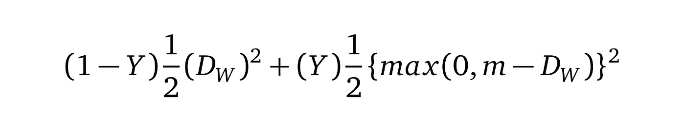
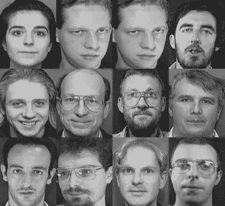
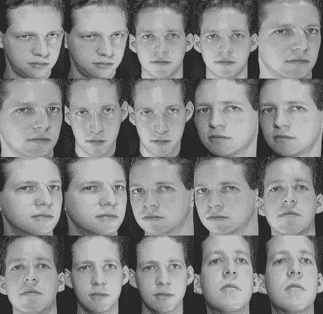
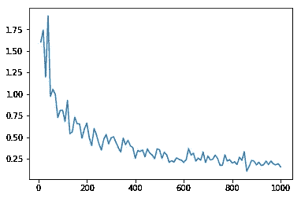
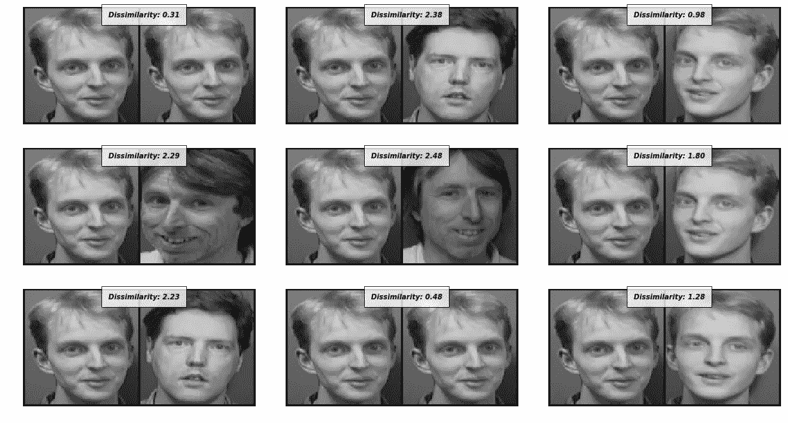

# PyTorch 中与暹罗网络的面部相似性

> 原文：<https://medium.com/hackernoon/facial-similarity-with-siamese-networks-in-pytorch-9642aa9db2f7>

> 这是由两部分组成的文章的第二部分。你应该在这里继续之前阅读 [*第一部分*](https://hackernoon.com/one-shot-learning-with-siamese-networks-in-pytorch-8ddaab10340e) *。*

在中，上一篇文章讨论了 one shot [learning](https://hackernoon.com/tagged/learning) 旨在解决的一类问题，以及暹罗网络如何成为这类问题的良好候选。我们讨论了一个特殊的损失函数，它计算一对图像中两个图像的相似度。我们现在将实现之前在 PyTorch 中讨论过的所有内容。

*你可以在本文末尾找到 Jupyter 笔记本的完整代码。*

# 建筑

我们将使用标准的卷积神经[网络](https://hackernoon.com/tagged/network)架构。我们在每个卷积层之后使用批量归一化，然后是丢弃。

**Snippet 1.0** Siamese Network Architecture

这个网络没什么特别的。它接受 100 *px* *100 *px* 的输入，并且在卷积层之后具有 3 个全连接层。

## 但是另一只暹罗猫在哪里？

在上一篇文章中，我展示了一对*网络*如何处理一对网络中的每张图片。但是在这篇文章中，只有一个网络。因为两个网络的权重被限制为相同，所以我们使用一个模型，并连续输入两个图像。之后，我们使用两幅图像计算损失值，然后反向传播。这在绝对不影响其他指标(比如准确性)的情况下节省了大量内存。

# 对比损失

我们将对比损失定义为

Equation 1.0

我们将 Dw(就是欧几里德距离)定义为:

Equation 1.1

Gw 是我们的网络对一幅图像的输出。

PyTorch 的对比损失是这样的:

**Snippet 2.0** Contrastive loss with a default margin value of 2

# 数据集

在前一篇文章中，我想用 MNIST，但是一些读者建议我用我在同一篇文章中讨论的面部相似性的例子。因此我在& T faces 数据集从 MNIST/OmniGlot 切换到**。**

该数据集包含 40 个对象从不同角度拍摄的图像。为了测试我们的模型，我将培训中的最后 3 个主题放在一边。

Figure 1.0\. **Left**: Samples from different classes. **Right**: All Samples of one subject

# 数据加载

我们的架构需要一个输入对，以及标签(相似/不相似)。因此，我创建了自己的定制数据加载器来完成这项工作。它使用图像文件夹从文件夹中读取图像。这意味着您可以在任何想要的数据集上使用它。

**Snippet 3.0**. This data set generates a pair of images and the similarity label. Label will be 0 if images are from same class, and 1 if they are from different classes.

暹罗网络数据集生成一对图像，以及它们的相似性标签 **(0 表示真实，1 表示冒名顶替)**。为了防止不平衡，我确保将近一半的图像来自同一个类，而另一半不是。

# 培训暹罗网络

暹罗网络的训练过程如下:

1.  通过网络传递图像对的第一个图像。
2.  通过网络传递图像对的第二个图像。
3.  使用 1 和 2 的输出计算损耗。
4.  反向传播损失以计算梯度。
5.  使用优化器更新权重。在这个例子中，我们将使用 Adam。

**Snippet 4.0** Training the siamese network

使用 Adam 和 0.0005 的学习率对网络进行 100 个时期的训练。损失随时间变化的图表如下所示:

**Figure 2.0** Loss value over time. The x axis is number of iterations

# 测试网络

我们为测试集提供了 3 个主题，这些主题将用于评估我们的模型的性能。

为了计算相似性，我们只需计算 Dw(等式 1.1)。该距离直接对应于图像对之间的相异度。Dw 的高值表示较高的不相似性。

**Snippet 3.0** Evaluating the model by calculating distance between model outputs.

Figure 3.0 Some outputs of the model. Lower values indicate more similarity, and higher values indicate less similarity.

效果挺好的。网络能够区分同一个人，即使他们来自不同的角度。它在区分不同的图像方面也做得很好。

# 结论

我们讨论并实现了一个暹罗网络来区分面部识别的人脸对。当特定人脸的训练样本很少(或只有一个)时，这很有用。我们使用判别损失函数来训练神经网络。

## 你可以在我的回购中找到完整的代码:

 [## Harvey slash/py torch 中与连体网络相似的面部

### Pytorch 中具有连体网络的面部相似性](https://github.com/harveyslash/Facial-Similarity-with-Siamese-Networks-in-Pytorch) 

# 附言

如果你喜欢这篇文章，请❤在下面分享它。欢迎提出建议，如果你有不明白的地方，请随时问我。