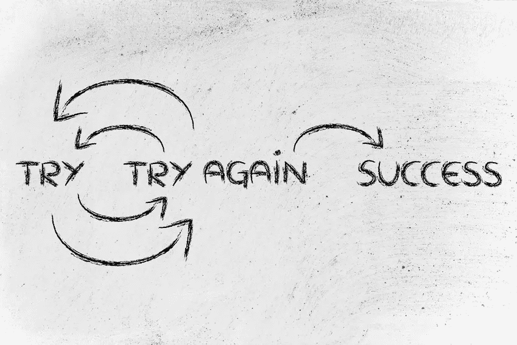

# 快速失败、迭代和透视

> 原文：<https://medium.com/hackernoon/fail-fast-iterate-and-pivot-8d00d6c00836>

我正在读来自[的文章“](https://medium.com/u/f576c9fe8447?source=post_page-----8d00d6c00836--------------------------------) [4 个阻碍你的创业神话](/swlh/4-startup-myths-that-hold-you-back-a45b5fdc81eb)”。神话 1 真的让我眼前一亮。

> 神话 1:成功=伟大的想法+决心

在我职业生涯的早期，我相信我会被这个神话所迷惑。也许我那时很天真，但现在没那么天真了。人们很容易相信，成功所需要的只是一个伟大的想法和决心。但是这是**最危险的**神话。

如果你和我一样，大声说出来感觉很奇怪。你喜欢在你热爱的事情上努力工作，并想尽你所能让它们成功。作为一个每天都努力工作来实现自己想法的人，我每天都在学习如何实现自己的想法。我可以告诉你，一个伟大的想法和你的决心不会决定你的成功。失败了很多次，从中吸取教训并尽快这样做，会比想法和决心更有助于你成功。

> 如果有人问我，在尝试启动自己的 hustle/startup/软件产品时，最重要的事情是什么，我会用 fail fast 来回答，以了解什么可行/不可行，根据你了解到的真实数据进行迭代，不要害怕转向。

拥有快速失败、快速迭代和轻松转向的能力比决心和想法更有助于你的成功。不是说你不需要那些东西，你绝对需要！它们并不是你成功的最重要的因素。将快速失败、迭代和旋转视为成功的基础。有了他们，你就有了解决客户问题的基础。没有它们，你可能最终不得不建造无数的房子来解决你的顾客的问题。

# 渴望了解更多信息？

如果你喜欢这篇文章，并且渴望了解 AWS，我已经开始整理一本小的[书](https://hackernoon.com/tagged/book)！通过使用 [Amazon](https://hackernoon.com/tagged/amazon) Web 服务托管、交付和保护静态网站的实际例子，您可以了解 AWS 服务和技术。点击这里了解本书[的最新进展。](https://www.kylegalbraith.com/learn-aws/)

## 如果你喜欢这个，别忘了鼓掌以示支持！