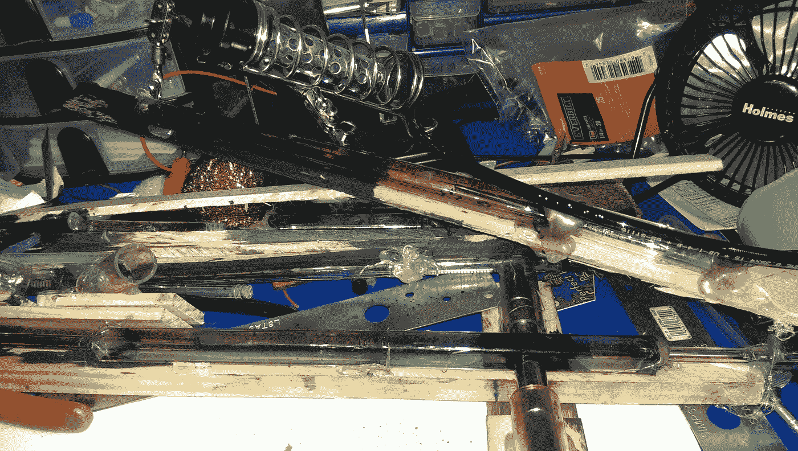
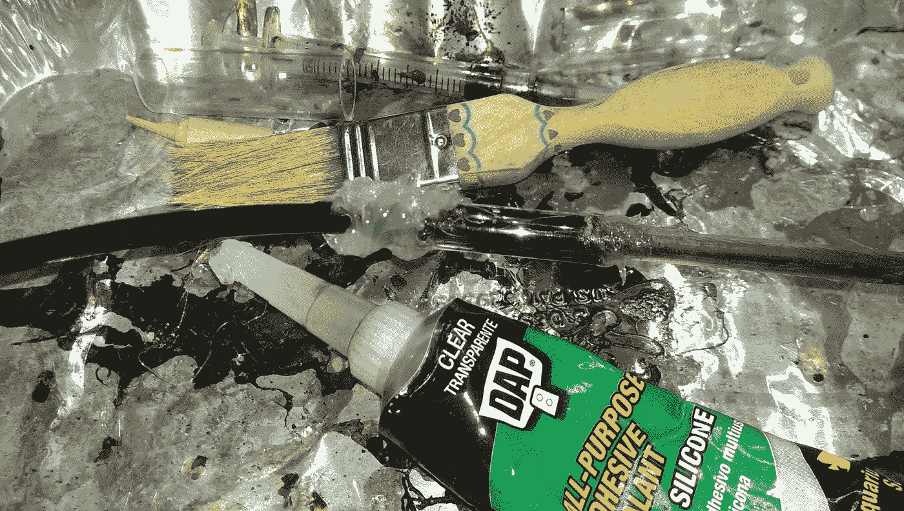
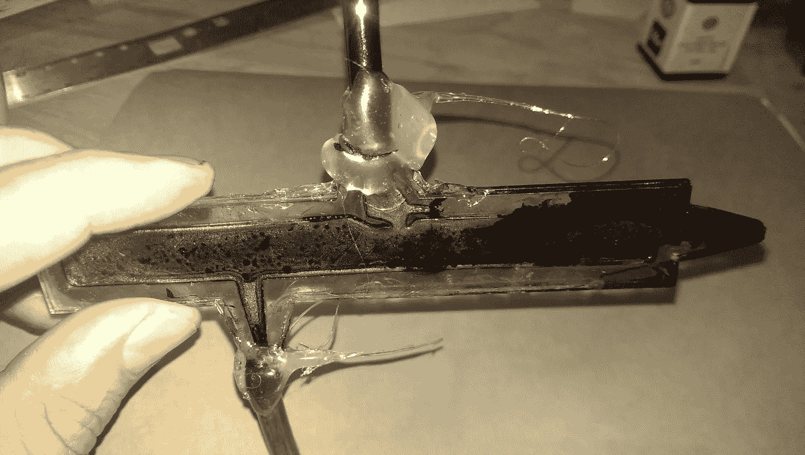
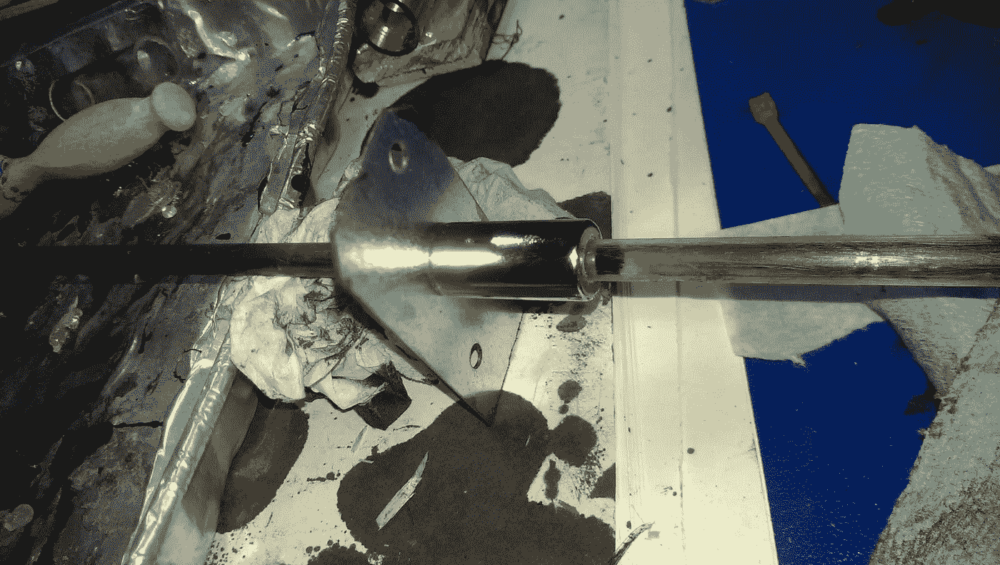
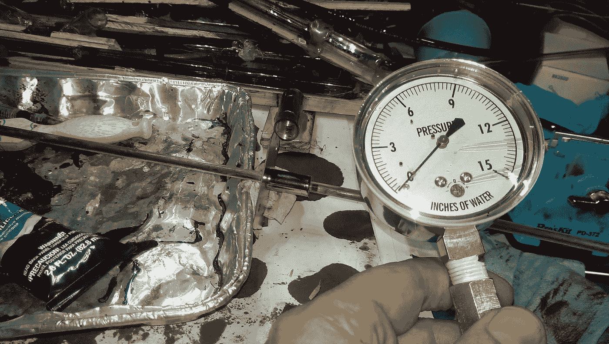

# 铁磁流体的失败实验

> 原文：<https://medium.com/hackernoon/failed-experiments-with-ferrofluid-742fa13b0ae1>

铁磁流体是矿物油中微小铁纳米粒子的悬浮液，当置于磁场中时，其行为就像移动的液体磁铁。它现在可以像 Apex 磁铁一样在磁铁商店便宜地买到。它有一些迷人而美丽的行为。你可以用它做一个没有运动部件的液体活塞，除非你计算液体的运动。由于这可以做得非常小，研究人员一直有兴趣尝试用铁磁流体制作小型泵，以操纵微小的样本进行化学分析，也许可以通过制作一个芯片上的[实验室](https://infoscience.epfl.ch/record/55930/files/98.pdf)。

部分是由于一个年轻学生 Huy 的兴趣，我开始用铁磁流体做实验。这是一个悲惨失败的故事；作为一名[公共发明家](https://pubinv.github.io/PubInv/)，公布成功和失败是我的精神。

虽然 Huy 最感兴趣的是建造一个软致动器，但我认为这可以通过建造一个铁磁流体泵来实现，也就是说，一个除了由电磁体操纵的铁磁流体之外没有移动部件的泵。如果我们可以将铁磁流体泵入膀胱或薄膜中，我们将会有一个“静水器”的开端，一个可以根据内部压力变化改变形状的物体。从理论上讲，我们或许可以制作一个人类舌头、蜗牛身体或章鱼手臂的模型。

My initial test apparatuses, now junked.

但在此之前，我坚持尝试建造一个泵，泵的基础是活塞和阀门。特别是“止回阀”或单向阀。只允许空气(或水)单向流动的阀门。有了两个止回阀和活塞，你可以做一个摆动泵，比如自行车打气筒。

如果你把一滴铁磁流体放在一个管子里，然后对它施加一个强磁场，它就会“密封”管子。也就是说，它形成了某种程度上的气密密封。如果一侧的空气压力变得足够高，它会爆炸式地喷出磁铁，从而打破密封。但是在你达到那个压力之前，它是密封的。你可以很容易地通过移动磁铁来移动试管中的斑点。我使用了强力的 1/2 英寸宽 1 英寸长的钕磁铁，但是任何磁铁都可以——越强越好，直到安全为止。你可以很容易地观察到，这个移动的斑点就像一个活塞，推动着管内的空气。

玩铁磁流体的标准方法是把它放在一个有盖的培养皿中，然后在它下面放一块磁铁。然后慢慢取下 petridish 盖。为什么慢慢来？因为铁磁流体像墨水一样会染色，而且容易飞溅。玩的时候最好戴上护目镜，用手套和不介意被弄脏的旧衣服。非常乱。

我这样做并四处玩耍，或多或少没有目的，并决定用皮下注射器将空气注入铁磁流体中。结果很有趣——产生的气泡总是朝着磁场梯度最低的方向出现。也就是说，气泡逃离了磁场最强的地方。

这当然有道理。在磁场存在的情况下，铁磁流体变成“固体”或半固体。也许“固体”这个词并不恰当——但是磁场中的铁磁流体可以抵抗其形状的变形。从某种意义上说，强磁场中的铁磁流体具有更大的内压。

注射器的效果非常明显:气泡的运动方向与磁通量梯度的方向相反。

这让我产生了一个想法:这种不对称的行为应该允许我们创造一个单向阀门。如果我们可以将铁磁流体放入一个具有强梯度的磁场中，我们可以想象制作一个允许空气从一个方向通过但不允许空气从另一个方向通过的滴状物。

另一种说法是，如果你在一个滴状物的表面上施加梯度增加方向的气压，你就移动了整个滴状物。如果你把空气放进一个小球，它会形成一个向外流动的气泡。

因此，我(错误地)推断，我可以很容易地建立一个几何图形，让我将气泡注入高梯度点，它会流向低梯度点(也就是说，空气会很容易地在这个方向上通过。)但另一个方向的空气会推动整个团，因此被密封而不流动。所以，我建造了六个不同的仪器来测试这个理论，如上图所示。

第一次是用皮下针。这似乎有效，但并没有。大约 48 小时后，铁磁流体会变粘并堵塞针头。

Silicone sealant seals urethane pressure tubes to acrylic better (but slower) than hot-melt glue

所以我制作了另一个类似的装置，完全由丙烯酸管制成。也就是说，一个小的丙烯酸管代替了钢针。这清楚地表明，这个想法确实可行——但有一个条件。一旦管中有空气(不是铁磁流体),使得空气确实进入梯度下降点，那么它就工作了。我可以通过用手在丙烯酸注射管上移动我的滴状物来完成这个动作。)然而，我不能把空气“吹”进这个斑点。一旦铁磁流体进入针中，就需要很高的压力来清除它。也就是说，这挫败了允许空气在低压下通过的想法。

然后我决定问题是我必须在到达下降的坡度之前克服这个上升的坡度。也就是说，如果我从同一个方向注入空气，不通过中心，大流量的部分，可能会有效。

也许，亲爱的读者，你现在看到了我的错误，但是让我继续。我费了很大的劲，用激光切割了一些丙烯酸片，做了一个容易看到的二维版本。然后，以更大的麻烦为代价，我把它们粘在一起，使它们不透气，用热熔胶把它们密封在聚氨酯管上。像通常发生的那样，我不得不把这些操作做两次才能让它工作。

Magent with steel yoke to channel flow lines

但是没有用。我只是不能理解它。我尝试了一个更简单的实验，用一个铁轭(实际上是软钢)来转移单个中空圆柱形磁体末端的磁通量。这无疑产生了从弱(有磁轭的地方)到强(没有磁轭的地方)的磁梯度。)至少，如果管内充满空气的话。

但是没有用。使用价值 40 美元的压力计测量水柱中的气压，并仔细密封氨基甲酸乙酯管，很明显，水滴密封良好，然后在两侧约 14 柱英寸水柱处破裂。

Air pressure gauge use to measure pressures (sealed to apparatus.)

困惑是值得珍惜的，因为它先于开悟。

一旦我的实验把我拖进光线中，我终于明白了:任何一滴铁磁流体的表面在表面上的任何一点都倾向于具有相同的磁通量，并且表面的磁通量将比内部更深的点更低。因此，在没有首先将流体从低流量位置移动到高流量位置的情况下，不可能将空气吹入铁磁流体滴中，无论你如何成形注射针或将其放置在哪里。正如我们所见，这不会让一个小气泡通过，整个气泡会移动。

是的，你可以将空气注入铁磁流体滴中，让空气轻松流出——一旦你用足够的压力将针中的流体移开。

换句话说，我推测不可能基于任何涉及简单空气界面的几何形状来制造单向被动铁磁流体阀。

这并不意味着我们不能以其他方式将空气“偷运”到一个 blob 中，但任何主动措施都不再是被动阀。

这里有一些数学/物理倾斜的挑战:

1.  证明或反驳在磁场(不考虑重力)存在的情况下，铁磁流体滴的表面是每单位面积通量密度相等的表面。
2.  证明或否定斑点表面的磁通量梯度总是指向斑点内部。
3.  证明或反驳一个物理上包含在一个管中的滴，有两个空气界面(在滴的任一端)在每一侧有相等的通量密度。
4.  证明或反驳无论你使用什么磁铁或物理形状，都不可能建立一个被动的铁磁流体几何结构，它提供了一个通量梯度递减的空气表面，因此不可能像我尝试的那样用铁磁流体建立一个简单的被动单向阀。

我声称所有这些断言都是真实的，但并不声称已经为这些陈述提供了令人信服的证据。

公共发明是一个非营利组织，致力于创造自由的开源发明，不寻求知识产权垄断，以造福全人类。要了解更多或参与其中，请联系 Robert L. Read <read.robert>，或查看 GitHub [repos](https://github.com/PubInv) 或我们的 [YouTube 频道。](https://www.youtube.com/channel/UCJQg_dkDY3KTP1ybugYwReg)</read.robert>