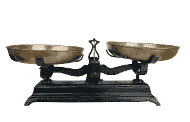
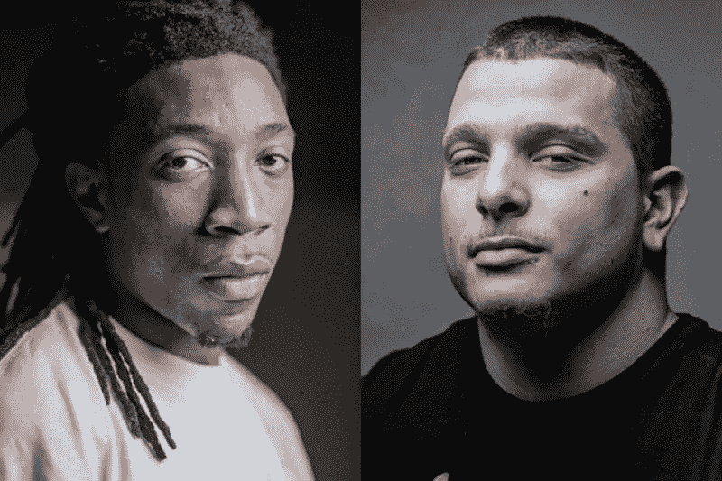
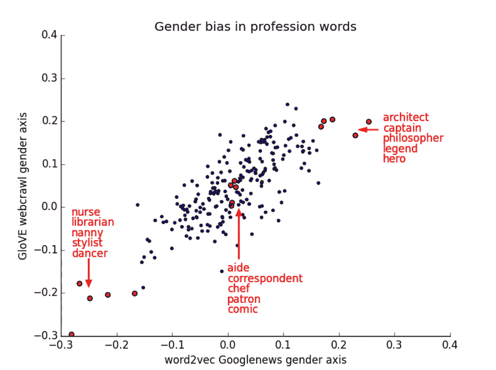

# 公平均衡？关于概率建模偏差的思考

> 原文：<https://medium.com/hackernoon/fair-and-balanced-thoughts-on-bias-in-probabilistic-modeling-2ffdbd8a880f>

最近几个月和几年，机器学习社区对算法的[偏差](https://hackernoon.com/tagged/bias)进行了大量的反思:我们的算法是否对社会中的特定群体根本不公平？

这段对话引起了我的兴趣，因为它处于我感兴趣的两个核心思想领域的交汇点:社会规范和概率建模。然而，我经常发现讨论空间是一个令人沮丧的空间，因为它包含了太多的人互相谈论:太多不同的偏见定义被隐含地融合在一起，太多无差异的指责。这篇文章是我试图澄清的:既是为了我自己，也希望是为了整个谈话。

# 不同基本速率偏差

如果你已经参与了任何关于机器学习和偏见的对话，你无疑已经看到了 ProPublica 的[这篇文章](https://www.propublica.org/article/machine-bias-risk-assessments-in-criminal-sentencing)，它声称 COMPAS 累犯预测模型是有偏见的，因为它的误差组成不同:虽然黑人和白人囚犯的总误差率相等，但黑人囚犯的误差更有可能是假阴性(预测累犯，不累犯)，而白人囚犯的误差更有可能是假阳性(不预测累犯，累犯)。对 ProPublica 提出的不公平指控的进一步研究表明，这并不像 ProPublica 所说的那样千篇一律，尽管“天真、有特权的技术人员会造成伤害”的叙述很有吸引力。

介绍这些发现的原始博客帖子本身就值得一读，但我将尝试在这里简要总结一下它的想法:你是否相信这个算法是公平的取决于你如何定义公平。一般来说，你不可能让一个算法同时符合多个定义。一种可能的定义方式是“得分相同的人再次犯罪的真实概率相等”。这通常简称为“校准”。建立 COMPAS 分数的 Northpointe 公司声称其分数是公平的，因为它是经过精心校准的:在一个给定的分数桶内，在该桶内得分的黑人和白人被告总体上再次犯罪的可能性相同。

ProPublica 对公平的定义侧重于没有再次犯罪的囚犯，并表明在这个群体中，黑人囚犯可能被认为比白人囚犯更危险。另一种思考方式是:在最终没有重新犯罪的人群中，Pro Publica 对公平的定义要求黑人囚犯的平均分等于白人囚犯的平均分。姑且称之为“负的阶级平衡”。你可能会关心这一点，因为你不希望一个群体被系统地认为风险更高，实际上是低风险的条件。你也可以想象对积极阶层的对称约束，在最终再次犯罪的人群中，黑人和白人表现出相同的平均分。姑且称之为“正阶级平衡”。你可能会关心这一点，因为你不希望一个群体在真正重新犯罪的情况下被系统地“放过”。

[Kleinberg 等人的这篇论文](https://arxiv.org/pdf/1609.05807.pdf)从数学上证明了这三个条件(校准、负类别平衡和正类别平衡)不可能同时存在，除非各组之间的基本比率(即再犯罪的总比率)相等，或者你有一个完美的模型。在任何不完美的模型中，当群体以不同的比率再次犯罪时，你必须牺牲至少一个公平的概念来满足其他的。

在这一点上，它变成了一个权衡的问题，这取决于您所操作的领域。我认为有一个非常有效的论点，在州政府选择是否进一步监禁某人的情况下，我们最想避免的伤害来源是“不公平”的进一步监禁，我们更希望确保真正低风险的人在不同人群中得到相同的待遇，而不是关心我们在真正高风险的人中的分数平衡。但是，我认为这里最基本的一点是:这是一个论点，并且有一个真正的权衡；**这不是一个明显的算法技术缺陷，它不是专门设计来满足一个矛盾的道德权衡标准。**

这个问题，即不同群体之间的基本费率不同，是一个有争议的问题。人们经常争辩说，在像这里所示的累犯案件中，数据本身是不公平的，因为它反映了一个没有平等竞争环境的压迫性社会。这是一个完全合理的论点。但是，从根本上来说，这比声称一个算法运行不正确要深刻得多。它断言，任何学习我们当前世界的统计模式的系统都是危险的，因为我们当前的世界在严重的方面存在规范缺陷，而任何在这个有缺陷的世界中学习关联的系统一旦纠正了这些规范缺陷就将是不正确的，或者更糟的是，将阻止这些社会失衡得到纠正。

# 不同的条件分布

另一个潜在算法偏差的领域是，由于不同的条件分布，不同人口统计组的准确度不同。条件分布是指特征 X 的分布，以输出 y 为条件。

为了便于继续讨论，我将参考上面的图片，这是一场[宣传风暴](https://www.theverge.com/2015/7/1/8880363/google-apologizes-photos-app-tags-two-black-people-gorillas)的原因，因为谷歌照片的算法错误地将两个有色人种标记为大猩猩。我暂时假设这个观察到的错误代表了一个广泛的、真实的问题，谷歌更可能将黑脸归类为非人类。我并不完全相信这个假设是正确的，我将在这一节的最后阐述这种怀疑。

但是，就目前而言，让我们想象一下，我们可以将这个问题描述为这样一个问题:当被归类为人类时，白色面孔的错误率较低，而黑色面孔的错误率较高。什么会导致这样的结果？一个明显的潜在原因是不同的条件分布。这里的“X”是由像素组成的(最终会变成更高级别的卷积特征)。为了简单起见，让我们减少类别的数量，并且想象 Y 是“人类”和“非人类”的二进制数。如果您有两种截然不同的特征轮廓(白人和非白人)都映射到人类，并且白人在数据中占绝对多数，那么分类器会将与白人相关联的特征视为最能指示具有“人类”类别的图像的特征。

如果你想象一个极端的情况，这背后的直觉会变得更容易:在“人类”下的数据集中，99 个样本是高加索人的脸，只有 1 个是非高加索人的脸。在这种情况下，大多数正则化方案将激励算法学习更简单的映射来检查常见的高加索人特征，而不是增加功能模型容量来捕捉这个更小的第二子群。在某种程度上，当您的特征 X 上有不同分布的子组时，您会遇到这个问题，所有这些子组都需要映射到一个共享结果 y。通常，如果您提前指定这些子组，并给它们自己的子标签，这是最容易做到的，这样您就提前“告诉”模型它需要能够捕捉更多不同的组。

像这样的解决方案显然提出了一个问题:**什么是实施平等绩效的正确群体？**所有级别的差异都沿着一个梯度存在:如果你放大得足够远，你可以发现在更大的组内存在许多级别的越来越小的子组，并且在极限情况下，在每个这样的子组之间实施均衡的性能会转化为要求数据集中的每个个体具有相同的预期性能。这是一个潜在的有趣问题，我不记得以前见过解决这个问题的方法，但是当你考虑到一个人正好在分布中间的两极，一个人是一个非常强的离群值时，这似乎是一个很难满足的约束；大多数规范化的模型最终会对前一个人表现得更好。

最终，我们决定实施平等表现的分组很可能是有背景的，是受压迫和被剥夺权利的历史的函数，而不是代表任何在数据中本质上比其他类别更突出的类别。这不一定有什么错——人们与算法交互的具体体验将受到社会背景的影响，在这种背景下，他们可能对这样的错误特别敏感，这使得它成为一个值得特别解决的问题。

我还应该在这里补充一个，解决引发这种狂热的实际情况:一个单一的轶事真的不构成一个广泛的问题，或一个精心制定的问题。这种说法不是:“有色人种被系统地误认为非人类实体”。碰巧的是，这种贴错标签的特殊事件有着令人痛苦的社会包袱，这使得这个错误成为一个特别有意义的错误。为了阻止类似的情况发生，谷歌必须系统地了解什么样的错误会带来类似的负担，并将这些知识输入到它的训练系统中。但这种评估从根本上来说是有背景的，从根本上来说是任意的:没有一种数学上严格的方法来确保没有人得到他们认为贬损或侮辱的图像标签。

# 基础分布 P(X)中的偏差

前两节讨论了人口统计组和数字少数特征亚组之间的不同基本比率，这可能很难了解，我想重点讨论的最后一个想法是自由形式数据本身的偏差嵌入(heh ),即使没有将特定目标或分组附加到该数据。一个很好的例子是[意识到 Word2Vec 单词嵌入表现出性别偏见](https://arxiv.org/abs/1607.06520):当你捕捉到代表性别(男孩-女孩，男人-女人等)的方向向量时，你会发现刻板印象中的女性职业或角色与刻板印象中的男性职业或角色相距甚远。

这当然是一件让人不舒服的事情。我们中的许多人习惯性地认为女性和男性一样有能力，并渴望一个各行各业性别比例均等的世界。但是单词嵌入算法并没有凭空产生那种关联。它吸收了数以百万计的句子，而我们的性别世界，正如它目前存在的那样，是在文本中呈现的。它了解到性别偏见是关于世界的一个语义上有意义的事实，因为在缺乏某种“道德规范”来告诉它这种相关性不值得捕捉的情况下，这似乎是一个与其他任何现实一样突出的现实。

我现在正在成为一个打破记录的人，但就像以前一样:虽然有一些针对这个特定问题的很酷的技术解决方案被提出来(参见本节前面的链接)，但为了真正先发制人地解决它，我们需要事先指定哪些类型的语义模式属于这个领域:作为规范偏好的问题，我们不希望算法表现的真正的相关性。

总而言之:

# 偏见是一个不可避免的规范性问题

“偏见”经常被简单地描述为一个技术问题，或者一个社会问题，促使每个人对那些目光短浅的工程师发出啧啧声，这些工程师使他们的算法产生偏见，只为自己工作。我认为这对任何希望在这个问题上做明确、具体工作的人都是有害的。因为，虽然技术上的担忧肯定会与道德上的担忧交织在一起，但如果不承认偏见从根本上来说是一种断言，即我们以数据形式呈现给模型的关于世界的某些东西并不应该是这样的，你就不会有任何进展。根据定义，这样的断言不能通过参照当前的世界来证明或证伪、测试或检查。

这一点很容易从一个简单的事实中看出，几乎所有关于偏见的说法都是关于群体之间的结果差异，而哪种跨群体差异具有道德意义的问题从根本上来说是一个道德问题。

这些问题中有很多可以归结为两个关键问题:“我们希望我们的算法中没有体现出我们当前世界的哪些方面”，以及“我们最关心并希望看到纠正的不平等或错误是什么”。如果我们能够深入清晰地思考这些问题的答案——基本上是规范性的——我认为我们将能够在解决这些问题上取得更大的进展。