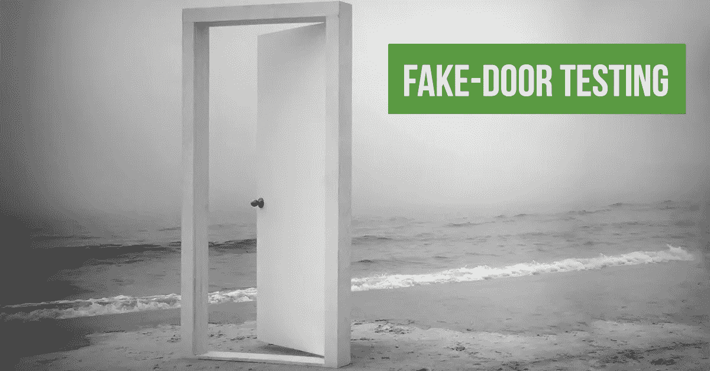
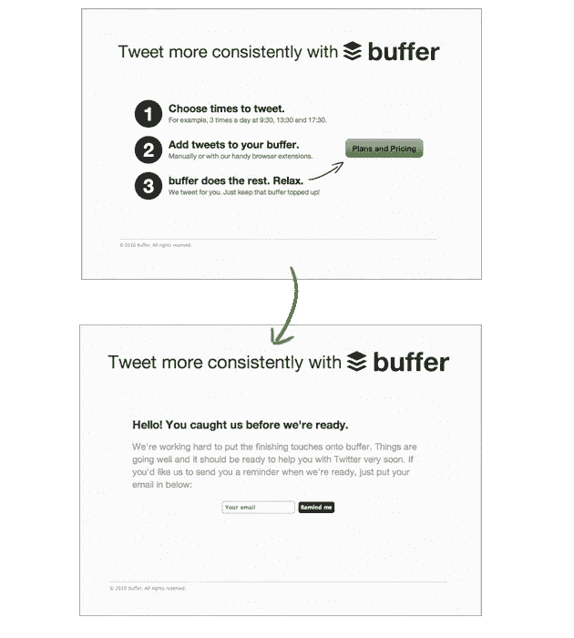
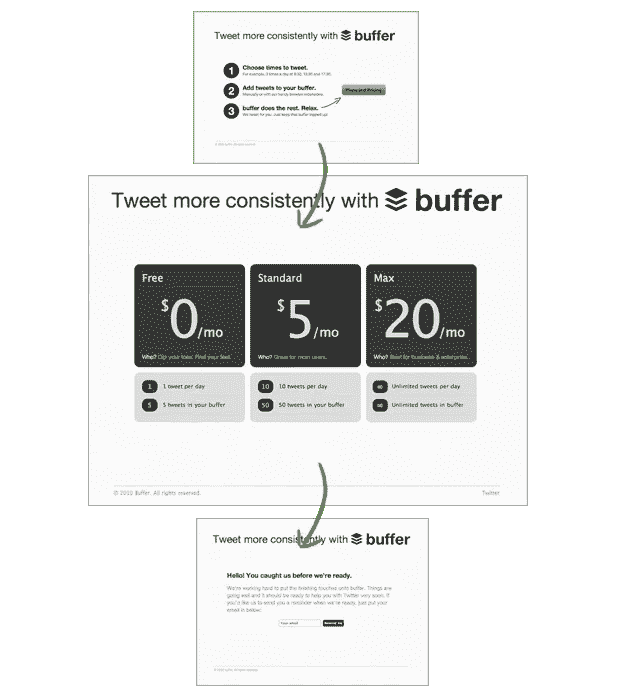

# 假门——MVP 之前的 MVP

> 原文：<https://medium.com/hackernoon/fake-door-the-mvp-before-the-mvp-61197ed264a3>

我们都很熟悉 MVP 这个术语。为了解释这一概念，人们使用了大量的数字墨水。最小可行产品(或 Henrik 建议的最小可爱产品)是为我们的用户带来价值的最小产品，让我们验证我们最初的假设并适应未来。一个 MVP 应该是小的，并且相对快速地交付，这样我们就不会在无法验证我们的假设的情况下损失太多的时间和金钱。

理论上这一切都很好，然而在现实中建立一个 MVP 仍然需要时间、努力和通常的 R&D 资源。尽管可能很小，但我们不想在错误的假设上浪费精力。是的，我们会从中学习，然而在这篇文章中，我想描述另一种方法来回答我们开始 MVP 之前最重要的问题——“人们真的想要我们的产品/功能吗？”。这个概念叫做“假门”，MVP 之前的 MVP。

# MVP——我们通常是如何做到的

为了这篇文章，假设我们已经创建了一个很棒的应用程序，我们的用户很喜欢它。一切都很棒，但应用程序绝对免费，我们都饿了。是时候让我们的用户为一些新的高级功能买单了。

## 我们如何开始？

1.  单一高级曲目—无需从一开始就推出具有不同功能和不同价格的不同曲目。
2.  我们将决定支付方式—一次性、月/年费—这是更容易实施的方式
3.  我们将把 PayPal 整合成一个单一的支付处理器——我们不想从一开始就支持不同的支付解决方案。
4.  我们将建立一个高级功能页面，介绍曲目和开始付费的能力。
5.  我们将构建一个简单的权限系统，只允许付费用户使用几个选择的功能。
6.  我们将为 premium track 创建一些高级功能。
7.  向所有用户发送电子邮件，告诉他们新的高级曲目。

这应该是开始的时候。这些是我们将随着时间的推移而发展的最低要求。这是我们的 MVP。在我们构建和交付它之后，我们将衡量用户的行为，学习和采纳。因此，大约一两周之后，我们将开始运行。照章办事的精益创业！

## 这些真的是最低要求吗？

听起来是这样，对吗？以上所有项目对于这个 MVP 和我们开始学习都是必不可少的。对吗？**错了！**

假设我们建立了 MVP。然后，我们等待。我们等一天，两天，三天，一周，你猜怎么着？没有一个用户决定付费。

整个 MVP 依赖于一个假设，即只有在整个 MVP 准备好之后，我们才能够进行验证——我们的用户愿意为我们的产品付费吗？

如果用户对我们的高级功能不感兴趣，我们为什么需要集成 PayPal？在验证这个假设之前，我们应该建立许可系统吗？大概不会。让我们看看构建我们产品的另一种方式。这一次，让我们看看一个真实的例子—[buffer 如何处理相同的场景](https://blog.bufferapp.com/idea-to-paying-customers-in-7-weeks-how-we-did-it)。我鼓励你阅读他们的帖子，因为它完美地描述了我的观点。

# *没有给用户带来价值的 MVP*

[Buffer](https://buffer.com/) 从他们产品的免费版本开始，过了一会儿决定引入付费歌曲。然而，他们没有从一开始就开发所有的“最小需求”，而是决定一个接一个地验证他们的假设**，而没有真正向用户交付价值**。他们一次使用尽可能小的测试来移动。

这是他们推出的:

如你所见，他们所做的只是创建了一个带有“计划和价格”按钮的登陆页面。那个按钮不会导致任何计划或价格。它导致了一个页面，解释说实际的计划还没有准备好，用户可以留下她的电子邮件进行更新。用户是否留下电子邮件并不重要。重要的是，有人点击了按钮，表明了**想要**了解更多计划的意图。

只有在足够多的用户表现出意愿后，他们才会转向下一个测试。

Yes, same trick here. How much money are the user willing to pay? For what features? Let’s check

让我们停一会儿。用一个按钮开发 2 个登录页面需要多长时间？大概一个小时。这很简单，公司里的任何人都能做。**这个 MVP 没有向用户交付任何价值**，但是它向公司提供了大量的知识，以一种超级快速和廉价的方式验证了我们的假设。

这个概念叫做“ [**假门**](http://www.uxmatters.com/mt/archives/2016/02/validating-product-ideas-through-lean-user-research.php) ”。有一个按钮，但它不通向任何地方。顺便说一下，[谷歌在对产品经理的面试中也问了类似的问题。](/the-mission/towards-a-minimum-buyable-product-why-your-buy-button-should-appear-sooner-f192eb5e91be) ( *你怎么知道人们会不会买一个 McSpaghetti？*)。

MVP 最重要的作用是让我们公司了解我们的用户想要什么。MVP 应该为我们的用户提供价值，但这是次要的。只有在我们确定他们确实对价值感兴趣之后，它才应该提供价值。

## 我亲身经历的真实例子

在这里你可以找到我的产品经理 [Elad](/@eladgovari) 的一篇精彩文章，他详细解释了我们如何在自己的应用中应用这一原则。

 [## 我如何将我们的头号用户投诉转变为增长引擎

### 作为产品经理，我总是睁大眼睛，竖起耳朵，收集用户的反馈。

medium.com](/@eladgovari/how-i-turned-our-1-user-complaint-into-a-growth-engine-207664a1b644) 

## 走向

我们不能总是欺骗用户。最终，我们确实需要实现我们承诺的功能。最大的不同是，我们只有在之后**才会这么做，我们确信这确实是我们的用户想要的。**我们将减少为不需要 MVP 的用户建立 MVP 的浪费**，首先为我们建立一个 e **甚至更小的 MVP**，以测试用户的意图并验证需求。**

所以在你开始开发任何功能之前，问问你自己:

*这真的是验证我们假设的* ***最小测试*** *吗？提示:如果它给用户带来了真正的价值，那么它已经太大了。*

干杯，