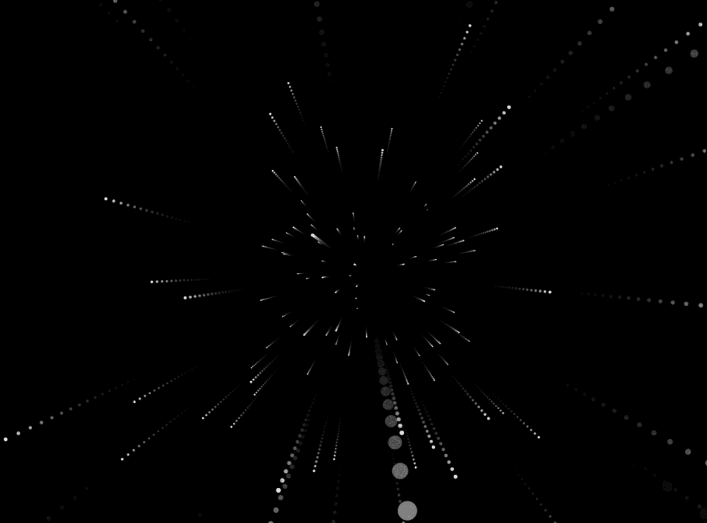
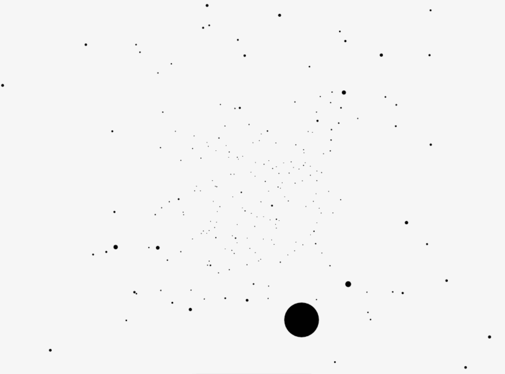

# 创造性编码中的伪 3D

> 原文：<https://medium.com/hackernoon/faking-3d-in-creative-coding-85b6b97eb38b>

## 用 Javascript 在画布上构建 3D 星空效果



We’ll be building this hyperspace star effect

我有几个请求，想展示如何基于上一篇文章中的 Math.sin()和 Math.cos()示例，在 3D 中做一些类似的事情。但在我们到达那里之前，让我们先了解一下伪 3D 的基础知识。

一旦你知道它是如何工作的，在画布上创建假 3D 就相当容易了。我们将从小处着手，在我们所学的技巧基础上再接再厉。

基本的技巧是缩放我们的对象来模拟 z 轴视图，我们使用一个视场角，简单来说就是视场角的宽度。角度越大，你得到的 3D 失真就越多。公式是:

```
scale = FOV/(z+FOV);
```

所以让我们先做一个简单的星域…

使用我们正常的粒子系统代码，我们还需要给每个粒子一个 z 值，一个 z 速度，一个比例值和一个 3D x 值和一个 3D y 值。我们不需要 x 速度或者 y 速度，因为我们只是向前移动粒子。

```
function addParticle(){
  var particle = {
    x: random(-100,100),
    y: random(-100,100),
    **z: 10,
    x3d: 0,
    y3d: 0,
    scale: 1,
    speed_z: 4**
  }
  particles.push(particle);
}
```

然后我们将根据我们的公式计算我们的 3D 位置。请注意，我们减去 z 位置来向前移动球，并使用我们的比例来计算新的 3D x 和 y 位置:

```
function moveParticles(){for (var i = 0; i < particles.length; i++) {
    var p = particles[i];
    **p.z -= p.speed_z;
    p.scale = fov/(p.z+FOV);
    p.x3d = p.x * p.scale;
    p.y3d = p.y * p.scale;** }}
```

您应该会看到这样的内容:



你会注意到一件事，粒子最终开始向后移动。很容易修复，只要检查他们是否已经达到过去的负面 FOV，删除它们。

唯一的另一件事是添加一个半透明的背景，以获得一个跟踪效果。

为了获得文章标题的效果，完整的代码如下所示:

```
var ctx = createCanvas("canvas1");
var particles = [];
var FOV = 250;function addParticle(){
  var particle = {
    x: random(-100,100),
    y: random(-100,100),
    z: 10,
    x3d: 0,
    y3d: 0,
    speed_z: 2,
    scale: 1,
    colour: rgb(0),
  }
  particles.push(particle);
}function draw(){
  ctx.background(0, 0.2);
  addParticle();
  moveParticles();
  drawParticles();
} function moveParticles(){
  for (var i = 0; i < particles.length; i++) {
    var p = particles[i];
    p.z -= p.speed_z;
    p.scale = FOV/(p.z+FOV);
    p.x3d = p.x * p.scale;
    p.y3d = p.y * p.scale; if (p.z < -FOV) {
      particles.splice(i,1);
    }
  }
} function drawParticles(){
  ctx.save();
  ctx.translate(w/2, h/2);
  for (var i = 0; i < particles.length; i++) {
    var p = particles[i];
    ctx.fillStyle = rgb(255);
    ctx.fillEllipse(p.x3d, p.y3d, p.scale, p.scale);
  }
  ctx.restore();
}
```

仅此而已。我们完了。快乐的[编码](https://hackernoon.com/tagged/coding)。

像往常一样，完整的代码可以在我的 [github](https://hackernoon.com/tagged/github) 上找到，这篇文章是第 9 部分(一定要时不时地拉一下，因为我经常更新内容):[https://github.com/GeorgeGally/creative_coding](https://github.com/GeorgeGally/creative_coding)

**在 Instagram 上关注我这里:**[**https://www.instagram.com/radarboy3000/**](https://www.instagram.com/radarboy3000/)

**在推特上关注我这里:**[**https://twitter.com/radarboy_japan**](https://twitter.com/radarboy_japan)

**又如我这里的脸书页:【https://www.facebook.com/radarboy3000】[](https://www.facebook.com/radarboy3000)**

**[](http://bit.ly/HackernoonFB)****[](https://goo.gl/k7XYbx)****[](https://goo.gl/4ofytp)**

> **[黑客中午](http://bit.ly/Hackernoon)是黑客如何开始他们的下午。我们是 [@AMI](http://bit.ly/atAMIatAMI) 家庭的一员。我们现在[接受投稿](http://bit.ly/hackernoonsubmission)，并乐意[讨论广告&赞助](mailto:partners@amipublications.com)机会。**
> 
> **如果你喜欢这个故事，我们推荐你阅读我们的[最新科技故事](http://bit.ly/hackernoonlatestt)和[趋势科技故事](https://hackernoon.com/trending)。直到下一次，不要把世界的现实想当然！**

****