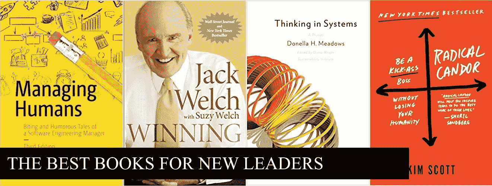
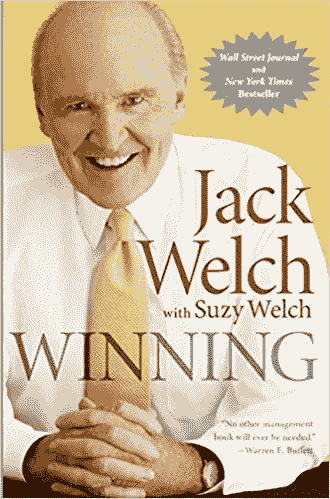
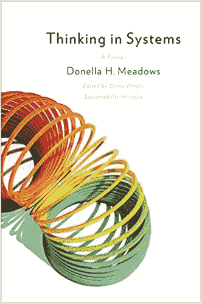
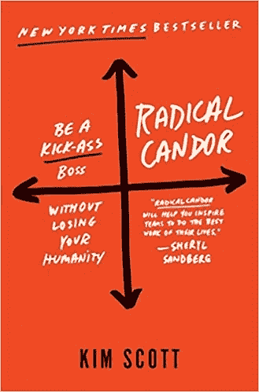

# 常见问题:你会给新经理、主管和领导者推荐什么书？

> 原文：<https://medium.com/hackernoon/faq-what-books-would-you-recommend-for-new-managers-directors-and-leaders-50246fc36e9e>

My four favorite leadership books in no particular order

我经常被问到这个问题，所以我最终决定把答案写下来。在我们继续前进之前:*小心前进*。好的领导力是有背景的，你最好从经验中学习，而不是从[书本中学习。我告诉新的](https://hackernoon.com/tagged/books)[工程](https://hackernoon.com/tagged/engineering)经理的第一件事是，盲目地遵循你读过的任何 SCRUM 书籍都是搞砸你的团队的最可靠方式。你必须学会从许多地方获取想法，将它们融入环境，并应用到你当前的情况中。

这些书是由久经沙场的领导者写的，他们对管理方法有很强的见解。每本书都在我自己的职业生涯中扮演了关键角色，但我并不同意其中的所有内容。相反，我从每种风格中汲取了一些东西，形成了自己的领导风格。我建议你也这样做！

Great book for people managers

# [**管理人类**](http://amzn.to/2whyPEX)

迈克尔·洛普

这是第一本真正引起我共鸣的管理书籍，是我的一位直接下属在加入我的团队几个月后推荐的。

为什么？嗯，当时我还是一名新经理，还没有人告诉我，说到领导力，人比代码更重要。我怀疑这本书是一个微妙的暗示，暗示我需要改变我的领导策略。

*管理人员*从管理者的角度讲述了很多故事。虽然有点夸张，但我相信这是对发展以人为本的管理风格和健康团队所需的所有协调、利益相关者管理和同理心的精彩介绍。

> 具有讽刺意味的是，我从沮丧的员工那里听到的第二个最常见的抱怨是，“我的经理不知道我在做什么。“很高兴知道问题是双向的，不是吗？”
> **—迈克尔·洛普，管理人类**
> 
> “我对优秀经理的定义是，无论你在组织结构图中处于什么位置，你都能与之建立联系。”
> **——迈克尔·洛普，管理人类**

Hone your competitive edge

# [**获奖**](http://amzn.to/2eMPfic)

*“中子”杰克·韦尔奇*

杰克·韦尔奇是竞争领导力的守护神，赢得竞争就是发展你作为领导者的优势，发现机会，并建立积极实现目标的团队。

鉴于*管理人类*都是关于发展与人的联系，*赢得*只是纯粹的旧约，杀人或被杀，阵地战，丛林法则的东西。杰克因普及堆栈排名概念和在 80 年代解雇通用电气公司 10 万多人而闻名。他也是有史以来最成功和最有影响力的首席执行官之一。重复我之前的警告:**小心行事**，这本书发人深省并具有伟大的精神，但它也有一些想法，如果使用不当，会毁掉你的团队。

在我职业生涯的中期，当我成为经理中的经理时，我已经形成了一种风格，这种风格可能过于倾向于同情型领导。我爱团队和人！但是在导演级别，你必须和你的团队一起“离开舞台”,更多地考虑结果。*获胜*给我敲响了警钟，让我意识到严格执行、决策和培养顶尖人才的重要性。

> “有效的人知道什么时候停止评估，做出艰难的决定，即使没有完整的信息。“没有什么比一个不会上钩的经理更糟糕的了。”
> ― **杰克韦尔奇**，**获胜**
> 
> “领导者坚持不懈地提升他们的团队，利用每一次相遇作为评估、指导和建立自信的机会。”
> ― **杰克韦尔奇**，**获胜**

Organizational design

# [系统思维](http://amzn.to/2whsuth)

多内拉牧场

这是一本奇怪的书，也许更像一本伪装成复杂系统讨论的哲学书。我很惊讶更多的人没有读过它，因为它可以被广泛应用(也许这是它的根本缺陷)。

无论如何，*系统思维*是组织设计的神奇入门，尽管它并没有被设定为如此。我第一次读它是在我的组织规模达到 40 人左右，我不能再定期与团队中的每个人“签到”的时候。我想知道如何让我不断增长的产品团队网络更好地合作。亚文化开始形成，传达使命变得更加困难，其他“大团队问题”开始出现。我的团队也变得越来越有影响力，需要与微软越来越多的合作伙伴团体互动。我很难理解我的小团队是如何影响一个几千人的组织的。正如承诺的那样，这本书改变了我的思维方式，在阅读后的几个星期里，我都能听到有人引用它。

> “面对现实吧，宇宙是混乱的。它是非线性的、混乱的、无序的。它是动态的。它把时间花在去往其他地方的短暂行为上，而不是数学上的完美平衡。它会自我组织和进化。它创造了多样性，而不是一致性。这是世界变得有趣的原因，这是世界变得美丽的原因，这是世界运转的原因。”多内拉·h·梅多斯，《系统思考:初级读本》
> 
> "目的是从行为中推导出来的，而不是从花言巧语或既定目标中推导出来的."
> ― **多内拉·h·梅多斯**，**系统思维:初级读本**

Best book on the market today

# [彻底的坦诚](http://amzn.to/2gUWUiV)

*金·斯科特*

这本书充满了很好的管理建议、战争故事和可重用的框架，以至于任何总结它的尝试都将彻底失败。这简直是有史以来最好的管理书籍之一。

了解我的人都知道我有动力，直接，而且不怕说出自己的想法。我也对人充满热情。在一个由政治正确、参与战利品和共识驱动的决策所统治的时代，这本书因其平衡同理心和坦率的能力而脱颖而出。它将教你如何建立信任，攻击目标而不是人，避免接受平庸，等等。

也许唯一的缺陷是，它的写作方式让我想起了*富爸爸穷爸爸*或*实力发现者、*别有用心的卖书、培训课程等书籍。这本书有时会令人厌烦，但毫无疑问，这是你今天能读到的最好的管理书籍。

> “当老板过于关注每个人的相处时，他们也不会鼓励团队成员互相批评，因为他们害怕制造不和。他们创造了这样一种工作环境，在这种环境中，以批评为代价，优先考虑“好”，从而提高实际表现。
> ― **金·斯科特**，**激进坦率**

**岩石上的
——尼克**