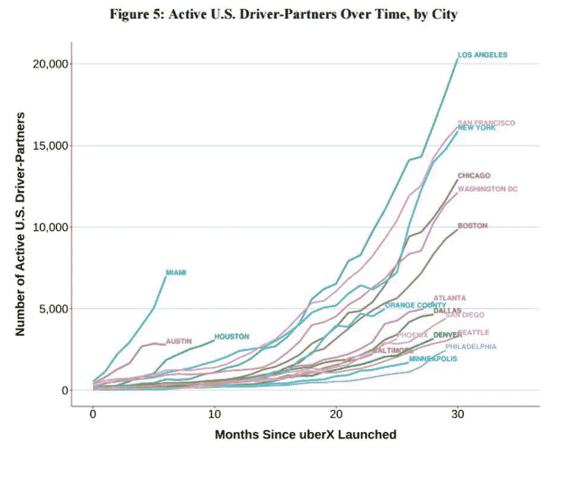

# 告别教育，欢迎 API 即服务微创业

> 原文：<https://medium.com/hackernoon/farewell-education-welcome-api-as-a-service-for-micro-entrepreneurship-f045710b9454>

## 外观设计和人体工程学消费

CRYPTIC CHILD, music producer/graphic designer meets art/film director

> 本体(信息科学)’—人工智能、语义网、机器学习、系统工程、软件工程、生物医学信息学、图书馆学、企业书签和信息架构等领域都创建了本体来限制复杂性和组织信息。

我创办了#DisruptionTalk，培育一个由创始人、企业家、工程师、艺术家和设计师组成的全球实时社区[，分散专业知识和关系](https://disruptiontalk.com/)，这是一个虚拟孵化器。

从过去的经历中，我了解到有时很难获得正确的关系和信息。然而，数字边界的奇迹让任何人都可以通过稳定的互联网连接进行实时合作和学习。

一个受众智能设计公司的成立，激发了成为数字游牧者的想法。除了专业的电子邮件营销和自动化软件，[针对目标受众的社交媒体推广计划](https://socialplan.co/)，以及由移动云提供支持的合作弹出窗口。

## 这是什么意思？

把每一个终端计算设备或者智能手机都变成孵化器意味着什么？将每一家咖啡店、餐厅、客厅和未充分利用的办公室或商业空间都变成共同工作空间意味着什么？

有复原力的社会将释放和拥抱个人的潜力。深度学习相关的很多论文、[数据集](https://code.google.com/archive/p/word2vec/)、[图像识别层级](http://image-net.org/index)、[软件工具](http://deeplearning.net/software/theano/)都是开源的。这带来了民主化的效果，使个人能够构建强大的应用程序。

WhatsApp 只用 50 名工程师就能建立一个服务 9 亿用户的全球信息系统[，相比之下，前几代信息系统需要数千名工程师。](http://www.wired.com/2015/09/whatsapp-serves-900-million-users-50-engineers/)

共享经济的颠覆正在人工智能领域发生。像 Theano 和 TensorFlow 这样的软件工具，通过云数据中心进行培训，通过廉价的 GPU 进行部署，可以让个人和小型分布式团队建立最先进的人工智能系统。或者使用 Movidius 神经计算棒即插即用特定领域的人工智能选项。

W 微创业对就业意味着什么？数据、技能和劳动力的高度分割已经让失业过时了吗？教育的现实，创新经济或第四波，是作为一个微型企业家被雇用，并根据个人的技能和熟练程度接受教育。

以前未充分就业的人正在将未充分利用的技能转化为资产。基于技能的超个性化工作正在大规模改变有组织的劳动。[优步组织了一项未被充分利用的技能](https://www.forbes.com/sites/briansolomon/2015/05/01/the-numbers-behind-ubers-exploding-driver-force/#7dc5a0795750)，并将其活跃司机群体从 2012 年年中的零增长至 2014 年底的 160，000 多人。新司机的数量每六个月增加一倍以上。

能够使用 xAPI 或经验图表来跟踪、测量和限定经验，使得基于个人的真正兴趣和熟练程度来雇用成为可能。下一步，[个人或小型分布式团队将建立什么样的技能型区块链劳动力市场？](https://socialplan.co/)

**准备好释放和拥抱你的潜力了吗？** [得到答案](https://alexanderjones.co/)。