# 更快的 Clojure 减少

> 原文：<https://medium.com/hackernoon/faster-clojure-reduce-57a104448ea4>

# 摘要

并不总是转换或迭代集合的最快方式。尤其是如果:1。涉及到原始数学。需要多个累加器或 3。涉及多个序列。

## 介绍

Clojure 中的许多函数都可以对序列进行迭代。还有`map`、`filter`、`keep`、`mapcat`等等。通常，如果没有一个标准的序列转换函数适合，开发人员倾向于回到`reduce`，更少的是手动`loop`。后两者非常灵活，因为你可以做任何你想做的转换

1.  简化为单一值
2.  忽略(过滤)一些值
3.  映射一些值
4.  添加更多值

同时进行。`reduce`也有非常快的名声，因为每个集合本身都会运行它自己的优化缩减代码。

## 问题

在这篇文章中，我将讨论两个问题:

1.  化简为多个值
    如:
    - *统计所有正数，统计所有奇数*-
    -*计算集合中所有数的和与积(迭代一次)*
2.  同时迭代多个序列。
    如:
    - *计算向量的转置
    -从一个向量中选择所有值给定另一个向量*

在示例中，我将使用 vectors，因为当您关心性能时，这是最常用的数据类型。

让我们从问题#1 开始:为了保持代码简单，我们将计算 1000 万个数字的奇数值和偶数值:

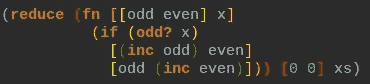

229ms

使用 Criterium 和一个正确配置的 JVM，这个过程大约需要 229 毫秒。作为对比:一个简单的`(reduce (fn [s _] (inc s)) 0 xs)`大约运行 82 毫秒。因为我们有两个累加器，而不是一个，所以几乎慢了 3 倍。

我们能做得更好吗？让我们来试试一个简单的手动`loop`:

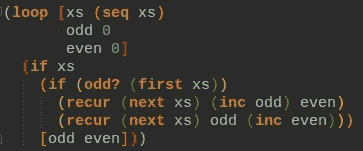

148ms

这大约需要 148 毫秒。为什么会快这么多？多重原因:

1.  我们并不是在每次迭代中都要析构一个新的向量。
2.  我们在循环内部做简单的数学运算。

然而，对于这样一个简单的`even? — odd?`比较，它仍然比 82 毫秒的基线慢得多。

在内部，向量由长度为 32 的 Java 数组块组成。对`next`的调用返回向量部分的顺序视图(a `ChunkedSeq`)。所以这个`loop`在每次迭代中生成一个新的对象，只是为了在循环的下一次迭代中丢弃它。这意味着我们产生了 JVM 需要收集的垃圾。

显然，迭代这个向量数组是最快的。这正是`reduce`在内部所做的。我们能以某种方式访问这个原始数组并编写我们自己的循环吗？许多函数和宏都知道分块序列，这也是`map`在向量上相当快的原因。

另一个候选是`doseq`，它遍历分块缓冲区(运行`(macroexpand '(doseq [x xs] “abc”))`来看看如何)。让我们使用一些技巧来加快速度:

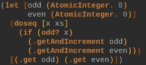

109ms

这大约需要 109 毫秒。更好！但是现在我们离开了我们美好的不可变领域，代码变得相当丑陋。此外，这种方法仅适用于有限的累加器集。如果我们想累积成另一个向量或持久地图呢？它是不灵活的。另一个更糟糕的版本是使用数组并对其进行变异:

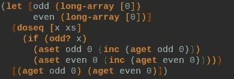

73ms

这大约需要 73 毫秒。非常快，但是如果我们想累加除了数字以外的值，这种方法非常难看，容易出错，而且不灵活。

## 被遗忘的方法

最后，让我们介绍一下这篇文章所涉及的结构:使用`Iterator`。大多数语言都有某种迭代器，Java 非常简单，它们的接口上只有两个方法:`it.hasNext()`和`it.next()`。让我们使用它:

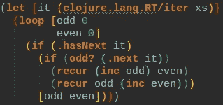

70ms

这大约需要 70 毫秒。它只比使用可变数组方法快一点点，但是我们更加灵活:我们可以累积任何我们想要的值！迭代器非常快，因为它在每次迭代中产生很少的垃圾，并且对大多数数据结构都有快速的实现。`it.hasNext()`检查只进行索引比较，而`it.next()`只调用`PersistenVector`的索引查找。

附注:我写了一个宏，它手动迭代分块缓冲区，类似于`doseq`，但也在循环中累加奇数/偶数。它的运行速度只快了 7%(低至约 65 毫秒)。我不会在这里展示它，因为它不太灵活，只适用于 vector，并且对分块序列的内部进行假设。

## 一个宏诞生了

让我们写一个宏使生活变得更容易:

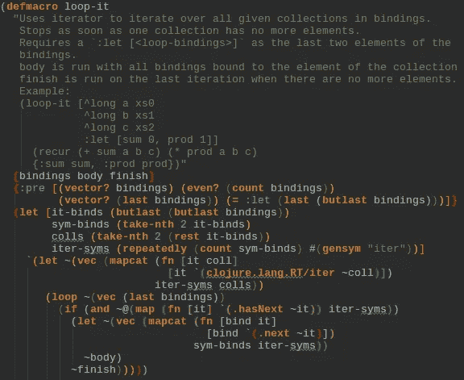

我们现在可以很好地重写上面的代码:

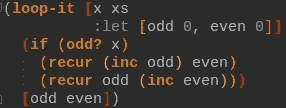

Same as above but using the new macro.

注意:告诉[草书](https://cursive-ide.com/)到[像对待](https://cursive-ide.com/userguide/macros.html) `[for](https://cursive-ide.com/userguide/macros.html)`一样对待 `[loop-it](https://cursive-ide.com/userguide/macros.html)` [给了我们很好的语法高亮。](https://cursive-ide.com/userguide/macros.html)

现在让我们来看第二个问题:迭代多个序列。为此，我们将考虑转置两个向量的问题。即:给定`[a b c]`和`[0 1 2]`，我们创建`[[a 0] [b 1] [c 2]]`作为输出。`clojure.core`中没有太多函数可以处理多个输入序列:据我所知只有`map`、`mapv`、`pmap`、`sequence`、`interleave`、`lazy-cat`和`mapcat`可以。因此，如果你需要迭代多个集合，你需要使用这些有限的函数。

相反，使用迭代器我们可以很容易地做到这一点:

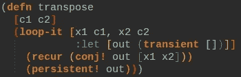

20ms

对于具有一百万个元素的两个向量，这在大约 20 毫秒内运行。使用`(mapv vector xs xs)`运行约 85 毫秒。所以使用迭代器时速度提高了 4 倍多。当然，这有点不公平，因为我们没有提供函数`f`在这里调用。然而，这样做只会降低功能 1-2%的速度。

附注:如果你真的需要这么快，你也可以使用数组来达到 10ms:

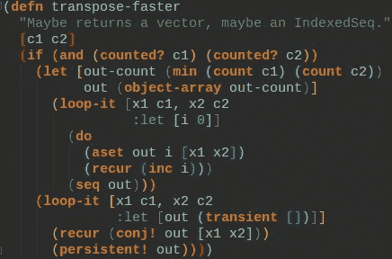

`loop-it`有很多应用。我们还可以用它来创建一个更快的`interleave`函数(显然不是懒惰):

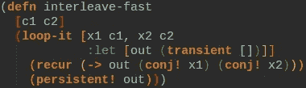

26ms

这大约需要 26 毫秒，而`(doall (interleave xs xs))`大约需要 64 毫秒。一次漂亮的加速。

我当然听到你说:`map`要灵活得多；它可以带一个**变量**号序列；

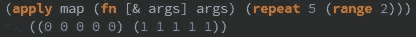

见鬼，它甚至能恰当地处理无限序列:

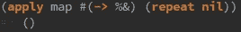

我们能用`loop-it`达到同样的效果吗？不是在它的当前状态:它需要你——在编译时——给它你想要迭代的序列。对于可变数量的序列，我们可以使用一个技巧(复制自`clojure.core`):将可变数量的迭代器转换成一个迭代器。新的迭代器为每个对`it.next()`的调用返回一个集合。我们称之为**多重迭代器**。由于`clojure.core`中的类是私有的，我们必须重写它:

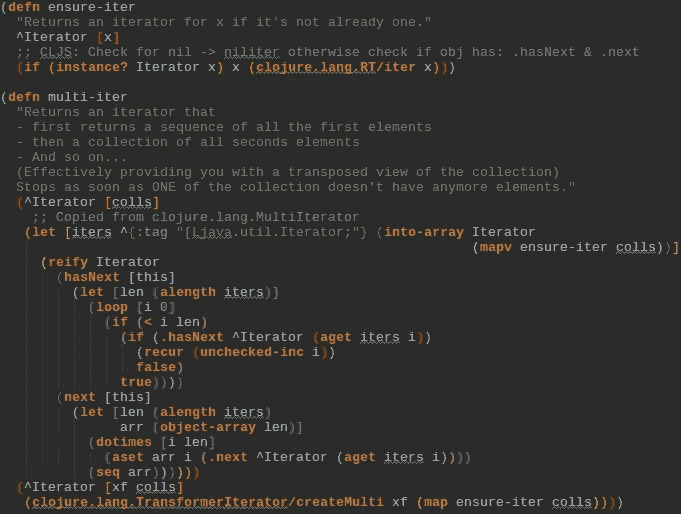

就像`clojure.lang.MultiIterator`一样，它使用本地数组来提高速度。然而，一个问题仍然存在:它不能处理无限数量的序列，因为它是热切的。所以让我们创建另一个懒人:

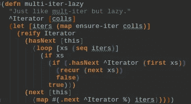

现在`colls`可以是一个无限序列。

让我们实际看看如何使用它:

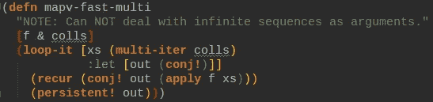

这是一个开始。但是在进行基准测试之前，让我们结合并展开一些内容，以得出一个真正快速的`mapv`:

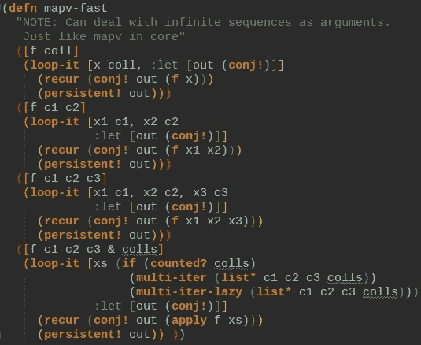

注意:我也把`loop-it`宏改为调用`ensure-iter`而不是`clojure.lang.RT/iter`。

让我们进行基准测试:

```
(**mapv** vector xs xs xs xs)
```

对于 100 万个元素，这大约需要 1.28 秒。我们新的基于迭代的实现仅需 147 毫秒。几乎 9 倍的加速，实现是非常可读的。

## 其他应用

1.  让我们写一个**真快** `take-nth`:

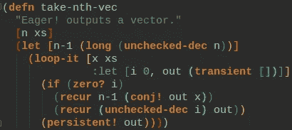

对于有 1000 万个元素的`(take-nth-vec 5 xs-large)`来说，这需要 52 毫秒。`(into [] (take-nth 5) xs-large)`运行时间为 273 毫秒`(doall (take-nth 5 xs-large))`运行时间为 290 毫秒。

2.将你的序列分成两组:`all-truthy-values`，`all-falsy-values`:

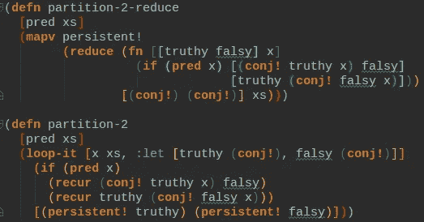

对于基于`loop-it`的实施，运行时间约为 176 毫秒，而对于基于`reduce`的实施，运行时间约为 291 毫秒。在我看来，这个循环可读性更强。

*边注*:这是其他多少编程语言定义的`partition`。

3.计算集合的总和。

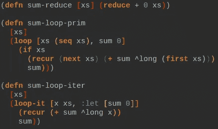

从上到下:177 毫秒，130 毫秒，59 毫秒

## Clojurescript

这一切在 Clojurescript 中也是可能的。创建一个 iter 是用`iter`完成的，只有对`ensure-iter`的改变稍微有点棘手。

## 梦想

一个`Iterator`很简单:`it.hasNext()`和`it.next()`。一个非常好的特性是一个改进的迭代器，它也允许我们说“现在给我剩下的序列”。类似`it.restSeq()`。这可以让我们加速像`nthrest`这样的事情，这在迭代器中是不可能的。一个值得注意的想法是加快`apply`速度，但并不那么快。它当前多次迭代给定的序列。想法见我的[clojuscript 票](https://dev.clojure.org/jira/browse/CLJS-2099)。如果迭代器有`it.restSeq()`的话，它就可以在那里使用。

## 结论

不要忘记 clojure 的`Iterators`。他们通常是值得的。如果您需要，请使用它们:

*   累积多个值
*   想做原始的数学
*   想要同时迭代多个序列

一如既往:如果性能很重要:基准。有时使用迭代器不是很快。例如，热切的`mapcatv`实现比嵌套的`loop-it`实现慢(但是使用`reduce`作为内部循环更快)。

所有代码位于:[https://github.com/rauhs/clj-bench](https://github.com/rauhs/clj-bench)

注意:由于`loop-it`很小，所以你应该复制它。没有 clojars 库。