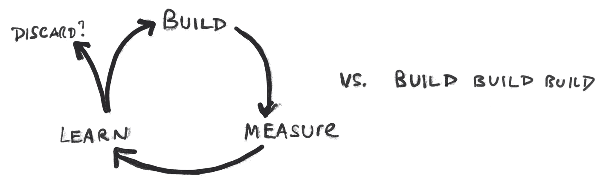
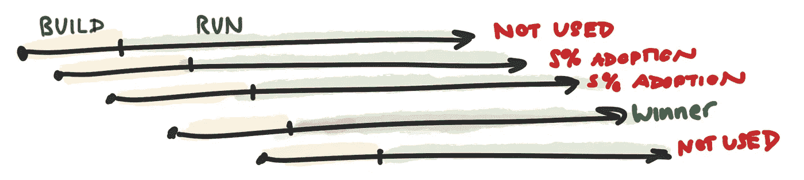
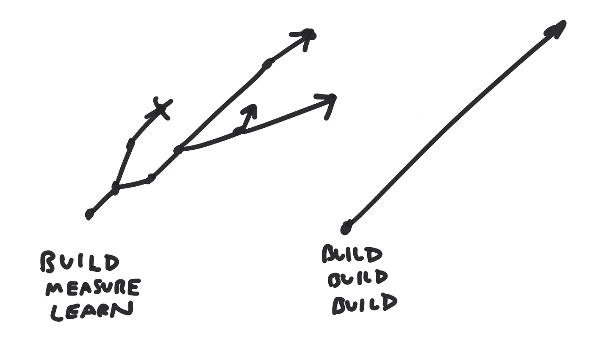
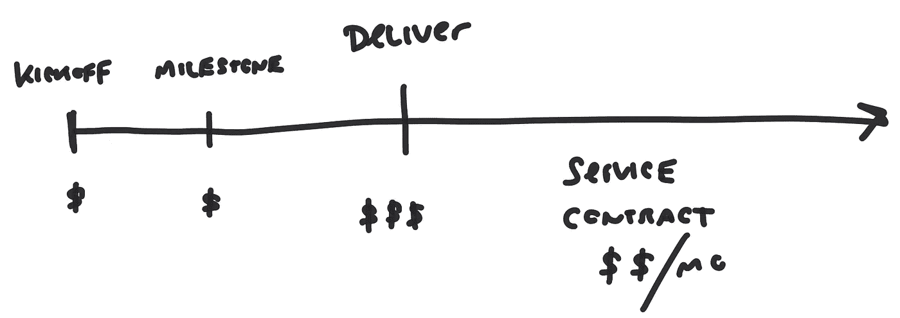
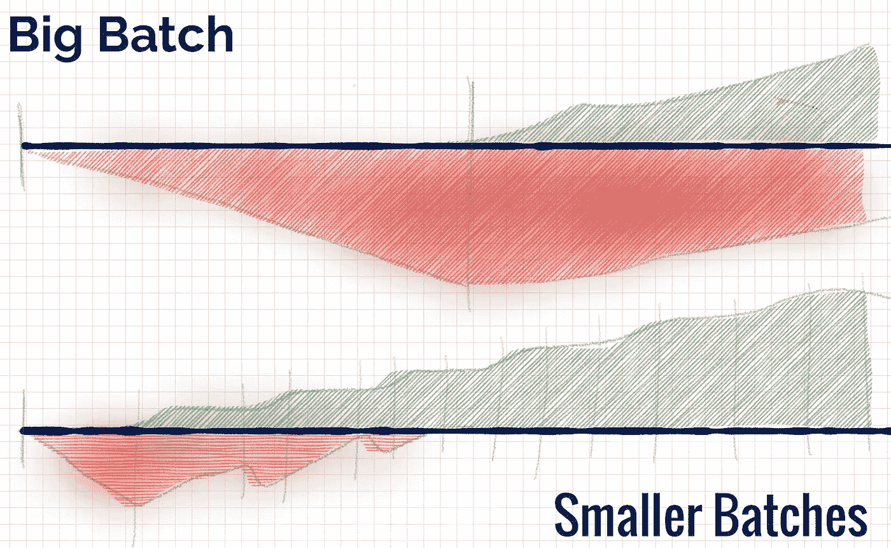
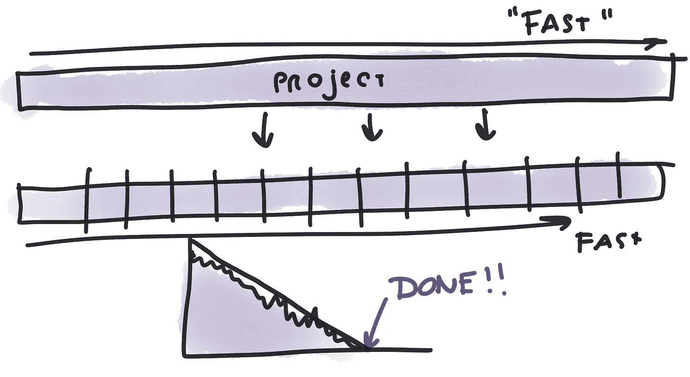
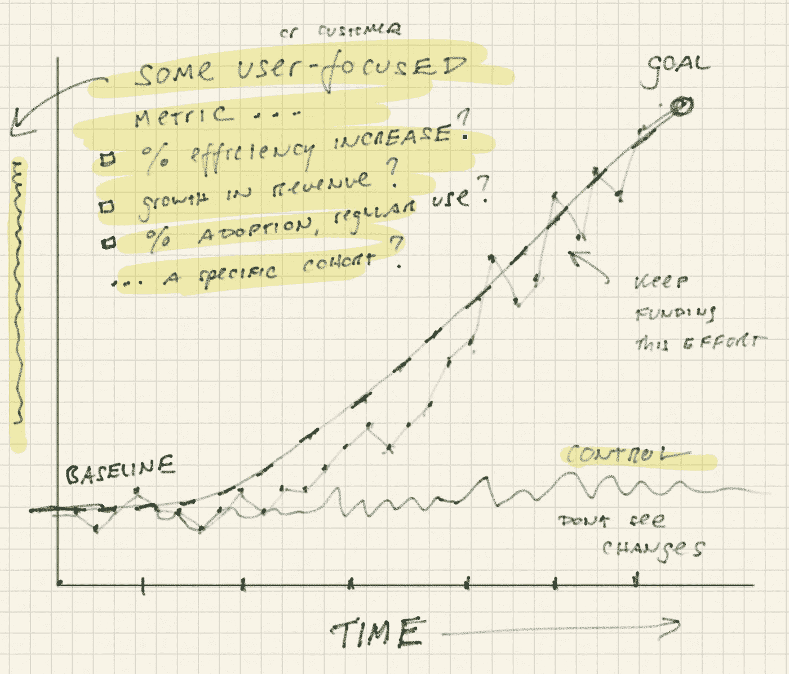

# 更快。更快。更快。

> 原文：<https://medium.com/hackernoon/faster-faster-faster-231c7b3d088d>

我想谈谈快速。

在左边，我们有构建-测量-学习循环。右边是常见的构建-构建-构建。

在这两种方法的背景下思考“快速”。通过构建-测量-学习，我们为学习而优化。我们尽可能快地绕着环路移动。在外人看来，这可能会慢一些，但我们学得更快。通过构建-构建-构建，我们优化了输出。我们尽快发货。有时输出是正确的策略，但有时会导致这样的结果:

五次尝试中的一个赢家。不好！银子弹的时间到了(笑话)。

问题是，我们倾向于不删除功能。因此，我们必须 1)保持复杂性，2)在添加额外功能时解决复杂性。可怜的行动！他们经常被留下来运行所有这些未被充分利用的功能，并且不知何故在招聘更多员工时遇到了问题。总之。

如果我们不小心，我们也会错过好机会:

请注意我们如何能够通过构建-测量-学习来寻求替代途径。我们扼杀一些想法，测试新想法，放大有效的东西。对于构建-构建-构建，我们要按照预先确定的计划执行。在这种情况下，利益相关者最不希望的就是翻翻剧本。

这里有一份遗产。

对于项目工作，有人来找你，要求提供 X、Y 和 z 方面的软件。对于固定投标工作，当你启动项目、达到一些里程碑并交付项目时，你会得到现金报酬。也许你也同意托管/维护软件，在这种情况下，你为服务合同收钱。

现在，这类工作可能需要大量的学习。这并不是对项目工作的否定。对于固定投标，您主要关心的是控制成本、降低风险和交付满足客户要求的产品。我们经常尝试在产品开发中复制这一方案:

这合乎逻辑。然而，还是有一些困难。这里有几个例子:

1.  大多数时候，当团队交付成果时，他们并没有得到“内部”现金。他们不享受利润。而且他们不会对服务合同收费(来维护他们构建的东西)
2.  如果被要求交付一个特性，他们会错过遵循替代路径来实现相同目标的机会。他们被“特写”钩住了。
3.  通过给出一个估计，他们已经限制了他们迭代特性以实现积极的业务成果的能力。最有可能的是，组织将在项目“完成”后立即安排后续工作。
4.  你冒着刺激更大的“批量”的风险(由于与专门团队相比，项目的交易/启动成本)。

概括地说，这意味着我们陷入了构建-构建-构建模式(见下面的大批量)与构建-测量-学习模式(见下面的小批量):

请注意我们如何使用较小的批次更早地交付价值。我们很早就“积极”了。现在想象一下跨多个计划的情况。这真的很重要。

我看到许多组织这样解释增量交付:

我们布局所有的“故事”，把所有的“点”加起来，一点一点地完成项目。增量不错。它们提供了集成点和现实检查，并降低了交付风险。

为什么我们做完就走了？在许多情况下，组织相信收益的实现是一个“长期”的事情，并且在完成之前不可能有测量/学习的方法。态度基本上是建造-建造-建造..测量-学习:

在这种模式中，快速就是要完成任务。我们将(快速)下注，然后等待直到商业价值实现(最终)。

在构建-测量-学习方法中，事情可能看起来有点像这样:

该团队的任务是移动一些用户/客户/业务指标。他们努力移动度量标准(在开始时有一个短暂宽限期)。他们可以自由地尝试不同的选择，只要他们能持续产生效果。理想情况下，他们针对特定的客户/用户群体，并使用控制。

是的…这需要更好的工具、测试、监控等。

是的，这对企业来说很可怕。

> 他们要建什么？
> 
> 我们将如何向客户解释？
> 
> 我们就不能和客户一起测试一下，然后继续前进吗？
> 
> 我们不能在发货前确保顾客喜欢吗？

但结果就是结果。这是一种选择。你也许可以这样工作。试着弄清楚，哪怕是一个小实验。

因此，当人们谈论“更快”或“只是执行”时，一定要问一些问题:

1.  更快对你来说意味着什么？
2.  你想优化什么？
3.  你愿意在未来走得更慢，还是现在走得更快？
4.  “快速前进”的效果如何？它对业务有什么帮助？疼吗？增加的复杂性带来了什么影响？
5.  如果能带来卓越的业务成果，你愿意放慢速度，减少建设吗？能不能少建点。

这是关于 fast 的一些基本想法。