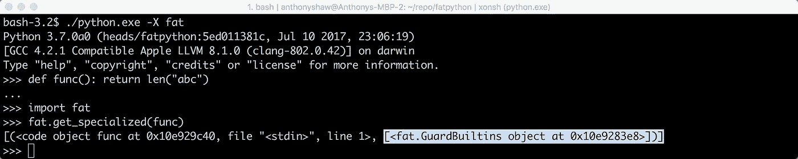
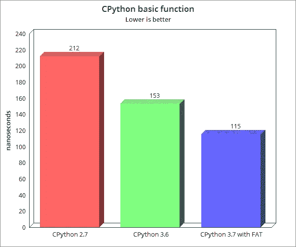

# 胖 Python:Python 优化的下一章

> 原文：<https://medium.com/hackernoon/fat-python-the-next-chapter-in-python-optimization-69dc974bcca2>


胖 Python 项目由 Victor Stinner 于 2015 年 10 月启动，旨在解决之前 Python“静态优化器”尝试的问题。Victor 对 CPython (Python 增强提案或“pep”)进行了一系列更改，并提供了一些示例优化和基准测试。

我们将在本文中探讨这三个层次。

# AST 中的优化

> 不确定 AST 是什么？[然后先看我的另一篇文章](https://hackernoon.com/modifying-the-python-language-in-7-minutes-b94b0a99ce14?gi=70b2d55c18a5)。

转换抽象语法树(AST)是优化代码的一种更符合逻辑的方式。通过停留在一个更高的层次，你可以作出跨越一个分支的决定。

例如，可以用 AST 优化器实现的一些优化:

*   [复制传播](https://en.wikipedia.org/wiki/Copy_propagation):替换 x = 1；y=x，x = 1；y=1
*   [常数折叠](https://en.wikipedia.org/wiki/Constant_folding):用 2 代替 1+1
*   [死码消除](https://en.wikipedia.org/wiki/Dead_code_elimination)

使用*(见下一章)，可以实现更广泛的优化选择。示例:*

*   *简化 iterable:当用作 iterable 时，用(0，1，2)替换 range(3)*
*   *[循环展开](https://en.wikipedia.org/wiki/Loop_unrolling)*
*   *调用纯内置:用 3 替换 len(“ABC”)*
*   *将使用的内置符号复制到常量*

# *脂肪是如何工作的*

*FAT Optimizer 是一组静态优化，基于 CPython 的 3 个主要变化。这些变化可能会合并到 Python 3.7 或 3.8 中，但目前我们必须手工编译它们。*

*为什么我们需要对 CPython 进行修改？嗯，CPython 没有用于优化 AST 的 API。AST 不可插拔，因此输入 *PEP 511* ..*

## *人教版 511*

*PEP 511 建议添加一个流程来优化 AST 实例。AST 实例是代码的面向对象表示。优化器可以是通用的，着眼于一般的优化，或者更加定制化。*

*定制优化器可以查看一组领域特定的变化，例如 NumPy 或 Pandas“反模式”,并在语法树中优化它们。在取代简单地推荐更改的静态 linter 的过程中，优化器可以为您做出这些更改。*

*PEP 511 引出对`sys`模块的改变，以设置可以使用的优化器，然后它为优化器实例提供 API。*

*将来，优化器可以包含在 Python 包中，并在 PyPi 上共享(相当酷——哈！？).*

*PEP 511 还假设，为了有效，优化器需要对核心 CPython 内部进行一些其他更改，输入 PEP 509..*

## *人教版 509*

*在 Python 中，内置 dict 类型被许多指令使用。例如，`LOAD_GLOBAL`指令在全局名称空间或内置名称空间中查找变量(两次字典查找)。Python 使用 dict 作为内置名称空间、全局名称空间、类型名称空间、实例名称空间等。本地名称空间(函数名称空间)通常被优化为一个数组，但它也可以是一个字典。*

*Python 很难优化，因为几乎所有东西都是可变的:内置函数、函数代码、全局变量、局部变量……都可以在运行时修改。实现尊重 Python 语义的优化需要检测何时“有变化”:我们将这些检查称为“保护”。*

*优化的加速取决于安全检查的速度。PEP 509 提议给字典添加一个私有版本来实现名字空间的快速保护。*

*Python 里怎么弄守卫？输入 PEP 510*

## *人教版 510*

*PEP 510 提出在 Python C API 中增加一个 *public* *API* 来为一个函数增加带守卫的专门代码。当函数被调用时，如果什么都没有改变，就使用专门的代码，否则就使用原始的字节码。*

> *更容易看到所有这些的运行，所以让我们安装这些 pep 并测试一个优化器。*

# *跑步变胖*

*编译一份打了 [PEP 509](https://www.python.org/dev/peps/pep-0509/) 、 [PEP 510](https://www.python.org/dev/peps/pep-0510) 和 [PEP 511](https://www.python.org/dev/peps/pep-0511/) 补丁的 CPython 3.6。你需要一个 C 编译器来完成这项工作，如果你还没有的话， [GCC 是一个简单的选择。](https://gcc.gnu.org/install/)*

```
*git clone [https://github.com/haypo/cpython](https://github.com/haypo/cpython) -b fatpython fatpython
cd fatpython
./configure CFLAGS='-O0' --enable-shared
make*
```

> *在我的 mac 上，我必须将`_sysconfigdata_dm_darwin_darwin.py`从构建目录复制到 lib 目录。*

*安装 fat。FAT 是 PEP510 的一种实现，用于专业警卫。*

```
*git clone [https:**//**github**.**com**/**haypo**/**fat](https://github.com/haypo/fat)
cd fat
**../**python setup**.**py build
cp **-**v build**/**lib***/**fat**.***so **../**Lib
cd **..***
```

> *对于 OS X 用户，在本文中使用`./python.exe`而不是`./python`*

*安装`fatoptimizer`，PEP 511 的一个实现，有一组优化。*

```
*git clone [https:**//**github**.**com**/**haypo**/**fatoptimizer](https://github.com/haypo/fatoptimizer)
cd Lib
ln **-**s **../**fatoptimizer**/**fatoptimizer **.***
```

*现在我们有了一个带有 FAT 的工作 CPython 可执行文件。一个简单的测试可以显示 PEP 510 中描述的防护。*

**

*现在为了比较速度，运行一个基本的 timeit，检查返回基本字符串长度的函数的调用。*

*`$ ./python.exe -X fat -m timeit -s ‘def f(): return len(“abc”)’ ‘f()’
2000000 loops, best of 5: 115 nsec per loop`*

**

*我用 CPython 3.6 和 2.7 再次测试了这个(去掉了`-X fat`)。比 3.6 提高了 24%。*

*优化本身在 [fatoptimizer 文档](https://fatoptimizer.readthedocs.io/en/latest/optimizations.html)中有描述。*

# *它是如何工作的？*

*如果拆开基础测试，看起来很正常。调用内置函数，返回值。*

```
*>>> import dis
>>> dis.dis(func)
  1           0 LOAD_GLOBAL              0 (len)
              3 LOAD_CONST               1 ('abc')
              6 CALL_FUNCTION            1 (1 positional, 0 keyword pair)
              9 RETURN_VALUE*
```

*但是，使用 fat，您可以访问该功能的专用(即优化)版本。这是在方法加载到 ast 中时生成的。Fat 保留了原始的 ast 并存储了一个优化的方法。*

```
*>>> dis.dis(fat.get_specialized(func)[0][0])
  1           0 LOAD_CONST               1 (3)
              3 RETURN_VALUE*
```

*当我们通过我们的方法调用 timeit 时，它正在运行优化的函数，该函数只返回 3，而不是调用`len`。很明显可以看出为什么这样更快。*

*然而，在 Python 中，你可以用任何东西替换任何东西，包括全局名称空间中的内置。如果您要用别的东西替换`len`，它会移除保护并执行原来的 ast。*

# *脂肪的下一步是什么？*

*3.7 中重新引入了(我认为)与 FAST_METHODCALL 实现的连接。这意味着调用方法的开销更少，大大降低了 CPython 的速度。*

*结合这 3 个 pep，我们可以在 PyPi 上看到 guards 和一系列优化器的实现。*