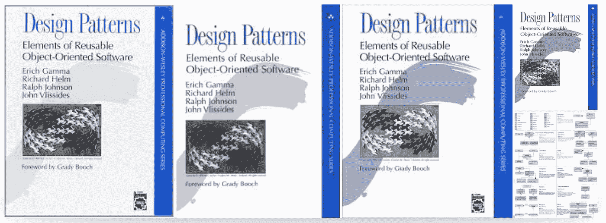
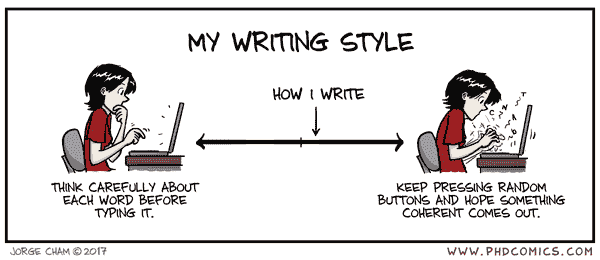

# “比起类继承，更喜欢对象组合”，他们说…

> 原文：<https://medium.com/hackernoon/favor-object-composition-over-class-inheritance-they-said-9f769659b6e>

是的。这是蜘蛛侠。你可能想知道他在这里做什么，在一篇关于编程，关于模式和其他计算机科学相关的营销废话的文章中。

所以，他只是想让你回忆起一件事:

> 能力越大，责任越大

# 哪些能力？

让我们列举一下我们拥有的:

> —功能
> 
> —类别
> 
> —变量

仅此而已。而且这些不是`powers`，这些是`elements`。

你可以用这些元素创造不同形式的强力咒语:

> — FP
> 
> —玻璃钢
> 
> — OOP
> 
> —命令式风格
> 
> —还有别的吗

这就是秘密——“偏爱对象组合胜过类继承”并不意味着“类是 sux，函数规则！”，或者“没有别的办法，FP”。

这意味着——“权力越大，责任越大”，你必须小心处理每一件事。否则魔法会烧死你。

# 让我们从头开始。

我决定在埃里克·艾略特的*“作曲软件”*系列*的[演讲之后写这篇文章。](https://medium.com/u/c359511de780?source=post_page-----9f769659b6e--------------------------------)*

让我首先强调一些文章，我强烈建议你先阅读:

 [## 函数式编程(组合软件)的兴衰与崛起

### 注意:这是关于学习函数式编程和组合软件的“组合软件”系列的第 1 部分…

medium.com](/javascript-scene/the-rise-and-fall-and-rise-of-functional-programming-composable-software-c2d91b424c8c)  [## 作曲软件:导论

### 注意:这是关于学习函数式编程和组合式编程的“组合软件”系列的介绍

medium.com](/javascript-scene/composing-software-an-introduction-27b72500d6ea)  [## 听起来你在谈论建筑。

### FP vs OOP 是一个错误的二分法。

medium.com](/@_ericelliott/it-sounds-like-youre-talking-about-architecture-b022edb2826d) 

它们都非常非常有趣，但我们将尝试从另一个角度挖掘。

# 让我们从头开始。

> 在计算机科学的开端，在大多数计算机科学实际上在计算机上完成之前，有两位伟大的计算机科学家:阿隆佐·邱奇和艾伦·图灵。他们提出了两种不同但等价的通用计算模型。**两个模型都可以计算任何可以计算的东西**(因此，“通用”)。
> 
> 阿隆佐·邱奇发明了λ微积分。Lambda 演算是基于函数应用的通用计算模型。艾伦·图灵因图灵机而闻名。图灵机是一种通用的计算模型，它定义了一种在一条带上操纵符号的理论装置。
> 
> 他们一起合作证明了 lambda 演算和图灵机在功能上是等价的。
> 
> —函数式编程的兴起、衰落和兴起

## 循序渐进。

而现在你可能在任何数字信号处理器内发现了**图灵机**，甚至**命令式**编程**风格**。

这就是图灵的工作方式——一步一步来。

## 流动。

Lambda 演算以不同的方式工作。程序是无止境的`flow`思想输入和输出。思想管道。

> 某个点的某个值是输入和输出的组合。只有。纯数学。纯函数。

lambda 创造了一个模拟器件的世界。

从现在开始，请将**命令式** **风格**视为图灵“待办事项”，将功能式风格视为 lambda“真空灯”。

不要忘记，他们是平等的。你可能写的所有 FP 代码都将被编译成字节码，并在图灵机中执行。但是图灵机将物理地运行在 CPU 模块的模拟原子上。

这是无止境的。

# 函数式编程的兴起

我希望你知道，但是第一台计算机是模拟的。第一个设备是模拟的。而且几乎所有的现代军事或航天设备仍然是模拟的。

长话短说，但我的父亲是一名程序员，实际上他曾向天空发射火箭。

> 在一个真实的，而不是像谷歌做的。

有一天，我问他——“你工作的时候在做什么”。

他回答说:“我被告知要用自测机制建立模拟方案”。

我又问:“模拟？但是为什么呢？你应该用正常的数字处理！”

并且得到了一个回答:“Cos **静态布线抗任何变化**。没有什么能改变“程序”的工作方式。重新布线。也不是兴奋，也不是辐射，也不是美国人”。

让我重新措辞:

> 使用函数式方法，你将得到更多可测试、可维护和可预测的代码。

但是，只要长函数式方法在功能上等同于命令式的 T21，你就可以在函数块中使用命令式风格。

只是因为这不是编程方法，而是架构。

如果你从一个个孤立的模块构建你的应用，通过`functional pipes`相互连接——你将得到类似微架构的东西，类似模拟设备。每个元素都是一个黑盒。不管里面有什么？

# 函数式编程的衰落

所以，30 年后，电脑有了一点进步，数字时代开始了。全新的中央处理器使每个人都能使用高级语言..

> 一个人在没有重大责任情况下使用了巨大的权力。

新语言是新的，它们很快，它们是为处理新的 CPU 而构建的，它们改变了世界。

但是它们的设计并不能像 Lisp 那样很好地处理旧的函数式风格。

> 好吧，有什么理由让你支持一些老垃圾/狗屎？

如果现在有人问我——你更喜欢 Lisp、Closure 还是 Java——我会选择 Java(好吧，我会选择 JavaScript)。

我们的父亲也是如此。函数式编程已经没落了。

# 今天。

然后有人发明了类和 OOP。1966 年。30 年后，OOP 的一位“父亲”说:

> 实际上，我创造了术语“[面向对象](https://en.wikiquote.org/wiki/Object-oriented)”，我可以告诉你，我脑子里没有 [C++](https://en.wikiquote.org/wiki/C%2B%2B) 。——艾伦·凯。

所以 C++、Java、JavaScript 中的“类”和“OOP”——不是“类”也不是“OOP”。而它们的“不”只在阿兰的“意思”里。

> 比如:你不是男人，你不是女人，你什么都不知道，琼恩·雪诺。

这只是一个人名。不同的语言有不同的表达方式。

如果艾伦没有把现代阶级当作阶级，这并不意味着现代阶级是坏的，甚至“不是真正的阶级”。

为什么他等待了 30 年，为什么计算机科学不能以自己的方式发展，必须保持在一定的限度内，这是一个悬而未决的问题。

# 今天不行。

但是四人帮说“重对象组合轻类继承”不是今天。他们 20 年前就这么做了。

而且，如果你读了一本书，你可能会记得他们为什么这么说。

现在，请试着理解下一个:

> 发明和实现 OOP 和类的人是非常聪明的人。比你聪明。
> 
> 他们实际上可以处理 OOP 的能力，并且没有任何问题。
> 
> 不幸的是，你很笨，或者不如创始人聪明，或者不使用 BDUF。

甚至，如果你很聪明，有很多时间做 BDUF 和 etc——你可能不是。

# BDUF —预先的大设计

正如互联网所说:

> 这是瀑布时代的遗物，在大家变得冷静敏捷之前。
> 
> 这个缩写是为了提醒我们不要被超级复杂的架构搞得晕头转向。我们不应该在编写第一行代码之前就花 3 个月来设计我们的应用程序。从小处着手，不断迭代。

在设计良好的系统上你不会有任何问题，你可以忽略任何文章和建议。它们都是为别人设计的，不是那么漂亮。

所有的建议、书籍和模式、测试和最佳实践都旨在解决一个问题:

> 帮助建立和维护设计不完善的系统。维护代码后帮助他人。强迫别人在你之前，留下你能理解和接受的代码。
> 
> 有助于团队合作。

而且，如果出现任何摩擦，你将得不到设计良好的系统。而且，根据我的经验——即使你会设计一个`well designed system`——几年后你会意识到——**它不是**。

PS: JFYI，大部分应用程序寿命都不长。

# 答案。

但是我仍然没有提供为什么“偏爱对象组合胜于类继承”是误解的信息。

让我再一次贴上埃里克·埃利奥特的一句话

> FP vs OOP 是一个错误的二分法。

我可以说:

> 对象组合相对于类继承就像一个微 vs 软。

构图和继承没有任何相似之处。

他们都可以用不同的方式做不同的事情。

他们都给了你力量。如何使用由你自己决定。

您可以创建一个对象，它将组合其他对象的功能，然后使用继承来修改它的行为。

或者，您可以创建静态关联方案，并使用继承来修改原子的行为。

我再举一个 Eric(最后！)时间

> 有人告诉我，软件开发是“将一个复杂的问题分解成更小的问题，并将简单的解决方案组合成复杂问题的完整解决方案的行为。”
> 
> 我人生中最大的遗憾之一是，我没能尽早理解那一课的意义。

对象**构图——是一个艺术品**。把复杂问题分解成更小的可行问题的贪婪方法。

类**继承——是工具**。积木。一把锯子。

并且大多数类继承的问题都源于不完全的分解。

试想一下——如果你可以在不使用高级工具的情况下获得完美的结果——你能用它做什么？

# **最后一个陷阱**

最后一个陷阱是最难的。

如果你“过多地”使用了继承——你将**纠缠你的代码**。到时候就很难“解开”了。

如果你“过多地”使用了分解——你也会使你的代码纠缠不清。很难找到用“单一责任原则”构建小-小-小原子组件之间的思路。

你必须考虑层次、输入和输出、插槽和信号、块，并尝试使用独立的黑盒来构建整个应用程序。

> **各个击破**！

# 但是

永远记住—

*   你并不孤单，有人(可能是你)必须支持你的代码，有人(可能是你)可能改变你的代码。
*   编程语言旨在帮助你。还有我。还有鲍勃。它们通常提供更多你应该使用的能量。
*   如何编写可用和可测试的代码取决于您。但是你可以结合不同方法的不同技术。你可以做到的。
*   没人能阻止你。

> 期待责任。
> 
> 所有的魔法都有代价。

PS: CSS！原子 CSS！功能 CSS！BEM！—那才是真正的战场……