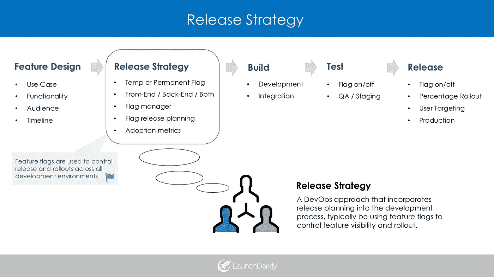
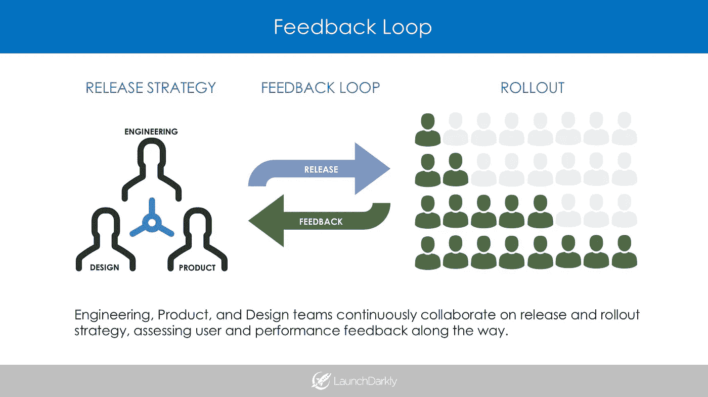

# 特征标志驱动发布

> 原文：<https://medium.com/hackernoon/feature-flag-driven-releases-7a7a5fee6ba7>

## 使用功能标志来推动产品的发布策略和持续交付

# 老办法

软件发布的“旧方式”的特点是团队之间的明确的瀑布式移交——从产品(功能需求)到工程(构建和部署)。这种老方法并没有在开发过程中明确地促进发布计划。完整的发布负担从一个团队转移到另一个团队，没有反馈循环或集成发布控制的计划。因此，团队很难持续地交付软件，收集反馈度量，并完全控制软件的推出和回滚。

随着持续交付的兴起，团队正在将特性发布和首次展示控制集成到产品开发过程中。这开创了一个新的开发时代，团队在初始设计阶段就发布策略进行合作，以便在整个开发周期(从本地、QA、试运行到生产)中管理发布。

该功能将如何发布？谁将最先获得这项功能？会逐步铺开吗？谁将测试它？如果事情不顺利怎么办？所有这些考虑事项(以及更多)通常不会在最初的规划会议上讨论。通过从一开始就制定一个发布策略，你可以确保你的软件发布从构建到发布到结束都是顺利的。

# 发布策略

发布策略是一个 DevOps 概念，团队将特性发布计划集成到开发过程中。开发人员将特性标志集成到开发生命周期中来控制他们的发布，而不是将新特性推向生产并完成它。概括地说，功能标记是一种通过将代码包装在条件中来控制特定功能的可见性和开/关状态的方法。标记的过程鼓励开发人员为最初的特性展示、基于用户反馈的特性改进和整体特性采用进行规划。它基本上迫使团队将发布策略合并到开发过程中。

[Upserve](https://upserve.com/) 的工程总监乔希·楚(Josh Chu)解释了他的团队是如何整合发布策略的:

> *“很多时候，人们会说‘让我们开始吧’,而不会去想如何真正被采用。事实上，你有一个功能标志的故事提高了知名度。工程师们开始考虑他们的功能将如何推出，而不是仅仅“将其推向生产，就完成了”。我们鼓励产品团队对预发布反馈采取更实际的方法，这直接有助于获得发布后的吸引力。”*

# 使用功能标志的战略部署

在这一节中，我们举例说明了一个发布策略是如何被整合到传统的设计、构建、测试和发布过程中的。

**第一阶段——功能设计**

*   设计特性的功能，检查目标受众和用例，并制定实施时间表。

**第二阶段——发布策略**

*   在首次展示和发布策略上进行合作。功能标志应该是前端标志、后端标志还是两者都是？(前端标志主要用于控制 UI 可见性，后端标志可以控制 API、配置甚至路由)。国旗后面应该是什么？这是永久的还是临时的旗帜？(例如。permanent = '维护模式'，temporary = '新注册表单')谁有权更改标志？该标志是否旨在控制百分比卷展？我们将如何整合用户反馈？我们将如何衡量采用率和牵引力？

**第三阶段——建造**

*   开发和集成，使用特性标志来管理特性在多个开发环境中的进展。

**阶段 4 —测试**

*   在 QA 和试运行中测试功能，使用功能标志来控制首次展示和用户定位。

**第五阶段——发布**

*   在生产中以“关闭”状态部署该特性，然后实施您的发布和推广策略。这可以是增量百分比展示、单个用户目标或目标用户组。

# 反馈回路

通过采用发布策略，工程、产品和设计团队可以在发布和展示计划上持续协作，并在此过程中评估用户和性能反馈。AppDirect[的产品经理 Bryan Jowers 评论了受控部署的好处:](http://www.appdirect.com/)

> *“它使我们能够更快地将产品推向市场、测试、获取数据和迭代……工程、产品和领导层都希望以低风险交付产品……我们通过严格控制的推出来实现这一点。”*

团队不应该将未来推向生产并完成它，而应该设计包含目标/增量展示的发布策略，目的是基于反馈进行迭代。这创建了一个连续的[反馈循环](https://launchdarkly.com/usecases/feedbackloop.html)，因为团队可以综合性能度量，并将这些度量转化为更好、更快的迭代。

# 外卖

发布策略将发布和首次展示计划纳入开发流程。它迫使团队规划功能的推出，并开发收集用户反馈、分析指标和评估牵引力的方法。正如 Upserve 和 AppDirect 的团队所使用的，其中一个行之有效的方法是使用[特性标志](http://blog.launchdarkly.com/feature-flag-driven-development/)来启动、控制和测量从开发到发布的特性。

*让我们保持联系！在* [*LinkedIn*](https://www.linkedin.com/in/justinabaker87/) *上加我。*