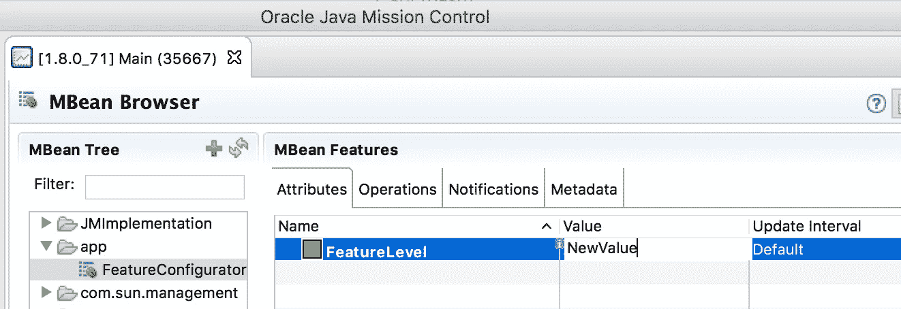

# JVM 上 Scala 和 JMX 的特性切换、继承和敏捷

> 原文：<https://medium.com/hackernoon/feature-switches-inheritance-and-agile-with-scala-jmx-on-the-jvm-140b4bf94d9f>

[*https://www . Scala willian . com/1609/feature-switches-agile-Scala-JMX/*](https://www.scalawilliam.com/1609/feature-switches-agile-scala-jmx/)

还记得上一次生产中的一项关键服务工作不正常，而您恢复了您的更改，或者为新配置重新启动了服务吗？我也不知道。

在我最近的一份合同中，在产品部署前 10 天，我开始开发一个实际上需要 2-3 个月的功能。管理层没有考虑到任务的复杂性，但是不用担心:我们有敏捷和 [Play](https://www.playframework.com/) [Scala](http://scala-lang.org/) 供我们使用。

一旦你知道你会错过，就不会设定最后期限，所有的风险都消失了，只剩下确定性。

我同意项目经理实现最简单、最笨、最安全的东西，这样至少我们不会错过最后期限。进入 master 需要一天时间。

这将是我们的基本界面:

Scala 中有一个非常愚蠢的实现，叫做‘static feature’

现在知道了管理层将会要求对最终的可交付产品进行不断的更新，我同意产品负责人的观点，实现一些简单的至少部分满足需求的东西会更有意义，但是会花费更少的时间。这花了 2 周时间，我们能够非常轻松地将其部署到生产环境中。如果出现任何问题，我们将能够切换回我们之前同意的东西(即‘static feature’)。

欢迎使用“高级功能”，它比“静态功能”复杂 10 倍，经过测试，当它无法满足要求时，可以退回到“静态功能”。

但是，让我们说，而不是失败和后退，“高级功能”返回不正确的输出？因为输入的 XML 非常松散，所以不能保证所有的东西都像预期的那样工作，而且没有一个东西可以很容易地进行单元测试。

然而，我们如何切换回来？还原 Git 代码？重新部署配置更改？加油！我们可以随意使用 JVM。它有一个叫做[JMX](https://hackernoon.com/tagged/jmx)(“[Java 管理扩展](http://openjdk.java.net/groups/jmx/)”)的东西，为你提供了一种在运行时管理应用的方法。您可以进行度量、重新绑定端口、更改配置选项、更改日志详细程度、运行诊断，等等。所以你应该这么做:

首先，您编写一个通用接口，即“管理 Bean”:

然后编写一个实现，将该组件注册到 JMX 注册表，并允许远程调用其方法:

现在，当您的应用程序运行时，您打开[Java Mission Control](http://www.oracle.com/technetwork/java/javaseproducts/mission-control/java-mission-control-1998576.html)(UNIX shell 中的 jmc)，连接到应用程序，然后您可以立即更改值(它会在按下 Return 时调用 setFeatureLevel 方法):

当然，在生产中，你可能希望有一些更容易使用的东西，在这种情况下，我使用了 [Java 8 的 JavaScript 解释器 jjs](https://docs.oracle.com/javase/8/docs/technotes/guides/scripting/nashorn/shell.html) 来连接到一个远程运行的进程，并通过一个 Shell 脚本来更改配置值。

现在，企业已经确定，他们将得到一个给出预期行为的更小版本，而不是被不正确的行为所困扰。

最终实现，“ComplexFeature”:

这是迄今为止最复杂的一次，该企业希望像 A-B 那样将该功能推广到多个生产环境中。在第一个环境上运行几个星期，然后在第二个环境上运行，然后在第三个环境上运行，最后我们完成第四个环境。如果出现任何问题，我们会求助于较低版本，并在运行时更改级别。简单方便。

这种方法是成功的。Ops 很喜欢。阿宝很喜欢。

1.  如果特征 C 开始产生不正确的结果，它将退回到 b。
2.  如果特征 B 开始产生不正确的结果，它将退回到 a。
3.  Ops 能够在运行时在这些级别之间切换。
4.  Ops 能够将相同的代码部署到不同的生产环境中，并 A/B 测试这些更改。
5.  Ops 和 Test 能够将相同的代码部署到生产、试运行和测试环境中，并验证每个功能的行为。
6.  Ops 能够监控 DataDog 的行为和回退率。

**现在有总比没有好。**

但现在的一切都比现在的东西好，所以选择 Scala & JDK 8，它拥有一切。

在 LinkedIn 和 Twitter[上与我](https://twitter.com/ScalaWilliam)[联系。](https://www.linkedin.com/in/scalawilliam)

—

**更新，2016 年 11 月 4 日**:一位读者提了一个很好的问题:

> 那么，与数据库交换相比，有哪些优点和缺点呢？

我的回答是:

> 与数据库交换机相比，没有缺点，只有优点。因为您的服务是远程的，所以您需要解决的是如何执行这个触发器。
> 
> 1.通过 SSH 隧道实现 Java 任务控制。您需要指定额外的 Java 属性来实现这一点。
> 2。从服务器本身进行调用的自定义脚本。这是我在文章中采用的方法。工具的构建需要一点时间。
> 3。在服务器上启动类似 Hawtio 的东西:【http://hawt.io/】T2 这是一个非常好的简单方法，但是你需要确保对它的访问控制。需要神灯:【https://jolokia.org/】
> 4[。通过 REST 使用](https://jolokia.org/)[https://jolokia.org/](https://jolokia.org/)和你自己的管理面板。在这里你想抽象出低层次的细节。
> 
> 如果您的开发人员可以访问生产机器并知道他们在做什么(小团队，很少的应用程序)，请选择#1。如果您的开发人员和开发人员保持密切沟通，但开发人员没有生产权限，请选择#2。
> 如果机器上运行更多应用程序，甚至可能是同一应用程序的多个实例，请选择#3。
> 如果您向拥有自己运营团队的客户交付产品，并且需要对您的产品进行特别可靠的控制，请选择#4。我认为这将需要一篇进一步的文章。
> 数据库不应该真正用于配置或管理。但是当然不是所有的平台都支持管理设施。

> [黑客中午](http://bit.ly/Hackernoon)是黑客如何开始他们的下午。我们是阿妹家庭的一员。我们现在[接受投稿](http://bit.ly/hackernoonsubmission)并乐意[讨论广告&赞助](mailto:partners@amipublications.com)的机会。
> 
> 如果你喜欢这个故事，我们推荐你阅读我们的[最新科技故事](http://bit.ly/hackernoonlatestt)和[趋势科技故事](https://hackernoon.com/trending)。直到下一次，不要把世界的现实想当然！

