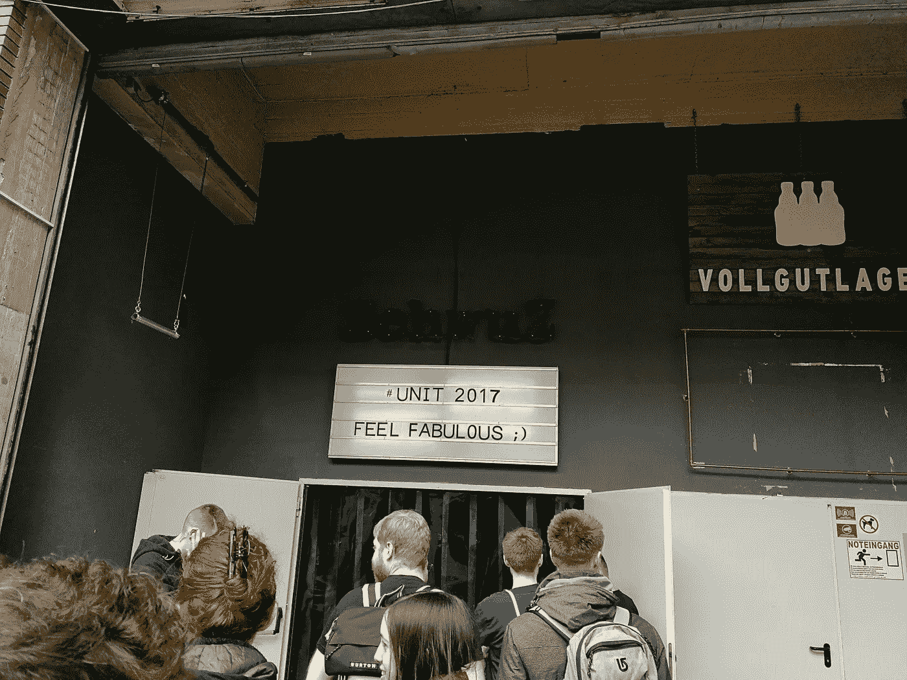

# 在#UNIT Berlin 体验酷儿科技的美妙感觉

> 原文：<https://medium.com/hackernoon/feeling-fabulous-with-queer-tech-at-unit-berlin-8b60b09800e0>

#UNIT 在柏林定期举办聚会，对象是那些在科技界工作的女同性恋者、男同性恋者、双性恋者、跨性别者和双性人(LBGTI ),但其主旨是为那些你可能不会经常在更主流的活动中看到的演讲者提供一个空间。我个人并不认同这些，但我总是喜欢在聚会上听到的各种信息和有趣的气氛，这是我第二次参加年会。

这一次，会场周围是一个洞穴般的夜总会，这意味着我不断地怀疑自己会在半明半暗的光线中被绊倒，每个房间都相当孤立，这意味着会议缺乏去年的乐趣；尽管如此，高质量的会谈远远弥补了这一点，以下是我的亮点。

# 琳·康维

[林恩](https://en.wikipedia.org/wiki/Lynn_Conway)的演讲，“一个看不见的女人:硅谷微电子计算革命背后的内幕”，是一个引人入胜的故事。不仅了解了 [VLSI](https://en.wikipedia.org/wiki/Very-large-scale_integration) 集成电路设计的开拓历史([米德和康威革命](https://en.wikipedia.org/wiki/Mead_%26_Conway_revolution))，还深入了解了人们在历史上的遗产是如何轻易被抹去的，并且必须为之而战。

她在结束演讲时想知道人们是否经常对创新视而不见。他们当时没有意识到一件事或一个想法的重要性，并且经常会变得很平常，而没有意识到它可能是其中的一部分。人们追随一个好的想法，而不会问它从何而来，也不会问它是来自某个特定的人的深思熟虑的想法。如果你有一个你觉得有价值的想法，你必须确保你得到了荣誉，不管是有意还是无意。

# 马蒂亚斯·布雷默·克劳斯·耶格尔

Klaus 和 Matthias 的演讲“半导体物理如何彻底改变可持续电力和照明”是 Lynn 演讲的后续，简要介绍了自阀门逐渐退出主流以来半导体的发展。他们讲述了[半导体](https://en.wikipedia.org/wiki/Semiconductor)的基本功能和“[带隙](https://en.wikipedia.org/wiki/Band_gap)的作用，以及它如何受到能量和热量的影响。他们覆盖了常见于太阳能电池板中的[光电](https://en.wikipedia.org/wiki/Optoelectronics)电池，其工作方式类似，但受光线水平的影响。他们谈到了发光二极管，以及有趣的事实:大多数情况下只生产蓝色发光二极管，然后再加工成其他颜色。最后，他们报道了最近的发展，包括有机发光二极管(尽管代表“有机”，但不是由生物组成)和尖端的“有机太阳能”(承诺大幅削减太阳能成本)。

# 马丁·韦佐夫斯基

马丁的演讲“让我们设计一个我们都想要生活的未来”看起来像一个走下哈雷戴维森的摇滚明星，为这一天画上了鼓舞人心的句号，涵盖了乐观的未来思维以及我们在其中可以扮演的角色。该演示充满了天马行空的想法和精彩的引言，例如:

> *“我们将在未来度过余生。”*

还有。

> *“你想变得毫无意义吗？”*

他的基本信息是，未来(和未来的创新)不会都有意义，你需要学会如何表达并展示给其他人。

> [黑客中午](http://bit.ly/Hackernoon)是黑客如何开始他们的下午。我们是 T21 家庭的一员。我们现在[接受投稿](http://bit.ly/hackernoonsubmission)并乐意[讨论广告&赞助](mailto:partners@amipublications.com)机会。
> 
> 如果你喜欢这个故事，我们推荐你阅读我们的[最新科技故事](http://bit.ly/hackernoonlatestt)和[趋势科技故事](https://hackernoon.com/trending)。直到下一次，不要把世界的现实想当然！

