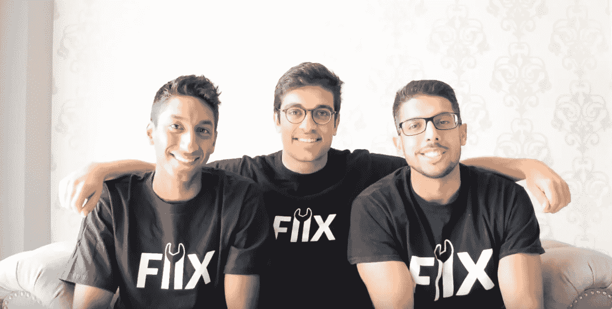
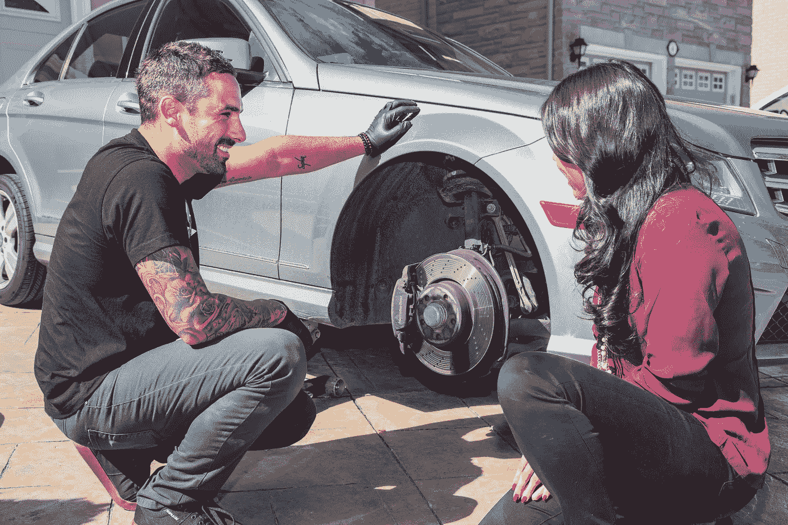

# fiix——通过市场释放行业潜力

> 原文：<https://medium.com/hackernoon/fiix-unleashing-the-potential-of-an-industry-through-a-marketplace-2d640ae1a05b>

Fiix 是汽车维修的优步。我们派遣专业的、有执照的技术人员到你家，在 3 小时内修好你的车(因此得名“Fiix”)。事实是，修理厂 80%的工作实际上可以在你的车道上用合适的工具和设备完成。通过省去修理店的中间商，我们能够支付给机械师的工资是他们在修理店工作时的 3 倍，同时让我们的客户支付的价格比经销商收取的价格低 30%。到目前为止，我们的客户和机械师喜欢这种体验！我们的客户留下的[评价 98%都是 5 星评价！](https://www.fiix.io/reviews)

尽管如此，用市场模式经营企业是一种不断学习的经历。在 Fiix 的一生中，我们学到了很多适用于所有市场的经验。

# 关于有效经营市场，人们应该知道的 3 件事

1.  渗漏是市场失败的一个重要原因。作为一个市场，你是连接供需双方的中间人。如果双方都认为直接联系比利用你作为中间人更有价值、更容易，那么双方就有动力省去中间人。因此，花钱获得客户是浪费，尤其是如果你在第一笔交易中没有盈利的话。这里的解决方案是提供一个明确的激励，(例如，赚额外的钱，奖励，更少的努力和工作，更高的时间利用率等。)其中 2 直接连接是没有意义的。
2.  在市场中，在早期关注你的单位经济和你的保留是非常重要的。许多市场在第一笔交易中没有盈利，所以他们依赖客户进行多次交易，然后才能实现收支平衡。这就是为什么投资者经常问上市公司他们的“回收期”是多少。然而，如果你的客户保持能力很差，而客户最终没有充分利用你，那么你永远无法从获得客户中获利，也永远无法赚钱。
3.  首先，供应方和需求方都需要有明确的激励机制来使用你。供需双方需要从使用你而不是替代品中找到 10 倍的价值。比如和我们在一起，我们的供应方(技工)用我们赚了 3 倍的钱，需求方(客户)节省了时间和金钱，通过使用我们获得了应有的透明度和体验。

# 关于经营市场，我们学到了以前不知道的一件事

许多市场的失败是由于糟糕的单位经济学。当谈到单位经济学时，我们发现在分类中很容易排除隐藏的成本，这会扭曲你的数字并描绘出一幅误导的画面。例如，排除与预订单个服务相关的客户支持成本会低估您最终为获得客户而花费的成本，并可能导致无利可图的单位经济学。

# 我们是先关注需求还是先关注供给？我们如何在缺少另一个的情况下引导一个？

这是一个来回博弈，一个“鸡和蛋”的问题。最初，我们首先通过发布免费广告来测试需求，以测试客户是否真的想要这项服务。然后，我们获得了非常少量的供应来满足少量的需求。然后随着需求开始回升，我们会相应地增加供应。然而现在，我们试图始终保持供应领先于需求，这样我们就可以确保我们有非常快速的反应时间。

在 Fiix，我们是您与汽车相关的任何事情的第一联系人。如果您有任何问题，您可以简单地请求即时报价或在我们的网站上与现场机械师交谈，我们将帮助确保您的汽车得到妥善处理。与此同时，我们所有的支付都通过 Stripe 处理，这使得市场的创建更加无缝。现在，市场的支付交易复杂性已经消除，它允许我们为最终客户和机械师提供更加简单、轻松的体验。

> [黑客中午](http://bit.ly/Hackernoon)是黑客如何开始他们的下午。我们是 [@AMI](http://bit.ly/atAMIatAMI) 家庭的一员。我们现在[接受投稿](http://bit.ly/hackernoonsubmission)，并乐意[讨论广告&赞助](mailto:partners@amipublications.com)机会。
> 
> 如果你喜欢这个故事，我们推荐你阅读我们的[最新科技故事](http://bit.ly/hackernoonlatestt)和[趋势科技故事](https://hackernoon.com/trending)。直到下一次，不要把世界的现实想当然！

