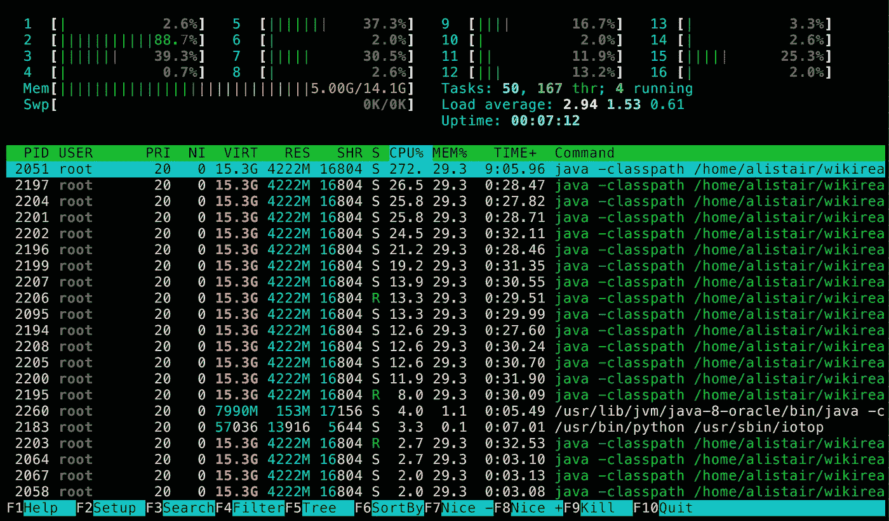
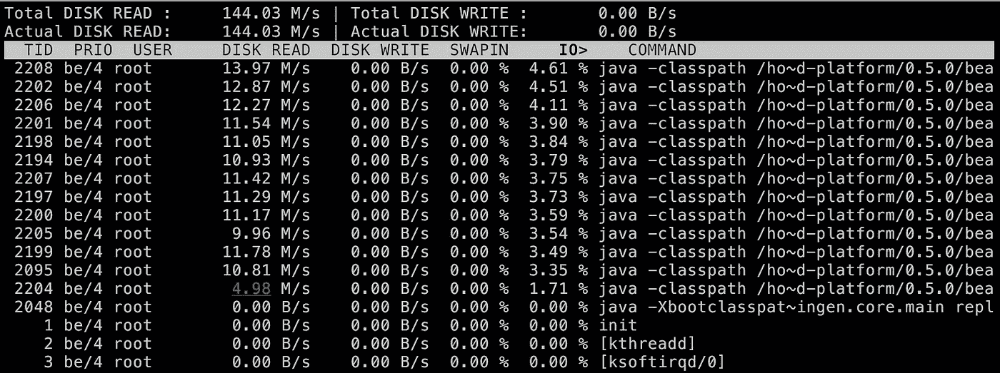
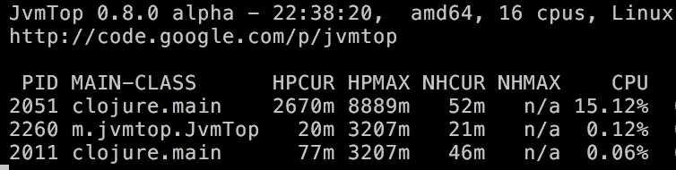
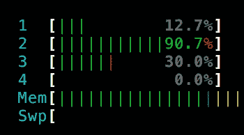
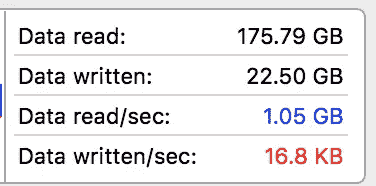
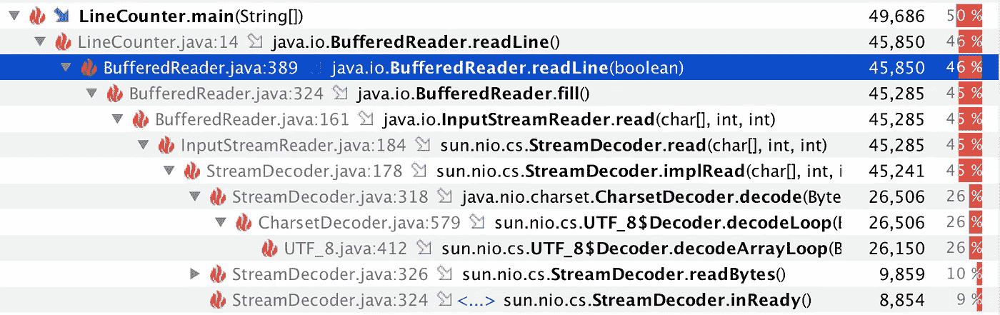
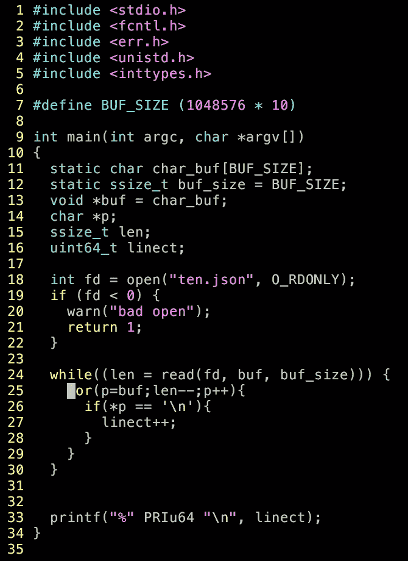

# Clojure 中的文件处理很容易受到 CPU 的限制

> 原文：<https://medium.com/hackernoon/file-processing-in-clojure-can-easily-become-cpu-bound-3c1c38669daf>

[最近](/@atroche/an-initial-exploration-of-wikireading-googles-huge-new-nlp-dataset-c17d859db9d0)我一直在[玩](/@atroche/using-dataflow-in-clojure-to-process-googles-huge-new-wikireading-dataset-832af367539c)一个名为[维基阅读](https://github.com/dmorr-google/wiki-reading)的大型数据集，谷歌的研究人员在一对[新](https://arxiv.org/abs/1608.03542)[NLP 论文](https://arxiv.org/abs/1611.01839)中使用了这个数据集。它由映射到 Wikidata 语句的 Wikipedia 文章的文本组成(例如，澳大利亚→(最深点，[爱湖](https://www.wikidata.org/wiki/Q179970)))，加起来有 208GB 的 JSON。

我最初的目标是通过脸书的 [fastText](https://github.com/facebookresearch/fastText) 运行它，并将文本分类性能与谷歌的深度学习方法进行比较。所以我将 JSON 转换成 fastText 可以使用的格式，当我等待它运行时(它毕竟是快速文本，而不是即时文本)，我发现论文中使用的数据和公开数据之间似乎存在严重差异(以及令人担忧的数据质量问题),这使得很难进行有意义的比较。

**然而**！当我用不同的方法处理这些大型 JSON 文件时，我无意中发现了一些我觉得很神秘的东西，今天我将尝试解开这个谜，并在这个过程中学习一些东西。

我运行了一些 [Clojure](https://hackernoon.com/tagged/clojure) 代码来读入 JSON 行，解析它们，进行一些计算，并给出结果图。我使用的计算机(Google 计算引擎实例)可以:

*   以大约 240 MB/秒的速度从磁盘读取
*   从 RAM 中解析 1.2GB 的 JSON(并用它做一些有用的事情)只需要 3.7 秒，大约 324MB/s

然而，当我试图在程序中读取磁盘并解析 JSON 时，我最多只能在 21 分钟内完成 208GB，或者说大约 166MB/s。

我在 htop 运行时观察了一下，发现内核并没有达到最大限度:

Please ignore the fact that I’m running Clojure as root. I have reasons!

但是 iotop 显示磁盘吞吐量也不是:

另一个问题是:它似乎在 240 开始处理，然后在大约 10 秒的时间内，它下降到 140。

为了彻底起见，下面是 JvmTop 显示的内存使用情况，看起来不错:

16 个核心中有一个快疯了:

瓶颈在那里吗？它到底在做什么？

为了回答这个问题，我想暂时离开混乱的现实世界，在我的笔记本电脑上建立一个小工作台，在那里我可以了解磁盘和并行性。

**首先，我的固态硬盘有多快？**

我有一个 10GB 的 JSON 文件，当我运行

> time cat ten.json > /dev/null

我发现需要 6.3 秒，那我们就以 1750MB/s 读取为上限吧。

**我能多快计算出文件中的行数？**

内置的 *wc* 命令耗时~11 秒，所以平均约 900MB/s。这是我运行 wc 时活动监视器的截图:

有趣的是，wc [看起来像是 CPU 绑定的](http://unix.stackexchange.com/questions/96563/why-is-wc-so-slow)，这是我在尝试之前没有预料到的。阅读了它的工作原理后，我看到了 Brendan Gregg 的一篇有趣的博客文章，他展示了他如何使用 dtrace 将 grep + wc 的速度提高了 2000 倍。

反正如果 wc 能做到 900MB/s，Clojure 怎么样？

`(**time** (**count** (**line-seq** (clojure.java.**io/reader** ten-gb-json-file))))`

在我的 2015 年中期 MBP 上，这需要 30 秒，并在其中一个内核上显示 100%。我们看到的是大约 166MB/s，这不是我们想要的。

出于好奇，我尝试在没有缓冲区的情况下逐字节读取文件:

大约 2.5MB/s。缓冲区很重要！上面的代码导致了太多昂贵的系统调用。

我还尝试删除代码的 line-seq 部分，它构造了一个惰性序列，只是为了看看它会有什么影响:

它几乎将行计数的速度提高了一倍！但是 300MB/s 仍然不够好，而且从这个紧密的循环中已经没有多少可以优化的了(我也用类型提示试过了；几乎没什么区别)。为了检查一下 Clojure 是否有问题，我写了一个 Java 程序(这是我的第一次！)本质上做同样的事情:

花的时间差不多。

此时，我跳到了 [BufferedReader](http://docs.oracle.com/javase/7/docs/api/java/io/BufferedReader.html?is-external=true) 后面的源代码中。比我想象的要复杂！600 行密密麻麻的 Java。这让我们想在最基本的 IO 原语之上编写一个纯 Clojure 编写的缓冲系统，只是想知道如何去做。但是改天吧！

所以，我很好奇 readLine 到底在做什么，速度这么慢。在上面的程序运行时，我将 YourKit profiler 附加到上面的程序中，看到了以下内容:

。readLine()在字节进来时对其进行解码，显然这是一件相当昂贵的事情。我可以想象一个系统，它拥有 BufferedReader 所有合理的缓冲属性，但不进行 UTF-8 解码，只是将字节交给其他内核处理，这将使它能够从磁盘中获取更多数据。但是好像不存在？我想我得自己写了！(如果不是这样，请告诉我！)

有什么方法可以解决这个问题？

在阅读了 Clojure Cookbook 中“用 Reducers 并行化文件处理”这个充满希望的名字之后，我尝试将 [iota](https://github.com/thebusby/iota) 与 core.reducers 结合使用，然后与 [tesser](https://github.com/aphyr/tesser) 结合使用。这根本没有带来多大的改善。我希望我知道更多关于内存映射文件的信息，这样我就可以指出原因，但是那将不得不等待下一次。

然后，我尝试分割文件(使用分割命令行工具),这样我可以用 pmap 并行处理它们:

9 秒！超过 1GB/s，比字数还快。这都是因为它能够在不同的线程上运行令人惊讶的 CPU 密集型读取行。

所以！我今天了解到，有了足够快的 SSD，对文件进行最基本的处理实际上是 CPU 受限的。

我很好奇是否有办法用更好地利用多核的东西来取代 BufferedReader + readLines。

另一个有趣的项目是用 Rust 或 C 编写一个行计数程序，看看我可以在一个内核上获得什么样的吞吐量。

*【编辑:控制不住自己】*

> [黑客中午](http://bit.ly/Hackernoon)是黑客如何开始他们的下午。我们是阿妹家庭的一员。我们现在[接受投稿](http://bit.ly/hackernoonsubmission)并乐意[讨论广告&赞助](mailto:partners@amipublications.com)机会。
> 
> 如果你喜欢这个故事，我们推荐你阅读我们的[最新科技故事](http://bit.ly/hackernoonlatestt)和[趋势科技故事](https://hackernoon.com/trending)。直到下一次，不要把世界的现实想当然！

