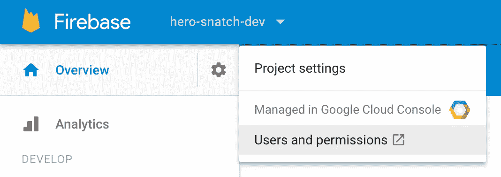
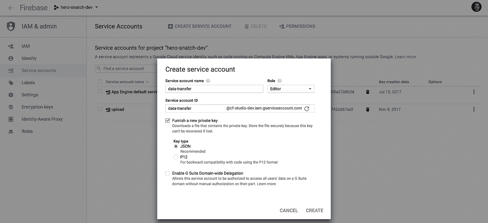
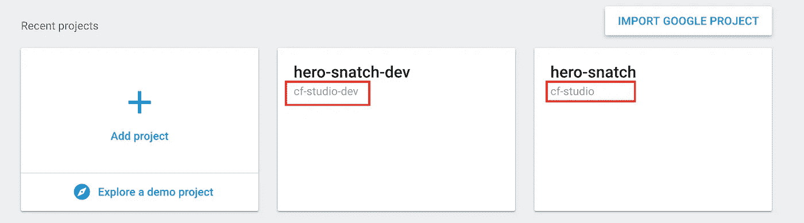

# 如何将数据导入云 Firestore？

> 原文：<https://medium.com/hackernoon/filling-cloud-firestore-with-data-3f67d26bd66e>


不久前 Firebase 团队宣布了新的**文档数据库**叫做 **Firestore。**一个新的数据库有许多改进和新的能力。即使是现在的测试版，它也有和老兄弟一样的限制(100 000 个并发连接)。从明显的优势来看:

*   可量测性
*   多区域支持
*   **面向文档的数据结构！**
*   易于查询
*   离线支持(即使是 web)

所以，如果你准备好投入到[无服务器](https://hackernoon.com/tagged/serverless) [技术](https://hackernoon.com/tagged/technologies)的未来，这份教程就是为你准备的！

> 在本教程中，我将把 **Firebase 实时数据库**称为 **RTDB** 。

# 如何导入数据？

您可能会问自己的第一个问题是如何将数据推送到新数据库。旧的 **RTDB** 很棒，它具有作为单一 JSON 文件的导出/导入数据库的特性。

对于新的**云 Firestore，**我们需要自己实现一个机制。让我们假设您正试图从 **RTDB** 迁移到 **Firestore** ，因此您需要导出您当前的数据库快照。如果没有 RDBM 实例，可以使用任何 JSON 数据来测试这种方法。

# 加载数据的脚本

为什么[**Firebase admin SDK**](https://firebase.google.com/docs/reference/admin/node/)而不是 **Firebase SDK？**

> 目前，使用 **firebase SDK** (在 4.6.1 中测试)将嵌套数组推送到 Firebase 仍然存在问题。如果你试图使用 Firebase SDK 设置嵌套数组，你会得到如下结果:
> 
> `*Function DocumentReference.set() called with invalid data. Nested arrays are not supported.*`

## 证明

要授权我们的应用程序，我们需要导出**服务密钥。**



Firebase Console

在 **Firebase 控制台**中，点击*概述*部分旁边的设置轮，选择*用户和权限*选项。



你将登陆*权限页面*。选择*服务帐户*选项卡，并填写数据，如上面的屏幕截图所示。填写复选框*提供一个新的私钥，*这样您就可以**下载**您的密钥并在脚本中使用它。创建后，会询问您保存密钥的位置。我们将其保存为`service-key.json`

```
const admin = require('./node_modules/firebase-admin');
const serviceAccount = require("./service-key.json");admin.initializeApp({
  credential: admin.credential.cert(serviceAccount),  
  databaseURL: "https://YOUR_DB.firebaseio.com"
});
```

`credentials` —该属性将由刚刚创建的**服务账户密钥**填充

【firebaseio.com】—是您的数据库实例的名称+T2



**https://cf-studio-dev.firebaseio.com** and [**https://cf-studio.firebaseio.com**](https://cf-studio-dev.firebaseio.com)

## 脚本的其余部分

只要数组也是对象，这个脚本就完全可以使用。

```
$ node json-to-firestore.js
```

请记住，脚本依赖于几个文件:

`firebase-admin` — npm 模块，可以本地安装到脚本的文件夹下

`service-key.json` —我们在**认证**部分生成的文件

`data.json` —实际上是我们想要推送到我们的 **Firestore** 的数据

# 结论

**云火石**看起来很有前景。尽管它还处于测试阶段，但这并不意味着你不应该得到它。众所周知的 Firebase 产品叫做**云函数**(仍在测试阶段)已经被数千个项目使用。

在本文中，我介绍了一种向云商店提交 JSON 数据的简单方法。如果您对使用 **Angular** 框架配置 **Firebase hosting** 感兴趣，请学习[如何使用 Angular、Firebase 和 GitLab CI](https://hackernoon.com/from-zero-to-production-with-angular-firebase-and-gitlab-ci-598181cfc6e5) 从零到生产。