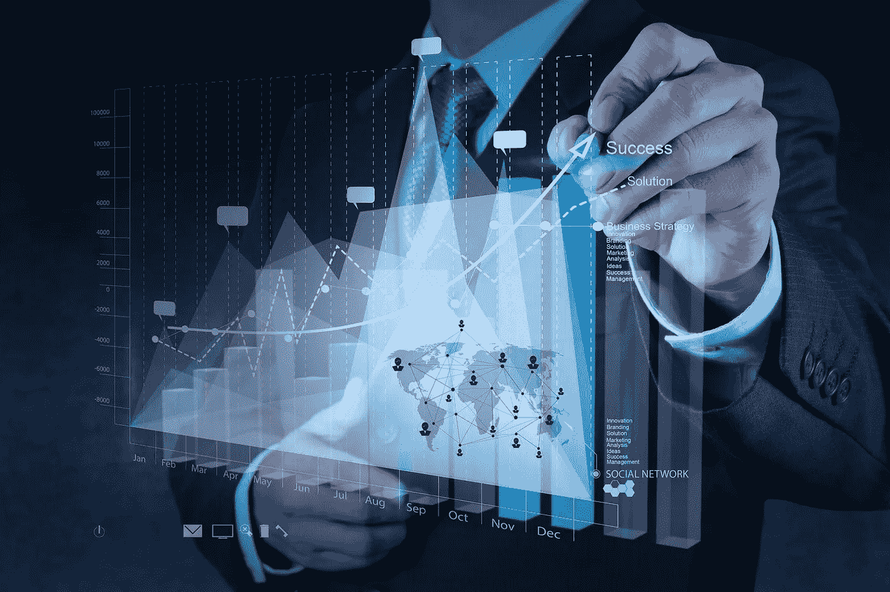

# 2018 年金融科技趋势与预测

> 原文：<https://medium.com/hackernoon/finance-technology-trends-and-predictions-for-2018-950742f523ff>

2018 年，金融科技领域的一些事情将保持不变，但聪明的公司将开始吸收一个巨大的游戏规则改变者，从而意识到所呈现的机会。

1.  **人工智能**。
    游戏规则的改变者。人工智能的繁荣将呈指数增长，技能差距将变成一场人才战争。媒体关于人工智能威胁就业的警告将会消失，因为人工智能技能成为该行业招聘的最大驱动力。员工的担忧也会消退，因为人们会意识到，人工智能不做人类做的工作；它做人们不能做的工作。模式识别、机器学习(ML)和模糊逻辑等人工智能技术多年来一直是网络安全工具和金融数据解析的基础；他们也促进了 RegTech 革命；但现在三个新的主要领域开放了:(1)从结构化和非结构化数据中导出深度学习，以驱动战略规划；(2)利用大数据工具支持操作风险管理和操作规划；(3)利用人工智能预测金融动荡和评估金融传染的风险。会受到雇主高度追捧的 AI 和 ML 技能包括:自适应软件开发；语音和人脸识别；人工神经网络、模式识别、深度学习和大数据。
2.  **大数据**。
    为了让人工智能/人工智能发挥最大效力，能够不受限制地访问大量个性化数据非常重要。新的人工智能框架将消耗大量这样的数据。信息来源的多样性和质量将严重影响人工智能解决方案的成功率和应用领域。跨域数据交换将成为一种常态，我们将看到专注于聚合和交换用户数据的解决方案的增长。
3.  **数据安全、数据监管和防止数据泄露**。
    企业及其客户越来越认识到用户数据的价值。在希望无限访问数据的人工智能解决方案的利益与希望保持大部分数据隐私的用户的个人和社会利益之间找到正确的平衡，将推动人工智能解决方案进入多层数据系统的空间。在这种系统中，用户数据存储在单独的数据保护层中。即一些相对开放形式的数据；一些信息处于聚集或屏蔽状态；并且，最敏感的数据以高度保护的模式进行存储和分析。监管机构将不得不进一步进入数据保护领域，这将增加大数据/人工智能解决方案必须应对的复杂性。最近的数据泄露清楚地表明，如果企业不认真对待数据保护，将会受到多大的影响。人工智能处理敏感数据将数据保护带到了另一个层面。随着人工智能技术的成熟，并开始从概念和概念验证转向生产解决方案，安全话题将强烈影响这一技术领域的发展速度和总体方向。
4.  **避免下一次撞车。** 随着 Dodd Frank 等人的评论凸显出未能理解和控制系统性风险，它将从一个监管(基于规则)问题转变为一个数据管理和技术问题。期待看到金融科技公司的埃隆·马斯克(Elon Musk)被推出，为可能的艺术提供建议。人工智能将发挥重要作用；大规模改进数据管理也是如此；资产负债表和库存管理。在保护全球经济的战斗中，报告将越来越被视为过时和无效的。
5.  **数字化和用户体验(UX)。只有最高标准的数字化和 UX 才会被客户接受。告诉世界数字化是你的最高优先事项，而只更新基于网络的桌面解决方案将导致信心的丧失和客户的流失，因为人们已经习惯了全渠道、以消费者为中心的解决方案，在他们生活的每个其他领域都有巨大的 UX。如果他们不能像使用优步那样在手机上轻松地做到这一点，同时觉得他们的财务和个人信息是安全的，那么他们不会再和你一起做了。**
6.  **运营风险管理(ORM)。** 随着高管因 ORM 故障而丢掉工作，ORM 的重要性将会升级。技术将在帮助评估整个企业的风险方面发挥重要作用。低效的风险识别参数目前在行业中普遍存在，导致无法实现整体数据视图，从而导致不正确的风险识别。银行、保险和资产管理领域各自为政的组织结构，加上糟糕的数据管理实践，使得跨业务线的跨企业风险衡量难以实现。人工智能(见上文)将使看似不可能的事情成为可能，而无需重组。
7.  **分布式账本技术。**
    随着区块链等分布式账本技术的好处越来越被广泛理解，增长将呈指数级增长(与加密货币及其交易机制的增长无关)。原始区块链的性能不佳仍然是推动分布式账本技术进一步发展的一个问题。2018 年，通过将分布式总账与物联网等其他新技术相结合，可以解决性能问题。保险业将受益于这种创新。区块链也将开始被更广泛地视为网络安全和个人数据保护问题的解决方案。区块链可以通过基于零知识证明、环签名或全新数据组织原则的新机密解决方案来帮助解决这些问题。

*由****Cliff Moyce****撰写，DataArt 金融实践领袖；****Alexander Makeyenkov****，瑞士 DataArt 公司董事，欧洲业务发展负责人；&* ***【巴拉诺夫】*** *，首席顾问。*

*原载于 2017 年 12 月 10 日*[*www.globalbankingandfinance.com*](https://www.globalbankingandfinance.com/dataart-finance-technology-trends-and-predictions-for-2018/)*。*