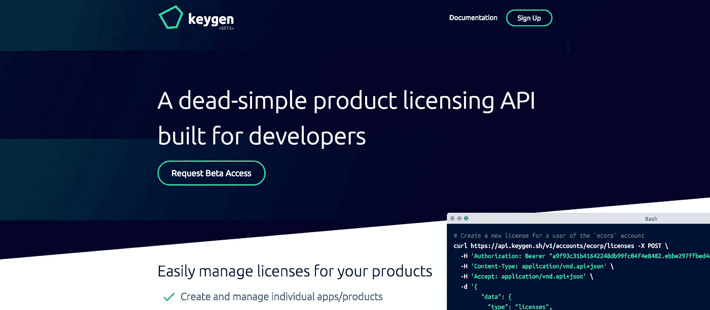

# 为什么软件许可的现状如此糟糕(以及我正在为此做些什么)

> 原文：<https://medium.com/hackernoon/finding-issues-and-guessing-solutions-43e6b7ed823e>

作为一名开发人员，我最喜欢的事情之一就是在我的日常活动中发现问题，并找出创造性的方法来解决它们。即使我从来没有执行一个解决方案，我仍然喜欢思考它。能够做到这一点是我非常热爱我所做的事情的原因之一。

我今天要谈论的问题是我在使用流行的 [Electron](https://electron.atom.io) 框架开发桌面应用时遇到的一个大问题。

这是一个商业应用程序(即我打算把它卖给最终用户)，所以我需要某种服务来轻松管理我的付费(和未付费)用户，并强制他们在应用程序中允许和不允许做什么，即*某种软件许可服务*。更好的是，这种服务是我不必亲自主持的——*也许是 SaaS？*

我已经计划使用 Stripe 来接受支付和处理订阅，所以它需要轻松地与他们的 API 集成，*并且绝对不提供自己处理支付的方式。*

如果它是一个灵活的 JSON API，类似于 Stripe，那就更好了。

于是，我开始寻找合适的服务。

相信我，我找了很久。

但是什么也没有。

嗯，那实际上不公平。有一大堆“企业”服务；数字版权管理(DRM)“解决方案”完全不考虑客户的体验。

一些人推销他们把你的应用作为卖点。

我意识到大多数许可“解决方案”为客户提供了糟糕的用户体验(UX)，因为这似乎是处理事情的“最佳”方式。

(其实不是。)

请输入 90 个字符的许可证密钥。

好的。

您不应该要求您的客户输入*并跟踪*一个冗长的许可证密钥，这意味着机器消费。

如果机上的用户只需要使用普通的电子邮件和密码登录，那就方便多了。但是没有人提供那种服务。

然后你会遇到这样的事情:

“您的试用期已经到期，因此我们已经锁定了您迫切需要的软件，以便完成您正在进行的项目。请付 400 美元。(去和我们的销售团队谈谈，然后带着您的许可证密钥回来。)"

“我注意到你买了一台新电脑。恭喜你！我们已锁定该软件，希望您联系我们的支持团队。我们只想确定你没有偷我们的东西。我们*知道*您自己管理您的计算机激活会很方便，但这是不可行的。”

去他妈的。

许可不应敌视您的客户。

它不应该默认假设每个人都是罪犯。

*而且它绝对不应该使购买额外的许可证变得困难。*

如果你的客户没有许可证，很简单:*给他们一个*。如果他们在一台新机器上使用你的软件，提示他们购买额外机器的许可，或者用新机器去激活旧机器。

省去你的支持负担，让*管理他们自己的许可证。*

不要搞砸了，因为这样“更容易”

我在搜索时的原则是，如果导航菜单包含“解决方案”这样的词，我会跳出来。毕竟我是在 Node.js 和[electronic](http://electron.atom.io)上搭建一个简单的 app。我不需要(也不想)将它与一个单独的安装程序或 DRM 服务捆绑在一起，如果使用不当，它们会阻塞我的应用程序。

它需要跨平台，但没有一个是跨平台的。要么他们支持 Windows，要么他们支持 macOS。Linux？不会吧。

所有这些许可“解决方案”对于开发小型产品的人来说都是非常可怕的。我只是想要简单的东西*——条纹简单的*。

因此，经过几周的搜索和实际试用我找到的一些企业产品后，我只是说“去它的！”并在 Rails 中整合了一个许可 JSON API。这没什么稀奇的；1 个数据库表，几个 API 端点，仅此而已。我把它推给了 Heroku，一周后，我就完成了。

最后，*我可以继续构建我的应用程序了*。

我做到了，一切都很好。

但我最初面临的许可问题仍然在我的脑海中挥之不去。

“我不可能是唯一一个在这个问题上受挫的人，对吧？”当我完成并发布我的应用程序时，我会对自己说。

在越来越多的问题出现后，我无法忍受不去尝试解决它。

如果 Stripe 对在线支付的现状感到失望，它可以通过瞄准开发者来扰乱市场，那么软件授权不也可以这样做吗？

“也许吧”，我想。

所以我造了一个*差点* -MVP。当我说“*差点* -MVP”时，我的意思是*根本不是 MVP* 。我不止一次完全废弃了我所拥有的。我建立了 MVP，然后重建了 MVP，然后又重建了 MVP。

像大多数副业一样，它一直在增长。

我以为我永远也完成不了。几个月(实际情况是:八个月)之后，我已经将最初设想的特性集增加了两倍。

但是我真的很喜欢我所拥有的。

所以我退了一步。

“验证你的想法——[你的猜测](/@cliffordoravec/the-epic-guide-to-bootstrapping-a-saas-startup-from-scratch-by-yourself-part-1-4d834e1df8c1)”是我从[初创公司](https://hackernoon.com/tagged/startup) [书籍](https://hackernoon.com/tagged/books)、播客和博客帖子中反复读到(和听到)的话。我知道在我花更多时间在这个项目上之前，我应该*验证*它。

所以我为一个软件许可服务建立了一个“早期访问”网站，这个网站还没有接近完成。这是一个带有邮件列表注册表单的页面。我戴上设计师的帽子，创立了一个品牌，我认为这个品牌可能会帮助我获得一些吸引力。然后我把它贴在黑客新闻上，坐在沙发上，实际上把它忘了。

睡觉前，我想我应该检查一下，看看邮报怎么样了。

它。吹了。向上。

说了这么多，做了这么多，我在头版呆了 2 天，收到了数百个注册，很多愤怒的评论，也有一些不错的评论。

(我承认，我太紧张了，以至于没有很好地应对批评。我的一些答案是不正确的，其他的我误读了问题。)

起初，我认为我展示产品的方式可能过于模糊，导致人们蜂拥而至，因为他们认为这是一个不同问题的解决方案——但不，在与一些注册者交谈后，*他们都与我一样对完全相同的问题感到沮丧*。

我的下一步？

完成它！

The fancy-pants landing page.

将近 6 个月后(包括 3 个月的测试版)，我发布了 [Keygen](https://keygen.sh) :一个为*开发者*构建的非常简单的软件许可 API。这是我在软件许可 API 中需要的所有东西，甚至更多。

你不需要安装任何花哨的软件。

没有什么会阻碍你的应用。(除非你自己做？)

没有“企业”的语言。

纯 HTTP 善良就好。

Keygen 允许你以自己的方式许可你的软件，但是鼓励为你的客户提供一个好的 UX。它通过鼓励您:

1.  比起输入原始的许可证密钥，更喜欢用户帐户(尽管，如果你愿意，你仍然可以这样做，以牺牲客户的理智为代价)。
2.  将许可证密钥更像加密安全的特征访问令牌，而不是插入算法的东西。
3.  包括让您的客户通过应用内购买和自助机器激活来享受您的软件的方式，而不是死锁。
4.  把你的顾客当成像和*一样想要使用*你创造的产品的人，而不是罪犯。
5.  快速迭代，不要浪费时间在内部创建许可解决方案，因为这是经常发生的事情。

我很乐意听到你对 Keygen T1 的想法和反馈，这篇文章，我的其他项目，以及任何你想谈论的东西！最后，如果你觉得这篇文章有趣，请分享给其他人看。

> [黑客中午](http://bit.ly/Hackernoon)是黑客如何开始他们的下午。我们是 [@AMI](http://bit.ly/atAMIatAMI) 家庭的一员。我们现在[接受投稿](http://bit.ly/hackernoonsubmission)并乐意[讨论广告&赞助](mailto:partners@amipublications.com)机会。
> 
> 如果你喜欢这个故事，我们推荐你阅读我们的[最新科技故事](http://bit.ly/hackernoonlatestt)和[趋势科技故事](https://hackernoon.com/trending)。直到下一次，不要把世界的现实想当然！

