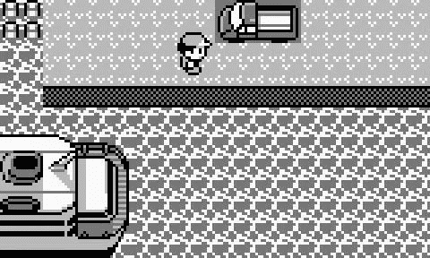
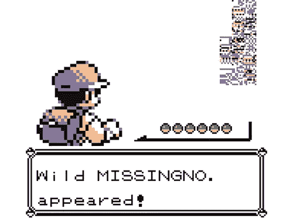
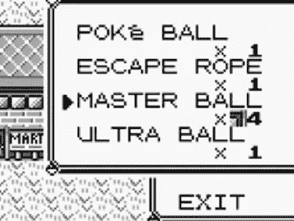
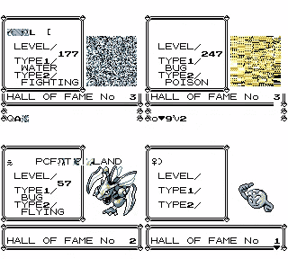
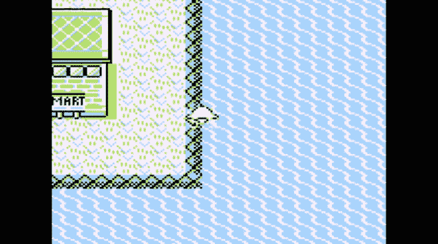

# 查找缺失编号

> 原文：<https://medium.com/hackernoon/finding-missingno-4df003345ccd>

## 世界上最大的故障如何成为一种文化现象

Image by [Destro-the-Dragon](https://des-the-dragon.deviantart.com/art/MissingNo-448248902). This Paid Story is brought to you by [Codacy](https://goo.gl/SvwMy7)

> 这个付费的故事是由 [Codacy](https://goo.gl/SvwMy7) 带给你的。

成长在 90 年代是非常棒的。那是溜溜球、电子鸡、超级酒鬼和无数其他炒作的时代。这些往往会在几个月内席卷全球，但很快就会消失。

但其中一部最终成为有史以来票房最高的媒体特许经营，在过去二十年里赚了超过 550 亿美元。

1996 年在日本发行的《神奇宝贝:红色和绿色》红极一时。没过多久，这款游戏就进入了美国和欧洲，最终以《神奇宝贝红与蓝》的形式发行。

游戏的前提很简单——你要去寻找尽可能多的神奇宝贝，同时击败健身房的领导，并在神奇宝贝联盟中逐步上升。然而，游戏的执行是完美的——一流的开放世界游戏，151 种不同的生物可以收集，以及无尽的可玩性使它成为十年来最好的游戏之一。由于最近的重新发布，即使在今天也值得再去一次。

## 有传闻说

随着世界上越来越多的孩子开始玩这个游戏，奇怪的故事开始出现。我还记得一个朋友告诉我，最难以捉摸的神奇宝贝 Mew 藏在游戏中一个荒凉区域的卡车下面。当你到达那里时，你需要使用力量技能将卡车推开，并展示一个里面有 Mew 的扑克球。然而，事实上，移动卡车是不可能的——但这并没有阻止任何人相信这个故事。由于没有现成的互联网来核实谣言，没过多久，世界上的每个玩家都在谈论神秘的卡车。

虽然当时流传着更多这样的故事，但大多数都是完全虚构的，只不过是一些游戏民间传说。除了一个。

## 失踪的传说

在第一个游戏中抓住 Mew 并不是*不可能*，但是它需要你去一个任天堂的官方活动并且把它加载到你的游戏卡上。注册编号为 151，这是完成精灵宝可梦所需的最后一个生物。但是根据另一个传闻，还有一个人要抓…一个没有数字的神奇宝贝*。*

被称为神秘幽灵的 MissingNo 不是传统意义上的神奇宝贝。它看起来肯定不像——混乱的像素与任何其他生物都没有相似之处。但是你能够和其他人一样战斗或者抓住它——至少如果你能找到它的话。遇到一个 MissingNo 需要发生一组非常特殊的事件，这反过来又会产生一个小故障。

当玩家接触到 MissingNo，事情就开始变得诡异了。由于其故障性质，玩家包中的第六个项目被复制了 128 次，用一个奇怪的图标取代了它的计数器。视觉伪影在屏幕上闪烁，名人堂菜单变得永久失灵，变得不可用。如果你特别不走运，当前保存的文件会被破坏，变得无法播放。

一种只在特定情况下出现的隐藏生物，具有非常非传统的外观和意想不到的故障行为——这一切构成了一个迷人而又绝对令人毛骨悚然的故事，激发了全球玩家的想象力。对于许多年轻玩家来说，没有什么比一个怪物破坏游戏本身更可怕的了。

那么为什么游戏中会出现 MissingNo 呢？为了理解它，人们想出了最疯狂的故事。一些人认为这是朱砂岛上的神奇宝贝实验室失败的科学实验的结果，就在它被发现的地方旁边。其他人认为错过 No 是因为神奇宝贝被困在它的神奇宝贝球里太久了。

由于对怪物的起源感到困惑，玩家们经常会拨打游戏怪胎热线，这是一个由游戏创作者设立的客户支持电话号码。因为它被试图解决同样问题的人淹没了，你听到的第一件事是一条自动信息:

> 没有遗漏。

当然，这只是增加了神话。游戏狂在隐藏什么？

## 怪物背后的故障

好吧，那么你到底需要做什么来召唤失踪的诺？有几种方法可以做到这一点，但最简单的是触发[老人故障](https://bulbapedia.bulbagarden.net/wiki/Old_man_glitch)，这涉及到与维里迪安市的一个角色交谈，向你展示如何抓住神奇宝贝的视频。之后，你应该飞往朱砂岛——在那里，你需要在不下水的情况下沿着海岸线冲浪:

过一会儿，你会遇到许多形式之一的 MissingNo 为了遇到“经典”的 L 形，你的角色的名字需要在特定的位置有特定的字母:G，H，J，M，S，T，:]，a，b，c，M，o，p 或 v 需要在名字的第三，第五或第七个位置。这些程序的详细版本可以在[这里](https://glitchcity.info/wiki/Old_man_trick)找到。

我知道你在想什么——为什么看似随机的一系列动作会引发故障？事实证明，三个不相关的事件以惊人的方式结合在一起。

一、游戏的随机战斗遭遇战系统。它在一个数据缓冲区中给神奇宝贝赋值，当玩家遇到一个野生的神奇宝贝时就会读取这个数据缓冲区。由于某种原因，朱砂岛东海岸没有任何赋值。其次，还有神奇宝贝捕捉视频，它将玩家的名字临时保存到同一个数据缓冲区。当沿着岛屿的海岸冲浪时，当玩家遇到一个神奇宝贝时，游戏现在会检索这个名称的十六进制值。第三，游戏的错误处理系统一团糟。当它试图选择一个不是现有神奇宝贝的值时，在这种情况下是名称，就会触发一个子程序，使 MissingNo 出现。

这种块状生物的功能与任何其他神奇宝贝一样，但有一个很大的不同——它在玩家的神奇宝贝索引中占据了数字 000，因此它的名字是 [MissingNo](https://bulbapedia.bulbagarden.net/wiki/MissingNo.) ，是“缺失数字”的缩写。有时，另一个名为[M](https://bulbapedia.bulbagarden.net/wiki/%27M_(00))的小故障神奇宝贝也会出现，它的特征略有不同。

由于方便的物品复制和其纯粹的新颖性，游戏杂志开始出版关于如何抓住受欢迎的怪物的演练。这个小故障最终变得如此受欢迎，以至于它被从《神奇宝贝黄》中移除，这是《红与蓝》的后续版本，在玩家旅行期间，皮卡丘是其伙伴。思念不再。

## 永远没有思念

尽管它再也没有回归过，但《失踪的诺》已经在一代游戏玩家身上留下了印记。这个社区已经以各种方式在神奇宝贝经典中确立了自己的地位，包括大量的[令人毛骨悚然的同人小说](http://someordinarygamers.wikia.com/wiki/Missingno_Murder)，以及人们打扮成动漫和游戏大会的小姐:

尽管在随后的任何神奇宝贝游戏中都没有出现 [MissingNo](https://hackernoon.com/tagged/missingno) ,但这并没有阻止铁杆粉丝加入进来。它最近一次出现在 2014 年发布的《欧米茄红宝石》和《阿尔法蓝宝石》中，距离最初的游戏已经过去了整整 18 年。

《失踪的诺》可能是神奇宝贝社区的一件大事，但它的巨大人气也没有被世界其他地方忽视。在 2007 年一项关于软件错误的社会学研究中，它对玩家的影响得到了彻底的分析，得出了以下结论:

> [……]在一个重视个人主义和创造力的社会中，元游戏可能被认为是一种更高级的活动，尽管它们经常涉及违反规则或利用游戏制造缺陷。

是的——试图寻找遗漏是一种表达，表明玩家迫切希望发挥自己的创造力，在游戏中做更多的事情。这无疑解释了这种生物的大量追随者。

然而，任天堂的官方声明却有点平淡无奇；

> 错过是一种编程怪癖，并不是游戏的一部分。当你得到这个的时候，你的游戏会表现得很奇怪，而且图形经常会变得混乱。失踪的神奇宝贝通常是在你表演了战斗野生动物园的神奇宝贝魔术后发现的。
> 
> 要修复混乱的图形，请尝试释放丢失的神奇宝贝。如果问题仍然存在，唯一的解决办法是重新开始你的游戏。这意味着清除你当前的游戏，开始一个全新的游戏。

你没看错——失踪可能根本就不存在。但是这能消除世界上最著名的故障的神秘感吗？不可能——它只是重申了它作为有史以来最受欢迎的视频游戏故障的地位。

> 喜欢这篇文章吗？更多关于编程和数字文化交汇点的精彩故事，请查看 [Codacy 博客](https://www.codacy.com/blog)。
> 
> 这个付费的故事是由 [Codacy](https://goo.gl/SvwMy7) 带给你的