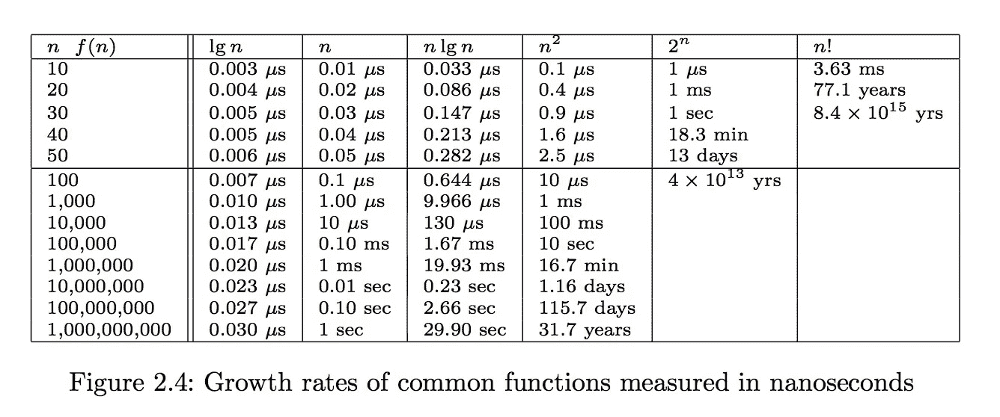

# 在 Javascript 中查找非唯一元素

> 原文：<https://medium.com/hackernoon/finding-non-unique-elements-in-javascript-d934e6fd6260>

令人惊讶的是，算法无处不在，而我们现代开发人员却常常不关心它们。我认为并且确信这些知识只适用于语言和框架核心开发团队。

—如果 Array.sort()完成了它的工作并且足够快，谁会关心它是如何工作的呢？

因此，我抱着这种心态参加了去年的 Facebook Hacker Cup，希望赢得一件 t 恤，但在第一轮比赛中失败了，感到失望，开始思考如何才能改进，并开始慢慢潜入算法世界。

长话短说，让我们考虑一个简单的例子:

我们有一个整数数组，任务是找出其中所有非唯一的元素。

# 天真的解决方案

想一想你会怎么做，让我展示我的第一个可行的解决方案:

```
var length = data.length;
var unique = [];
var distinct = [];for (var i = 0; i < length; i++) {
    var elem = data[i];
    var uniqueInd = unique.indexOf(elem); if (uniqueInd > -1) {
        unique.splice(uniqueInd, 1);
    } if (distinct.indexOf(elem) === -1) {
        distinct.push(elem);
        unique.push(elem);
    }
}for (var i = length - 1; i > -1; i--) {
    if (unique.indexOf(data[i]) > -1) {
        data.splice(i, 1);
    }
}return data;
```

我写这段代码的时候，我不知道任何像`map`或`reduce`这样的函数式 Javascript 方法，所以它看起来很长。但这很有效，让我非常自豪。我花了不到一天的时间。

我把它贴到[https://js.checkio.org/mission/non-unique-elements/](https://js.checkio.org/mission/non-unique-elements/)去和其他解决方案比较。

# 不错的解决方案

一旦你提交了自己的代码，你就可以看看其他人是如何完成的。

这位美女名列榜首:

```
return data.filter(function(a){
    return data.indexOf(a) !== data.lastIndexOf(a)
});
```

它简短易读。背后的想法很聪明——如果一个元素的第一次和最后一次出现相同，那么这个元素只出现一次，所以它是唯一的。

看看这个，和我的相比。你看到这个悬崖了吗？

我印象非常深刻，于是我开始做其他竞争性的编程测验，这一度让我想到了大 O 符号。

# 快速解决方案

要快速理解为什么大 O 有意义，请看史蒂文·斯基纳书中的图表:



想象我们的算法有 n 的平方复杂度。这意味着处理一百万个数字的数组大约需要 16.7 分钟。那不是太多了吗？我想说，这是考虑到在 Facebook 黑客杯上，一旦你获得输入数据，你只有 5 分钟的时间来上传结果。

当我们从算法复杂性的角度来看时，我们的好解决方案还那么好吗？与我的第一个解决方案相同，可惜不是。让我们来看看为什么:

`indexOf`和`lastIndexOf`在最坏的情况下进行 n 次运算(假设我们有一个所有唯一数字的数组)，因为它们基本上遍历了整个数据。我们在一个`filter`方法中执行它们，这个方法是一个 n 的循环，这意味着我们做了 n 次操作，也就是 O(n * n)。哎呀。这慢得令人无法接受。

解决这个问题的一个方法是使用排序。算法科学的基础告诉我们，我们可以以 O(n * log(n))复杂度进行排序，也就是说，如果你检查上面的表比 O(n * n)快得多，并且即使对于 10 亿条记录也需要合理的时间。

一旦我们对列表进行了排序，我们可以使用另一个基本的算法技巧，用二分搜索法覆盖`indexOf`和`lastIndexOf`方法。二分搜索法背后的想法是，在每一步中，我们将可搜索的数组分成两部分，并且只在其中的一部分中继续搜索。我们简单地检查数组中间的数字是大于还是小于我们搜索的数字，然后选择数据的左边部分或右边部分，知道它是排序的。直到我们得到一个只有一个元素的数组，这个元素要么是我们正在寻找的元素，要么不是，这意味着我们的元素根本不在数组中。因此，为了完成这一步，我们需要 x 个步骤，其中 2 的 x 次方是 n(因为在每次迭代中，我们将数据量除以 2)，这给了我们 O(log(n))的复杂度来找到`indexOf`和`lastIndexOf`。因为 O(log(n)) + O(log(n)) = O(log(n))，所以对于`indexOf`和`lastIndexOf`方法调用，我们总共得到 O(log(n))复杂度。

最后，我们有一个 n 的循环(因为我们用`filter`遍历整个数组)，每次迭代的复杂度为 O(log(n))，这样我们的总复杂度为 O(n * log(n))。

这和排序的复杂度是一样的，所以最后，整个算法的复杂度是 O(n * log(n))+O(n * log(n))= O(n * log(n))。酷！快多了。

现在，我们甚至可以在不到一分钟的时间内处理 10 亿条记录。

这就是我们如何在一个排序的数组上做复杂度为 O(n * log(n))的`indexOf`:

```
function newIndexOf(array, elem, startIndex, endIndex) {
    if (array.length === 1) {
        if (array[1] === elem) {
            return startIndex;
        } else {
            return -1;
        }
    }

    var median = Math.floor(array.length / 2);

    if (elem <= array[median]) {
        return newIndexOf(array, elem, startIndex, median);
    } else {
        return newIndexOf(array, elem, median + 1, endIndex);
    }
}
```

`lastIndexOf`实施将是相同的，但我们将使用<条件代替≤条件。

# 更快的解决方案

但是谈论一个高负载甚至~30 秒的 web 服务器似乎太多了。我们能做得更好吗？

每次想到高级阵列实用程序，我都会想到`lodash.js`库。这就是他们如何[提议](https://github.com/lodash/lodash/issues/918)这样做的:

```
_.transform(_.countBy(array), function(result, count, value) {
    if (count > 1) result.push(value);
}, []);
```

首先，我们使用`countBy`方法计算每个元素的出现次数。它给了我们一个 JS 对象，该对象将元素作为键，将它们的出现作为值。`countBy`方法在内部使用 JS `reduce`方法，时间复杂度为 O(n ),因为它基本上是遍历整个数组一次。

然后使用`transform`，我们遍历对象中的所有键，并获取那些值(出现次数)大于 1 的键，这又给了我们时间复杂度 O(n ),因为我们在该对象中不能有超过 n 个键。

因为 O(n) + O(n) = O(n)，所以最终结果是 O(n)复杂度。如果您查看上面的表格，您会发现我们现在处理 10 亿条记录的速度提高了 30 倍。哇！


# 结论

不知何故，我的简短分析证实了像`lodash.js`这样的框架和实用程序库通常会处理算法的时间复杂度，从这个意义上说，我们可以信任它们。

与此同时，我们很容易陷入漂亮聪明的代码的陷阱，最终会大大降低我们应用程序的性能。

因此，即使我们自己可能不会创建复杂的算法，知道如何计算给定算法的复杂性也是很好的，因为这样我们就可以确信，当我们决定将应用程序扩展到更大规模时，我们不会感到意外。

如果你真的感兴趣，我强烈推荐史蒂文·斯基纳[的课程](https://www.youtube.com/playlist?list=PLOtl7M3yp-DV69F32zdK7YJcNXpTunF2b)和学习书籍，以及【https://js.checkio.org/】的和[的【https://www.codewars.com/】的](https://www.codewars.com/)平台来获得一些实践。也许会在下一次编程比赛中见到你。；)