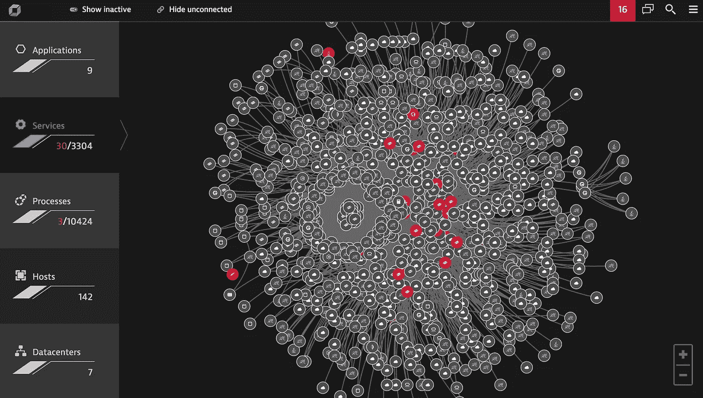

# 大海捞针

> 原文：<https://medium.com/hackernoon/finding-the-needle-in-a-haystack-bc3b14b4cb9d>

## **查明动态环境中应用程序性能问题的根本原因**

在动态环境中查明应用程序性能问题的根本原因通常就像一场复杂的捉迷藏游戏。一个熟悉的比喻是，这就像试图在干草堆中找到一根针。这种描述说明了挑战，但对提供解决方案没有特别的帮助。因此，如果应用程序问题的根本原因是“针”，而应用程序环境是“干草堆”，那么我们应该如何恢复最佳性能呢？

从字面上看，这种类比实际上是一种很好的方法，可以探索在动态、弹性和瞬态基础设施环境中解决应用程序性能问题的各种方法。

**那么，你会怎样去大海捞针呢？**

**1。** **消灭草堆**

找到针的最快方法可能是烧干草堆。或者把干草倒在一池水里，然后等着针沉到底也是可行的。如果我们真的在谈论针和干草堆，好吧——但我们不是。越来越多的公司开始转向基于云的动态部署，这是有根本的业务原因的。我们几乎可以拒绝回到单一的静态基础设施的选择，在这种基础设施中，确定应用程序性能的因果关系更加直接。

**2。** **手动翻找针**

我们可以一根一根地在那堆干草中筛选，直到找到针。这基本上就是传统的[应用性能监控](https://www.dynatrace.com/solutions/application-monitoring/) (APM)工具的工作方式。他们扔给我们一大堆数据(尽管通常是格式良好的图表),并要求我们梳理所有数据，找出问题所在。实际上找到针仍然是一个费力的手工过程。某个地方的某个人必须仔细研究图表，理解数据，并把这些点联系起来以发现根本原因。这种手工分析可能需要几个小时，甚至几天。

当应用程序问题导致客户不满时，这就太长了。当然，如果我们指派更多的工作人员来解决这个问题，事情会进展得更快:越多人筛选干草，我们就能越快找到针。但是召集一个作战室会议来解释数据仍然是一项劳动密集型的、耗时的工作。大多数首席信息官已经对如此多的工时花费在故障排除上而不是创新和优化上感到沮丧。

此外，也许更重要的是，当今的动态环境(数百万个依赖项时刻都在发生变化)太复杂、变化太快，有太多的性能数据点，人类无法及时进行分析。要在如此多的数据中发现因果关系，并确定导致问题的组件，需要比任何企业可支配的人员都多。

**3。** **定位针的大致区域**

使用金属探测器或 X 射线可以缩小大海捞针的大概位置。这比查看整堆文件更有效率，但仍然需要大量的工作。我们仍然需要手动筛选干草——只是没有那么多。类似地，一些现代 APM 解决方案让我们更进了一步。发现代理从应用程序环境中的各种分布式元素收集并关联无数的指标和性能数据点。数据被整合并呈现在一个统一、集成的“单一控制台”视图中。我们现在对性能问题的*症状*有了清晰、全面的了解，但是我们还没有诊断出*根本原因。艰苦的工作仍然留给我们。我们仍然需要仔细研究数据的图表——只是没有那么多。现代 APM 在一个更有意义的框架内显示数据，帮助我们缩小关注范围。*

现在，想象一下当指针不停地移动时有多困难。这正是当今高度动态的环境所发生的情况。服务器总是来来去去，根据需要自动扩展和缩减。容器技术和微服务架构甚至更加短暂——从一台主机移动到另一台主机——并产生更多指标。由于我们的应用程序现在有如此多的活动部件，试图通过剖析过多的图表和图形来跟上它们和它们的拓扑结构已经超出了人类的能力。动态应用程序有数百万的依赖项需要分析，而且它们一直在变化。我们刚一认为我们已经掌握了所有事物是如何协同工作的，情况就发生了变化，我们又回到了起点。当今的应用环境变化太快、太频繁，即使是最有才华的故障排除人员也是如此。

Even a relatively simple containerized environment like this one, with only 142 hosts, has more dependencies than a human being can track without software assistance.

**4。** **自动拔针**

最终，找到针的最好方法(特别是如果它不会静止不动的话)是使用强大的磁铁将它从干草堆中拔出来，并送到你的手中。在我们的类比中，下一代[人工智能驱动的 APM](https://www.dynatrace.com/platform/offerings/ruxit/) 解决方案就是这样一个“磁铁”它自动锁定应用程序问题的根本原因，使耗时的手动分析变得不必要，就像磁铁消除了筛选一堆干草的需要一样。

人工智能(AI)使计算机能够做它们最擅长的事情:吸收大量信息，并以超出人类可能的速度更快、更彻底地理解这些信息。它应用复杂的算法和上下文丰富的诊断来检测和关联数据之间的因果关系，并在数微秒内处理数百万个依赖关系。本质上，人工智能增强的监控与我们人类分析问题的方式相同，只是速度更快。人工智能能够几乎瞬间完成我们人类需要几个小时或几天的分析“重担”。

**从理论到现实:Dynatrace APM**

人工智能被定义为“能够感知其环境，并应用认知功能，如学习和解决问题。” [Dynatrace APM](https://www.dynatrace.com/capabilities/application-performance-management/) 建立在人工智能之上，因此它能够

*   从客户的 web 浏览器一直到主机基础架构，端到端自动发现整个技术体系的所有组件 *—*
*   在交互式视觉显示中描绘出整个 IT [环境](https://hackernoon.com/tagged/environment)
*   确定网站、应用程序、服务、流程、主机、[网络](https://hackernoon.com/tagged/networks)和云基础架构之间的数百万依赖关系
*   了解它们是如何协同工作的，以及什么构成了正常行为
*   自动检测、分析异常和性能问题，并确定其优先级
*   实际上建议解决这些问题的根本原因

人工智能让 Dynatrace 能够以无人能及的速度、规模和精度完成所有这些工作。

Dynatrace“了解”应用程序。其专有的 Smartscape 技术持续自动发现和监控每个应用程序的各个方面。复杂的算法学习正常的应用程序性能模式，并主动标记异常。AI 会实时动态地自动调整基线，以避免预设的静态警报阈值导致的误报。

应用程序性能问题很少是孤立的、一次性的事件，它们通常是更大问题的症状。Dynatrace 查看几乎同时使用相同组件的所有其他事务，看它们是否也遇到了问题。人工智能将整个技术堆栈(客户端、服务器端、基础架构级别)中的事件关联起来，以识别类似的问题并检测因果关系。人工智能诊断分析收集的大量数据，以查明导致问题的确切组件。

在当今日益复杂和多变的 IT 环境中，解释具有数百万依赖性的数据点以确定潜在的因果关系超出了人类自身的能力。只有人工智能可以在问题袭击客户之前，将海量数据转化为可行的解决方案。

亲自看看 Dynatrace 能做什么。Dynatrace 提供了一个[免费试用版](https://www.dynatrace.com/trial/)——一个完整的成熟版本，而不是一个精简的演示版——它可以在几分钟内自动发现并直观地规划出您的整个技术体系。

> [黑客中午](http://bit.ly/Hackernoon)是黑客如何开始他们的下午。我们是 [@AMI](http://bit.ly/atAMIatAMI) 家庭的一员。我们现在[接受投稿](http://bit.ly/hackernoonsubmission)并乐意[讨论广告&赞助](mailto:partners@amipublications.com)机会。
> 
> 如果你喜欢这个故事，我们推荐你阅读我们的[最新科技故事](http://bit.ly/hackernoonlatestt)和[趋势科技故事](https://hackernoon.com/trending)。直到下一次，不要把世界的现实想当然！

