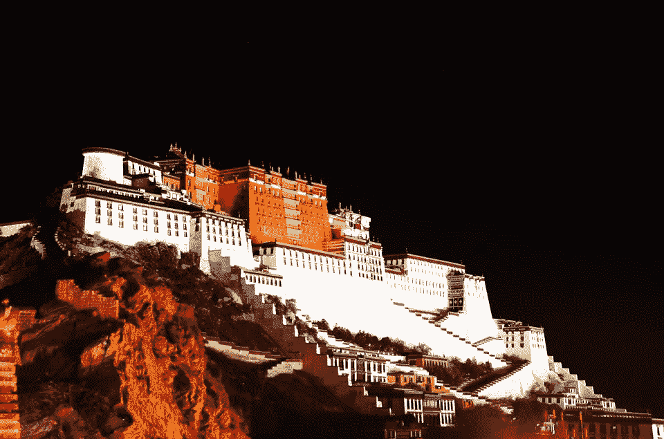

# 萤火虫和蜂鸟

> 原文：<https://medium.com/hackernoon/fireflies-and-hummingbirds-b03e050ae23e>

决定是在某个地方做出的，但不是由某个人做出的。

次仁把我摇醒。在他年轻的脸上有着我从未见过的急迫和担忧，而这个人的兄弟在不到一周前自焚了。黑色的窗户轻声对我说，现在仍然是午夜，但即使不是深夜(或凌晨，取决于你的观点)，我也会昏昏沉沉的；我的佛教主人可能很少喝酒，但我仍然受到终身恶习的影响。毕竟，从技术上讲，我只是以记者的身份在那里。

“你一定要来看看，”他说着，带我出了门。我们大步走过达赖喇嘛的画像——在拉萨，尤其是在三月，这是一件危险的事情。1959 年的这个月，在中国人迫在眉睫的威胁下，他逃离了这座西藏城市，再也没有回来。

他领着我快速上楼，来到布达拉宫的屋顶上。数百名僧侣，其中许多是从印度流亡归来的，已经占领了这座博物馆和世界遗产地近一个月，以示抗议。在它现在的名称之前，它是达赖喇嘛 300 年来的主要住所。

我们到达时，屋顶上已经有十几个人了。在 13 层楼下面的院子里，我可以模糊地分辨出在晚上这个时候不寻常的活动水平。在 1000 英尺之下，在建造宫殿的红山脚下，我还可以看到中国人民解放军营地的灯光。

“你看见了吗，在那边？”次仁指着西边问道。这是世界上海拔最高的古代地方——外面很冷，还下着小雨。从远处看，天气在某种程度上挡住了视线，但你可以辨认出一片金色的薄雾，从高耸于城市之上的群山中迅速下降。我希望我有我的相机来记录这个空灵、幽灵般的地方，但让我记录和报道占领的条件之一是我不能拍照或录像；宫殿内严禁拍照。作为一个局外人，我很好奇哪些规则是不能违反的。

“是的，我明白了，”我轻声回答，尽管我不太确定我是否相信。

“你见过这样的事情吗？”另一位年长的僧侣问道，在我成为他们客人的两周里，我还没有被介绍给他们。

“不，恐怕我没有。”我很害怕。当金色的云朵到达山脚并继续在城市上空盘旋时，我们肃然起敬。一旦明确它将直接前往宫殿，紧张的低语声在人群中沙沙作响，一些人走进了里面，尽管现在有大约 50 人在屋顶上，因为消息传遍了巨大的，有一千个房间的结构。

在 100 码外，我发现那不是一片云，而是一群最初给我留下大萤火虫印象的东西。一定有成千上万个，每一个发出的光照亮了它附近的小雪花。部落包围了我们，我的耳朵充满了这些奇怪的生物发出的嗡嗡声，因为他们冲向屋顶上惊愕的居住者。

它们现在的移动方式改变了我对它们的印象，从萤火虫到蜂鸟，它们会从一个地方飞到另一个地方，然后停下来在原地盘旋，几乎是不知不觉地快速飞行，留下一条逐渐消失的光线。就好像他们在检查什么东西，他们是。其中一只停在我面前几英尺的地方，我本能地伸出手，好像要提供一个栖息的地方，但它稍微后退了一点，所以够不着。我的胃突然下降，因为我意识到这些不是大自然的创造，而是人类的。更有可能的是，人类产品的产物。我对机械蜂鸟的感知随着我内心的下沉而凝固，因为我注意到它们中的每一只都有一根几英寸长的针从它身上伸出来，就像一个锋利的喙。

我开始听到周围奇怪的声音——咳嗽和咕噜声，以及当一个人试图用部分切断的声带尖叫时发出的可怕声音。这些针现在被打入屋顶上所有人暴露的颈部。很明显，除了我自己。

我从被不可思议的到来所催眠的迷迷糊糊中走出来，听到下面院子里传来几声叫喊。我还能听到宫殿内沉重的脚步声，因为我看到整个山顶都被这些死亡使者吞没了。我可以看到他们从敞开的宫殿窗户里蹦蹦跳跳地进进出出，其中一些窗户现在被里面的灯光照亮了。除了明亮的条纹之外，大部分都是黑暗的——随着它们的出现而迅速消失——就像黑暗中成千上万颗微小的流星。无处可逃。

由于所造成伤口的性质，许多自主刺客被喷洒了血液，现在更接近猩红色。在我周围是一个耀眼的红色和金色灯光表演的飞行机器，在雪中跳舞。对于一个不知情的观察者来说，这将是一件美妙的事情。

我附近的地上有一根拐杖，是一个不再需要它的老和尚掉下来的。我拿起它，试图与一些袭击者战斗，但我挥下的几下挥杆只击中了冷空气。几秒钟之内，我的两只手都被细小的尖刺刺穿了几次，使得它们毫无用处；我用自己的机器口述了这个账户。

他们刚一开始，可怕的噪音就停止了，嗡嗡声也开始变得模糊。蜂群再次成为城市上空的一朵云——不再完全是金色的——并登上山峰，消失在视线之外。

我看到次仁脸朝上躺在地上，眼里流露出惊讶和不相信的神情。血液与他穿着的栗色长袍混合在一起，他脖子和胸部的洞在苍白的月光下几乎无法察觉。如果不是睁着眼睛，他可能一直在睡觉。

我在屋顶上坐了很长时间，试图弄清楚刚刚发生的事情，我沉重的呼吸在我面前形成了一片迷雾。我甚至没有注意到我的手和我的头脑都变得麻木了。雪变得越来越大，开始覆盖它下面的污渍层，直到一个纯白色的毯子覆盖了视野中的一切。我从未感到如此孤独——现在是这个庞大建筑群中唯一的生物。为什么要使用灯，尤其是在入口和出口处？为什么要放过一个证人，即使他是美国人？抗议者的声音很轻，而且声音在高海拔地区传播得不快或远。雪减弱了回声。但我在那里，留下来讲述这个故事。他们认为——假设他们真的在想——没有人会相信我吗？城市里的其他人肯定看到过他们。

我哥哥是美国空军的无人机飞行员。他将远离目标数千英里，以“99 个红气球”为背景，手动执行上级的意志。现在法官、陪审团和刽子手是同一个人。这些算法太复杂了，任何人都无法理解捕杀决定的内容，但 p 值是 0.01，仅此而已。

*灵感来源于* [*这封信*](http://futureoflife.org/open-letter-autonomous-weapons) *，以及什么开始于* [*这封信*](https://www.ted.com/talks/raffaello_d_andrea_meet_the_dazzling_flying_machines_of_the_future?language=en) *。*

> [黑客中午](http://bit.ly/Hackernoon)是黑客如何开始他们的下午。我们是阿妹家庭的一员。我们现在[接受投稿](http://bit.ly/hackernoonsubmission)并乐意[讨论广告&赞助](mailto:partners@amipublications.com)的机会。
> 
> 如果你喜欢这个故事，我们推荐你阅读我们的[最新科技故事](http://bit.ly/hackernoonlatestt)和[趋势科技故事](https://hackernoon.com/trending)。直到下一次，不要把世界的现实想当然！

