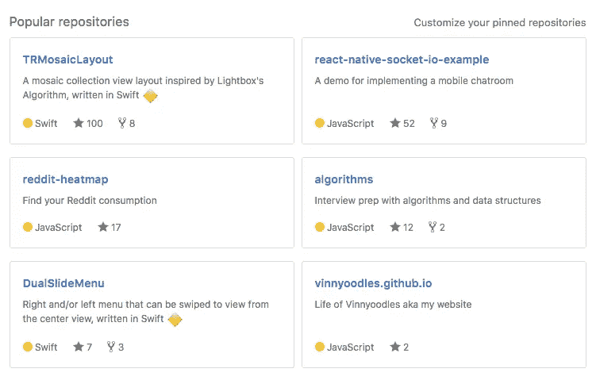

# 我的第一个 100 颗 GitHub 星

> 原文：<https://medium.com/hackernoon/first-100-stars-on-github-64f25cb7cfd3>

当我第一次创建 GitHub 账户时，我还没有听说过版本控制，并认为它只是另一个存储文件的网站，类似于 Google Drive。

在了解了 git 真正能做什么以及令人敬畏的开源社区之后，我给自己定了一个目标:为社区做贡献，并拥有一个趋势库。

My repositories as of Jan 26, 2017.

今天是我长期目标的一个重要里程碑。我一次回购就赚了 100 颗星。

*TRMosaicLayout* 诞生于我试图在 iOS 上创建一个类似 Snapchat 的故事视图的视图时。这个想法肯定不是原创的，因为我的灵感来自这个[博客](http://blog.vjeux.com/2012/image/image-layout-algorithm-lightbox.html)和一个类似的 [iOS 库](https://github.com/fmitech/FMMosaicLayout)。

开源社区的一个问题是它太大了。因此，每个人都有自己的用例，大多数时候你不可能找到一个完全符合你需求的库。你能做的最好的事情就是找到一个相似的库，并根据你的需要进行调整。

这正是我所做的。我找到的这个库是用 Objective-C 编写的，设计略有不同。然后我决定用苹果的新语言 Swift 写一个类似的库🔶。

**注意**:我从开源库学到的一个技巧是它应该尽可能的通用，这样它就可以灵活的适应其他的用例。此外，文档是关键。

在我把这个库推送到 GitHub，并在 iOS 的一个包管理器 [Cocoapods](https://cocoapods.org/) 上发布之后，我尽可能多的地方共享了这个库。我非常想尽可能地增加流量，这样这个库就能在 GitHub 的趋势列表中排名第。我不是 100%确定他们的算法是什么，决定什么在列表上，什么不在列表上。我相信它包括了你在一天内获得的星级数以及总流量和浏览量。如果你能在第一天获得大约 20-25 颗星，你应该能在今天的*列表中列出该语言。*

我花了大约 7 个月的时间才得到那个图书馆里的 100 颗星星。有点慢，但这是一个开始。从那时到现在，我已经增加了几个公共存储库，获得了一些流量。

现在进入下一个里程碑:1000 颗星星！

> [黑客中午](http://bit.ly/Hackernoon)是黑客如何开始他们的下午。我们是 [@AMI](http://bit.ly/atAMIatAMI) 家庭的一员。我们现在[接受投稿](http://bit.ly/hackernoonsubmission)，并乐意[讨论广告&赞助](mailto:partners@amipublications.com)机会。
> 
> 如果你喜欢这个故事，我们推荐你阅读我们的[最新科技故事](http://bit.ly/hackernoonlatestt)和[趋势科技故事](https://hackernoon.com/trending)。直到下一次，不要把世界的现实想当然！

