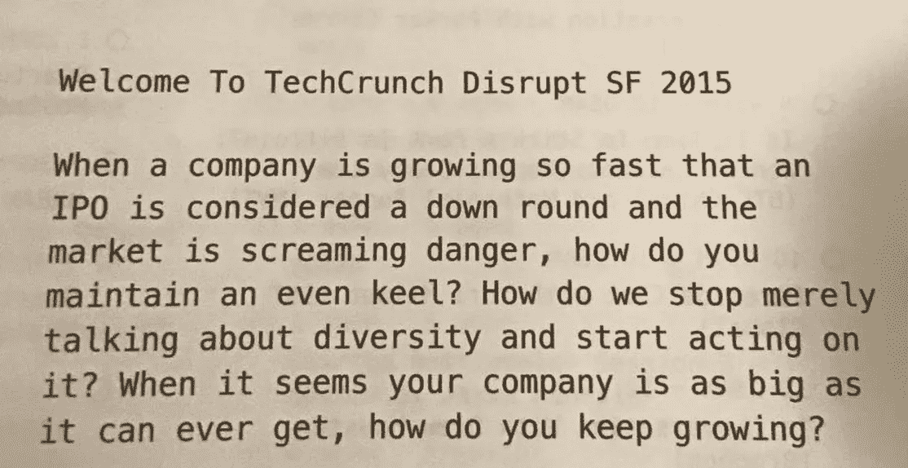
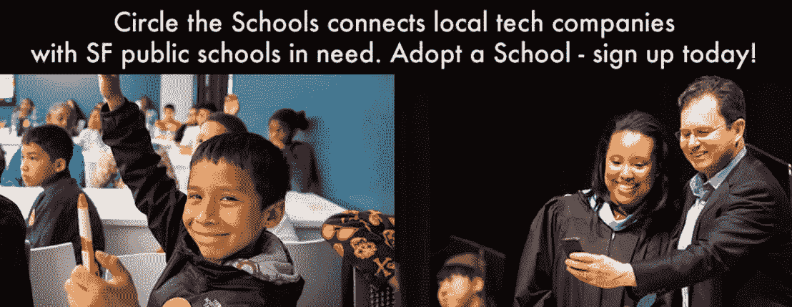
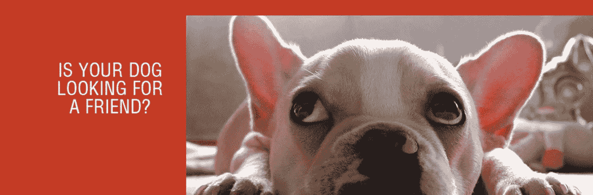
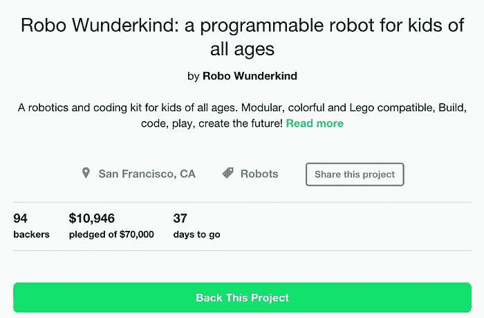

# #TCDisrupt SF:值得关注的十家创业公司

> 原文：<https://medium.com/hackernoon/first-day-of-tcdisrupt-sf-the-ten-startups-to-watch-3c3e9158a454>

[#TCDisrupt](https://twitter.com/search?q=%23tcdisrupt&src=typd) 的大主题是虚拟现实、和“我们能在 70 号码头的一个 90 度的仓库里塞进多少创业公司？”

会议向 Startup Alley 开放，提供了通往自助餐厅的监狱走廊的位置，强调了种子资金资助的想法的原始热情。

我不打算参加今年的[# TC disrupt](https://twitter.com/search?q=%23tcdisrupt&src=typd)…这一切都是从支持我的商业伙伴[开始的。这个周末，我去了 TechCrunch 黑客马拉松。我做了力所能及的一点点事情我们可以访问 Crunchbase 的所有数据。哼哼。他们给了我们每人一张票，奖励我们的辛勤工作和对我们事业的奉献。](https://twitter.com/jayzalowitz)

我上周刚从意大利回来，所以我想我应该自私地从我本可以使用的应用程序开始。

# 旅游应用

## [Esplorio](http://home.esplor.io/?utm=ARTMAPinc) —将旅行状态更新聚合到映射的故事中

牛津的人都笑逐颜开。直到今天我才知道——但是我告诉你——他们的摊位上有一些快乐的妈妈们。说到这个，[我在他们的应用程序中绘制了我的意大利之旅，](https://esplor.io/trips/5ftsnrnmzvfe0)给你一些我曾经称之为当地的味道。这款应用在桌面视图中有效地聚合了来自不同社交网络的照片。他们的移动应用有点落后于桌面应用，但他们有团队来提升水平。另外，他们说产品周期是以周为单位，而不是以月和季度为单位，这尤其令人耳目一新。

> 哦，接下来的事情让我想起了我的失败。)。

## [景点](http://www.viewspot.co/?utm=ARTMAPinc) —发现公共有利位置

世界上最美的风景在哪里？以下是 Viewspot 对其产品的定义:

据 LinkedIn & Crunchbase 称，他们有一个才华横溢的创始团队，由 Innotas 高级销售顾问 Ankit Gupta 和 Innotas 解决方案顾问 Naveed Bagheri 组成。我会关注他们的成长，甚至分享我的 1000 张最好的地理标签图片的秘密列表。

> 关于我，我的旅行，我体验的应用程序，以及更重要的事情，例如，整个硅谷可以改变世界…

# 社会公益

## **—采用公立学校的科技公司**

**罗恩·康韦是董事长。这是关于[科技回馈当地社区的](http://c.how/)，但是我把我的讨论集中在他们造福公立学校的工作上；科技公司可以“收养”当地的公立学校。通过 [sfciti](http://sfciti.org.?utm=ARTMAPinc) 进行的每一次收养或赞助都是根据学校的需求定制的。现金，导师，公园，应有尽有。他们最近[达成了 50+](http://sfciti.org/update/circle-the-schools-kicks-off-school-year-in-52-schools/) 的官方合作关系！**

****

**我要开车引他们的路，为什么不呢？**

## **为社会公益而奋斗**

**一个应用程序可以衡量我输入到这个世界的社会公益吗？我不认为我已经做好准备，根据对我社交媒体更新的情绪分析，将我所有的优点总结成一个 0-100 之间的数字……但我很欣赏突出那些做好事的人的举措。**

**“你是 65 岁，你可以得到一件免费的 t 恤，”她说，并递给我一件衬衫，上面写着“你有多棒？”我在这里，考虑退休年龄。**

# **虚拟现实**

## **[有机运动](http://www.organicmotion.com/)——虚拟现实的启动工具**

**他们有一个工作人员在笼子里，伴随着他的化身跳舞的屏幕。这让我想起了文斯·沃恩在博物馆的展览，名为**、[、【未完成的事业】、](https://en.wikipedia.org/wiki/Unfinished_Business_%282015_film%29)中的美国商人**(它还发布了[的免费商业股票照片](http://www.adweek.com/adfreak/vince-vaughn-and-costars-pose-idiotic-stock-photos-you-can-have-free-163239)，这是一次有趣的营销活动)。Organic Motion 以 995 美元的价格出售一套包括硬件、软件和指令的入门套件，让你自己制作第一个虚拟现实视频。**

**还有一堆其他很酷的虚拟现实技术——如[三星的冒险时间](https://venturebeat.com/2015/09/21/cartoon-network-launches-adventure-time-virtual-reality-game-for-samsung-gear-vr/) & [虚拟现实 River 的股票赛车体验](https://twitter.com/River_Racing)——但我没有心情扭曲我已经存在的现实，所以我将在另一天讲述虚拟现实的后起之秀。**

# **[艺术作品](https://medium.com/art-marketing)**

## **[受委托](https://www.thecommissioned.com/?utm=ARTMAPinc)——多才多艺的艺术家准备描绘你的梦想，让你感觉自己像一个富有的文艺复兴者**

**我坐在仓库的一个角落里(70 号码头里面有路缘石)——正在处理电子邮件，因为你知道我有一家[营销公司](http://artmapinc.com/?utm=tcdisruptmedium)要经营，而我今天本来不应该在这里——这个家伙把我的注意力从屏幕上移开，说，“ArtMap 是做什么的？”我告诉他我的生意。他谈到了他的。正如波普艺术先生曾经说过的:**

> **“擅长做生意是最迷人的艺术。赚钱是艺术，工作是艺术，好生意是最好的艺术。”**

**首席执行官 Melvin Yuan 说[委托的](https://www.thecommissioned.com/?utm=ARTMAPinc)将与艺术家分享 20%的收入，而画廊传统上在 50%的范围内。似乎很公平。我会跟踪他们为优秀艺术家获得优秀作品的进度，可能还得委托画一幅[的画，一个商人试图拦截熊猫扔给虎鲸的足球](https://www.facebook.com/photo.php?fbid=10205062321225917&set=a.3140805927308.2126172.1479720189&type=1&theater)，或者是[维克多利亚·库图科娃接下来要画的任何东西](https://www.thecommissioned.com/artists/viktoria-kutukova)。**

## **[ArtoMatix](http://artomatix.com/) —自动化制作艺术家&朋友**

**它们长出纹理。死亡接缝。他们创造出几乎无限的图案。视频游戏和好莱坞电影的艺术制作可能会有一个新的得力助手。他们的视频声称他们已经建造了“第一个具有想象力的人工智能”，视频中的第一个机器人非常接近前玛奇纳的艾娃。在展台工作的创始人解释道:**

> **“说你想要 100 只丧尸。而不是雇佣 100 名演员。雇三个演员，把镜头发给我们，我们会把他们变成 100 个独特的僵尸。”**

# **因为，“为什么不呢？”**

## **[MerryJane](https://www.merryjane.com/?utm=artmapINC) —大麻生活方式媒体目的地**

** [## #MerryJane，by @snoopdogg 于 2015 年 9 月 21 日晚 11 点 54 分发布

### 看到这张 Instagram 照片被@snoopdogg * 42 万赞

instagram.com](https://instagram.com/p/76WxkKv9C_/?taken-by=snoopdogg) 

显然，史努比·道格会在 TechCrunch 上发布这个。

## [见见我的狗](http://meetmydogapp.com/?utm=ARTMAPINC)——*狗狗的打火(玩耍)日*

你的狗对群里的另一只狗感到孤独吗？你是不是很恶心自己的狗，想和别人家的狗玩捡球游戏？我开玩笑。无论哪种方式，[遇见我的狗](http://meetmydogapp.com/?utm=ARTMAPINC)都能帮上忙。我得到了他们创始故事的布斯版本:

> “脸书有一套复杂的算法来识别非人类的个人资料。他们删除了我狗的资料。所以我建造了**遇见我的狗**

## [神童](https://www.kickstarter.com/projects/startrobo/robo-wunderkind-a-programmable-robot-for-kids-of-a)——教孩子如何编码的乐高玩具

舞台上有一种胆怯，这并不是因为缺乏创新。只是团队没有去过那里，而 [Kickstarter](https://www.kickstarter.com/projects/startrobo/robo-wunderkind-a-programmable-robot-for-kids-of-a) 只是抓住他们的积木。

他们的总部设在维也纳，他们计划让建造乐高城堡的行为也创造一个计算机程序。年轻是多么可怕啊！

# 我不喜欢#TCDisrupt 的 4 点

1.  **应用程序无法正确构建 Twitter 登录。**不难。永远不要让我在大型社交网络上输入登录凭证。我已经用手机登录了，别浪费我的时间。我知道你很忙。但是如果你是来获取用户的，不要让用户一进门就马上输入另一个账户的登录凭证，这样就破坏了“上车”的时刻。
2.  **座位不够。**我知道 TechCrunch 想要营造一种售罄的感觉。但是温度和座位之间有一个黄金比例。在这股热浪中，TechCrunch 需要更好地考虑如何监控开发者的腋窝；大声吸气，仓库里的气味是公共空气。
3.  只有三明治。我的意思是我没有花钱买票，但有些人花了很多钱买票，他们辛苦挣来的美元应该得到一些正宗的旧金山美食。也许是快餐车，也许是[莫里纳里斯](http://www.yelp.com/biz/molinari-delicatessen-san-francisco)，也许是[埃塞俄比亚](https://www.facebook.com/permalink.php?story_fbid=1495773607388240&id=1493678630931071)，不仅仅是一个简单的三明治加蓬松的面包。
4.  **创业小巷的拥挤——**“太拥挤了，”IDGN 记者[布莱尔·汉利·弗兰克](https://twitter.com/belril)坐在我们的 Lyft 线上告诉我。一辆 2005 年的 Landcuiser。"明天展位上会有全新的."我不知道他们明天会让新的创业公司支付更多的钱来回收今天的产品。

# 我喜欢#TCDisrupt 的 4 点

1.  **冰咖啡。**清凉提神，&含咖啡因——完美。
2.  **水喷泉。**这水真他妈的好。又冷又没瓶。瓶子使用量的减少令人钦佩。专业会议提示，TechCrunch 应该要求水站附近的所有创业摊位赠送他们的品牌水瓶。

好了，关于冷，冷饮已经说得够多了…

**3。整体能量。**与会者、赞助商、黑客、演讲者、摄影师、作家——兴奋、荒谬、现实扭曲和下一个伟大的想法都在这里。无论是[科尔·福克斯](https://twitter.com/colejfox)骑着巨大的滑板车在拥挤的过道中穿梭，[约翰·迈克菲](https://en.wikipedia.org/wiki/John_McAfee)到处客串，TechCrunch 的工作人员[在码头中间的舞台](https://instagram.com/p/78D-eWMG7B/?taken-by=smookewalks)上拍摄，没有一个与会者能听到演讲者的声音，或者只是可能遇到有人在制作一些很酷的东西， [#TCDisrupt](https://twitter.com/search?q=%23TCDisrupt&src=typd) 都有能量。

**4。继续对话的机会！**享受美好的一天！

> 下次再见， **sống ảo.**

> 中→ [**【艺术+营销】**](http://medium.com/art-marketing)
> 
> LinkedIn→[**in/Clark Kent**](http://linkedin.com/in/clarkkent)
> 
> 推特→**[**@ DavidSmooke**](http://twitter.com/davidsmooke)**

**如果你总是说自己很棒，不要点击下面的推荐按钮。如果你对他们团队的业务状况很诚实，那么[谈谈营销](mailto:david@artmapinc.com)会很棒。**

> *****⇓推荐⇓*****

************

> **[黑客中午](http://bit.ly/Hackernoon)是黑客如何开始他们的下午。我们是 [@AMI](http://bit.ly/atAMIatAMI) 家庭的一员。我们现在[正在接受投稿](http://bit.ly/hackernoonsubmission)并乐意[讨论广告&赞助](mailto:partners@amipublications.com)机会。**
> 
> **如果你喜欢这个故事，我们推荐你阅读我们的[最新科技故事](http://bit.ly/hackernoonlatestt)和[趋势科技故事](https://hackernoon.com/trending)。直到下一次，不要把世界的现实想当然！**

******