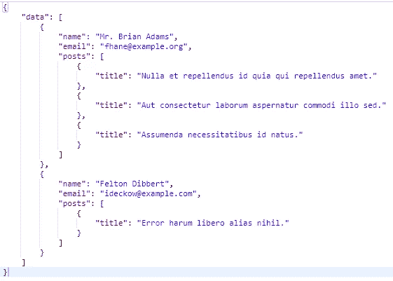

# 对 Laravel API 资源的第一印象

> 原文：<https://medium.com/hackernoon/first-impressions-on-laravel-api-resources-4869b73b7847>



昨晚 [Taylor Otwell](https://medium.com/u/d694c31ce941?source=post_page-----4869b73b7847--------------------------------) 终于介绍了在 Laravel 5.5 上开发 API 时，可以取代 [Fractal](http://fractal.thephpleague.com/transformers/) 的开端。这是我第一次尝试。

有趣的事情从第 4 步开始。

## 1-安装 clean Laravel 5.5 项目

```
composer create-project laravel/laravel responses dev-develop
cd responses
touch database/database.sqlite
php artisan make:model Post -mfa
php artisan make:resource UsersWithPostsResource
php artisan make:resource PostsResource
php artisan make:controller UsersController --resource
```

将您的`.env`文件改为使用 SQLite，并删除所有其他数据库变量。

```
DB_CONNECTION=sqlite
```

## 2-准备数据库

*   帖子迁移`database/migrations/______create_posts_table.php`

```
Schema::*create*('posts', **function** (Blueprint $table) {
    $table->increments('id');
    $table->string('title');
    $table->string('body');
    $table->unsignedInteger('user_id');
    $table->timestamps();
});
```

*   邮报工厂`database/factories/PostFactory.php`

```
**<?php

use** Faker\Generator **as** Faker;

$factory->define(App\Post::*class*, **function** (Faker $faker) {
    **return** [
        'title' => $faker->sentence,
        'body' => $faker->paragraph,
        'user_id' => **function** () {
            **return** factory(\App\User::*class*);
        }
    ];
});
```

*   用户有帖子关系`app/User.php`

```
**public function** posts()
{
    **return** $this->hasMany(Post::*class*);
}
```

*   避免职位的大规模分配`app/Post.php`

```
**<?php

namespace** App;

**use** Illuminate\Database\Eloquent\Model;

**class** Post **extends** Model
{
    **protected** $guarded = [];
}
```

*   为数据库设定种子

```
php artisan migrate:fresh
php artisan tinker
factory(App\Post::class)->times(2)->create();
factory(App\Post::class)->times(2)->create(['user_id' => 1]);
```

## 3-设置路线

```
Route::*apiResource*('/users', 'UsersController');
```

## 4-将模型转化为资源

```
*/**
 * Display a listing of the resource.
 *
 ** ***@param*** *User $user
 ** ***@return*** *\Illuminate\Http\Response
 */* **public function** index(User $user)
{
    **return new** UsersWithPostsResource($user->paginate());
}
```

## 5-拥有帖子资源的用户

```
**<?php

namespace** App\Http\Resources;

**use** Illuminate\Http\Resources\Json\Resource;

**class** UsersWithPostsResource **extends** Resource
{
    */**
     * Transform the resource into an array.
     *
     ** ***@param*** *\Illuminate\Http\Request
     ** ***@return*** *array
     */* **public function** toArray($request)
    {
        // Eager load
        $this->resource->load('posts');

        **return** $this->resource->map(**function** ($item) {
            **return** [
                'name' => $item->name,
                'email' => $item->email,
                'posts' => **new** PostsResource($item->posts)
            ];
        });
    }
}
```

## 6 员额资源

```
**<?php

namespace** App\Http\Resources;

**use** Illuminate\Http\Resources\Json\Resource;

**class** PostsResource **extends** Resource
{
    */**
     * Transform the resource into an array.
     *
     ** ***@param*** *\Illuminate\Http\Request
     ** ***@return*** *array
     */* **public function** toArray($request)
    {
        **return** $this->resource->map(**function** ($item) {
            **return** [
                'title' => $item->title
            ];
        });
    }
}
```

## 7-结论

与**分形**相比，第一个明显的区别是资源可以轻松直接地访问整个集合，而不是基于每个对象。这意味着当转换一组用户时，你可以很容易地加载每一个帖子，而不需要 N+1 个查询。

嵌套转换也很容易，因为您可以根据需要生成一个新的资源类来转换您的数据。

一旦我开始挖掘更多的可能性，我会写一个更详细的帖子。

# 后续行动

这是 Laravel 5.5 中关于 API 资源的第一篇文章。你可以在这里找到关于这个主题的第二篇文章:[https://medium . com/@ deleugpn/reusable-API-resource-with-nested-relationship-laravel-5-5-c654c 7243869](/@deleugpn/reusable-api-resource-with-nested-relationship-laravel-5-5-c654c7243869)