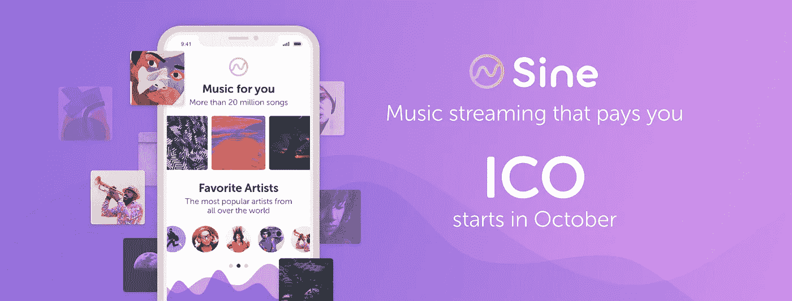
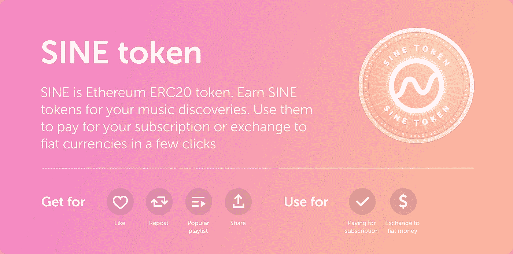

# 首个音乐流媒体应用 Sine 向听众支付音乐发现费，通过他们即将推出的 ICO 筹集 60 美元

> 原文：<https://medium.com/hackernoon/first-music-streaming-app-sine-that-pays-listeners-for-music-discoveries-to-raise-60%D0%BC-through-95a76a35f2a8>

由基于以太坊的加密货币 SINE tokens 支持的音乐流媒体应用 Sine 在发布时提供完全授权的 2000 万首歌曲目录。由于对听众和创作者都有独特的好处，Sine 希望通过他们即将推出的 ICO 筹集 6000 万美元。

**Sine** ，世界上第一个基于加密货币的音乐流媒体应用，很高兴地宣布其首次硬币发售，预售将于 2017 年 10 月 23 日启动。Sine 旨在解决听众和音乐家在使用当前可用的音乐流媒体服务时遇到的一些最突出的问题。该公司的目标是通过向用户支付内容选择费用来颠覆音乐流媒体行业，创建世界上最大、最活跃的音乐社区。

目前，流媒体产生了整个唱片行业超过 50%的收入，拥有 1.12 亿付费音乐流媒体订阅用户，收入超过 40 亿美元。然而，免费账户仍然存在一个问题，例如，只有 30%的 Spotify 用户是付费用户。现有的定价模型缺乏灵活性，因为在总成本计划和免费账户之间没有其他选择。

Sine 奖励用户自己的基于以太坊的加密货币 Sine tokens，因为它是第一个发现未来热门歌曲并制作流行播放列表的用户。听众可以付费订阅，降低费用甚至免费。额外的代币可以在主要的加密交易所兑换成法定货币。

另一方面，Sine 也将通过创建灵活的费率来增加付费用户的比例，从而使音乐人和音乐公司受益。新音乐的推广将变得更快更有效，因为用户会主动搜索它们。这极有可能降低他们的推广成本，增加他们的最终利润率。

“如果我们想为艺术家提供优质的音乐服务，我们应该从为听众提供最好的服务开始。Sine 的首席执行官兼联合创始人 Sergey Mayamsin 说:“高度参与的观众使 Sine 成为音乐家展示他们新作品的完美平台。“灵活的订阅计划将从流媒体中带来更大的收入，我们相信创作者会喜欢基于智能合同和内置曲目推广工具的即时支付。”

早期投资者 30%奖金的 Sine ICO 预售将于 2017 年 10 月 23 日开始。要了解更多详情和阅读白皮书，请访问 [https://sine.media](https://sine.media)

**关于 Sine:** Sine 是世界上第一个基于加密货币的音乐流媒体应用程序，奖励听众发现新的热门歌曲、下一个大艺术家或制作流行播放列表。这也是一个优秀的平台，让音乐人找到他们的观众，并以最有效的针对性推广音乐。Sine 的目标是创建世界上最大、最活跃的音乐社区。