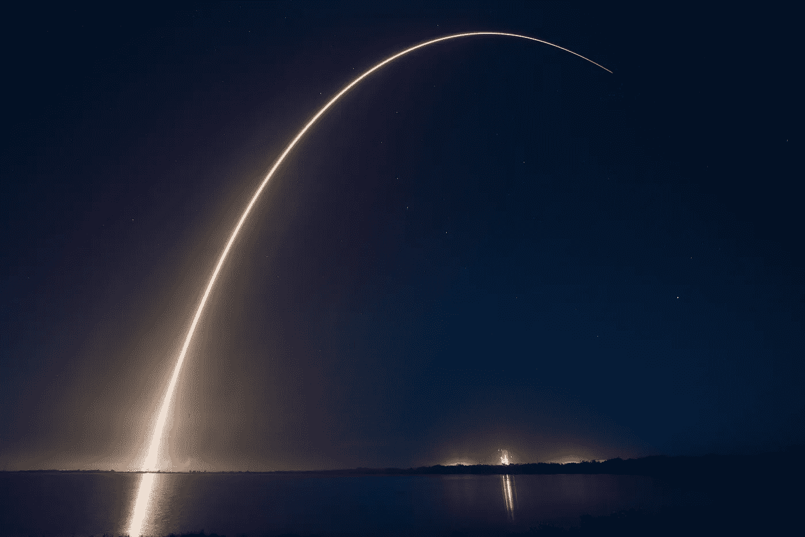
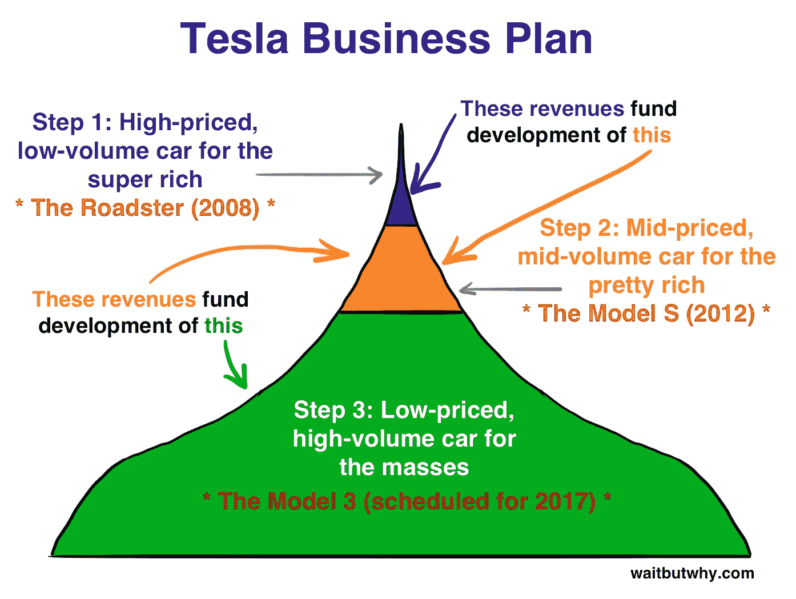
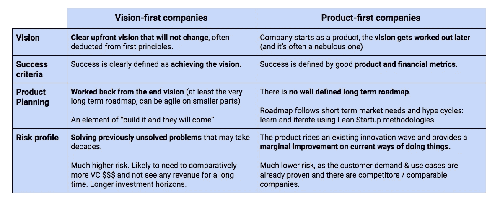
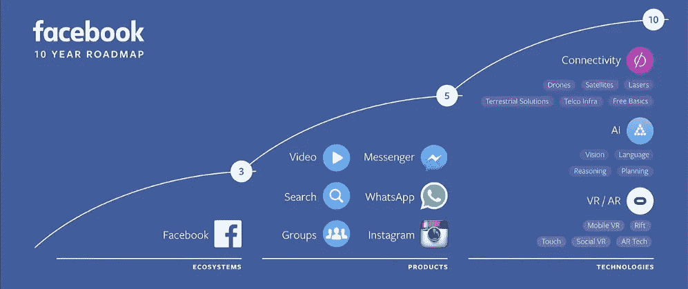
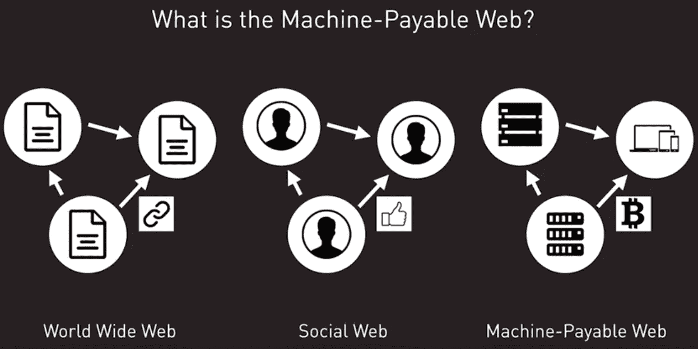
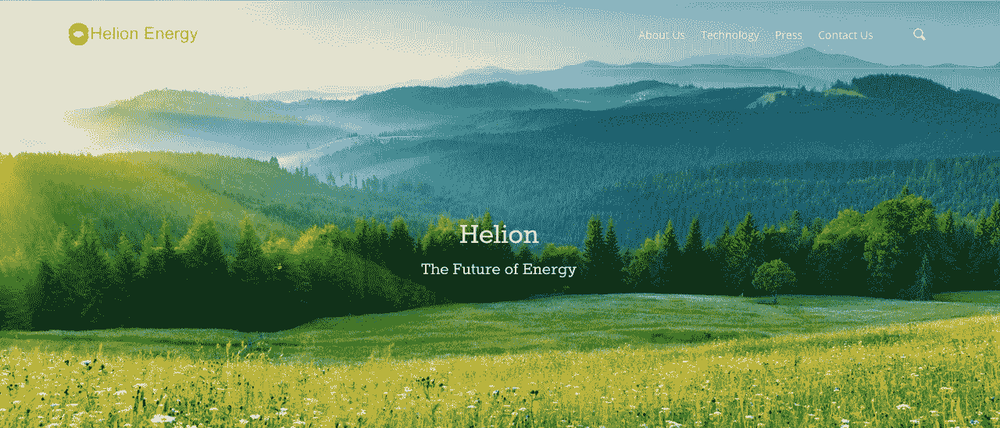

# 企业家精神的基本原则

> 原文：<https://medium.com/hackernoon/first-principles-entrepreneurship-dfc82175ea9b>

大多数创始人和公司都订阅了韦恩格雷特斯基商学院(Wayne Gretsky school of business):他们滑向冰球不可避免要去的地方。很少有人知道冰球未来应该在哪里，并在这个方向穿过未知的地形。埃隆·马斯克和其他几个人就是这么做的。

*(本文不会再有曲棍球的比喻，也不会再向加拿大点头。)*

Photo courtesy of SpaceX.com

假期里，我终于抽出时间阅读了 T4 阿什莉·万斯写的关于埃隆·马斯克的精彩传记。

这本书讲述了很多关于埃隆故事的有趣细节——他的性格，他在南非艰难的童年，有趣的轶事(你知道吗，埃隆在去火人城的路上向他的堂兄弟提出了太阳能城市的想法？)—但真正让我难忘的是**埃隆从“第一原则”中推理。**用他自己的话说:

> 我认为，一般来说，人们的思维过程过于拘泥于惯例或对以往经验的类比。
> 
> 人们很少试图在基本原则的基础上思考问题。他们会说，“我们会这么做，因为一直都是这么做的。”或者他们不会这么做，因为“没人这么做过，所以肯定不好。”但这只是一种可笑的想法。你必须从头开始建立推理——“从第一原理”是物理学中使用的短语。
> 
> **你看基本面，从那个**构建你的推理，然后你看你有没有一个行得通或者行不通的结论，它可能和过去人们做过的有区别也可能没有区别。

这种心态导致埃隆在年轻时有以下思维过程:

> 人类的生存有赖于地球保持友好，但以目前全球变暖的速度，这是不可能的。
> 
> (1)成为行星间物种，以及(2)增加地球适宜居住的时间，将会增加生存机会。
> 
> 因此，我将尽我所能来实现(1)和(2)。

🤔逻辑检查正确吗？

看到伊隆如此相信这一点，令人印象深刻。从这种基本原则的思考中，他继续推导出他一生的工作应该是什么样的(为了实现这一目标，他每周工作 100 小时，工作了 15 年以上！)

# 产品第一与愿景第一的公司

这种想法导致了我所说的“愿景优先公司”。

一个*逻辑推论*世界上有些事情是错误的，应该得到解决，这推动了一股不可思议的动力，向着这个世界新的更好的状态前进，即使要花 10 年才能到达那里，每个人都认为你疯了:

Tesla Master Plan Part 1\. [Part 2](https://www.tesla.com/en_GB/blog/master-plan-part-deux?redirect=no) is well underway now.

给我留下深刻印象的是，这种自上而下/非常长期的规划方法与大多数当前的创业建议形成了鲜明对比:开放地构建，不要在没有与客户不断验证假设的情况下盲目地执行长期计划，如果数据告诉你要这样做，准备好转向，使用敏捷而不是瀑布，等等。

这种方法是建立成功企业的低风险方式。你通过迭代找到对你的客户有用的产品，通过展示这一发现和使用的进展，你可以不断提高估值来筹集资金。视觉第一的公司没有这种反馈循环——他们在打赌客户*在 N 年后会想要什么*,并需要风投的融资(或者特斯拉的崇拜用户群！)带着信仰的跳跃。

**所以我突然想到，其实有两种创业公司:愿景优先和产品优先:**

区分这两种的最清晰的方法是想想成功是什么样子的。

对于以愿景为先的公司来说，成功就是实现愿景。在实现愿景的道路上，所有中介的成功都是为了让公司继续前进，并产生更多的资源来推动实现最终愿景。特斯拉总体规划就是一个完美的例子。一旦愿景优先的公司有足够的成功机会，许多创业公司就会跟进——这条路已经没有风险了。

**相比之下，在产品至上的公司，成功是相对于过去的表现而言的。以脸书为例，对他们来说，这意味着增加平台上连接的用户数量。因此，路线图不包含具体的目标，只有主题:**

其他几个产品第一的例子:**Snapchat/Twitter/Pinterest**(社交分享的改进) **Stripe/Braintree** (当前支付系统的改进) **Slack** (团队沟通的改进) **Asana** (任务管理的改进)**优步/Postmates/Instacart** (按需运输/东西)。

# 当今视觉第一的公司

这些公司令人着迷，因为他们通常有一个鼓舞人心的创始人带你了解他们的愿景及其背后的推理，并邀请你进行信念的飞跃。因此，耐心是关键，因为该公司的目标是推出能够推动其实现最终目标的产品。

我认为今天有几个很棒的公司符合要求。

# 21 公司

Vision: build the machine-payable web

创始人兼首席执行官 Balaji S. Srinivasan 对创建 21 世纪的想法是这样的:

> 机器需要能够相互转移资金，特别是为了鼓励共享闲置资源(在网格计算范例中。)
> 
> 今天所有的钱包都与人而不是机器联系在一起，这意味着人类必须让一台机器与另一台机器对话。这在 IOT 和网格计算世界中是无法扩展的。
> 
> 因此，应该创建基于机器的钱包。

请看这段视频，巴拉吉经历了这个思考过程。在我看来，正是这种退一步，通过一个演绎的思维过程认识到每台机器的钱包将是必要的，然后继续实施的能力，无论这将是多么困难&耗时(建立一个采矿芯片不亚于此)，使这一点如此令人印象深刻。

# [Helion 能源](http://www.helionenergy.com/)

Talk about a big idea

> 化石燃料危害地球；可再生能源的产出不可预测。
> 
> 核聚变不会损害地球，是可预测的，比可再生能源浪费更少。
> 
> 创造一个融合引擎。

(理想情况下不会炸掉星球。)

# [Deepmind](https://deepmind.com/)

> 世界上某些重要的问题似乎是人脑无法解决的。
> 
> 人工通用智能可以帮助创造新的大脑来补充我们的大脑。
> 
> 因此，我们应该建立人工智能。

# [不大可能](http://improbable.io)

*(披露:我在《不可能:-)*

> 能够理解现实世界系统中出现的复杂性将有助于解决重要的问题。
> 
> 在这些系统的高保真仿真中发现了突现的复杂性，这在今天的技术上是不可能的。
> 
> 因此，我们应该创建高保真模拟。

我们正在用 [SpatialOS](https://spatialos.improbable.io/) 前进，这是我们用于构建大规模模拟的操作系统，现在在 Open Alpha 中。报名有戏！

# 下一个是谁？

在我看来，绝大多数这类公司都是由以下人资助的:

*   **y 合成器**
*   安德森·霍洛维茨
*   **彼得·泰尔/创始人基金**(并非巧合的是，他们的口号是“我们想要会飞的汽车，但我们得到了 140 个角色”！)

跟踪这些基金的投资团队所说的话以及他们采访的人非常有趣。我主要是在这个 twitter 列表上这样做的，但如果我能保留一个来源，那就是 a16z 播客，合伙人邀请他们投资的公司的创始人解释他们的愿景。(也是这个播客让我发现了不可能，并在一年后加入了这个团队！👌)

# 你相信什么别人不相信？

我认为产品第一的公司也是那些更有可能让你母亲认为“技术走得太远”的公司。点播*插入实物好*， [Blincam](http://www.blincam.co/) (眨眼拍照)，[你好阿尔弗雷德](https://www.helloalfred.com/)(帮你做所有家务)， [Yo](https://itunes.apple.com/us/app/yo./id834335592?mt=8) (Yo！)， [Zenly](http://zen.ly/) (gps 追踪你的朋友)——举几个令人作呕的例子。

愿景优先的公司，通过从改善的世界状态中回溯他们的计划，有更多的机会解决真正的社会问题。

那么，告诉我——在我上面的列表中，谁明显不见了？

## 感谢阅读👍

很想知道你的想法。点击此处回复或[在 twitter 上找到我](https://twitter.com/ErnOpp)！

*感谢* [*亚历克斯·弗拉芒*](https://twitter.com/AlexCFlamant)*&*[*加布里埃尔·奥珀蒂*](https://twitter.com/gabropp) *对这一观点的批判性喋喋不休。*

> [黑客中午](http://bit.ly/Hackernoon)是黑客如何开始他们的下午。我们是这个家庭的一员。我们现在[接受投稿](http://bit.ly/hackernoonsubmission)并乐意[讨论广告&赞助](mailto:partners@amipublications.com)机会。
> 
> 如果你喜欢这个故事，我们推荐你阅读我们的[最新科技故事](http://bit.ly/hackernoonlatestt)和[趋势科技故事](https://hackernoon.com/trending)。直到下一次，不要把世界的现实想当然！

