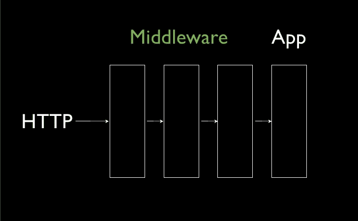

# 一系列承诺中的第一个结果

> 原文：<https://medium.com/hackernoon/first-result-in-a-sequence-of-promises-e8c5f01a1678>

最近，我们在应用程序中实现了一个功能，产生了一个很好的类似 kata 的任务，鼓励我玩 JavaScript 承诺，并加深我对它们的了解。


Illustration of [Autocomplete](https://dribbble.com/shots/2220256-Autocomplete) by [Martin Bonov](https://medium.com/u/97ed1df6cbc8?source=post_page-----e8c5f01a1678--------------------------------)

**任务:**

*对于自动完成，有几个服务可以询问用户输入的建议。这些服务是从我们自己的服务器(便宜)，合作伙伴的，谷歌的(昂贵)订购的。我们希望向用户显示第一个非空响应。此外，只有在前一个服务没有建议任何项目的情况下，我们才希望询问下一个服务。*

哦，还有一点和形很相似，那就是我在解决它的时候很开心。

# 形形式的问题

用技术术语来说，*服务*是一个返回承诺的异步函数。这个承诺，在解决时，包含了一系列的建议。该数组可以为空。请注意，空结果不同于拒绝承诺。

给定这些*服务的列表*调用每个*服务*，等待其结果，然后或者返回结果(如果非空)或者继续下一个*服务*。

> 现在，在我展示我的解决方案之前，是时候亲自尝试一下了——如果您愿意的话。从基本测试用例的[样板文件开始:](https://gist.github.com/robinpokorny/fb01d868d79e9afadff5d5ddcfa48f08)

# 现有库和解决方案

在我对现有解决方案的研究中，一个小障碍是我不知道如何用关键词来描述它。最后，我尝试了“第一”、“顺序”、“级联”、“瀑布”和“回退”以及明显的“承诺”。然后我必须过滤掉大量描述`Promise.all`或`Promise.race`的结果。

## [承诺-回退](https://www.npmjs.com/package/promise-fallback)

经过一些研究，我发现这个 NPM 包基本上解决了这个问题。它使用了一种(相当麻烦的)递归，总体来说既不容易理解也不优雅。参见 GitHub 上的[代码](https://github.com/CharlesWall/promise-fallback/blob/6095a5deff9dbbe60006d50d1d2ccda82e8187c4/src/index.coffee)(在 CoffeeScript 中)。不过，*比照*它可以为我们所用。

## [按顺序执行承诺](https://www.abeautifulsite.net/executing-promises-in-sequence-and-stopping-at-the-first-resolved-promise)

Cory LaViska 在最近的一篇文章中解释了类似任务的第二种方法(文件名列表中的第一个现有文件)。它还利用了递归。虽然感觉更整洁(没有 CoffeeScript 帮助😜)，我不能说它读起来很好。作者自己以一个问题“你有更优雅的方法吗？”

# 我的解决方案

尽管如此，我还是希望有一个小的、可读的、可维护的方法。我的理想解决方案类似于 [koa](http://koajs.com/) 中间件。

## 迭代 1: Promise.reduce、Koa 和 wrappers

最后，Cory 的文章被证明是非常有用的，因为它给我指出了我发现 [Promise.reduce](http://bluebirdjs.com/docs/api/promise.reduce.html) 的蓝鸟文档。



Middleware architecture on a [slide](http://www.slideshare.net/joncrosby/rack-middleware/89-Middleware_App_HTTPTuesday_March_17) by [Jon Crosby](https://medium.com/u/d903c92bf073?source=post_page-----e8c5f01a1678--------------------------------)

虽然`Promise.reduce`有不同的用途——例如，将多个文件的内容相加——但它执行一件重要的事情。当遍历数组时，在继续下一次迭代之前，等待承诺的结果。

我想创建一个承诺链，而不是递归调用 fallback 函数。因此，我将每个*服务*包装在一个包装函数中，该包装函数接收到目前为止的最新结果*。然后，如果这个结果是空的，它调用服务并返回它收到的承诺。另一方面，它只是传递结果——就好像路径在 koa 中间件中不匹配一样。*

*看起来是这样的:*

```
*const myServiceWrapper = (latestResult) =>
  !latestResult.length
    ? myService(userInput)
    : latestResultconst partnerServiceWrapper = …
const googleServiceWrapper = …*
```

*这样的包装器很容易被链接起来:*

```
*Promise.resolve([])
  .then(myServiceWrapper)
  .then(partnerServiceWrapper)
  .then(googleServiceWrapper)*
```

*这里`Promise.resolve([])`作为承诺链的*启动器*。多亏了它，我们可以立即使用`then`。此外，它将第一个包装器的`latestResult`设置为`[]`。*

*找到了。这个*差点*解决了我们的问题！*

## *迭代 2:减少到五行*

*这些包装器简单、易读且独立。这意味着可维护性。*

*那么接下来会发生什么呢？首先，我们不想写样板文件。其次，*服务*的数量未知。我们想传递给我们的函数一个给定的*服务数组*。*

*巧合的是，我们一步解决了这两个问题。这里一个重要的提示是前面提到的`Promise.reduce`的名字。*

*那五个(！)line 解决方案使用`Array.reduce`对任意数量的服务执行与上面的包装器链完全相同的操作(哦！😃).*

*我们从`Promise.resolve([])`开始这个链，然后在每次迭代中`prev`是一个承诺，`next`是一个*服务*。*

```
*const firstResult = (services, userInput) => services.reduce(
  (prev, next) => prev.then((result) =>
    !result.length ? next(userInput) : result
  ),
  Promise.resolve([])
)*
```

# *广义解*

*后来，我概括了承诺序列中第一个非空结果的代码。S *服务*现在是模糊的*任务*。*

> *你喜欢[流](https://flowtype.org/)吗？请看下面带类型标注的解决方案！*

*作为第二个参数，您可以传递一些选项(带有默认值):*

*   *`args=[]`:传递给每个*任务的参数**
*   *`initial=undefined`:给*一个值开始*承诺链*
*   *`isEmpty=(x) => !x`:判断结果是否为空的函数。应该很快，因为它是重复运行的。*

*General solution with options*

# *评论*

*   *因为代码实际上只有 5 行，所以我决定不把它作为独立的 NPM 包发布。或者我应该？*
*   *如上所述，`isEmpty`函数被调用的次数总是与任务数相同。这是孤立的一个缺点。*
*   *在这个例子中，`!result.length`不是一个好的真实条件，因为如果`result`未定义，它将抛出一个异常。*
*   *当任何*任务*被拒绝时，整个封装承诺也被拒绝。*

# *额外收获:带有流类型注释的解决方案*

*为了清楚起见，我用*流*类型的注释给出了上面的解决方案，这使得整个代码有点长；虽然，主要部分还是五行左右。*

*注意，通用类型`T`对应于*任务*的结果，因此也对应于整体结果。*

*Solution with (rather verbose) type annotations*

*符号`?T`表示类型*可空*，参见[解释](https://gist.github.com/robinpokorny/b18ecd4565104831a78b02a43d62c1af)。*

> ***请帮忙:**你觉得流程标注有帮助吗？它为你增值了吗？我应该继续添加它们吗？*

**如果你喜欢这个帖子，请别忘了给个*👏*下图*。每一个鼓掌通知对我来说都是一种激励。*

*如果你想了解更多，我最近在 YouTube 上开了一个关于 JavaScript 的频道。我每周都会发布新视频，所以可以考虑订阅。从一开始就在那里，帮助我变得更好。*

*[](https://www.youtube.com/c/robinpokorny?sub_confirmation=1) [## YouTube 上的罗宾·波科尔尼

### JavaScript 是我的激情所在:我喜欢写 JavaScript，我喜欢读 JavaScript，我喜欢说 JavaScript。

www.youtube.com/c/robinpokorny](https://www.youtube.com/c/robinpokorny?sub_confirmation=1)* 

## *相关文章*

*   *[按顺序执行承诺(并在第一个解决的承诺处停止)](https://www.abeautifulsite.net/executing-promises-in-sequence-and-stopping-at-the-first-resolved-promise)由[科里·拉维斯卡](https://medium.com/u/1e2dfa2c83d2?source=post_page-----e8c5f01a1678--------------------------------)*
*   *蓝鸟文档中的[承诺.减少](http://bluebirdjs.com/docs/api/promise.reduce.html)*

*[](http://bit.ly/HackernoonFB)**[](https://goo.gl/k7XYbx)**[](https://goo.gl/4ofytp)*

> *[黑客中午](http://bit.ly/Hackernoon)是黑客如何开始他们的下午。我们是 [@AMI](http://bit.ly/atAMIatAMI) 家庭的一员。我们现在[接受投稿](http://bit.ly/hackernoonsubmission)并乐意[讨论广告&赞助](mailto:partners@amipublications.com)机会。*
> 
> *如果你喜欢这个故事，我们推荐你阅读我们的[最新科技故事](http://bit.ly/hackernoonlatestt)和[趋势科技故事](https://hackernoon.com/trending)。直到下一次，不要把世界的现实想当然！*

**