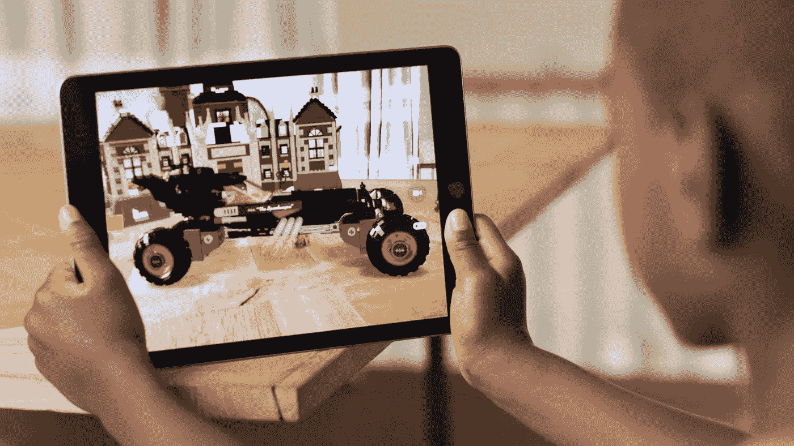

# 第一个上市，还是同类最佳？

> 原文：<https://medium.com/hackernoon/first-to-market-or-best-in-class-f83c35e33277>

现在每第二篇文章都是关于苹果的 ARKit。开发人员正在创建演示来[测量房间](https://thenextweb.com/apps/2017/06/26/ar-measure-smartphone-ruler/#.tnw_ItegpiPT)，[绕着地图走](http://www.idownloadblog.com/2017/06/24/ios-11-maps-vr-mode/)，甚至[扮演《我的世界》](http://toucharcade.com/2017/06/26/watch-the-arkit-bring-minecraft-and-a-measuring-tape-to-life/)。尽管技术非常相似，但它获得的墨水量远远超过了对谷歌 Tango 和微软 HoloLens 等早期成果的关注。

事实上，如果你听听专家的意见，[苹果的产品在它实际能提供的方面落后于](https://www.imore.com/apple-arkit-vs-google-tango-vs-microsoft-hololens-augment-my-reality)*。惊讶吗？我们是。*

从标题上看，这听起来像是圣杯的到来。ARKit 会改变一切。ARKit 会让 iPhone 8 立即成为畅销书。ARKit 将改变我们所知的技术。然而，实际的横向测试表明，苹果的 AR 产品比 Tango 渲染更慢，覆盖的地面更少。它的分辨率低于 HoloLens，缺乏头戴式选项意味着它的通用性也较差。尽管如此，看起来那些圣杯的宣告可能是真的:早期的报告显示了巨大程度的兴奋。那么，如果它不是同类工具中最好的，它有什么能让它从容地击败竞争对手呢？

*真的真的很容易得到。*

当 iOS 11 在秋季进行商业发布时，每个拥有下一代 iOS 设备的人都可以访问 ARKit 创建的应用程序。平板电脑、手机和电脑都将兼容。而且不仅仅是最后几代会升级；[所有采用 A9 或 A10 处理器的设备](http://blakespot.com/ios_device_specifications_grid.html)都将能够处理新的操作系统。苹果可能不是同类中最好的，但它将是第一个打破消费市场的。

谷歌在营销项目 Tango 上投入了大量精力，但迄今为止，它只在两款设备上可用:联想 Phab 2 和华硕 Zenfone。当旗舰产品谷歌 Pixel 发布时，没有备受称赞的 Tango，这让业内所有人都感到惊讶。自去年年底传言发布“风暴”以来，没有任何关于未来设备的传言。开发人员没有对这种很酷的新技术进行大量演示，因为这有什么意义呢？很少有消费者能够使用它。

HoloLens 更成功，但鉴于其 3000 美元的价格标签，它自然会进入不同的市场。我们已经看到了一些非常令人惊讶的 HoloLens 演示，包括我们痴迷的一个[旅鼠游戏](http://www.hammerandtusk.com/blog/article/lemmings-is-even-more-fun-in-3-dimensions)，以及一个得到很多关注的[马里奥演示](http://www.newsday.com/business/technology/hololens-wearing-mario-galavants-through-central-park-1.13769079)。但微软正专注于他们擅长的领域，即企业市场，HoloLens 将大规模进入培训和行业(这都是*超过* NASA)。他们目前是同类产品中最好的，但销量只有“T6”千分之，他们对此很满意。

众所周知，苹果公司在别人闲荡的时候等待，然后大摇大摆地推出一款非常优秀的产品。众所周知，他们会推迟发布，直到他们有了光滑的、经过良好测试的、闪亮的和完美的东西。他们的 AR 战略似乎与此相反。

时间将会证明率先上市是否是更好的策略，或者一旦谷歌真正进入游戏，苹果是否会努力与更强大的产品竞争。但现在，我们迫不及待地想玩人们使用 ARKit 制作的应用程序，其他人似乎也有同感。

*由雷恩·汉德曼为*[*www.hammerandtusk.com*](http://www.hammerandtusk.com/blog/article/first-to-market-or-best-in-class)*所写。*

> [黑客中午](http://bit.ly/Hackernoon)是黑客如何开始他们的下午。我们是 AMI 家庭的一员。我们现在[接受投稿](http://bit.ly/hackernoonsubmission)并乐意[讨论广告&赞助](mailto:partners@amipublications.com)机会。
> 
> 如果你喜欢这个故事，我们推荐你阅读我们的[最新科技故事](http://bit.ly/hackernoonlatestt)和[趋势科技故事](https://hackernoon.com/trending)。直到下一次，不要把世界的现实想当然！

