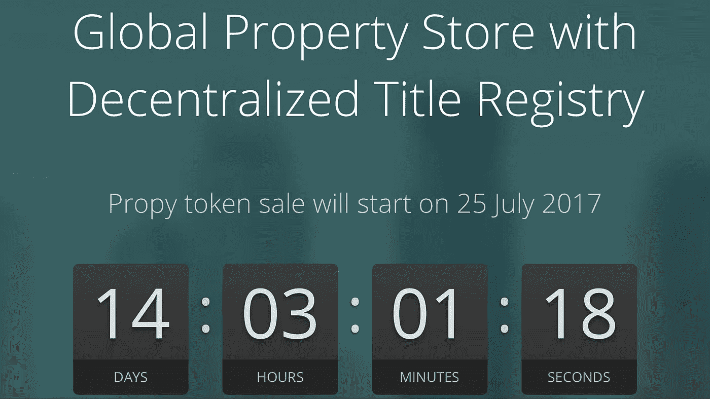

# 房地产的第一次象征性销售

> 原文：<https://medium.com/hackernoon/first-token-sale-in-real-estate-d6fe834daac2>

我在 2003 年开始了我的房地产职业生涯——大约 15 年前——从那以后我一直在建造和销售房产。我向来自世界各地的买家出售过房产，寻找和完成跨境交易的困难一直是我的一大困扰。

当然，跨国房地产交易通常涉及语言和文化的复杂性。但房地产的本地化和官僚性质、跨境支付的困难以及交易各方面对无数第三方的需求，充其量只能导致长时间的延误。最坏的情况是，对欺诈的担忧和一般的交易摩擦会让买家犹豫是否要完全进入这些市场。这导致市场流动性下降，从而加剧了问题。我在 2015 年创建了 Propy，以解决与这些跨境房地产交易相关的问题。我有第一手和长期的经验与跨境房地产购买，我相信现在是时候使用目前的技术来解决这个问题。

特别是区块链技术。

# 两周前，Propy [宣布了其即将到来的代币销售](https://bitcointalk.org/index.php?topic=1982115.0)，这是我们提供的整体解决方案的重要组成部分。

2016 年，我和我们的首席区块链架构师安德烈·扎莫夫斯基(Andrey Zamovski)一起访问新加坡，会见了一些亚洲大型房地产公司。这些公司长期以来一直需要解决方案来实现部分或全部跨境房地产交易的自动化。

在新加坡时，我们会见了财富 500 强企业 JLL 亚太公司的高管，他们在 T2 倡导对房地产购买和产权转让——交易摩擦的一个特殊来源——采取区块链解决方案。其他公司也表达了同样的担忧。

这些公司对区块链技术有一个基本的理解，以及如何使用它来使房地产交易更容易。在这次旅行中，安德烈建议做一次象征性的销售。然而， [ICO](https://hackernoon.com/tagged/ico) 和代币销售的概念在一年前还是新鲜事物。如今，人们的意识正呈指数级增长。

因此，一批创业公司试图利用这种炒作，在一个仓促设计的解决方案上栓上一个令牌，任何令牌，并向世界宣布 ICO。我们认为，这些解决方案几乎没有现实意义，也没有向市场提供可行的产品。

Propy 与众不同。我们在房地产领域数十年的实际经验已经引导我们创造了一个深思熟虑的，综合的产品，我们想用自己。我们使用区块链和其他技术，以帮助几乎所有方面的房地产交易:付款，文书工作和产权转让。

我们的竞争对手充其量只是提供我们服务的一部分，例如在区块链为特定司法管辖区进行业权转让。如果没有我们提议的所有权转让和自动付款、文书工作和身份验证全球标准，采购自动化和全球分类账就无法运作。

简而言之，Propy 将重新思考全球范围内的房地产交易。但我们也有基于步骤的短期解决方案来帮助我们实现这一目标。Propy 今天开展代币销售是因为代币销售是我们一年前制定的长期解决方案的重要组成部分，而不是因为当前围绕 ico 的炒作。

## **为什么房地产行业需要区块链和令牌化？**

区块链技术解决了“[双支出](https://en.m.wikipedia.org/wiki/Double-spending)进行房地产交易合法权益转让的难题。这形成了我们的技术基础，让投资者和业主执行房地产物业购买完全在线。如果不解决非区块链交易固有的双重支出问题，这个问题就无法解决。

其中，区块链是一项经过测试的技术，它允许在没有中间人参与的情况下，将某些东西(例如，T4 加密货币)从一个所有者的钱包转移到另一个所有者的钱包。就房地产交易而言，这种毫不费力的资金和合法权利转移如今已经超出了现实范畴，因为它们与政府法规、税收、支付处理和文件转移等都有关联。，而所有这些流程在不同的管辖区之间存在显著差异。

我们的策略以逐步过渡至分散模式为基础，在买卖双方之间减少、尽量减少或完全没有第三方的参与。为此，去年我们开发了一种基于 Ethereum 智能合同的产品，该产品符合加州和美国其他州的现有法规，并且我们与房地产市场的主要参与者合作对该产品进行了验证。

到 2017 年底，我们预计第一笔交易将在*产权登记处*完成。每次所有权转让都需要*Propy Utility token(PRO)*进行处理和验证。此外，我们正在与几个政府进行谈判，以接受由我们的分布式注册发布的地契作为所有权的法律证明。因此，通过让更多的政府和房地产公司参与进来来发展生态系统，将会增加专业代币的使用。将创建数量有限的令牌(1 亿个)。

## **为什么 Propy 要做代币销售？**

对于大多数开展 ICO 的公司来说，ICO 是一种筹集资金的方式，是吸引风险资本的替代方式。风险投资资金通常意味着强调一种战略，即专注于早期利润的实现和对最有前途、低风险战略和市场的追求。因此，在房地产这样一个高度监管的行业进行 P2P 交易并不合适。

作为第一阶段目标，我们的战略还侧重于在现有的监管环境下，寻求一种可盈利的、自我维持的自动化跨境和司法管辖区房地产交易模式。但这只是我们的第一阶段目标。我们的长期无限策略是追求实时分散的 P2P 交易，这一目标涉及游说立法改革，这需要全球令牌持有者群体和整个生态系统参与者的支持和参与。

在我们世界级顾问的帮助下，包括迈克尔·阿灵顿、大卫·考恩、文尼·林厄姆和阿兰·皮内尔，我们正在开发一个可扩展的、独特的产品，充分利用区块链在房地产领域的优势。

## 谁将购买我们的代币？

系统中需要一个令牌来解锁对支持区块链的*属性注册表*的访问，以便进行所有权转移。令牌具有多种功能，包括(1)为社区吸引新用户和合作伙伴提供经济激励，以及(2)安全性——作为保护注册管理机构免受泛滥和其他类型滥用的费用。

我们希望对跨境房地产交易感兴趣的公司和个人成为我们代币的主要买家。跨境房地产交易是一个 3400 亿美元的年度市场，每年增长 13%。Propy 打算大力发展这个市场。

我们还对行业专业人士进行的代币销售感兴趣，他们包括风险资本家、加密货币基金和最近完成代币销售的其他公司的高管。这些顾问和投资者为创造 Propy 的产品做出了巨大贡献，我们欢迎他们参与代币销售，以帮助创造一个流动的市场。

最后，我们寻求，并给予严重的奖励，大量参与我们的社区，在追求我们的最终目标的 P2P 房地产交易平台。我们 35%的代币被指定用于激励潜在的购房者和经纪人加入房地产，以及激励政府在*房地产登记处*进行初始数量的所有权转让。

在生态系统参与者的帮助下，我们完全有信心看到 Propy 发挥其全部潜力。