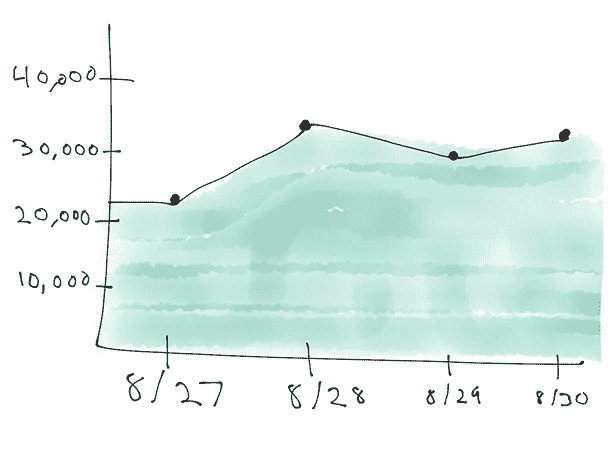
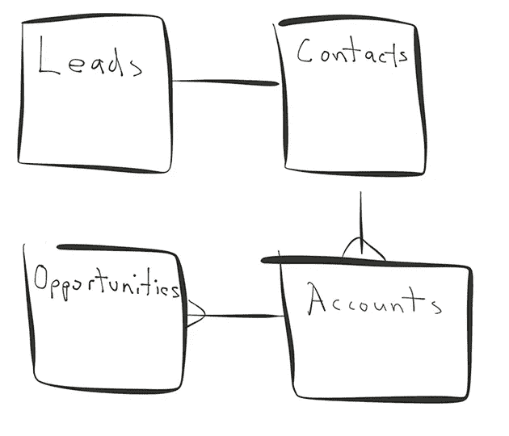
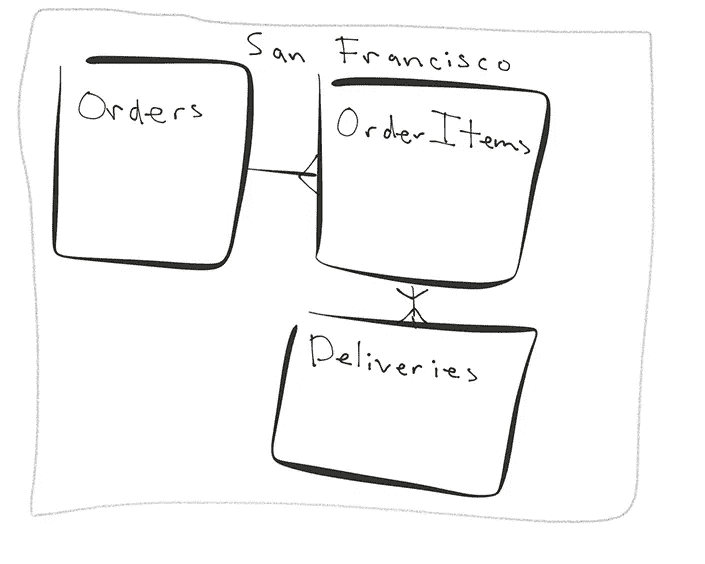

# 用于分片的五种数据模型，哪一种是正确的

> 原文：<https://medium.com/hackernoon/five-data-models-for-sharding-and-which-is-right-f5c3fa480b00>

当谈到[扩展您的数据库](https://www.citusdata.com/product/)时，存在挑战，但好消息是您有选择。当然，最简单的选择是扩展您的硬件。当你达到扩展的上限时，你有更多的选择:[分片](http://www.craigkerstiens.com/2012/11/30/sharding-your-database/)，删除你认为在[未来](https://hackernoon.com/tagged/future)可能不需要的数据，或者试图用[微服务](https://martinfowler.com/microservices/)来缩小问题。

如果你负担得起，删除部分数据是很简单的。关于分片，有许多方法，哪种方法是正确的取决于许多因素。在这里，我们将回顾对五种分片方法的调查，并探究是什么因素引导您采用每种方法。

# 客户或租户分片

SaaS 应用程序通常服务于许多客户(称为“租户”)，这就是为什么我们经常将这些应用程序称为“[多租户应用程序](https://www.citusdata.com/blog/2016/08/10/sharding-for-a-multi-tenant-app-with-postgres/)”如果你是一家 SaaS 企业，通常情况下，一个客户的数据不会与其他客户的数据发生交互。这与社交[网络](https://hackernoon.com/tagged/network)截然不同，后者在不同用户生成的数据之间有很多相互依赖关系。

对于多租户的 SaaS 应用程序，数据通常是事务性的。事实证明，付费用户不太喜欢你在这个过程中丢失他们的一些数据。由于许多此类事务性、多租户 SaaS 应用程序(比如:CRM 软件、营销运营、web 分析)的性质，您需要强有力的保证，即当数据保存到数据库中时，数据将保留在那里。并且您的客户希望您实施引用完整性。

关于多租户应用程序的另一个有趣的事情是，它们的数据模型会随着时间的推移而发展，以提供越来越多的功能。与受益于网络效应增长的消费者应用程序不同，B2B 应用程序通过为客户添加新的(理想的粘性)功能来增长。通常情况下，新特性意味着新的数据模型。最终结果是 10 到 100 个表，有时有复杂的连接。如果这听起来像你，那么按租户分片是一种安全的(也是推荐的)方法。

# 地理分片

近几年来，另一类最受关注的应用是基于地理位置的应用:*感谢 iPhone* 。无论是 Lyft、Instacart 还是 Postmates，这些应用都与位置有着重要的联系。你不会住在阿拉巴马州，从加州订购食品杂货。如果你要订购一辆从加州到阿拉巴马州的 Lyft 皮卡，你将会等上很长一段时间。

但是，仅仅因为你有一个带有地理倾向的应用，并不意味着地理就是正确的碎片键。按区域进行分片的关键在于，特定地理区域内的数据不会与另一个地理区域发生交互。并非所有有地理数据的应用程序都意味着地理分片方法是有意义的。一些需要大量跨地理边界交互数据的应用程序(如 Foursquare)不太适合按地理进行分片。

与上面的多租户应用程序类似，依赖于地理位置的应用程序的数据模型往往更加进化。我的意思是，对于依赖于位置的应用程序，你有许多相互之间有外键依赖的表，并且经常在它们的查询中相互连接。如果您能够将查询限制在一个地理位置，并且数据很少跨越地理边界，那么按地理位置分片可能是一个不错的方法。

# 按实体 id 分片(随机分布的数据)

我们的下一个数据模型可以适用于许多不同的数据库系统，这是因为它在你的数据模型之间没有很强的相互依赖性(读:没有连接)。由于不需要连接和[经常性事务](https://brandur.org/acid)(与关系数据库相同),有一系列数据库可能有帮助，也可能没有帮助。您正在解决的问题是，单个节点(或核心)的数据太多，无法快速处理。

当按实体 id 分片时，我们希望尽可能均匀地分布数据，以最大化系统内的[并行性](https://docs.citusdata.com/en/latest/tutorials/real-time-analytics-tutorial.html)。对于一个完全均匀的分布，你可以通过一个随机的 id 进行分片，本质上是循环数据。现实生活有点混乱。虽然您可能没有 50 个紧密耦合的表，但是有 2-3 个您想要连接的表是很常见的。我们认为实体 id 模型最有意义的地方是 web 分析用例。

如果您的查询没有任何连接，那么使用 uuid 来分割您的数据会很有意义。如果有一些基本的连接可能与一个会话有关，那么用同一个 shard 键对相关的表进行分片可能是理想的。跨表共享一个 shard 键允许您[协同定位数据](https://www.citusdata.com/blog/2016/12/22/scaling_out_sql_with-colocation/)进行更复杂的报告，同时仍然提供相当均匀的并行分布。

# 分割图表

现在我们来看也许是最独特的方法。在查看图形数据模型时，您会看到不同的缩放方法，以及对分片容易程度的不同看法。图表模式在流行的 B2C 应用中最为常见，如 T2 的脸书和 Instagram，这些应用利用了社交图表。在这里，数据之间的边之间的关系可能就像数据本身一样是查询的关键。在这一类别中，[图形数据库](https://www.graphenedb.com/)开始独立成为社交图形和应用程序的有效解决方案，这些应用程序与数据之间有着非常高的联系。如果你想更深入地了解，内部数据库 TAO 上的[文件](https://www.usenix.org/system/files/conference/atc13/atc13-bronson.pdf)是一份很好的读物。

对于图形数据库，有两个关键项，即作为类型化节点的*对象*和指定到它们的连接的*关联*。对于对象，一个例子可能是 Craig 在 Citus 登记；关联将与丹尼尔，谁订阅克雷格的更新。对象通常是可以重复出现的东西，而关联捕捉诸如*谁*(谁订阅了更新，谁喜欢等等。)

在这种模式下，数据通常以几种不同的形式复制。然后，应用程序负责映射到对获取数据最有用的表单。结果是，您有以不同方式分片的数据的多个副本，最终数据通常是一致的，然后您必须将一些应用程序逻辑映射到您的分片策略。对于脸书和 Reddit 这样的应用来说，除了采取这种方式别无选择，但这确实要付出一些代价。

# 时间划分

切分的最后一种方法是某些应用自然倾向的方法。如果您正在处理以时间为主轴的数据，那么按天、周、小时、月进行分区是正确的。在查看某种形式的事件数据时，时间划分非常常见。事件数据可以包括广告的点击/展示，它可以是网络事件数据，或者来自系统监控角度的数据。事实证明，大多数数据都有某种类型的时间叙述，但是按时间划分是正确的选择吗？

在以下情况下，您可能希望使用基于时间的分区方法:

1.您可以通过以时间为轴对数据进行分析来生成报告/警报。
2。您定期删除数据，以便对其进行有限的保留。

时间划分确实有意义的一个例子是，当你是一个只报告 30 天数据的广告网络时。另一个例子:您正在监控网络日志，并且只查看最近 7 天的日志。当你混合了最近(过去 7 天)的数据和历史数据，比如一年前的数据时，困难就来了。

# 正确的分片方法取决于您的应用

与许多关于架构和基础设施的决策一样，必须做出权衡，最好将方法与您的应用程序的需求(以及您的客户的需求)相匹配！)在分片的情况下，将分片的类型与应用程序的需求相匹配是能够有效伸缩的关键。当您将您的数据模型和用例与正确的分片类型相匹配时，许多困难的问题，如对应用程序重写的大量投资、确保数据一致性以及在问题变得更糟 6 个月后重新审视您的问题，都可以逐渐消失。