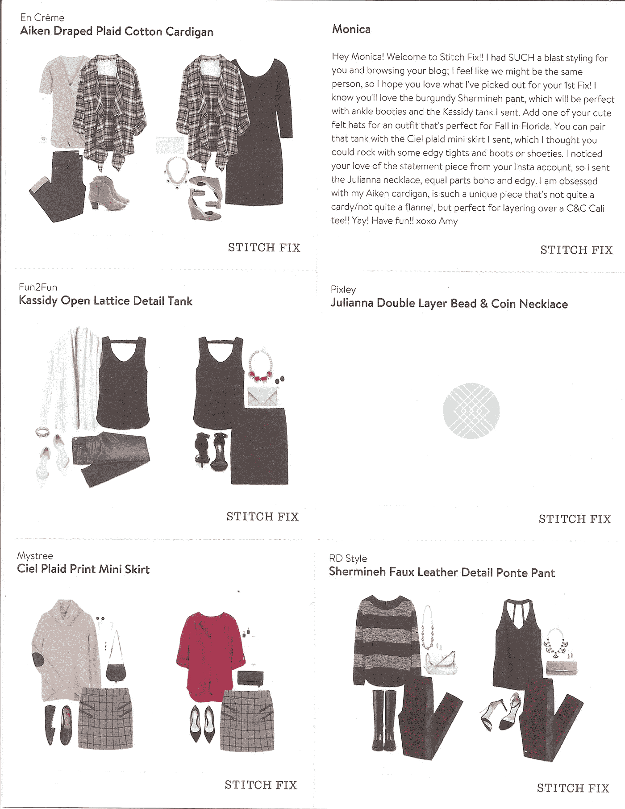
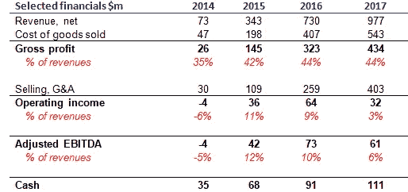
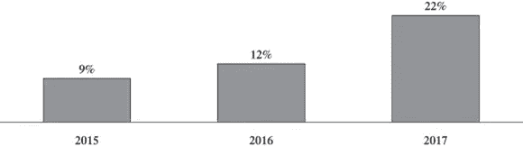

# 从 Stitch Fix IPO 招股说明书中得到的 5 点启示

> 原文：<https://medium.com/hackernoon/five-interesting-points-from-stich-fix-ipo-prospectus-915d8008d10e>

2011 年，Katrina Lake (34 岁)在哈佛商学院读二年级。在波士顿的一个小公寓里，她梦想为每个人提供个人时尚助理。六年后，她创办的公司 Stitch Fix 上市，收入超过 10 亿美元，EBITDA 为正，活跃客户超过 200 万。

**这是怎么回事？**

Stitch Fix 是关于找回时尚零售体验的一部分，这种体验在向电子商务的迁移中有些丢失——个性化。在你的电子商务体验中，缺少来自店内员工的造型技巧？缝合修复是为你-提交数据(大小，适合，价格偏好，风格)，选择装运间隔，并获得您的“修复”。

This is how it looks

这 5 项修正是数据科学家(约 75 人)和算法的共同努力，并通过兼职造型师团队(约 3500 人)的洞察力得到增强。顾客收到修复后，选择他们喜欢的商品(只为这些商品付费)，然后把剩下的退回。收集反馈并对退货进行分析，以改善客户体验和修复 fit。每次修复收费 20 美元，可用于购买，如果顾客保留所有 5 件商品，她将获得 25%的折扣。

**财务**

Source: Stich FIx S-1

2017 年(该公司的财年于 7 月结束)该公司的收入为 9.77 亿美元，同比增长 33.8%。该公司 2016 年的净收入为 3300 万美元，2017 年的净亏损为 100 万美元，2016 年和 2017 年的调整后 EBITDA 分别为 7300 万美元和 6100 万美元。该公司拥有 220 万活跃客户[【1】](#_ftn1)，同比增长 31%。

Stich Fix CEO, Katrina Lake

Stitch Fix 披露的队列数据有限，因此很难全面了解其业务的健康状况。我们确实了解到，客户在服务的前六个月比接下来的六个月花费更多，同样，第一年比第二年花费更多。这可能意味着客户对服务感到厌倦或厌倦，公司必须更加努力地推动更多创新和参与。从积极的一面来看，随着时间的推移，随着每次修复购买的平均商品数量的增长，该公司似乎改进了其产品:

Percentage growth in the average number of items purchased per Fix during each respective year compared to the average number of items purchased per Fix in 2014\. (Source: Stich Fix prospectus).

该公司没有披露客户流失数据，但它确实披露了 2017 年 86%的收入(2016 年为 83%)来自回头客。

**估值**

该公司没有透露其估值预期，但我们知道它去年以 20 亿美元的估值从员工手中购买了股份(Lake 以 100 万美元的价格出售了股份)，这将符合 Asos 和 Zalando 等在线时尚公司的 2 倍收入倍数。但是，据路透社报道，该公司可能寻求 30-40 亿美元的估值，这意味着他们将试图把这个故事作为一个数据/技术公司而不是普通的电子商务公司来销售。

**我从招股书中学到的最有趣的事情:**

***1。*** ***我们盈利增长，大家起来唱***

在截至 2017 年 7 月的 12 个月中，该公司的净收入[【2】](#_ftn2)为 9.77 亿美元，毛利为 4.34 亿美元(44.5%)。毛利率与更大规模的其他 e-com 时装公司一致。营业收入占收入的 3.3%，低于 2016 年的 8.8%。该公司表示，自 2014 年以来，它的现金流为正，2016 年和 2017 年的 EBITDA 都为正。2016 年公司实现盈利。2017 年，它回到了红色，主要是因为营销支出增加。广告支出从 2016 年的 2500 万美元增长到 2017 年的 7050 万美元。

**2。** **亚马逊世卫组织？**

在招股书中搜索 Amazon 这个词只会得到两个结果——没有一个与竞争相关(不像 data 这个词出现了 229 次)。

*“我们与百货公司、专业零售商、折扣连锁店、独立零售店、这些传统零售竞争对手的在线产品以及销售与我们相同或相似商品和服务的电子商务公司竞争”。*

以上是招股书关于竞争的部分，因为你看不到任何关于西雅图巨人的内容。尽管许多人认为亚马逊衣柜公司对 Stitch Fix 构成了直接和迫在眉睫的威胁，但我倾向于同意该公司的观点，它并非如此。Stitch Fix 时尚体验由 3500 名造型师和一名 34 岁的时尚创始人提供支持，与亚马逊相差甚远。

**3。** **哦，那个亚马逊！**

那么，如果不是与竞争相关，那么招股书中提到的亚马逊是什么？一份是该公司首席技术官的简历——凯茜·波林斯基在西雅图呆过一段时间。但是更有趣的是在系统中断下的风险因素部分提到了 A 字(无意冒犯，Cathy ):

“…我们过去也经历过中断。例如，2017 年 2 月，由于托管我们大部分技术基础架构的****亚马逊网络服务中断，我们支持仓库运营和订单履行的应用程序出现中断，导致我们能够进行的修复发货数量暂时放缓”。****

**像网飞和许多亚马逊零售竞争对手一样，Stitch Fix 的基础设施也依赖于 AWS。据媒体报道，由于零售方面的竞争，其他零售商如 Target 选择离开 AWS。**

*****4。*** ***像蝴蝶一样飘，像蜜蜂一样叮*** *【穆罕默德·阿里】***

**效率。效率通常被定义为在一个过程中所做的有用功与消耗的总能量之比。Stich Fix 重新定义了电子商务的效率，电子商务通常是资本密集型行业。该公司在几年内发展到收入 10 亿美元的业务，而股本只有 4250 万美元。如果我们假设估值为 20 亿美元，这只是公司价值的 2%，或者如果估值达到传言的 40 亿美元(对我来说，4 倍的收入倍数听起来太高了，但谁知道呢)的 1%。这是独特的。筹集如此之少的资金一定促使 Lake 和她的团队在营销方面非常高效和有效，而没有在获取客户方面花费太多，这在大量融资的电子商务初创公司中经常发生。**

*****5。*** ***谁掌管世界？女生们！女孩们，我们运行这个 motha(耶！)*** *【碧昂斯】***

**如果你已经读到这里，并且有两只眼睛，现在你应该知道 Stich Fix 是由一位女性创立的(实际上是两位女性，艾琳·莫里森·弗林与莱克共同创立了这家公司)。但你可能不知道，该公司 55%的管理团队和一半的董事会成员是女性。这在硅谷并不常见。Stitch Fix 拥有 5，800 多名员工，包括 3，400 多名造型师(许多人兼职)、1，500 名全职履行中心员工、200 名客户体验员工、95 名工程师和 75 名数据科学家。现在是最后的数字:公司超过 86%的员工是女性。那么谁在统治世界？是啊。**

****商战总结****

**有人说这是一种时尚，有人说它会持续下去。我相信是后者，但谁知道呢？我所知道的是，在亚马逊时代，创办一家电子商务公司很有挑战性。作为一家电子商务公司，生存更具挑战性。仅筹集了 4250 万美元的资金，就实现了 10 亿美元的收入和利润，这真是太棒了。祈祷 IPO 成功，给那些试图在商战中生存下来的小公司带来一些新鲜的能量和希望。**

*****你怎么看？史迪奇会留在这里吗？还是一时兴起？或者可能会像 Diapers.com 和 Zappos 一样被亚马逊吃掉？*****

**.:.**

**[【1】](#_ftnref1)去年至少使用过一次该服务的客户**

**[【2】](#_ftnref2)收入，不包括造型费、销售税、退款、礼品卡、推荐积分和清仓销售的影响**

**#商业战争**