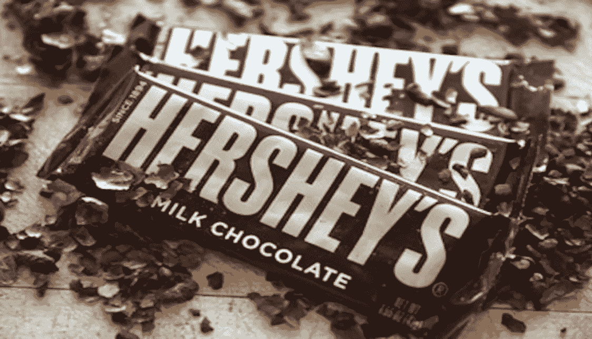
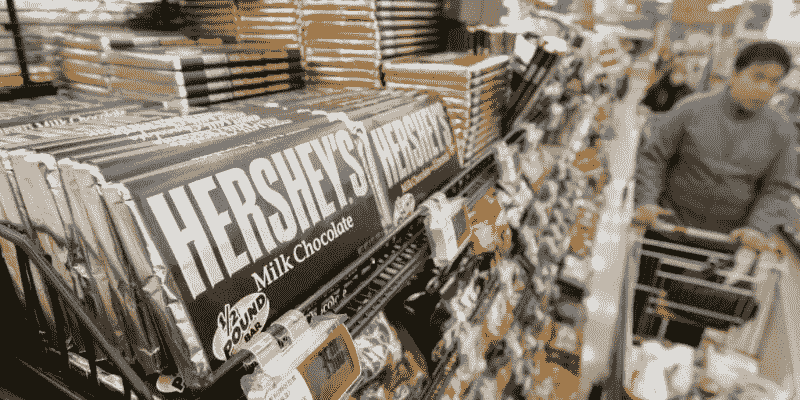

# 帮助成功人士从失败中反弹的五种心态:米尔顿·好时的教训

> 原文：<https://medium.com/hackernoon/five-mindsets-that-have-helped-successful-people-bounce-back-from-failure-lessons-from-milton-223b480ab3b9>

[Featured Image: Scott Olson/Getty Images.]

失败并不总是坏事。

谁不爱吃巧克力？我们都知道好时公司，但也许我们并不都知道这家著名巧克力公司的创始人米尔顿·好时的故事。

米尔顿·好时是一个“无名小卒”，根据[的传记](http://www.biography.com/people/milton-hershey-9337133)，他成为了美国制造商和慈善家，创立了好时巧克力公司，并在世界大部分地区推广巧克力糖果。

在获得成功之前，他创办了三家独立的糖果企业。没有一个像他希望的那样成功，但最终他创办了好时巧克力公司，这使他成为了行业领导者。

几次失败后往往会成功。在个人和职业生涯中，我们会犯很多错误。如果我们从错误中吸取教训，生活就会宽容我们。然而，如果我们沉溺于自己的错误，它们会吞噬我们。

借助好时的生活故事，请允许我分享帮助人们从失败中恢复过来的五种心态——这是我从自己的[之旅](http://www.faisalhoque.com/)中所熟知的。

## 1.没有什么是不变的

> “当你经历一段困难时期
> 当一切似乎都与你背道而驰……
> 当你觉得自己甚至不能再忍受一分钟
> 时，千万不要放弃！
> 因为是课程会分流的时间地点！”—鲁米

米尔顿·赫尔希 14 岁辍学，开始跟随宾夕法尼亚州兰开斯特的一位糖果大师学习。四年后，他向姑姑借了 150 美元，在费城的市中心开了一家自己的糖果店。

努力工作了五年却收效甚微，他不得不关闭商店。他在丹佛与父亲团聚，并在一家糖果店找到了工作。正是在丹佛，他发现了焦糖以及如何用鲜奶制作美味的糖果。

仅仅因为你还没有找到做一件事的方法，并不意味着你是一个失败者。当你认为自己是个失败者时，你就陷入了消极的恶性循环，这会影响你未来的行动。

在任何结果中，通常都有一定比例的外部影响。将失败视为暂时事件有助于我们采取实际的、非情绪化的步骤来解决它。

## 2.这很令人失望，但我会坦然面对

> "没有摩擦，宝石就无法抛光；没有考验，人就无法完美."—中国谚语

即使你能够承认你不是一个失败者，这也不会减少失败的痛苦。坚韧不拔的人发展出一种心理能力，使他们能够在逆境中轻松适应，像绿色的芦苇一样弯曲，而不是像高大的橡树一样折断。他们接受，适应，然后继续前进。

企业家米尔顿·赫尔希(Milton Hershey)从头再来，先是在芝加哥，后来在纽约。他两次都失败了，但挫折从未使他退缩。

1883 年，他在宾夕法尼亚州的兰开斯特创办了兰开斯特焦糖公司，他坚信自己可以建立一个成功的糖果公司。很快，他的生意兴隆，将焦糖运往全国各地。

当我们有信心和从失败中反弹的经验时，接受未来的挑战似乎并不那么令人畏惧。这是为了成功，决定把自己放在障碍跑道上。

*图片:李在元/路透社*

## 3.我能从中学到什么？

> "改变和变得更好是两回事。"—德国谚语

如果我们没有成功的信念，我们就不应该开始做任何事情，但是众所周知，错误是通往最终成功的必不可少的一部分。学习并不来自于把每件事都做得尽善尽美——最好的学习发生在我们崩溃的时候。

1893 年，米尔顿·好时在芝加哥的世界哥伦比亚博览会上近距离观察了巧克力制作艺术。尽管他最近在焦糖生意上取得了成功，但这深深地激励他创办了好时巧克力公司。

他想重新定义牛奶巧克力的制作方式。牛奶巧克力当时在很大程度上被认为是瑞士的专长。好时公司希望找到一种新的配方来大规模生产大众可以接受的牛奶巧克力糖。

米尔顿·好时在 1900 年以 100 万美元的价格出售了他的兰开斯特焦糖公司，创办了好时巧克力公司。

1905 年，好时巧克力公司开始生产，为糖果业开辟了新的道路。米尔顿·好时从兰开斯特焦糖公司退出后，花了三年多的时间来设想和规划他的现代糖果制造设施。

正如[的传记](http://www.biography.com/people/milton-hershey-9337133)所写，“很快，好时巧克力公司的成功远远超过了其创始人之前的风险投资。他的获奖创意包括 1907 年公司创始人以自己的名字命名的好时之吻。商标铝箔包装是在 1924 年增加的。

## 4.如果有人批评，没关系

> “批评只是别人的看法。即使是本领域的专家有时也会出错。你可以选择是相信一部分，一点也不相信，还是全部相信。你的想法才是最重要的。”― [鲁道夫·科斯塔](http://www.goodreads.com/author/show/3302452.Rodolfo_Costa)，“我父母给我的建议:以及我从错误中吸取的其他教训”

当我们犯错时，最大的恐惧是别人会对我们做出负面评价。其他人经常出于他们自己的不安全感而使用批评。它说的更多的是他们，而不是我们。

看看这篇《纽约时报》批评好时及其巧克力的文章:

“好时的糖果制作天才很难保持一致。他花了数年时间试图找出如何“将芜菁、欧芹、芹菜甚至甜菜混合到巧克力中”甚至他的标志性产品也有——现在仍然有——批评者。与瑞士巧克力相比，好时巧克力“有一种淡淡的酸味”，这是牛奶脂肪发酵的结果，是使用液态炼乳而不是奶粉的副作用。这种优势“定义了美国人对巧克力的口味，他们会在甜而微酸的味道中找到和谐。”就像他的糖果一样，1945 年去世的好时也有缺陷。"

最严厉的批评者往往是那些没有勇气将自己置于风口浪尖的人——他们经常幸灾乐祸地看着别人的错误来提升自己的自尊。

当我们接受一项困难的任务时，我们必须确保我们是为自己而做，而不是为了得到别人的认可。在这种情况下，失败要容易处理得多。

## 5.好，接下来是什么？

> “改变的第一步是意识。第二步是接受。第三步是行动。”—纳撒尼尔·布兰登

任何错误的最大威胁不是直接后果，而是对我们行为的长期影响。如果我们把一个错误放在心上(特别是当我们不能做任何事情来影响结果的时候)，能够采取下一步似乎要困难得多。

失败已经过去了，为什么还要纠结于失败呢？如果我们不采取积极的下一步，我们就有陷入失败情绪循环的风险。开始下一个项目来占据你的头脑。不要只是坐在你的房间里等待世界吞噬你。也许这是从好时公司的故事中得到的最大教训。

版权所有(c) 2016，作者 Faisal Hoque。保留所有权利。
**原创文章**[**@ business insider**](http://www.businessinsider.com/5-mindsets-that-have-helped-successful-people-bounce-back-from-failure-2016-5)**。**

我是一名企业家和作家。 [SHADOKA](http://shadoka.com/) 等公司创始人。Shadoka 促进企业家精神、增长和社会影响。《万物互联——如何在创意、创新和可持续发展的时代进行变革和领导》(麦格劳·希尔，2014 年)和《生存与发展:富有弹性的企业家、创新者和领导者的 27 种实践》(励志出版社，2015 年)。在推特上关注我 [@faisal_hoque](https://twitter.com/faisal_hoque) 。

> [黑客中午](http://bit.ly/Hackernoon)是黑客如何开始他们的下午。我们是阿妹家庭的一员。我们现在[接受投稿](http://bit.ly/hackernoonsubmission)并乐意[讨论广告&赞助](mailto:partners@amipublications.com)的机会。
> 
> 如果你喜欢这个故事，我们推荐你阅读我们的[最新科技故事](http://bit.ly/hackernoonlatestt)和[趋势科技故事](https://hackernoon.com/trending)。直到下一次，不要把世界的现实想当然！

