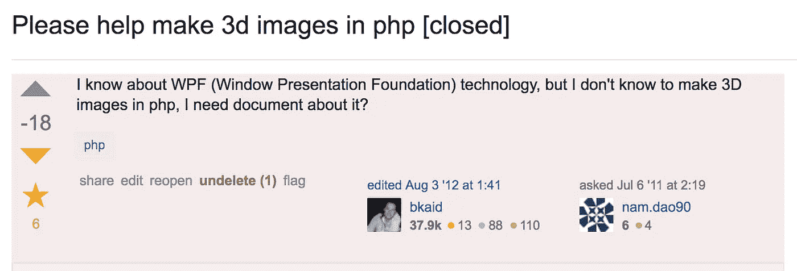
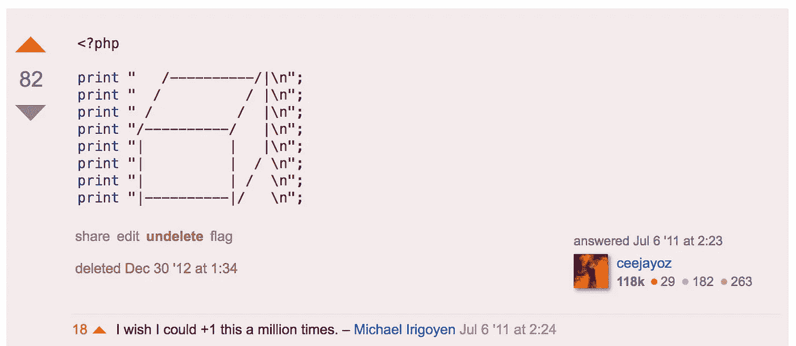

# 五个主要是堆叠交换链接的书签

> 原文：<https://medium.com/hackernoon/five-mostly-stackexchange-links-to-bookmark-right-now-5152cf16bd1>

## 从 5 开始倒数。

我们的安全审计员是个白痴。我如何给他想要的信息？——关于一名[安全](https://hackernoon.com/tagged/security)审计员要求一名[系统管理员](https://hackernoon.com/tagged/sysadmin)交出纯文本用户名和密码以及更多信息的故事。

4) [蹦床为什么管用？](http://softwareengineering.stackexchange.com/questions/333317/why-do-trampolines-work) — JavaScript (≤ ES5)不支持尾部调用优化，有在递归上吹栈的风险。蹦床绕过了这一点，很高明。阅读第二个答案(杰克)。

3) [对于处理文本，每个程序员绝对需要了解的编码和字符集](http://kunststube.net/encoding/)——如果你想知道什么时候编码或解码 UTF-8，读一下这个。

2) [免费提供的编程书籍清单](https://github.com/vhf/free-programming-books) —一个宝藏。

1)[Frisby 教授的《函数式编程指南》](https://www.gitbook.com/book/drboolean/mostly-adequate-guide)——这确实坚定了我的决定，转到 FP 的世界，在我的 JS 代码中采用 currying、compositions 等，并开始使用 Haskell 和 LISP。

## 荣誉奖:

[请帮忙用 php 制作 3d 图像【关闭】](http://stackoverflow.com/questions/6590902/please-help-make-3d-images-in-php)

因此，除非你在 StackOverflow 上有相对较好的分数，否则你可能看不到它，因为它已经关闭了，所以我将在这里发布一些屏幕截图。毫无疑问，这是 StackOverflow.com 的最佳答案。

*如果你喜欢这个，请点击💚下面这样别人也能欣赏！*

> [黑客中午](http://bit.ly/Hackernoon)是黑客如何开始他们的下午。我们是 T21 家庭的一员。我们现在[接受投稿](http://bit.ly/hackernoonsubmission)并乐意[讨论广告&赞助](mailto:partners@amipublications.com)机会。
> 
> 如果你喜欢这个故事，我们推荐你阅读我们的[最新科技故事](http://bit.ly/hackernoonlatestt)和[趋势科技故事](https://hackernoon.com/trending)。直到下一次，不要把世界的现实想当然！

