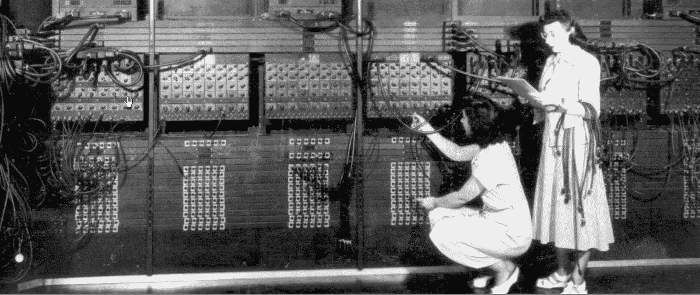
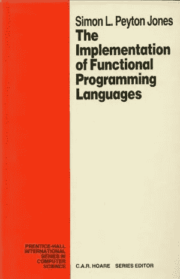
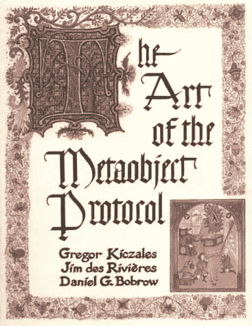
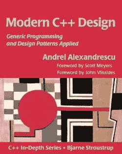
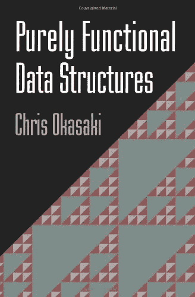
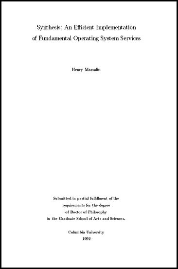

# 五部被忽视的计算机科学经典

> 原文：<https://medium.com/hackernoon/five-neglected-computer-science-classics-e0aefd24bf8e>

工作的程序员是工匠。我们边走边学，从我们接触的代码、我们阅读的文章和我们一起工作的人那里。

我脑海中有一个清单，上面列有对我的编程能力产生巨大影响的书籍和论文。边缘很模糊，因为我从来没有写下来。但它包含了一些经典:*[克努特](http://www-cs-faculty.stanford.edu/~uno/taocp.html)[*神话人月*](http://www.amazon.com/The-Mythical-Man-Month-Engineering-Anniversary/dp/0201835959)[*编程珍珠*](http://www.amazon.com/Programming-Pearls-Jon-Bentley/dp/8177588583)[*算法入门*](https://mitpress.mit.edu/books/introduction-algorithms)[*C 语言编程*](http://www.amazon.com/The-Programming-Language-Brian-Kernighan/dp/0131103628) 。我在生活中的特定时间阅读的一些东西也让我有了新的方向:[丹尼·希利斯的论文](http://dspace.mit.edu/handle/1721.1/14719)、[米切尔·雷斯尼克的书](https://mitpress.mit.edu/books/turtles-termites-and-traffic-jams)描述了如何思考大规模并行、[艾伦·凯的 Smalltalk](http://worrydream.com/EarlyHistoryOfSmalltalk/) 、90 年代初关于自我的一些[论文](http://bibliography.selflanguage.org/)、关于 Lisp 的和 [*Lisp 小片段*](http://www.amazon.com/Lisp-Small-Pieces-Christian-Queinnec-ebook/dp/B00AKE1U6O)*

*最近，一位朋友向我征求健脑食品的建议，随后的讨论让我意识到，除了上面列出的“显而易见的经典作品”，我还非常喜欢一些不太知名但同样值得花时间阅读的作品。*

**

*[The Implementation of Functional Programming Languages](http://research.microsoft.com/en-us/um/people/simonpj/papers/slpj-book-1987/) (1987)*

**函数式编程语言的实现(1987)是一本关于高级函数式语言、lambda 演算和图归约的书籍篇幅的教程。**

**[*在普通硬件上实现懒惰的函数式语言:无骨气的无标签 G-machine*](http://research.microsoft.com/apps/pubs/default.aspx?id=67083) (1992)建立在这本书的最后一节，描述了一个函数式语言的编译器，它可以产生高效的代码。**

**这两部作品都有很深的技术性，写得非常好，非常聪明。他们是我所知道的从理论开始，一步一步走向现实世界系统的最好例子。**

**这个无脊椎、无标签的 G-machine 是 Glasgow Haskell 编译器(以及其他 Haskell 研究和实现工作)不可或缺的一部分。这两部作品很好地解释了为什么 Haskell 是现在这个样子。**

****

**[The Art of the Metaobject Protocol](https://mitpress.mit.edu/books/art-metaobject-protocol) (1991)**

**第一次看 [*元对象协议的艺术*](https://mitpress.mit.edu/books/art-metaobject-protocol) 的时候觉得很有趣，但是并没有真正吸收。几年后，我回到这里，有一个深刻的瞬间。**

**同样，这本书是关于使用[计算机科学](https://hackernoon.com/tagged/computer-science)理论来构建现实世界编程的工具。但是，在这种情况下，作者从普通 Lisp 程序员使用的面向对象语言特性的调查开始，然后应用来自计算机科学的几个分支的理论来设计一个元系统，该元系统提取普通特性并使“语言设计”选择可参数化。**

**对我来说,*啊哈*部分是一个教训，一些编程符号在思考某些问题时比其他符号更有效。**

**元对象协议的艺术中的所有代码都是 Common Lisp。当我第一次读这本书的时候，我对 Lisp 只是一知半解。当我第二次阅读这本书的时候，我已经写了相当多的产品 Lisp，并且这本书里的源代码对我来说是前所未有的。我发现书中的观点也更容易理解。**

**我们使用哪种编程语言来解决日常问题并不重要。但是我们实际上认为用哪种编程语言很重要。**

****

**[Modern C++ Design](http://www.amazon.com/exec/obidos/ASIN/0201704315/modecdesi-20) (2001)**

**[*现代 C++设计*](http://www.amazon.com/exec/obidos/ASIN/0201704315/modecdesi-20) 影响如此之大，以至于没人再读它了。**

**Alexandrescu 在本书中倡导和推广的许多功能都成为了 C++标准。如今，有许多 C++参考资料涵盖了编译时模板元编程、模板泛型和类型列表。**

**从某些方面来说，Alexandrescu 的方法是对 Peyton Jones 方法的完美补充。Peyton Jones 从理论开始并构建了一种语言(Haskell)，Alexandrescu 从语言(C++)开始并回到理论的严格而有用的应用中。**

**下面是[背景故事](http://erdani.com/index.php/books/modern-c-design/):原来 [C++模板系统是图灵完备的](https://en.wikibooks.org/wiki/C%2B%2B_Programming/Templates/Template_Meta-Programming#History_of_TMP)。然而，那是意外。语言作者只是想让使用容器数据结构不那么痛苦。(这个趣闻告诉你关于 C++你需要知道的一切。)许多人意识到，考虑到这种非常强大(但也非常奇怪和脆弱)的编译时语言的存在，可以做一些有趣(也令人震惊)的事情。**

**Alexandrescu 剖析了 C++标准，分解了模板系统的机制，并将这些机制重新构建成一个精湛的、令人眼花缭乱的、实用的库，使 C++成为一种比它应有的更具表现力的语言。*现代 C++设计*描述了这个库的构建模块、实现和使用。**

****

**[Purely Functional Data Structures](http://okasaki.blogspot.com/2008/02/ten-years-of-purely-functional-data.html) (1999)**

**这个列表中贯穿着一个函数式编程主题。(甚至 C++模板也是纯函数环境。这很奇怪，但是如果你想做更多的模板元编程，让自己沉浸在函数式编程中肯定会有帮助。)**

**我认为，我记忆中最具启发性的书籍过多地讲述函数式编程并不是偶然的。函数式编程思想非常强大，是计算机科学的基础。**

**这些天来，感觉我们正在缓慢但稳步地将函数式编程工具包的元素融入“主流”语言。**

**这种进化以前也发生过。当我读研究生时，我和我的很多朋友在学术生活中编写 Lisp 和 Smalltalk 代码，在兼职“工业”时编写 C 和 C++代码。公平地说，学术界之外的人通常对带有垃圾收集和一级函数的语言非常怀疑。快进到今天，大量的生产代码(可能是大多数生产代码)是用同时具备这两种特性的语言(JavaScript、Python、Ruby)编写的。计算机变得更快，实现得到改进，新一代程序员成长起来，并对工具和方法做出了新的决定。**

**JavaScript 是一种非常合理的面向函数的语言，[如果你选择这样使用它的话](https://leanpub.com/javascriptallongesix)。Ruby 有 [#map，和#each，和#select](http://www.eriktrautman.com/posts/ruby-explained-map-select-and-other-enumerable-methods) 。雨燕有[图案匹配](http://www.codingexplorer.com/pattern-matching-in-swift/)。这些特性是函数式编程唾手可得的成果。它们非常有用，但也是适合命令式语言设计的简单折衷。**

**在接下来的几年里，函数式编程的其他方面是否会得到广泛应用，这将是一件有趣的事情。纯函数式数据结构——有时称为“不可变数据结构”——是主流采用的一个候选。如果您来自命令式编程背景，使用纯函数式数据结构需要一个学习过程。性能有时会是一个问题。但是如果你只使用不可变的数据结构，某些种类的错误就会消失，特别是与多线程代码相关的错误。在我们日益增长的多核和分布式世界中，这是一件大事。**

**Chris Okasaki 的 [*纯函数式数据结构*](http://okasaki.blogspot.com/2008/02/ten-years-of-purely-functional-data.html) 是关于不可变数据结构的标准参考和教程。阅读是一种享受。我同意 [jao](https://twitter.com/jaotwits) 的观点:这本书里的[信噪比非常非常高](https://jaortega.wordpress.com/2006/03/28/a-haskell-bookshelf/)。本书出版后的新变化上的 stackexchange 帖子也值得一读。**

****

**[Synthesis: An Ecient Implementation of Fundamental Operating System Services](http://citeseerx.ist.psu.edu/viewdoc/download?doi=10.1.1.29.4871&rep=rep1&type=pdf) (1992)**

**现在是完全不同的东西:亚历克西亚·马萨林 1992 年的博士论文描述了综合操作系统。**

**自省是一项不确定的事业，但我认为这篇论文比我读过的任何其他文章都更能塑造我对可能性的外部界限的认识。**

**当夸张不足以完成手头的任务时，陈述事实是一个体面的退路。我做不到比[瓦莱丽·奥罗拉的描述](http://lwn.net/Articles/270081/)更好的合成:**

> **一个完全无锁的操作系统，使用运行时代码生成进行了优化，在自制的双 CPU SMP 上运行的汇编中从头开始编写，带有两个字的比较和交换指令——你知道，没有什么特别的。**

**这(必然)在很大程度上低估了这篇论文是多么令人印象深刻、创新和有趣。上面的描述暗示了一堆可能不会立即显而易见的事情。例如，这是论文第 3 页和第 4 页的一段文字:**

> **该软件的第一个版本包括机器串行端口和 8 位模拟 I/O 端口的驱动程序、一个简单的多任务器和一个不寻常的调试监视器，其中包括一个基本的 C 语言编译器/解释器作为其前端。它非常小——所有的东西都可以装进机器的 16 千字节只读存储器中——并且可以在 16 千字节的随机存储器中舒适地运行。[……]尽管它缺少许多基本服务，比如文件系统，并且不能被认为是 Unix 意义上的“真正的”操作系统，但它是 Synthesis 内核的前身，尽管我当时并不知道它。**
> 
> **在 1984 年秋季进入哥伦比亚大学的博士项目后，我继续在业余时间开发该系统，改进硬件和软件，并尝试其他兴趣——电子音乐和信号处理。在此期间，随着摩托罗拉发布 68000 系列新处理器，CPU 升级了几次。目前，Quamachine 使用的是额定频率为 33 MHz 的 68030 处理器，但运行频率为 50MHz，这要归功于自制的时钟电路、特殊的内存解码技巧、高于规格的工作电压以及冷却处理器的冰块。**

**你有没有注意到“在其前端有一个初级的 C 语言编译器/解释器？”当您不得不编写自己的 C 实现(和环境)作为解决其他问题的前奏时——嗯，对于系统黑客来说，这要么是最好的，要么是最差的。**

**如果你对操作系统、编译器、并发性、数据结构、实时编程、基准测试或优化感兴趣，你应该读一下这篇论文。在它出版 25 年后，它仍然提供了大量的一般灵感和具体的思想食粮。写得也很清楚优雅。此外，作为最后的奖励，这是一个时代的快照，在那个时代，索尼制造工作站，并推出自己的专有 Unix 版本。美好时光。**

************

> **[黑客中午](http://bit.ly/Hackernoon)是黑客如何开始他们的下午。我们是 [@AMI](http://bit.ly/atAMIatAMI) 家庭的一员。我们现在[接受投稿](http://bit.ly/hackernoonsubmission)并乐意[讨论广告&赞助](mailto:partners@amipublications.com)机会。**
> 
> **如果你喜欢这个故事，我们推荐你阅读我们的[最新科技故事](http://bit.ly/hackernoonlatestt)和[趋势科技故事](https://hackernoon.com/trending)。直到下一次，不要把世界的现实想当然！**

****