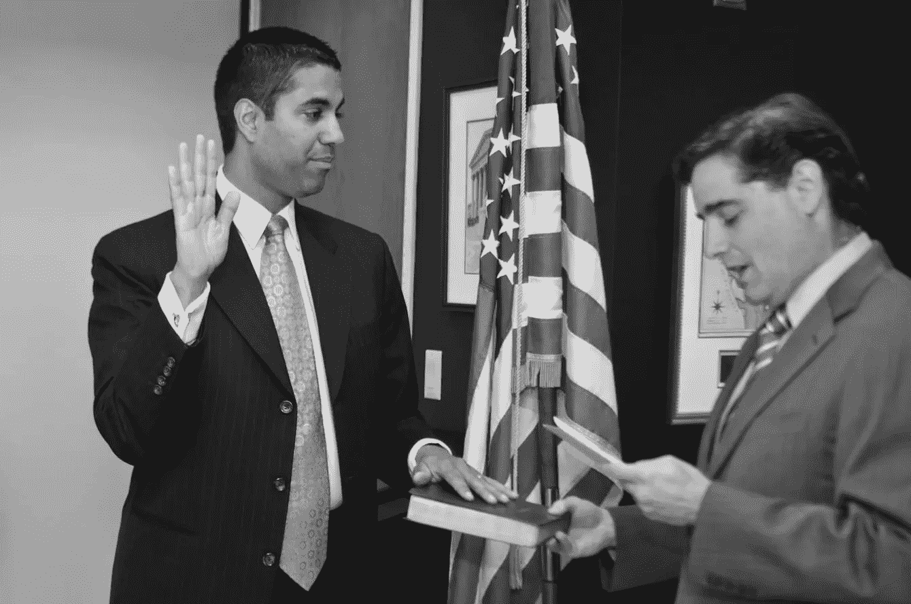

# Pai 主席说去除网络中立性有助于创业的五个理由，以及为什么它们都是胡说八道

> 原文：<https://medium.com/hackernoon/five-reasons-chairman-pai-says-gutting-net-neutrality-helps-startups-and-why-theyre-all-nonsense-19412e391a2b>

*Engine is the voice of startups in government, and we’re telling Members of Congress to* ***stop*** *the FCC’s December 14th Net Neutrality vote.* [*Add your startup’s voice to our petition delivery here*](https://docs.google.com/forms/d/e/1FAIpQLSc2NyssKr8b06UCeL2skqcIbTU1RcUkil0Y4-oYJkSIevkeEg/viewform)*.*

联邦通信委员会主席 Ajit Pai 说，他的计划，内脏网络中立保护将有助于创业。但是实际的创业公司，投资他们的人，以及基本的事实并不一致。

在 FCC 取消现有网络中立规则的计划中，所有的逻辑错误和彻头彻尾的错误(有很多)中，也许最奇怪和考虑不周的是声称允许互联网服务提供商向初创公司收取费用以更好地访问他们的用户在某种程度上有利于创新。现有的 FCC 规则禁止 ISP 创建“付费优先”方案，通过该方案，支付特殊费用的公司可以获得与最终用户的更快连接，从而减慢该过程中所有其他非优先流量的速度。Pai 希望取消付费优先的禁令，并认为初创公司渴望与大型互联网公司竞争，以获得向 ISP 付费的特权，从而更好地接触最终用户。

你可能会想:*“这显然是违反直觉的胡说八道。为什么会有人相信小型创业公司可以出价高于世界上最大的公司获得优先使用权？联邦通信委员会肯定有令人信服的实证证据来支持他们看似荒谬的立场。”*

好吧，我有一些令人失望的消息要告诉你，尽管这完全是意料之中的…

首先，Pai 忽略了一个简单的经济现实，即初创企业将无法负担优先使用权。根据[调查](http://www.kauffman.org/what-we-do/research/kauffman-firm-survey-series/the-capital-structure-%20decisions%20-of-new-firms) [数据](https://paulcollege.unh.edu/sites/paulcollege.unh.edu/files/webform/%20Full%20Year%202015%20Analysis%20Report.pdf)显示，一般的创业公司会筹集到 7 万到 35 万美元的初始资金来支付运营费用。相比之下，像脸书这样的老牌公司，市值超过 5000 亿美元。如果优先接触消费者确实是一种让公司从竞争对手中“脱颖而出”的有价值的方式，那么像脸书这样的在位者将为优先接触设定现行价格。由于分组交换是一个零和游戏——也就是说，如果一些互联网流量被优先考虑，所有其他流量必然被降低优先级——初创公司将被留在慢车道上。

根据互联网服务提供商自己的说法，优先排序可能非常昂贵，远远超出了初创公司的能力。他们认为，2015 年的网络中立规则将使他们的投资减少多达 400 亿美元，由于这些规则只禁止他们阻止内容或对最终用户的优先访问网站收费，这意味着如果这些规则被取消，他们预计将收回约 400 亿美元的访问和优先费用。为了赚取这些利润，互联网服务提供商需要将优先使用权的价格定得远远高于任何初创公司所能承受的水平。

但根据 Pai 的说法，现金短缺的初创公司希望自由地通过与谷歌和亚马逊等互联网巨头进行竞购战来“区分”他们的服务，以更好地获得用户:

> “付费优先可以让小型和新的边缘提供商在更公平的环境中与大型边缘提供商竞争。”

由于创业公司和大公司之间财务资源的巨大差异本身就造成了不公平的竞争环境，所以不清楚为什么允许大公司利用其财务实力来进一步巩固其主导地位会使事情变得公平。

尽管 Pai 经常吹嘘他的委员会在经济上是多么的严格，他却懒得引用任何实证研究来证明他的立场——他甚至不能指出他经常用来支持他的反竞争政策的虚假分析的类型。相反，FCC 接受了电信公司和智库未经证实的断言，即允许 ISP 利用其看门人的权力从网站提取优先接入费将在某种程度上有利于小网站。

提议的规则忽略了成千上万的初创公司和投资者，他们明确告诉委员会，允许有偿优先将严重限制初创公司的活动。在 Pai 的世界里，ISP 和其他大公司比实际的创业公司更了解创业创新。

那么，这些电信巨头提出了什么令人信服的论点来克服这个简单的经济现实呢？让我们来看看:

## **论点 1:“优先化是司空见惯的，有利于消费者的”**

“支持”Pai 推翻 FCC 网络中立禁令的一个共同主题是，依靠与其他市场的不恰当类比来表明其他“优先化”计划如何为消费者带来好处。不足为奇的是，这些类比是完全站不住脚的，而且几乎与网络中立规则所关注的优先级方案的类型没有任何关系。

***互联网就像杂货店***

在自由州基金会的一份十页的报告中，作者认为付费优先就像杂货店的“货位”政策，食品生产商可以支付额外的货架位置。

这种优先排序与互联网流量的付费优先排序有一些细微的相似之处，但这种相似之处在最细微的审查下就会土崩瓦解。最明显的是，杂货店市场竞争激烈，而宽带接入市场却没有。大多数消费者在决定去哪里购买食品杂货时有多种选择，这限制了任何个体商店或连锁店与食品生产商的议价能力。另一方面，互联网接入，大多数美国人有一个或零选择高速宽带。如果你不喜欢你的 ISP 优先处理流量的方式，你真的无能为力。这给了互联网服务提供商巨大的权力，以扭曲竞争的方式从网站上榨取租金，给了那些为优先访问权支付最高价格的现任者巨大的优势。

***互联网就像高速公路上的优先车道***

同样，该论文认为，付费优先是有利于消费者的，因为在一些城市，政府已经在高速公路上建立了特殊的优先车道，司机必须付费才能进入。根据这种观点，限制付费优先顺序会阻止消费者自愿为更好的访问付费，从而不适当地限制了用户的选择。实际上，现有的付费优先的禁令并没有禁止 ISP 对不同类型的服务向最终用户收费。

与为用户选择访问速度设定分级价格不同，互联网服务提供商为更好地访问用户而对在线服务收费，这扭曲了市场，因为这让最富有的现有企业获得了主要的竞争优势，同时损害了无力与这些现有企业竞争的公司，如初创公司。自由州基金会对高速公路优先车道的类比只有在政府向汽车制造商收费让他们的汽车进入快车道时才有意义。如果城市只为本田汽车开辟特殊的快速通道，你可以打赌本田汽车的销量将会激增，而其他汽车公司将会遭受损失。这是典型的市场扭曲行为，对汽车创新没有积极影响。

## **论点 2:“某些优先级可能是好的，所以我们应该允许所有的优先级”**

反网络中立的倡导者经常争辩说，因为新的延迟敏感的互联网服务可能需要只能通过优先服务提供的有保证的性能类型，所以所有付费的优先化方案都应该被假定允许。根据这一观点，最好在事后挑战扭曲竞争的优先化，以防止先发制人地阻止理论上有利于消费者的优先化方案。

根据 Pai 的命令，受到反竞争付费优先计划损害的公司可以根据现有的反垄断法挑战这些计划。但是，最有可能受到反竞争付费优先计划伤害的公司是那些一开始就无法与大公司竞争更好地接触最终用户的公司，他们当然也无法承受反垄断投诉带来的时间和成本密集型法律战。实际上，一家受到付费优先计划损害的初创公司不会存活足够长的时间来提起诉讼，更不用说通过诉讼获得判决了。

声称现有的付费优先禁令意味着 ISP 在任何情况下都不能优先处理流量，这显然是错误的。2015 年的命令为互联网服务提供商和网站创建了一个正式的机制，以申请豁免付费优先的禁令。因此，如果互联网生态系统的发展方式是优先考虑自动驾驶汽车数据，比如说，电子邮件流量是这些汽车正常运行的必要条件，那么有一种简单的方法来解决这个问题，而不允许大公司付费降低对竞争对手服务的访问。由于 Pai 认为值得优先考虑的内容类型只占互联网流量的一小部分，我们不应该围绕边缘案例制定规则。

## A **论点 3:“产生大量流量的网站应该将这些流量的成本内部化”**

这个不需要太多揭穿。Pai 的基本观点是，热门网站也应该为消费者已经支付的互联网流量付费*。*互联网服务提供商只是希望能够同时从他们已经收费的客户和这些客户访问的网站上收取费用。这一论点基于一个似是而非的主张:某些流行的网站产生了如此大的流量，以至于导致了 ISP 网络的拥塞。当然，由于网站只能在 ISP 客户访问这些网站时“引起流量”，这实际上意味着，当然，消费者正在产生如此多的流量，以至于他们正在造成拥堵。

即使假设这个拥塞声明是合法的(提示:[它不是](https://www.techdirt.com/articles/20151108/11154432757/leaked-comcast-docs-confirm-what-everybody-knew-broadband-usage-caps-are-about-profit-not-congestion.shtml))，在不扭曲竞争的情况下解决问题的方法是，如果用户消耗造成拥塞的大量数据，就向他们收取更多费用。提议的规则试图回避这一明显的观点，在没有任何支持的情况下断言“互联网服务提供商不能总是针对相关终端用户设定价格。”什么？你真的认为我们会相信 ISP 可以识别哪些网站接收了最多的流量，但却不能找出哪些客户带来了最多的流量？

## **论点 4:“允许付费优先将增加竞争，因为 ISP 将对其网络进行再投资”**

Pai 显然认为，允许互联网服务提供商从网站上收取垄断租金，将会给他们带来额外的资金，而这些资金是他们建设新网络所急需的。但是互联网服务提供商已经赚了很多钱——美国电话电报公司仅在 Q2 2017 年就有[400 亿美元的收入，康卡斯特](http://about.att.com/story/att_second_quarter_earnings_2017.html)[在第三季度](http://www.cmcsa.com/releasedetail.cfm?ReleaseID=1045524)赚了 210 亿美元；为什么付费优先带来的额外收入会突然促使他们建立新的网络并相互竞争？这些大公司几乎没有面临竞争。他们还需要多少钱才能开始竞争？

## **论点 5:“互联网服务提供商将把付费的优先化收入转移给消费者”**

是的，你没看错。Pai 声称，互联网服务提供商将出于他们的善心，把他们从付费优先方案中获得的钱返还给消费者:

> “取消付费优先安排的禁令可能会降低消费者的宽带互联网接入服务价格，因为 ISP 可能会从边缘提供商那里收回一些成本。”

在 Pai 提出的所有令人难以置信的说法中，暗示如果我们让康卡斯特和威瑞森的初创公司赚钱，他们会给你免费的钱，这是非常疯狂的。

事实上，Pai 拿不出任何更好的东西来支持他结束网络中立的计划，这本身就证明了他在学术上的不诚实。

引擎是政府中初创公司的声音，我们告诉国会成员 ***停止****FCC 12 月 14 日的网络中立投票。* [*在这里*](https://docs.google.com/forms/d/e/1FAIpQLSc2NyssKr8b06UCeL2skqcIbTU1RcUkil0Y4-oYJkSIevkeEg/viewform) *把你创业的声音加入我们的请愿投递。*