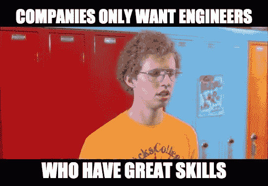
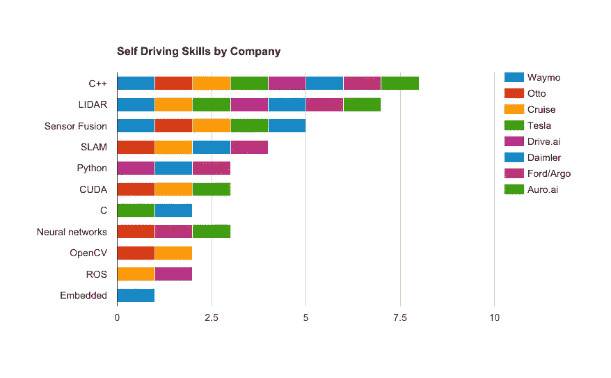
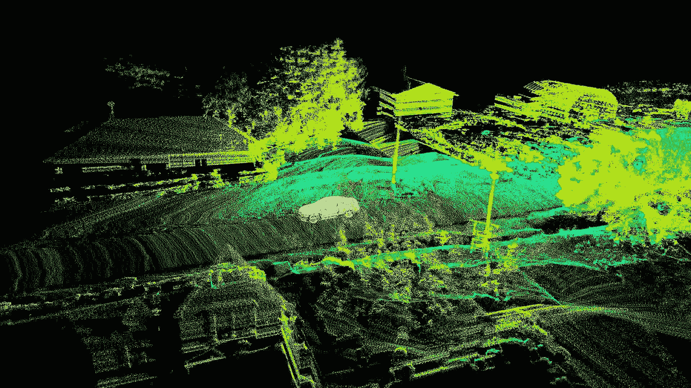
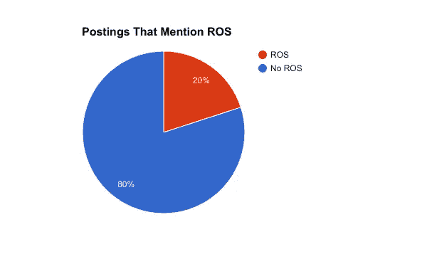

# 自动驾驶公司需要的五项技能

> 原文：<https://medium.com/hackernoon/five-skills-self-driving-companies-need-8546d2aba7c1>

制造自动驾驶汽车是一项具有挑战性的任务，它结合了广泛的工程和计算机科学学科。为了在自动驾驶领域为团队做出贡献，你必须不断学习和探索新技术。你能获得的最大财富是对解决难题的不懈的好奇心和强烈的自律。

也就是说，公司选择特定的技术和技巧来构建他们的系统，通常更喜欢已经拥有这些经验和技能的候选人。我分析了几家自动驾驶汽车公司的招聘信息，并编制了一份电子表格，列出了招聘信息中提到的技术和学科。这种分析的目的是让人们对公司的需求有一个大致的了解。这不是对他们所重视的内容的全面评估，但它可以作为那些试图获得足够经验来面试自驾车工程团队的人的指南。我专注于特定的技能/技术，如 OpenCV 和 SLAM，而不是广泛的学科，如计算机视觉或机器人学。

Self-driving skills by mentions in job postings

# C++

所有帖子中不变的一点是，对于自动驾驶公司来说，C++编程经验是非常受欢迎的属性。因为性能对于任何运行在实时系统上的代码都是至关重要的，所以有必要使用一种可以编译成机器代码的语言来提高速度。

对于未来的自动驾驶汽车工程师来说，好消息是，在所有列出的职责中，基本的 C++经验是最容易获得的。谷歌有很好的 T2 在线课程 T3。Udacity 正在开发他们自己的一门很棒的 C++课程，我和其他一些学生正在进行 beta 测试。公众应该很快就能看到它了。

我发现学习一门新语言的最好方法是选择一个基本项目，并用该语言实现它。如果你有像 Java 这样的面向对象语言的背景，但没有使用过 C 或其他过程语言，这将迫使你学习像指针和析构函数这样的新概念。这是一种“小时学习，终生掌握”的技能，在已经完成了许多其他编程之后，完成一个 C++项目将会有很大的不同，即使你还有很多东西要学。

# 激光雷达

Velodyne LIDAR mounted on Auro autonomous shuttle

获得经验的最具挑战性的自动驾驶工程师技能之一是激光雷达。除非你很富有或者在大学的研究实验室工作，否则你身边可能不会有一辆[威力登](http://velodynelidar.com/)。

通过加入[公司](https://hackernoon.com/tagged/company)来帮助符合我经验的项目(管理数据、报告系统和移动应用程序)，然后在业余时间尽可能多地学习激光雷达和点云操作，我已经能够在奥诺学习激光雷达。

了解这项技术的一些其他方式是从事开源项目，如 [Autoware](https://github.com/CPFL/Autoware) ，它们共享他们的点云记录，并给你工具来开始处理数据。此外，如果[威力登工厂](http://spectrum.ieee.org/cars-that-think/transportation/sensors/velodyne-to-build-lidar-megafactory)通过或[固态激光雷达](http://spectrum.ieee.org/cars-that-think/transportation/sensors/quanergy-solid-state-lidar)起飞，你应该可以获得超级便宜的激光雷达球(50-250 美元)来做自制项目。

# 传感器融合/SLAM

Demo of Dibotics SLAM algorithm

像传感器融合和 SLAM(同步定位和绘图)这样的核心机器人技术的经验是每个公司都重视的。许多机器人工程师花了几十年时间在研究生院的实验室里掌握这些技术。虽然期望立即掌握它们是不现实的，但你可以通过参加免费的在线课程，如[人工智能和机器人](https://www.udacity.com/course/artificial-intelligence-for-robotics--cs373)，获得基本的理解，这可能会让你加入一个团队。如果你能够将这些知识运用到自制机器人上，或者为开源自动驾驶项目做出贡献，团队会排着队让你加入。

# 活性氧簇（reactive oxygen species 的缩写）

Super unnecessary chart

ROS(机器人操作系统)是一个编写机器人软件的框架。它包括许多库和系统组织工具。虽然许多招聘启事没有提到 ROS(包括奥诺的职位)，但每家公司都可能使用可靠的分布式架构，与 ROS 有一些相似之处。汽车制造商通常会确保他们的系统符合汽车安全标准。宝马有一个[很棒的演示](http://roscon.ros.org/2015/presentations/ROSCon-Automated-Driving.pdf)，解释了他们为什么选择 ROS 作为他们的自动驾驶汽车研发，同时也强调了它在生产用例中的一些局限性。

拥有使用模块化系统的经验是非常有价值的，ROS 是一个很好的开源工具，可以让你获得使用机器人技术的经验。我强烈推荐浏览一下 [ROS 教程](http://wiki.ros.org/ROS/Tutorials)。他们不仅帮助我理解了 ROS，还帮助我理解了保持机器人系统有序和容错所必需的架构类型。

> [黑客中午](http://bit.ly/Hackernoon)是黑客如何开始他们的下午。我们是 [@AMI](http://bit.ly/atAMIatAMI) 家庭的一员。我们现在[接受投稿](http://bit.ly/hackernoonsubmission)并乐意[讨论广告&赞助](mailto:partners@amipublications.com)机会。
> 
> 如果你喜欢这个故事，我们推荐你阅读我们的[最新科技故事](http://bit.ly/hackernoonlatestt)和[趋势科技故事](https://hackernoon.com/trending)。直到下一次，不要把世界的现实想当然！

