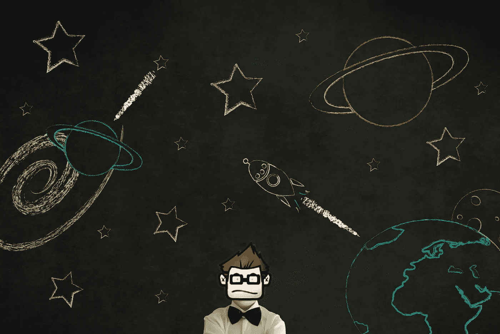
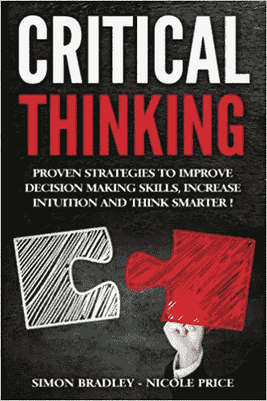
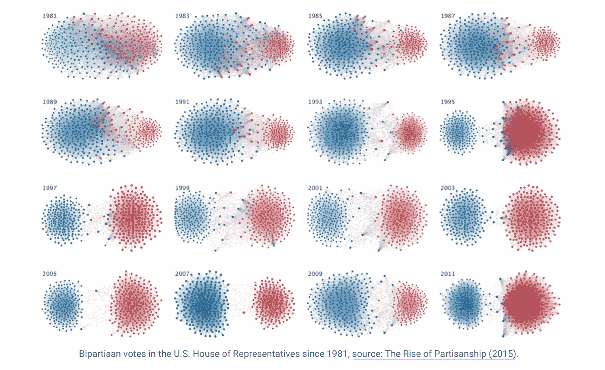
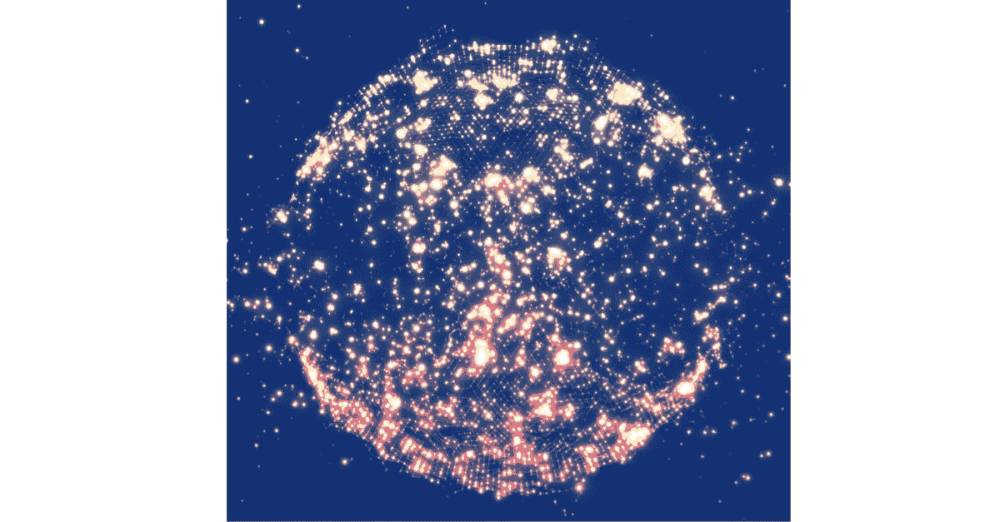
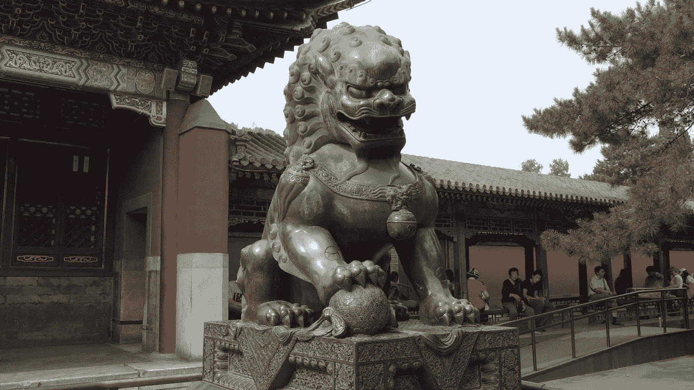
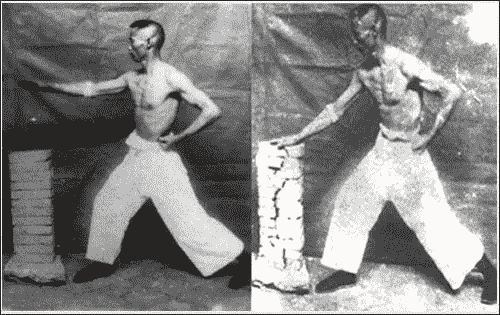
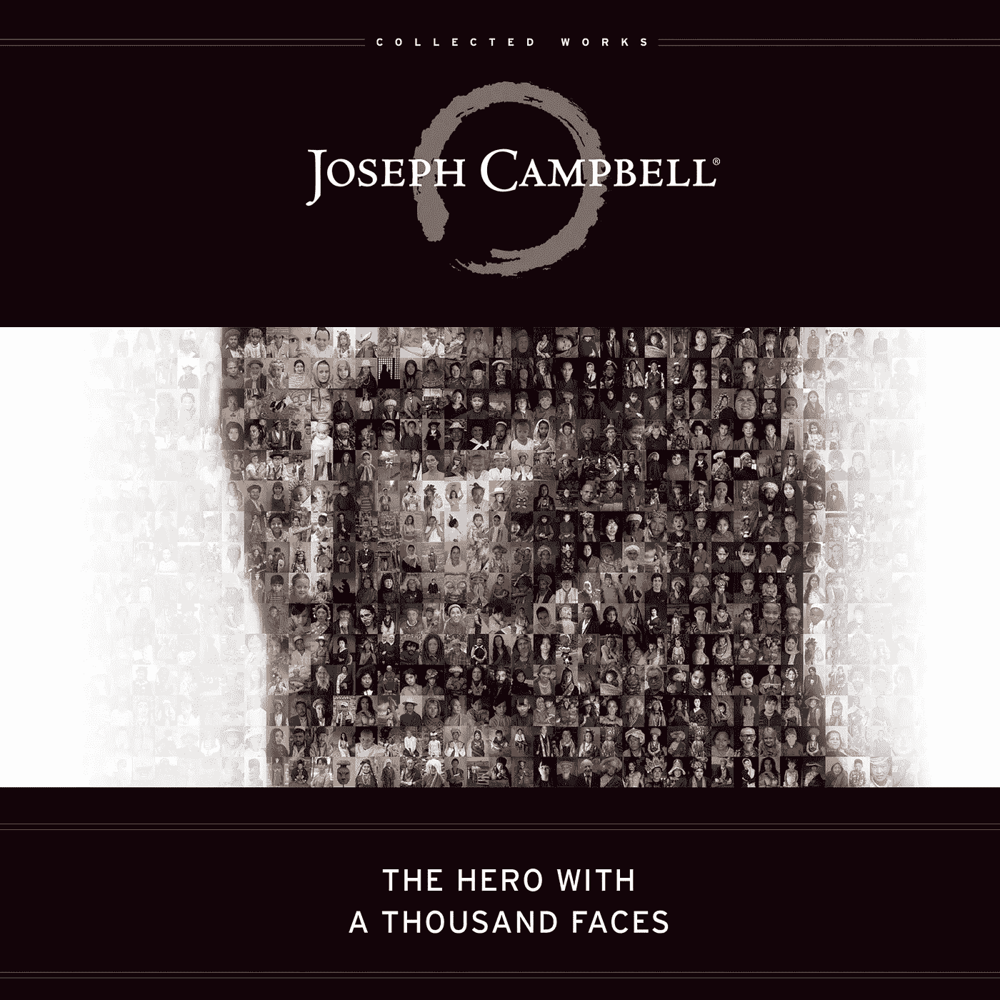

# 我从投资大师克里斯·迪克森那里学到的五件事

> 原文：<https://medium.com/hackernoon/five-things-i-learned-from-master-investor-chris-dixon-8b7be39f30fc>

有些人会给他们遇到的每个人留下深刻的影响。哲学家、程序员和投资者 [**克里斯·迪克森**](/@cdixon) 对我来说就是其中之一。有趣的是，我很确定他不知道。

我们已经很多年没有说过话了，所以我从来没有机会感谢他(*直到现在*)。

我们在我大学毕业后的第一份工作中相遇。网络泡沫刚刚破裂。我离开了一家破产的网络游戏公司，从在几个月内买下五层办公楼，到仅在一年后就在大甩卖中卖掉所有东西。

我通过一个朋友在一家名为 [Oddcast](http://www.oddcast.com/) 的小型网页设计公司找到了一份工作，这家公司正迅速发展成为一家媒体公司。那时，狄克逊还不是像今天这样超级成功的世界大师。他以前是哲学专业的学生，自学程序员。

这听起来可能有点自大，但即使在我二十出头的时候，我也习惯了成为任何房间里最聪明的人。然而，当谈到迪克森时，很明显我只是第二聪明的人(甚至可能是第三聪明，仅次于我的好友查尔斯·本宁顿，他忘记了比我所知道的更多的系统工程)。)

一些对你生活的影响是直接深远的。我的高中英语老师道森先生就属于这一类。他教会了我所有关于批判性思维的知识，以及如何带着深深的喜悦和好奇的精神阅读一本书。

有些影响更加微妙。

你当时不知道它们对你产生了影响，直到多年后你回首往事，才意识到你已经思考了某人说过几十遍的话，而这些话似乎毫无理由。

这就是迪克森的切入点。

# 1)永远要了解事情的两面

众所周知，我认为 [***批判性思维***](http://amzn.to/2xmTVa4) *是* ***人生中最重要的成功技能*** 。

道森先生在我的死亡诗社(Dead Poets Society)风格的英语课上反复使用这个词，我们围坐成一圈，自由而颠覆性地谈论各种书籍，从莎士比亚、哈克·费恩到罗伯特·帕克的神秘小说。批判性思维悄悄进入我的潜意识，并在那里扎根，成为我一生工作的试金石。没有它，我就不能写书、设计计算机系统或写出这些小文章。

对许多人来说，清楚地思考意味着许多事情，但对我来说，它意味着愿意质疑一切，仔细查看所有证据并为自己权衡，而不是听从非危险的权威。这是关于运用你的想象力、创造力和洞察力以及更高层次的推理能力。

但我不知道我在高中时是否真的得到了这些。有人在那个稚嫩的年纪真的懂什么吗？当然，我们当然认为我们有！

事实上，直到有一天我发现迪克森同时阅读《T4 时报》和《华尔街日报》时，我才真正明白*如何批判性思考*的想法。

这是在每一份报纸都上网之前，你仍然从枯树上获取大部分新闻。现在，随着信息战和假新闻的兴起，这看起来似乎有点古怪，但在当时，这两份报纸仍然是自由主义和保守主义思想的最终旗手。

那时，像许多刚从大学毕业的孩子一样，我倾向于自由主义，所以我问他为什么要费心去读“那本充满宣传和废话的杂志？”

“因为我不想只看到故事的一面，”他说。

我当时笑了，并不是真的理解，但多年来我一次又一次地回想起那个时刻。

随着互联网迅速发展成为今天的信息神谕和人类垃圾桶，我发现自己尽可能经常地阅读大量不同的来源，试图更接近我所见所闻的真相。我学会了看清每个记者报道中固有的偏见和偏颇，慢慢地，一幅不同的画面浮现在我面前，一幅让一切变得更加清晰的画面。

也许任何事情都不可能得到真正的真相？

但是如果你尽可能多的从不同的角度看待每一件事，甚至是那些你完全不同意的角度，你肯定会离得更近。实际上，尤其是阅读那些你根本不同意的东西。

今天，这比以往任何时候都更重要，而我们做得越来越少。

我们越来越多地生活在微小的回音室中，这些回音室给了我们一幅错误的世界图景。我们可以很容易地过滤我们得到的所有信息，以便我们只看到我们已经“知道”和相信的东西。

它正在杀死我们。

这让我们变得更愚蠢，因为作为一个社会，我们没有成长和改变，我们停滞不前，比以往更加两极分化。这种愚蠢的结果很可能是暴力和恐怖的大规模爆发。当没有人能听到彼此的声音时，一切都崩溃了，剩下的只有争斗。

没有人了解全局。

任何相信他们这样做的人都是真正的疯子。

把我们都想象成一个球体上的点。球体是一切已知的东西。

最聪明的人意识到他们是有限的，所以他们试着扩大视野，从别人的角度看世界。

但是大多数人认为他们的小点就是整个球体。

他们想的和理解的都是“对的”。除此之外什么都没有。

我们越来越多地生活在一个放大了疯狂信念的世界里，即我们可以知道一切，而另一边的每个人都疯了。今天，过道对面的人们尖叫着，拒绝在任何事情上妥协。

**如果你出生在精神病院，每个人都在大喊大叫，你会认为这很正常。**

*这不正常。*

# 2)永远不要害怕重塑自我

狄克逊在大学里学的是哲学。之后他就自学成了程序员。有一天他告诉我他要退出 Oddcast。我问他要去哪里，他说:“哈佛商学院。”

当时我觉得这很奇怪。你是如何从哲学，到编程，到商业，最终投资的？生活中要戴很多不同的帽子。

但最终这个奇怪的轨迹也反映了我自己的生活。

我去了纽约大学的加拉丁个性化学习学院，一个我的朋友开玩笑地称之为“没有围墙的学校”的地方，因为你可以学习任何课程。“自己做专业”学院不是白叫的。我选修了哲学、计算机、文学、电影以及几乎所有我感兴趣的东西。

当我毕业的时候，我父亲打电话给我，说“祝贺你毕业，我会再付你六个月的房租，去找份该死的工作。”

“但是我不确定我知道如何做任何事情，”我说。

“那是你的问题。”

我不知道该怎么办。

那时，我在一家小软件公司做秘书助理。我慌慌张张地去找电脑男，说“把你知道的都教给我。”所以他会拆开一台电脑，说“把它装回去，不要问我任何问题，除非你绝对有必要。”

事实证明，计算机和生活很大程度上是依靠自己，通过用头撞它们直到你让它们工作为止来解决问题。

从那以后，我一路胡扯进了一家计算机公司，整晚都呆在那里，直到凌晨 1 点才弄明白我说过我知道该怎么做的那些狗屁事情。这让我开始了长达 20 年的工程师和商人生涯。

现在我踏上了新旅程的第一站:

作者和演讲者(*电话线路开通*，*现在打电话*)。

我们有一种奇怪的想法，认为我们是谁和我们做什么是固定的。

但是我们是谁是流动的。

如果你在高中或大学选择了一个职业，坦白地说，你太蠢了，不知道你在生活中真正想要的是什么，你没有必要坚持下去。

改变！

如果你厌倦了每天做同样的事情，那就做点不同的事情。

不要一觉醒来，心不在焉地去做自己讨厌的工作。晚上回到学校，或者去谷歌的学校，用你在这个绿色和蓝色的小石头上的几天时间想出一些全新的事情来做，这是可以的。

这是你的生活。活下去。

你是谁每分钟都在变，日复一日，年复一年。

没有人是你。

不要害怕重新开始。勇往直前，开始新的冒险。

# 3)拥抱拒绝

当然，一旦你为自己选择了一条新的道路，你就是从零开始，这通常是很可怕的。

没关系。无论如何都要做。

你害怕的是你实际上不得不做的事情。

奔向你的恐惧。它们是指路明灯。

在[的一次采访中，迪克森谈到了拒绝:](https://a16z.com/2015/01/18/12-things-learned-from-chris-dixon-about-startups/)

“如果你每天都没有被拒绝，那你的目标就不够远大。我职业生涯中最有价值的一课是，当我试图在科技领域闯出一片天地时，我申请了大公司、初创公司和风投公司的职位。我到处被拒绝。

“我有一种不寻常的背景。我学的是哲学专业，自学成才的程序员。这被证明是我职业生涯中最有价值的经历，因为我最终变得如此厚脸皮，以至于我不再在乎被拒绝。

“事实上，我有点改变了它，开始接受它。我最终——这让我鼓起了勇气。通过这些更大胆的策略，我最终找到了一份工作，这份工作为我的第一次创业提供了资金。所以直到今天，我每天都努力确保自己被拒绝。”

除非你清理土地种植新作物，否则你不可能取得进展。

当你转行的时候，你没有被雇佣的必要背景，所以你每天都想辞职，因为没人想给你机会。不要放弃。继续走。

A Gate Guardian at the Summer Palace in Beijing, photo by me in 2014.

人们认为找到一份工作的唯一方法是在求职公告栏上列出精确的技能组合。

这不是真的。

这只是进入的第一道屏障，旨在阻挡不值得的人，就像古代神话中的大门守护者。

在我得到的每一份工作中，我都不具备他们想要的技能，所以我经常被拒绝。

坦白说，我不想做同样的工作两次。如果一家公司要我做和我上一份工作完全一样的工作，我不想为他们工作。这意味着他们在寻找机器中的齿轮，而不是实干家和思想家。

当你申请工作时，大多数人并没有真正看到或听到你。他们只是在运行一系列的精神试探法和复选框。这个人去学校了吗？十年来他们一直在做这个或那个吗？这是懒惰的，这让他们错过了真正有才华和创新的人。除非你快饿死了，否则你不会想为那些无法超越这种思维模式的人工作。

如果你快饿死了，接受这份工作，马上出去，开始寻找一份更好的工作，即使你下周就得辞职。如果你坚持下去，最终会有人看到真正的你，一个适应性强、敢于冒险、不怕彻底改变整个世界的人。

他们会意识到这正是他们一直在寻找的*式的忙碌和创造力*，并抓住机会。

# 4)从小处着手，逐步扩大

当大多数人着手建立一个新公司时，他们试图煮沸海洋。他们想成为下一个脸书或谷歌。

但是，即使是这些公司也没有明确的想法，他们会成为今天这样的大公司。相反，他们集中精力做好一件事。

谷歌在发布他们的广告平台之前*就着手建立有史以来最好的搜索引擎。如果你还不是一个目的地，你就不可能成为一个主宰世界的广告经纪人。*

在你尝试开始一项疯狂而大胆的事业之前，试着做一些你能做的小事。

创业并不容易。这非常复杂，而且规模越大，每天处理起来就越困难。

我为迪克森最早的两家公司工作过，一家是小型营销公司，另一家是他最终卖给迈克菲公司担任网站顾问的公司。

这两家都是小企业。迪克森告诉我，他创办第一家公司是为了证明他可以创办并经营一家他当时供职的风投公司。我们只有三个人:我、他和一个搭档。最终，他们雇佣了第四个人来负责日常运营。

Site Advisor 的运营规模更大，也有一些投资者的支持，但它仍然是一个七八人的团队。

教训很简单。在你学会基础知识之前，不要尝试一些超级复杂的东西。

选择一个你能处理的小主意。

Famous Iron Palm master, [Gu Ru Zhang](https://www.plumpub.com/kaimen/2006/gu-ru-zhang-iron-palm-master-1893-1952/), taking it to some stones.

如果你还想做的话，就从那里毕业，建立更大的东西。

在功夫方面，在你学习瞬间死亡的五指莲花掌之前，你最好先学会马步坐和投掷基本拳。如果你不能掌握基本的，你肯定不能处理莲花掌。

[从小做起，做大](http://amzn.to/2xngnzP)。

# 5)利用系统的优势进行设计

当你决定你想做什么时，不管是写书、创业还是辞职环游世界，你都会顺其自然，而不是逆其道而行。

那是什么意思？

发挥你的优势。

写作中有一句老话:写你知道的。如果你从未攀登过珠穆朗玛峰，很难写出一本书来描述寒风刺骨，而你的肺却在努力吸入迅速稀薄的空气的感觉。

如果你要开始一项新的事业，选择你感兴趣并且比任何人都了解的事情，而不是你上周读到的听起来很酷的事情。

如果你想设计一个产品，你会想利用系统本身的优势。

狄克逊曾经给我看过一个他在一种新的手持电脑上设计的小游戏，叫做掌上电脑(PP)。如果你年纪够大，还记得早期的 PP，你就知道它是最初的智能手机，没有电话。早在史蒂夫·乔布斯发现如何使用内置手写笔(我们的手指)来控制小屏幕之前，PP 就有了一个小塑料笔，这在当时是一个惊人的突破。

大多数迷你电脑游戏都符合点击操作的旧模式。游戏设计者简单地将桌面鼠标点击的隐喻嫁接到新的界面上。迪克森认为这是愚蠢的，他是对的。

他的游戏利用了手写笔带来的新的可能性。小虫子在屏幕上跑来跑去，他尽可能快地绕着它们打转，把它们踩扁。这不是一个复杂的游戏，我不记得在那之后见过他用它做任何其他事情，但它向我展示了一种全新的思考设计的方式。

不要只是把旧的界面塞进每一种新的格式。

利用新的格式，发挥其真正的潜力。

优步用手机里的全球定位系统告诉你汽车在哪里，以及他们需要多长时间到达那里。在那之前，出租车只是想什么时候出现就什么时候出现，你必须打电话给调度员，才能知道他们是否在附近。如果优步只是把一个出租车调度员放入他们的应用程序中，而忽略了 GPS 新发现的功能，他们的应用程序就会永远消失。

相反，他们顺应了新平台，而不是反对它。

如果你这样做了，也许你会设计出人们真正想用的革命性的东西。

然后你可能就有真正的生意要做了。

# 你自己的根源

现在迪克森是一个著名的商人，人们可能想从他那里得到各种各样的东西。我想那很难。我知道随着我变得越来越出名，有时我很难满足所有的要求。我只能想象他这个水平是什么样的。

但是我现在不想要他的任何东西，除了说一件事:

**谢谢你。**

**你不知道你在教我什么，克里斯，但你做到了，我听着，记着。**

也许看到这里的你们有人读过巨著 [***千面英雄***？(如果你还没有尽快去拿的话)。](http://amzn.to/2xmOFmH)

在这部电影中，英雄总是得到*召唤去冒险*。他或她真正的生活目标在燃烧的灌木或闪光中显露出来。

在现实生活中，我们对冒险的呼唤要微妙得多。我们必须仔细看和听，否则我们可能会错过它。

这个号召是重塑你自己，抓住机会，拥抱拒绝，让自己变得越来越好。

你的生活是一个故事。

它是一串串珠子，一个接一个。每一课都建立在最后一课的基础上，让你越来越了解自己。

但不仅仅如此。

这是你的冒险。

也许你没有意识到，但是:

***千面英雄就是你*。**

############################################

如果你喜欢这篇文章，我会很高兴你能把它拍下来！之后，请随意用电子邮件发送给朋友！非常感谢。

###########################################

[Photo credit](https://extranewsfeed.com/the-winds-of-world-war-iii-8bc369584f67)

关于我:我是一名作家、工程师和连续创业者。在过去的二十年中，我涉及了从 Linux 到虚拟化和容器的广泛技术。

*你可以看看我的最新小说，* [***一部史诗般的中国科幻内战传奇***](http://amzn.to/2gAg249) *在这部小说中，中国挣脱了共产主义的枷锁，成为世界上第一个直接民主国家，运行着一个高度先进、人工智能的去中心化应用平台，没有领导人。*

## 当你加入我的读者群，你可以免费得到一本我的第一部小说《蝎子游戏》。读者称之为“神经癌的第一次严重竞争”和“黑色侦探会见约翰尼记忆术。”

## 你也可以根据书中的想法查看[蝉开源项目](http://iamcicada.com/)，该书概述了如何立即将该技术变为现实，你可以参与其中。

## 最后，你可以[加入我的私人脸书小组，Nanopunk Posthuman 刺客](https://www.facebook.com/groups/1736763229929363/)，在这里我们讨论所有的科技、科幻、幻想等等。