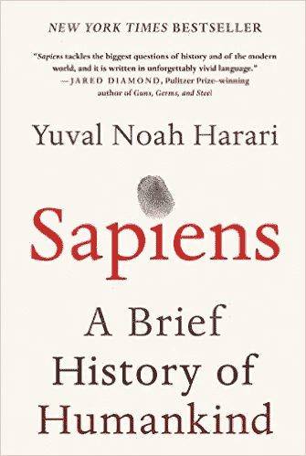

# 我从阅读《智人》中学到的五件事

> 原文：<https://medium.com/hackernoon/five-things-i-learned-from-reading-sapiens-6ae97a52c45f>

## 尤瓦尔·诺亚·哈拉里的《智人:人类简史》书评

*作为我的* [*读书系统*](https://hackernoon.com/how-i-live-reading-books-so-they-last-6f93c7e7d702) *的一部分，我从我读过的每本书里列出了我想记住的五个关键概念。这篇文章列出了我从尤瓦尔·诺亚·哈拉里的《智人》中获得的五大智慧。*

## 5.共享小说的力量

智人的成功依赖于创造“共享小说”的能力。共享虚构是虚构实体中普遍持有的信念。例如，对金钱力量的信仰是一种“共有的虚构”:没有金融机构的承诺，美钞本身就是一纸空文。在早期历史中，这些共享的小说围绕着多神论的神，但在现代社会中，它们包括公司、道德和政治制度。这些系统让我们的物种更有效地合作。

## 4.奢侈品变成了必需品

纵观智人，有一个永恒的主题，关于人类如何继续让他们的奢侈品变成必需品。

> 小麦驯化人类就像人类驯化小麦一样。

小麦种植有益于久坐不动的生活方式——但是在人类建立了久坐不动的生活方式后，他们别无选择，只能继续种植，否则就回到游牧时代。以这种方式，小麦种植，这本来是一种优势，成为了智人的必需品，因为他们不再想回到他们更古老的生活方式。

同样，书写让人类能够储存大脑之外的想法和思想。这对于信息的代代相传和记录金融交易非常有帮助。然而，随着书写越来越受欢迎，它不仅成为所有交易和信息存储的必需品，而且实际上也改变了智人的思维方式。类似的效果发生在今天的谷歌时代，我们不再记住信息片段，而是记住从哪里获得信息。

## 3.一切都是“自然”的

哈拉里分解了什么是“自然的”(例如，关于同性恋)。

> “事实上，我们的‘自然’和‘非自然’概念不是来自生物学，而是来自基督教神学。“自然”的神学含义是“与创造自然的上帝的意图一致……与上帝意图不同地使用(我们的身体)是“不自然的”。但是进化没有目的。"

相反，他认为，我们所做的一切从技术上来说都是“自然的”——作为一个物种，我们所做的一切在生物学上都不是自然的，因为一切都源于自然。

## 2.可传播性和受欢迎程度是不同的

> "进化的货币既不是饥饿也不是痛苦，而是 DNA 螺旋的拷贝."

很多时候，我们把一个想法的可传播性与它是否有益混为一谈。这在历史上出现过几次。

农业可以推广，因为它允许家庭养活更多的孩子，从而提高了繁殖率。然而，普通农民比普通的采集者工作更努力，时间更长，吃的营养更少。正如哈拉里提到的，“农业革命是历史上最大的骗局。”它的成功更大程度上是因为它很容易复制更多的智人，从而允许它传播更多，尽管这降低了人类的生活质量。

**一神教**比多神教更容易传播。当两个持相反多神教观点的人相遇时，仍然有可能让他们的神共存。然而，一神教往往包括“传播这个词”作为一个关键的学说。当一个一神论者遇到一个多神论者，没有任何妥协的余地，一神论者被激励去改变多神论者，从而传播宗教。

## 1.幸福与意义的关系

哈拉里涵盖了几种幸福理论。其中一个站得住脚的理论是，幸福与意义紧密相连。

> “那些说自己的生活有意义是因为她增加了人类知识储备的科学家，那些宣称自己的生活有意义是因为他为保卫家园而战的士兵，以及那些在建立新公司中找到意义的企业家，他们的妄想程度不亚于那些在阅读经文、参加十字军东征或建造新教堂中找到意义的中世纪同行。”

如果你觉得这值得分享，请点击💚下面来推荐文章，并报名参加我上面的时事通讯！

> [黑客中午](http://bit.ly/Hackernoon)是黑客如何开始他们的下午。我们是 [@AMI](http://bit.ly/atAMIatAMI) 家庭的一员。我们现在[接受投稿](http://bit.ly/hackernoonsubmission)并乐意[讨论广告&赞助](mailto:partners@amipublications.com)机会。
> 
> 如果你喜欢这个故事，我们推荐你阅读我们的[最新科技故事](http://bit.ly/hackernoonlatestt)和[趋势科技故事](https://hackernoon.com/trending)。直到下一次，不要把世界的现实想当然！

