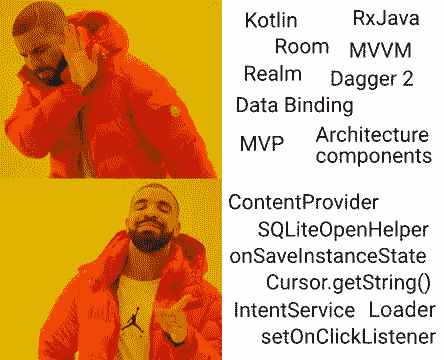

# 独立前要考虑的五件事

> 原文：<https://medium.com/hackernoon/five-things-to-consider-before-going-indie-2e4c92b0b80b>

## 所以你认为你准备辞职，靠自己的项目生活？

> 这是一篇反思性很强的文章，作者是一个没有做成的独立 Android 开发者。这是零动机的废话——只有冷酷的事实。你已经被警告了。

所以，你决定靠自己的应用谋生？总是想建立对你重要的东西，而不是为大老板卖命？看到别人玩弄这个系统，并受到启发自己也这样做——写一个应用程序，然后在你的[生活](https://hackernoon.com/tagged/life)中依靠被动收入生活，冷吗？恭喜你，你和我一样是个傻瓜！但是现在还不要担心。也许你已经具备了成功的条件。

# 1.这一切都始于正确的态度

让我们从一个小清单开始。你是:

*   对编码很有热情？
*   准备好把你所有的空闲时间都奉献给你的项目了吗？
*   目标是让它成为绝对最好的？
*   不在乎利润，而是要有所作为？
*   反正不怎么出门，所以你不介意牺牲周五的啤酒，你的性生活，见你的亲戚等等。一段时间？

如果大部分都是肯定的，**先把你他妈的生活理清楚！**

上面提到的特征对于一个*悲惨的极客*来说是非常典型的。不成熟的浪漫主义者。无生命者。相信我，我也经历过。这种人相信，如果他们超级努力地工作，抛开其他一切，他们就会成功。但事实是，如果你走那条路，你可能甚至没有机会在完全筋疲力尽之前完成你的应用程序的 v.1。

和所有事情一样，这种心态的形成是有原因的。不是因为钱而是因为激情而从事工程(尤其是编码)的人往往会被社会抛弃。他们天生的逻辑思维天赋使得他们从童年早期就无法与同龄人交流。他们从小性格内向，受约束，最终进入计算机作为一种逃避现实的方式。由于缺乏真实的生活经验，他们的心态大多是由看电影、电视节目、玩电子游戏、在网上随意阅读等替代情绪形成的。结果，他们形成了一种非常理想主义的、非黑即白的观点，认为善良诚实的工人总是赢家。那些人努力工作，加班加点，从不授权，也从不要求加薪。你也永远不会在管理岗位上找到他们——他们只擅长做分配给他们的工作。他们信心不足，经常过着不健康的生活方式，工作/生活平衡差。如果这样的人选择辞掉工作，把自己从为老板卖命中解放出来，作为一名独立开发人员过上更充实的生活，那么他们最终得到的将是为自己内心的恶魔卖命。

不会再有老板了，但压力会保持不变，甚至更大。每周 40 个小时将变成 60、80 个小时——适当的娱乐将被放在一边“直到它结束”。这个人会停止享受生活，因为没有什么可以享受的了。从那时起，这只是几个月的事情，直到这最终导致严重的抑郁症，这个人瘫痪了，他们既不能继续工作，也不能让他们的生活回到正轨。

再说一次，我去过那里。真他妈的糟糕。但是好消息是——这是可以治愈的。这不在本文的讨论范围之内，但是是可以治愈的。当你一切顺利的时候，你成功的机会会无限增加。

所以我在这里的建议是:当你去[独立](https://hackernoon.com/tagged/indie)的时候，*绝对不要*把你所有的时间都奉献给你的项目，做*绝对不要*抛开你的生活去更快地完成它，做*绝对不要*花额外的时间把它打磨到完美，牺牲你为之做这一切的生活乐趣。过健康的生活方式*现在*，有足够的睡眠、性生活、锻炼、人际交往，迎合你的需求和欲望，放轻松，一切都会很美好。

**底线:** 

# 2.你妈妈教你失败了吗？

如果你读过其他一些激励性的文章，你可能已经看到他们通常把完美主义称为我们发展灾难的罪魁祸首。但真正的问题是完美主义的根源——对失败的恐惧。

完美主义本身并不是一件坏事。毫无疑问，有高标准总比没有标准好。然而，对失败的恐惧是一种真正的痛苦:正是这种特质让你相信你只有一次成功的机会，为了不失败，你必须做好每一件事。这对那些决定辞职追逐梦想的人来说尤其痛苦:他们害怕失败，因为对他们来说，这意味着永远埋葬他们的梦想，回到过去毫无价值的生活，并且永远不会考虑再次冒同样的风险。

完美主义和对失败的恐惧经常相伴而生，所以如果你觉得你有一个，很可能你也有另一个。两者都是你成长的产物，你的父母对你有很高的期望，对你犯下的每一个错误都批评你，不管多么温和——在他们看来似乎什么都不是，但会慢慢扼杀你的自尊。如果你成长为一名优等生，赢得学生竞赛并一直获得高分，这可能是你有这种恐惧的一个迹象。

你会问，有什么不好？当被放入像工作场所这样的受限环境中时，什么都不是。(事实上，好的成绩和成就可能会帮你找到一份体面的工作，如果你意识到自己的价值，会给你带来更高的薪水。)但是当谈到独立时，你会发现自己无法完成任何项目——它永远不够好！*“人们不会喜欢它，除非我添加特性 X 和 Y，”*你会想。尽管人们实际上喜欢各种各样的垃圾，而且也不可能让每个人都满意，但你会感到压力，这将是你永远无法实现目标的原因。

现在，怎么处理呢？现在完全公开，我屈服于这种恐惧，我没有找到能帮助我的治愈方法，这就是为什么我现在离开独立 Android 开发。然而，这如果不是失败本身又是什么呢？突然间，我平静下来了。没有灾难性的事情发生，我也没有真正失去任何东西——嗯，我花了 2.5 年的时间，财务收益几乎为零，但我变得更聪明了，这可能会在长期内帮助我。我也没有放弃我独立创作的雄心；这并不是我的终结，我可能最终还会重温那个想法。

因此，我的建议是:**多失败，快失败！只要失败几次，你就会发现没有人真正在乎，这个世界没有停滞不前。之后，拥抱失败，学会将失败视为尝试和经验的积累。生活实际上没有*那么短，所以你会有第二次、第三次、第四次机会——但前提是你不能错过第一次。***

这里有一篇文章可能会帮到你。

**底线:** 如果你是一个超水平的成功者，你必须经历几次失败才能把自己从恐惧中解放出来。最好快点。

# 3.有战略眼光

如果你像我一样在一个工人阶级家庭长大，你决定辞去一份稳定的工作，去探索未知的世界，这可能会给你的家庭带来巨大的冲击。他们会说，这是无情而粗心的一步。完全正确——除非你制定了一个计划并合理地行动。

这一章中的大部分内容都是显而易见的，但为了完整起见，我还是把它们放在这里。

首先，确保你在辞职前积累了足够的钱。没有人会蠢到一贫如洗地去独立制作，但我还是要告诉你以防万一。为至少一年(最好是两年)没有任何收入的生活做好准备。同样考虑到第一段，不要仅仅靠吃拉面维持最低生活水平，而是要存足够的钱来维持和以前一样的生活水平(特别是，不要搬回来和父母一起住)。

其次，**从合适的项目开始。到现在为止，你可能已经对应用程序的公民凯恩有了一些大的想法——忘了它吧！理想的第一个项目应该:**

*   简单点，也就是说，一周内就可以完成(反正要花几个月，因为你不擅长估算)；
*   给你赚点钱(广告收入就够了)；
*   给你带来一些追随者；
*   给你一些可以重用的代码或技能；
*   或者彻底失败，教你如何失败和恢复。

如果你的项目达到了其中的 4 点，那就可以开始了。记住:**在任何情况下，你都不应该同时处理几个项目！**你可以调整你的优先级，停止开发一个应用程序，选择另一个。但是当你放弃一个项目时，就忘掉它，把它看作一个失败，然后继续前进。因为如果你不这样做，你会陷入优柔寡断的陷阱，无法做任何事情。

最后，**有一个撤退计划。很有可能，尽管你尽了一切努力，你还是会永远失败，最终不得不重新开始你的职业生涯。因此，在做你的项目时，试着学习和使用那些*有市场价值的技术，*也就是说，你可以把你的经验放进你的简历并转化为金钱。**

(这就是我搞砸的地方:我采用了普通的 Android 开发，过于信任 Android 文档和[炒作驱动的绒毛](https://medium.com/u/6e1a63c4fcd1#perfmatters 视频，并逐渐鄙视所有那些 Kotlin / RxJava / MVP / other <a class=)。你知道吗，这些是现在的必需品，没有这些，即使是谷歌自己也不会接纳我。)

还有，不要和你以前的工作断绝关系。你可能永远也不想回到那里，但是有机会这样做会让你内心平静一些。

**底线:** 确保自己不会破产，确保自己永远知道该怎么做。

# 4.好人最后完成

好吧，这听起来可能有点色情。但是就像在约会游戏中做一个好男人一点都不性感一样，在商业中做一个好男人也没有什么好处。嗯，除非你想把你的时间、金钱和热情付诸东流，然后爬回职场，哇哇叫。

用代码改善世界——许多开发人员相信他们有这种崇高的使命(毫不奇怪，见第一章)。但是这个神圣的使命经常让他们对现实视而不见。因此，这些开发者会很乐意为更大的利益而努力，不期望任何利润回报:他们将免费或以捐赠的方式提供他们的应用程序，为开源做出贡献，帮助社区中的其他人，解决堆栈溢出等问题。此外，他们认为做一个“乖乖女”会帮助他们建立更好的个人形象，得到关注和赞扬，受到尊重和崇拜，并且通常会让他们在生活中走得更远。

现在跟我说:这个。是。他妈的。扯淡。

如果你是个好人，这是对你的现实检验。**没人在乎你的个性或你的感受。对外面的人来说，你的重要性只取决于你的工作成果。如果你的应用能让他们的生活变得更好(为他们节省金钱或时间，或者给他们一些乐趣和娱乐)，他们可能会喜欢你的应用，但他们可能会对你、你的生活和你的理想不屑一顾，只要你给他们机会，他们就会利用你。**

这就是为什么你不应该给他们两个狗屎。

所以成熟点吧，记住:

1.  你选择独立是因为那是你更喜欢的谋生方式。你这么做不是为了成为圣人。你这么做是为了**他妈的生存。**
2.  做一个利己主义者，把自己的需求放在第一位，这是唯一的出路。你周围的每个人都在做同样的事情。说没有的都是伪君子。或者没骨气的傻瓜，他们想被操。
3.  用户只把你视为他们使用的某个应用背后的劳动力——所以你应该只把他们视为数字、转化和终身收入。
4.  假装关心你的用户，对他们友好，但不要依恋他们。那些陌生人只在乎你用更少的钱给他们更多的东西。所以不要掺杂个人感情，也不要让他们决定你应该做什么。把你的信任放在分析上。
5.  重视你的作品，贴上价格标签，让用户付费。如今，人们越来越习惯于不为软件付费，这也伤害了你。当然，一些用户会生气，但是去他们的。他们永远不会为你免费做任何事。
6.  出于同样的原因，除非你绝对肯定会有经济收益(无论是否立竿见影),否则不要费心为开源做贡献。或者，就此而言，除非你没有更好的事情可做。所有那些 GitHub 项目和堆栈溢出评级，都只是为了让别人看到你渴望免费工作。
7.  最重要的是，学会原谅自己。和你的道德感做个约定。这不是说你是个混蛋——这是经济运行的方式。当你还是一名雇员时，上述所有情况仍然适用，只是这是你的企业主的负担。但只要现金在你的帮助下流动，他们就不会介意，你也应该如此。

如果这些让你感到不舒服，那么独立开发不适合你。回到你的工作中去，把你喜欢的项目作为你讨厌的小爱好。说真的。

**底线:**
你必须学会不在乎别人怎么想，把自己的利益放在第一位。

# 5.你现在是一家企业了

看看你已经走了多远！

当你是一名员工时，你只是一个劳动力单位，做分配给你的工作，完成你的任务，获得你同意的工资，有严格定义的责任，不受任何商业责任的保护，对任何公司范围的决策没有发言权。

但现在你要自己做开发者了。现在*你*做出所有的选择。*你*确定战略。你管理你的风险、预算和其他资源。你对你正在做的工作负全部责任。

你正在成为一个企业。你应该像他们一样思考和行动。

之前写的所有东西——那只是你到达那里所需要的。但是，即使你设法制作了几个应用程序，完全满足了你目前的生活需求，这也不会永远持续下去。最终，它们都将达到极限，不再吸引新用户，被竞争对手超越，失去关注点，最后被淘汰。因此，要真正做到*留在那里*你必须最终放下你的工程师思维模式，并**采用商业思维模式。**

开发人员关心的是:

*   从事一个有趣的项目；
*   编写好的代码(因为他们将不得不自己维护它)；
*   对用户讲道德，例如，慷慨地提供免费功能，温和地赚钱，将广告保持在最低限度等。；
*   他们的个人声誉(来自高质量的工作和友善的态度)。

企业关心的是:

*   **利润最大化；**
*   交付能够以尽可能少的投资产生**最大利润**的产品，并在合适的时机发货；
*   他们的公众形象——但只是在可能影响他们的**利润**的程度上(你认为谷歌[解雇那个发表宣言的家伙](http://www.businessinsider.com/google-sundar-pichai-anti-diversity-manifesto-fired-2017-8)是因为他们关心这项事业吗？胡说，他们只是不想激怒媒体和投资者，因为这将意味着他们的股票下跌)；
*   持续增长，如果必须的话，通过不道德的手段。

总而言之，商业与感觉无关，而只与持续运转有关，这是通过冷酷的计算实现的。这就是为什么你必须抑制你最后的情绪并记住:

1.  从事一个有趣的项目当然很好，但是**现在对你来说最重要的是产生积极的现金流。**除非你运气好，有一个能立即卖出去的想法(而且你对这个想法如此有信心，以至于你可以马上去向投资者推销)，否则放下你的骄傲，去开发一个能立即卖出去的东西——哪怕是另一个他妈的 Match 3 老虎机，一个有一大堆广告的弱智单次点击游戏，或者是一个公然剽窃 Unity assets 的热门游戏。只有当你有令人满意的现金流时，你才可能分配资源来开发你想要的应用程序。
2.  **好的代码被高估了。企业不在乎现在写糟糕的代码会给你以后带来痛苦——重要的是你他妈的尽快交付一个工作产品。实际上，为什么你甚至认为受苦的会是你呢？你不会真的要写代码直到老死，是吗？所以这就是为什么你的目标应该是快速发布，尽可能的走捷径。如果应用失败——很好的解脱，不需要支持它。如果它成功了(我指的是经济上)——你只需要雇几个实习生来维护它，瞧，糟糕的代码不再是你个人的问题了。**
3.  现在，关于最后一部分。从第一天起，你必须清楚地明白，最终，你必须成长。你自己不可能支撑所有的事情，而且——如果你到了那一步，到那时你可能已经厌倦了编码。自然地，你将不得不雇人并把你的工作委派给他们。这就是你必须在精神上准备好欺骗别人的地方:雇佣热情的、没有经验的、渴望为你工作一碗饭的笨蛋，从第三世界国家收购廉价的程序员，为了少付他们工资而对你的员工玩心理游戏等等。—尽你所能让他们给你带来更多利润，同时把大部分利润留给自己。不道德？—也许吧。但这就是你如何保持漂浮，这就是每一个他妈的企业如何内部运作。

我希望我能说那些都是讽刺，但不是。

**底线:** 学会压抑自己的情绪，用冷硬的算计做计划。作为一名员工，做好道德准备，做出你会觉得毁灭性的决定。

# 结论

独立开发不适合胆小鬼。

不，我不是不鼓励你放弃传统职业，尝试做自己的事。恰恰相反，我认为按照自己的方式工作是每个专业人士应该追求的目标。我写这篇文章是因为我得到了惨痛的教训，也许读完这篇文章后，你就不会重蹈我的覆辙了。

或者他妈的去重复他们！因为我他妈的该听谁的？

## -你他妈的是谁？

很高兴你问了。长话短说，我花了两年半的时间试图成为一名独立的 Android 开发者。那些年我挣了他妈的四十块钱。我甚至还没有从 Play Store 撤回它，因为光是转让费就要 20 美元。在那段时间里，我只发布了一个像样的应用程序——[Material Cue](https://play.google.com/store/apps/details?id=com.actinarium.materialcue&referrer=utm_source%3Dmedium%26utm_medium%3Dreferral%26utm_term%3Dfiveindie)——即使是那个也还是一个该死的 *0.9 .东西*，因为它他妈的不够好！这个应用曾经有应用内购买(也就是早期支持捐赠)，但在某个时候，我也删除了这些。

> 在这里，我想对我的 26 位匿名支持者说谢谢，感谢他们给了我总共 40 美元，并为我没有发布我承诺过的所有“专业功能”而感到抱歉。
> 谢谢你。

在这个愉快的时刻，我正式宣布我现在离开 Android，回到我以前的专业领域:**web 应用程序的测试自动化。在这两年半的时间里，那里什么都没有改变；世界各地的公司仍然在犯同样愚蠢的错误，试图自己实现自动化(这绝对是我下一篇文章的主题！)但是现在有我来拯救:我确实对好的企业级测试自动化略知一二，并且我愿意从一开始就帮助这些公司构建伟大的自动化项目，为他们节省*年*的努力。**

你的公司是其中之一吗？为什么不告诉你的老板[雇用我](http://bit.ly/cv_pauldanyliuk)？

还有其他人——谢谢你们陪我走到最后。喜欢这本书吗？关注我，成为第一个将我的新故事加入你的订阅源的人。此外，在评论中写下你的想法。或许还会鼓掌？那会让我心跳加速。

保重！