# 构建 WebGL 应用程序的五种方法

> 原文：<https://medium.com/hackernoon/five-ways-to-build-webgl-apps-4c7eb541d193>

from [pexels](https://www.pexels.com/photo/pink-yellow-green-and-blue-chalk-226591/)

如果你想为网络构建图形密集型应用，你几乎肯定需要 WebGL。这里有一些构建 WebGL 应用程序的很好(也不太好)的方法。

**TL；DR；你可以用纯 Javascript 构建 WebGL 应用，但也有很好的替代品，比如 Three.js、Phaser、PlayCanvas 和我最喜欢的 Unity。下面是对这些方法的利弊的调查。**

# 纯 WebGL

## Web 图形编程的汇编语言

如果你是一个拥有数学博士学位的图形天才，这绝对是一条正确的道路。对于我们大多数凡人来说，我不建议这样做。

在我看来，使用纯 WebGL 在逻辑上等同于直接用汇编语言学习和编程，而你可以使用像 C++这样的语言使你的生活变得简单得多。

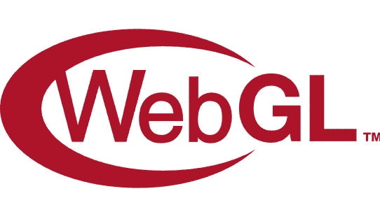

也就是说，理解低级 WebGL 代码是非常有趣和有用的，这样您就可以构建非常定制的东西，或者知道如何在使用高级库时调试东西。

这是 Youtube 用户制作的一个惊人系列的第一个视频， [Indigo code](https://www.youtube.com/channel/UCufDmM2MGQlbfS3luzgVDxw) 。他准确无误地进入了 WebGL 的真正领域。

但是要小心！在你画一个 3D 旋转立方体之前，你需要花将近两个小时的教程。别说我没警告过你。

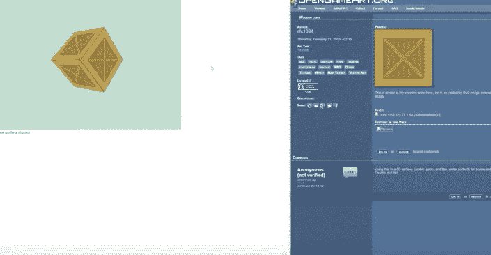

# 三个 j

## 一个更高级的 OpenGL 库

对于大多数想要极端控制，但也想有一个起点的人来说， [ThreeJS](https://threejs.org/) 是一个不错的选择。

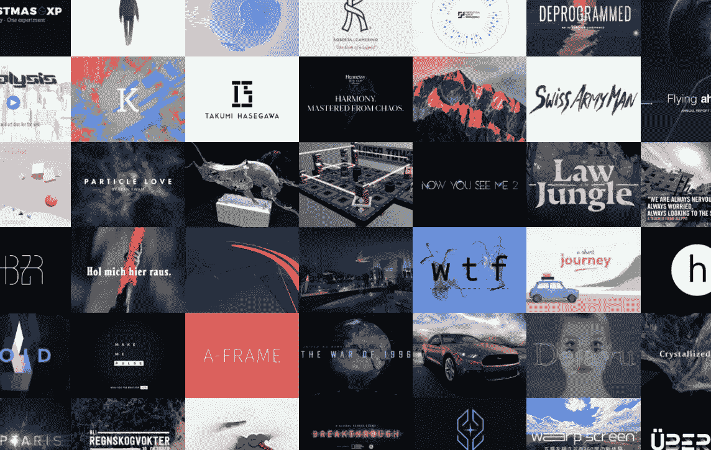

some amazing things have been built [with three.js](https://threejs.org/)

ThreeJS 有一个很棒的社区，和[很棒的文档](https://threejs.org/docs/index.html#manual/introduction/Creating-a-scene)。对于任何想要用纯 Javascript 构建高度定制和快速的东西的人来说，这几乎是事实上的标准。

它抽象掉了数百行 WebGL 设置代码中的一部分，但仍然给了您对图形管道的巨大控制权。它甚至还有一个简洁的图形编辑器:

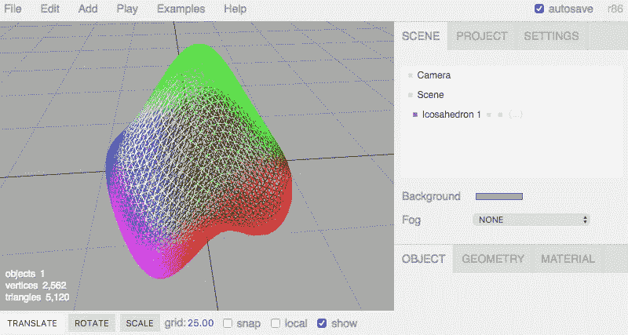

If you go to the editor, check the “[Examples](https://threejs.org/editor/)” menu!

# 编辑:巴比伦 JS

我猜这篇文章应该重新命名为*构建 WebGL 应用的六种方法*。这里和 Reddit 上的一些评论者提到 BabylonJS 有一个非常棒的社区，甚至可能比 three.js 更受欢迎。因此，虽然我自己没有使用过它，但我绝对建议您去看看:

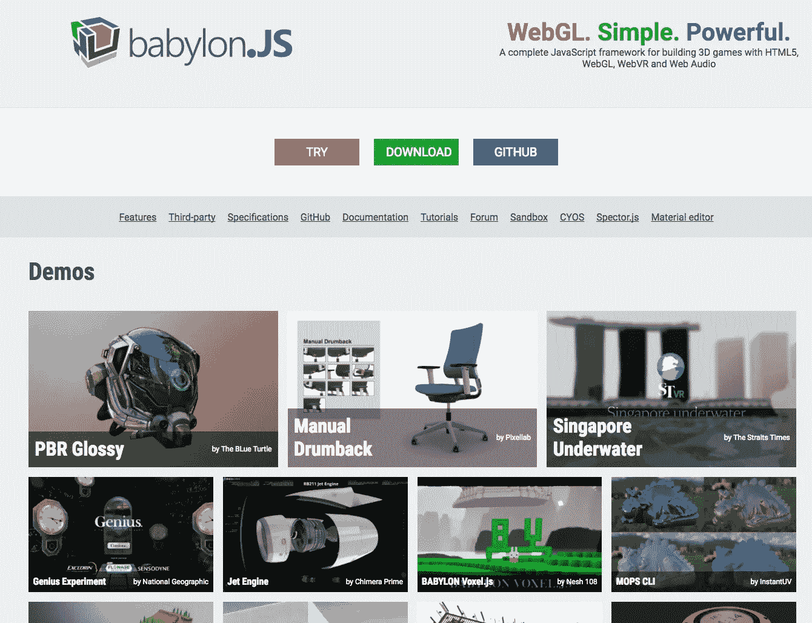

[babylon.js](https://www.babylonjs.com/)

# WebGL 游戏引擎

## 碰撞、物理和声音，开发时间最短

抽象图腾柱上的下一步是各种各样的 WebGL 游戏引擎，包括 [Phaser](http://phaser.io/) 、 [pixi.js](https://github.com/GoodBoyDigital/pixi.js) 、 [PlayCanvas](http://playcanvas.com/) 和 [Construct2](https://www.scirra.com/) 。

如果你想做一个非常酷的 2D 游戏或应用程序，Phaser 是一个非常有趣的库(WebGL 可以做 2D，只需在一个 3D 平面上渲染 2D 精灵)。他们有很多例子:

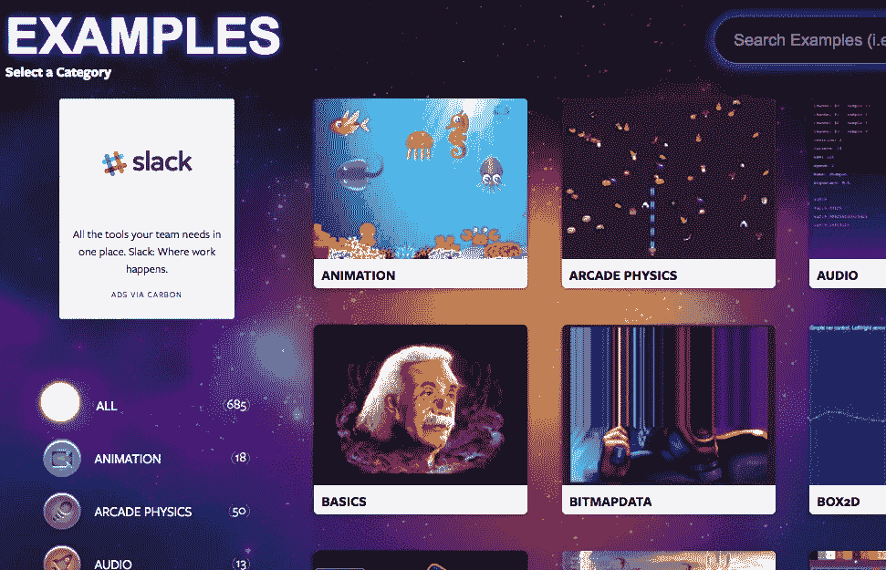

我对 PlayCanvas 也很感兴趣，尽管我还没有亲自尝试过他们的开发平台:

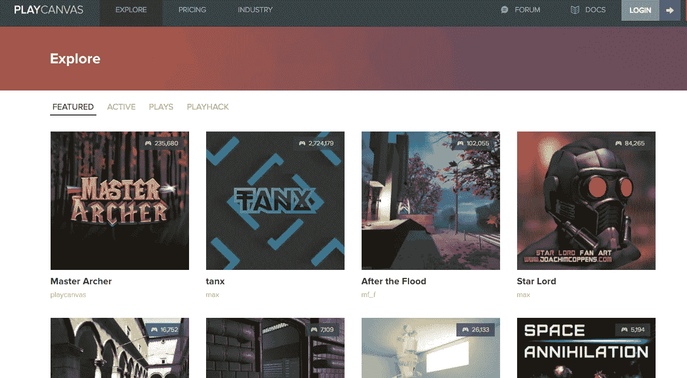

PlayCanvas [Gallery](https://playcanvas.com/explore/featured)

Javascript HTML5 游戏引擎有大量的选项，所以[https://html5gameengine.com/tag/webgl](https://html5gameengine.com/tag/webgl)给你一个很好的起点来了解每一个引擎的特性、许可和定价。

# 专业游戏引擎

到目前为止，我最喜欢的为网络创建 WebGL 内容的方法是使用 Unity 游戏引擎。它是成熟的，已经被用于创建游戏内容超过 12 年，现在它有一个很好的网络出口。

但为了完整起见，我们先来看看虚幻:

## 虚构的

[虚幻引擎](https://www.unrealengine.com)确实可以导出 HTML5/WebGL，但我做了一点实验，它似乎没有 Unity 那么适合黄金时间。

我亲自尝试了一下，我认为构建花费了 1000 ngggg 的时间，并且输出非常大(1GB 构建一个示例项目)。

尽管如此，我相信 Unreal 将会在 WebGL 中取得长足的进步。以下是 HTML5 中虚幻引擎游戏的几个例子:

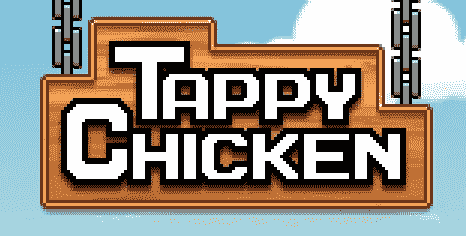

[Tappy Chicken](https://www.unrealengine.com/html5/)

[Epic Zen Garden](https://s3.amazonaws.com/mozilla-games/ZenGarden/EpicZenGarden.html)

顺便说一句，当我试图在 Chrome 中加载史诗禅园时，出现了一个错误。它可以在 Firefox 上运行，是我在网上见过的最漂亮的 3D 演示之一。

## 一致

到目前为止，为网络创建 3D 内容最简单的方法是使用 Unity 游戏引擎，这是我个人的选择。这是一个已经存在超过 12 年的成熟游戏引擎，他们的 WebGL exporter 也已经存在快两年了。

ftw!

事实上，我非常相信 Unity，这将是我的网站的最初目标。(我正在[建立一个平台](https://hackernoon.com/webgl-needs-a-home-6f11fddc01df)来汇集网络的 WebGL 内容)。

[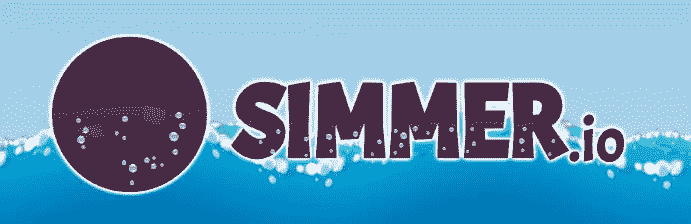](http://simmer.io)

如果你在 [Unity Asset Store](https://www.assetstore.unity3d.com/en/#!/) 上找到你喜欢的资产，你可以在 35m 内编译、构建并上传到网上，正如本文中的[所描述的。](https://hackernoon.com/how-i-built-and-deployed-a-webgl-game-to-a-new-website-in-35m-15b2e8339c31)

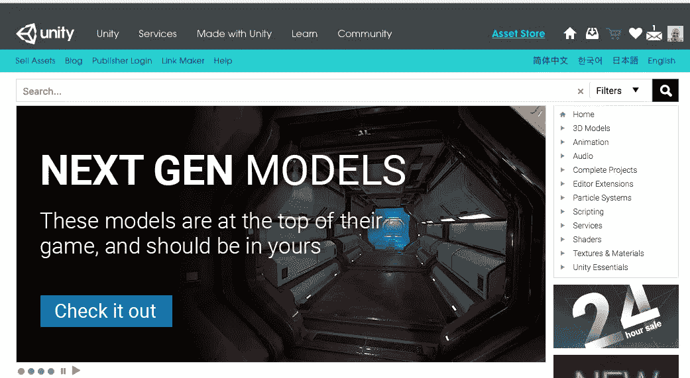

the unity asset store

当然，没有什么是灵丹妙药。尽管 Unity 是一个出色而成熟的平台，但它也有缺点:

1.  (次要)C#是首选语言，所以这可能会让一些 web 程序员望而却步。
2.  (主要)调试工具链[还不是很棒](https://docs.unity3d.com/Manual/webgl-debugging.html)。如果您在 WebGL 导出时遇到问题，您可能依赖于 console.log 编程。
3.  (主要)Unity 是闭源的，只对收入低于 100K 的公司/个人免费。

个人认为，这三点不足以阻止我。这只是一个使用 Unity 可以获得的质量水平的例子:

[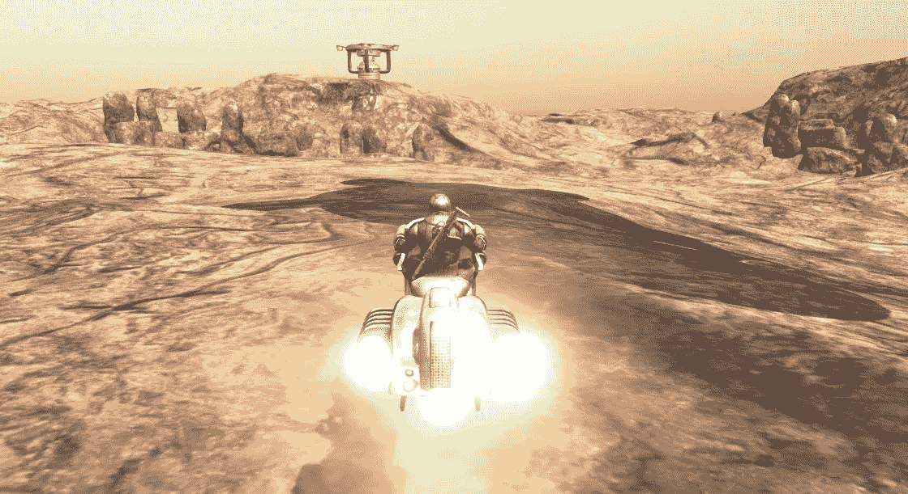](https://dl.dropboxusercontent.com/u/248930654/Asset%20Store%20Demos/Realistic%20Hovercraft%20Demo/Realistic%20Hovercraft%20Demo.html)

[Realistic Hovercraft](https://dl.dropboxusercontent.com/u/248930654/Asset%20Store%20Demos/Realistic%20Hovercraft%20Demo/Realistic%20Hovercraft%20Demo.html) from [BoneCracker Games](http://www.bonecrackergames.com/)

(加载需要几秒钟，但是值得！)

# 关于 WebGL 与 Unity 的课程

您有兴趣了解更多关于 Unity web GL 的信息吗？我现在提供一个关于 Udemy 的四小时 60+讲座课程。我的媒体读者可以以超过 90%的价格买到《WebGL with Unity 终极指南》。只需点击下面的链接！

# 敬请期待！

在网络上有很多方法可以让 WebGL 变得伟大。一些裸露的金属，一些与高度成熟的发动机连接。

我相信 WebGL 与 WebAssembly 的结合，将会开始超越我们所知的 web。

通过[加入我的电子邮件列表](https://upscri.be/1c08e9/)，保持对我当前想法的更新，并成为第一个听说[smelle . io](https://simmer.io)的人:

你今天学到新东西了吗？ ***请💚或者跟着我。*** *它给了我一吨的动力，让我继续这样写文章！*